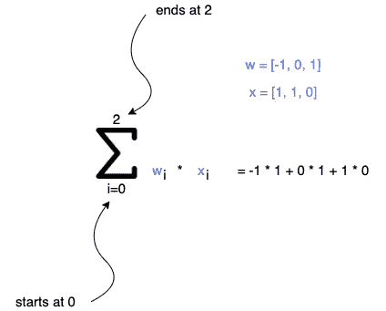

# 用普通 JavaScript 介绍机器学习

> 原文：<https://javascript.plainenglish.io/intro-to-machine-learning-in-plain-javascript-428d28067e8a?source=collection_archive---------11----------------------->


## 建立一个简单的感知器算法，有两个输入和一个输出

在这个例子中，我们将考虑一个简化的情况(上图),我们有一个由两个传感器监控的植物，一个将监控植物是否得到足够的阳光，另一个将监控它是否得到足够的水。

两个传感器将只发送 0 或 1，0 代表资源缺失，1 代表用资源完美地喂养植物。

我们想建立一个感知器(简单的机器学习算法)来计算我们的植物是否得到足够的水和阳光，如果缺少什么，它应该给出输出 1，这意味着我们的小机器人需要采取行动，照顾我们的植物。


在第一部分，我们用输入来填充我们的算法。

这些对将是两个值[0，0]、[0，1]、[1，0]和[1，1]的数组。

在机器学习中，我们向我们的算法提供数据(通常是大量的数据)，我们的算法从中学习并建立规则，然后我们可以使用这些规则(通常称为模型)来预测看不见的输入的输出。例如，它可以对我们的图像进行分类，并预测图片中是否有猫或狗。

在我们的例子中，这是一个监督算法，因为我们知道输出应该是什么，并将目标值输入到我们的算法中。

在我们非常简单的例子中，我们有一组固定的输入，只有两个结果(类别)。

现在，让我们来看看，当我们说算法学到了一些东西时，这意味着什么。

为了学习一些东西，我们需要可以优化的参数。在上面的第一张图片中，我们的机器人大脑中有一个思维气泡，让我们仔细看看这个气泡中发生了什么。

我们的小机器人有一个小的神经元网络，只有一个神经元(蓝色圆圈)作为大脑，因为他目前唯一的责任是照顾我们的植物。



首先，我们的神经元获得输入，假设[1，1]足够的水和太阳，然后算法首先计算 **(1)** 的加权和，它对 **w** (权重)和 **x** (输入)的乘积求和，次数与从 **i** = 0 开始的 **n** 中指定的次数一样多。你可以在左边看到一个例子。

第二个 **(2)** 检查加权和的输出= -1(本例的输出)是否激活神经元。在我们的示例中，我们使用简单的 [Heaviside 函数](https://de.wikipedia.org/wiki/Heaviside-Funktion)，如果加权和的输出大于 0，则返回 1，如果小于 0，则返回 0。这意味着如果加权和大于 0，我们的小机器人将采取行动，否则它将等待，给定-1，我们的机器人将等待。

现在让我们用普通的 JavaScript 来编写代码。

在权重和输入数组中，您不仅会看到水和太阳的两个值，还会在开头看到第三个参数。这就是偏见。

> **偏置值允许您向左或向右移动激活功能。**

你可以在这里阅读更多关于偏见的信息。

首先，我们将添加带有空函数的感知器类，以获得结构的清晰图像。

```
class Perceptron {
 constructor() {
   // (1) initialization
 } _heaviside(weightedSum) {
   // (2) activation
 } _calculateWeightedSum(input) {
   // (3) calculates the weighted sum
 } predict(input) {
   // (4) prediction
 } fit(iterations, trainingData) {
   // (5) trains our algorithm and updates our weigths
 } _updateWeights(error, input, target) {
  // (6) updates our class property weights
 }
}
```

(1)我们初始化我们的权重，如果你愿意，你可以选择任何其他数字。

```
constructor() {
  this._weights = [0, 0, 0];
}
```

(2)我们增加了激活功能。如果 weightedSum 大于 0，它只返回 1，否则返回 0。

```
_heaviside(weightedSum) {
  return weightedSum >= 0 ? 1 : 0;
}
```

(3)首先，我们检查我们的类属性权重是否与输入具有相同的长度，如果是，我们迭代每个输入并计算加权和。在函数结束时我们返回它，它总是一个数字。

```
_calculateWeightedSum(input) {
  let weightedSum = 0;
  if (this._weights.length === input.length) {
    input.forEach((x, i) => (weightedSum += x * this._weights[i]));
  } else {
    console.error("Length of weights and inputs doesnt match");
  } return weightedSum;
}
```

(4)我们添加预测函数，该预测函数计算加权和，并利用其结果检查神经元是否应该用 Heaviside 函数激活。

```
predict(input) {
  const weightedSum = this._calculateWeightedSum(input);

  return this._heaviside(weightedSum);
}
```

(5)在拟合函数中，我们训练我们的算法。我们有与迭代参数中指定的一样多的学习迭代，作为第二个参数，我们得到准备好的训练数据。

我们用一个空数组初始化错误，这样我们可以在以后检查我们得到了多少个错误。

我们希望获得训练数据的随机输入集，因此我们在 randomIndexOfTrainingData 中设置了一个随机索引，然后选择该输入。如果您有大型数据集，这一点很重要。

变量 selectedTrainingData 保存一个具有属性输入的对象，例如[1，1，0]和 target 1。我们对该值进行预测，然后计算误差。这只是意味着我们计算 target 和 calculatedTarget 之间的差异，并检查我们的预测是否正确。

然后我们更新类属性权重。

```
fit(iterations, trainingData) {
  let errors = []; for (let i = 0; i < iterations; i++) {
    const randomIndexOfTrainingData = Math.floor(
      Math.random() * trainingData.length
    );
    const selectedTrainingData = trainingData[randomIndexOfTrainingData]; const input = selectedTrainingData.input;
    const target = selectedTrainingData.target; const calculatedTarget = this.predict(input, target);
    const error = target - calculatedTarget; this._updateWeights(error, input, target);

    errors.push(error);
  }

  return {errors, weights: this._weights};
}
```

(6)最后，我们将更新权重函数添加到我们的感知器类中，该感知器类迭代输入，例如[1，1，0]，如果有错误，则更新类属性权重。

```
_updateWeights(error, input, target) {
  input.forEach((x, i) => {
    this._weights[i] = this._weights[i] + error * x;
  })
}
```

现在让我们来看看我们的算法在起作用。

我们用输入值和目标值来定义我们的训练数据。第一个值是输入属性中的偏差。第二个和第三个值来自我们的太阳和水传感器。

```
const trainingData = [
  {
    input: [1, 0, 0],
    target: 1
  },
  {
    input: [1, 0, 1],
    target: 1
  },
  {
    input: [1, 1, 0],
    target: 1
  },
  {
    input: [1, 1, 1],
    target: 0
  },
];
```

我们创建了感知器类的一个实例。

```
const perceptron = new Perceptron();
```

并开始我们的学习过程，我选择了 30 次迭代并传入我们上面指定的 traningData。

```
const result = perceptron.fit(30, trainingData);
```

然后，我们进行一些预测，并将结果记录到控制台。

```
console.log('result', result);// parameters, string for identification, prediction, target value
console.log('prediction 1', perceptron.predict([1, 0, 0]), 1);
console.log('prediction 2', perceptron.predict([1, 0, 1]), 1);
console.log('prediction 3', perceptron.predict([1, 1, 0]), 1);
console.log('prediction 4', perceptron.predict([1, 1, 1]), 0);
```

你可以在这里看到最终的代码。

我希望你读它的时候和我准备写这篇文章的时候一样开心。如果有未解决的问题或反馈，我们非常欢迎您发表评论。

*更多内容尽在*[*plain English . io*](http://plainenglish.io/)