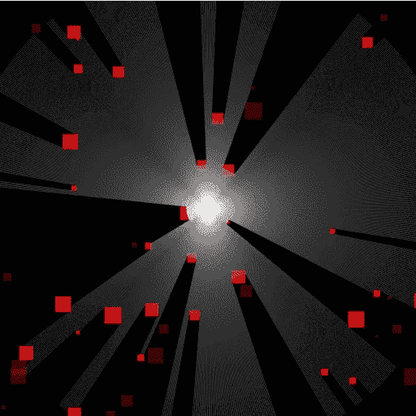
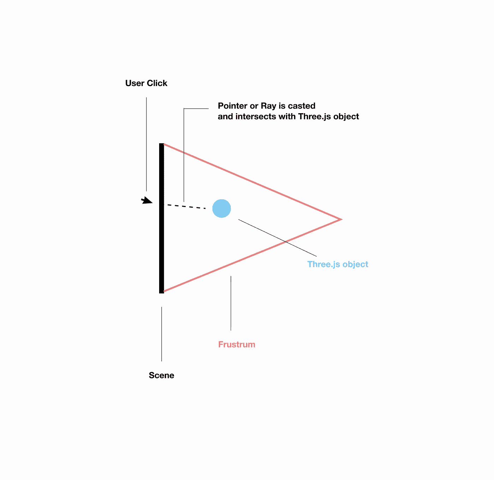

# Three.js 中光线投射的介绍

> 原文：<https://javascript.plainenglish.io/intro-to-raycasting-in-three-js-211ac4aae768?source=collection_archive---------1----------------------->



[https://somethinghitme.com/2011/11/16/fake-2d-lighting-with-javascript/](https://somethinghitme.com/2011/11/16/fake-2d-lighting-with-javascript/)

如果你是游戏开发者，这篇文章可能很平常。但是对于很多前端开发人员和交互设计师(包括我自己)来说，这个概念相当新。 [**光线投射**是利用光线-表面相交测试来解决 3D 计算机图形学和计算几何中的各种问题](https://en.wikipedia.org/wiki/Ray_casting)

当使用 [Three.js](https://threejs.org/) 在网络上处理 3D 图形时，图形使用 [HTML canvas](https://developer.mozilla.org/en-US/docs/Web/API/Canvas_API) API 进行渲染。除了一些“例外”，这可能会阻止您将渲染对象作为 [DOM 元素](https://developer.mozilla.org/en-US/docs/Web/API/Document_Object_Model/Introduction)进行访问。例如，如果您在 three.js 中创建一个立方体并检查浏览器检查器，您会注意到您只能访问保存 Three.js 场景的画布容器。像这样的情况可以用 Three.js 中的 [Raycaster](https://threejs.org/docs/#api/en/core/Raycaster) 类来解决。

# 什么是光线投射？

[Threejsfundamentals.org](https://threejsfundamentals.org/threejs/lessons/threejs-picking.html)将光线投射或物体拾取描述为“找出用户点击或触摸了哪个物体的过程”。本质上，一个指针从你的鼠标或手指(在手机上)通过场景的[平截头体](https://threejs.org/docs/#api/en/math/Frustum)投射到与之相交的物体上。为了在特定对象上执行逻辑，这个方法非常有用。



# Three.js 中的 Raycaster 类是什么？

Raycaster 类是 Three.js 提供的一个类，用于简化对象拾取。

# 让我们编码。

本文的计划是解释如何点击一个已经在 3D 世界空间中渲染的球体。如果你想学习如何设置一个 Three.js 场景，可以看看我的另一篇文章[“用 Three.js 可视化绘制 3D”](https://levelup.gitconnected.com/visually-mapping-out-3d-with-three-js-eef3f6adfd2f)。对于本文，我们将只关注光线投射的流程。

下面是一个简单的 three.js 样板设置:

```
// set inner height and width based on screen sizeconst winWidth = window.innerWidth;const winHeight = window.innerHeight;// global variableslet scene, camera, renderer, controls, circle;let objects = [];init();update();function init() { // scene and camera positioningscene = new THREE.Scene();scene.background = new THREE.Color(0xffffff);camera = new THREE.PerspectiveCamera(75, winWidth / winHeight, 0.01, 1000);camera.position.set(0, 0, 40);//lightingconst hemisphere = new THREE.HemisphereLight(0xffffff, 0xff0000, 1);scene.add(hemisphere);const directional = new THREE.DirectionalLight(0xffffff, 0.5);scene.add(directional);// renderrenderer = new THREE.WebGLRenderer();renderer.setSize(winWidth, winHeight);//geometryconst geometry = new THREE.SphereGeometry(10, 64, 64);//materialconst material = new THREE.MeshStandardMaterial({color: "red",metalness: 0.5,roughness: 1,}); //meshcircle = new THREE.Mesh(geometry, material);scene.add(circle);// raycaster code goes here// append canvas to dom elementdocument.getElementById("container").appendChild(renderer.domElement);// call resize function on resizewindow.addEventListener("resize", resize, false);}// update loopfunction update() {requestAnimationFrame(update);renderer.render(scene, camera);}// resize functionfunction resize() {camera.aspect = winWidth / winHeight;camera.updateProjectionMatrix();renderer.setSize(window.innerWidth, window.innerHeight);}
```

# 添加 Raycaster 类

下面，写着…

```
// raycaster code goes here
```

…添加以下代码:

```
// 3d mouse
  document.addEventListener('mousedown', onMouseDown);function onMouseDown( event ){
    event.preventDefault();// x
    const mouse3D = new THREE.Vector3( (event.clientX / window.innerWidth) * 2 - 1, -(event.clientY / window.innerheight) * 2 - 1, 0.5 ) const raycaster = new THREE.Raycaster()
    raycaster.setFromCamera(mouse3D, camera)
    const intersects = raycaster.intersectObjects(objects);if(intersects.length > 0){
      intersects[0].object.material.color.setHex( Math.random() * 0xffffff )
    }
  }
```

# 设置鼠标按下事件

我们需要做的第一件事是添加一个事件监听器来监听鼠标点击。我们可以使用 [mousedown](https://developer.mozilla.org/en-US/docs/Web/API/Element/mousedown_event) 事件来做到这一点。我们还可以创建一个名为 *onMouseDown* 的事件处理函数，当鼠标被点击时，它将触发光线投射。

```
// mousedown event listener
document.addEventListener('mousedown', onMouseDown);// mousedown event handler function
function onMouseDown( event ){
event.preventDefault(); //insert raycaster code here }
```

# 获取鼠标的坐标

目前，当鼠标按下事件被触发时，没有办法知道鼠标与场景的哪个部分相交。一旦计算出来，我们就可以检查这个坐标是否与圆相交。

在 *onMouseDown* 函数中添加以下内容:

```
const mouse3D = new THREE.Vector3( (event.clientX / window.innerWidth) * 2 - 1, -(event.clientY / window.innerheight) * 2 - 1, 0.5 )
```

由于格式的原因，上面的代码可能看起来有点混乱，但本质上是这样的。

1.  我们正在创建 Three.js [Vector3](https://threejs.org/docs/#api/en/math/Vector3) 类的一个实例，并将其存储在一个变量中。
2.  Vector3 接受 3 个数字参数 Vector3( x，y，z)。这些数字可以用于不同的原因，但其中最常见的是在场景或“世界空间”中设置一个坐标([这个论坛帖子很好地解释了世界空间的概念](https://gamedev.stackexchange.com/questions/65783/what-are-world-space-and-eye-space-in-game-development))。
3.  我们传入的参数是使用以下方法获取鼠标按下时的 x、y 和 z 坐标:

*//获取 x 坐标
event . clientx/window . inner width)* 2–1*

*//获取 y 坐标
-(event . clienty/window . inner height)* 2–1*

*// z 坐标始终为 0.5
0.5*

注意:

```
* 2 - 1
```

上面的等式是为了确保坐标范围从-1 到 1。如果我们把它去掉，坐标范围就是 0 到 1。

# 设置 Raycaster

在下一步，我们最终要设置光线投射功能。在 *onMouseMove* 函数下面添加以下代码:

```
// instantiate raycaster 
const raycaster = new THREE.Raycaster()// sets the pointer/ray with an orgin and direction
raycaster.setFromCamera(mouse3D, camera) //checks object array for any intersecting objectsconst intersects = raycaster.intersectObjects(objects); //if the array is more than zero, get the first intersected object and change the object material color to a random colorif(intersects.length > 0){
      intersects[0].object.material.color.setHex( Math.random() * 0xffffff )
    }
```

让我们来看看这些步骤。

1.  从 Three.js [Raycaster](https://threejs.org/docs/?q=raycaster#api/en/core/Raycaster) 类中实例化一个 raycaster

```
// instantiate raycaster 
const raycaster = new THREE.Raycaster()
```

2.调用光线投射方法 *setFromCamera* 。这个方法需要两个参数，鼠标 3D 的坐标和相机的坐标。这个方法将设置光线的原点和方向。

```
raycaster.setFromCamera(mouse3D, camera)
```

3.调用光线投射方法*相交对象*。这个方法接受一个对象并返回一个相交对象的数组。如果没有相交对象，将返回一个空数组。

注意:在这个特定的用例中，我最初创建了一个名为 *objects* 的空数组，并将我的 circle 对象推入数组。然后我将数组传递给了 *intersectObjects* 方法。这样，如果我有更多的对象，这个方法可以检查所有的对象。

```
//checks object array for any intersecting objectsconst intersects = raycaster.intersectObjects(objects);
```

4.最后，如果有一个相交的物体，我们想改变颜色为随机颜色。

```
//if the array is more than zero, get the first intersected object and change the object material color to a random colorif(intersects.length > 0){
      intersects[0].object.material.color.setHex( Math.random() * 0xffffff )
    }
```

# 最终代码

```
// set inner height and width based on screen size
const winWidth = window.innerWidth;
const winHeight = window.innerHeight;// global vars
let scene, camera, renderer, controls, circle;
let objects = [];init();
update();function init() {
  // scene and camera positioning
  scene = new THREE.Scene();
  scene.background = new THREE.Color(0xffffff);
  camera = new THREE.PerspectiveCamera(75, winWidth / winHeight, 0.01, 1000);
  camera.position.set(0, 0, 40);//lighting
  const hemisphere = new THREE.HemisphereLight(0xffffff, 0xff0000, 1);
  scene.add(hemisphere);const directional = new THREE.DirectionalLight(0xffffff, 0.5);
  scene.add(directional);// render
  renderer = new THREE.WebGLRenderer();
  renderer.setSize(winWidth, winHeight);//geometry
  const geometry = new THREE.SphereGeometry(10, 64, 64);
  //material
  const material = new THREE.MeshStandardMaterial({
    color: "red",
    metalness: 0.5,
    roughness: 1,
  }); //mesh
  circle = new THREE.Mesh(geometry, material);
  scene.add(circle);//push everything into an object for raycasting
  objects.push(circle);//3d mouse
  document.addEventListener("mousedown", onMouseDown);function onMouseDown(event) {
    event.preventDefault();//x
    const mouse3D = new THREE.Vector3(
      (event.clientX / window.innerWidth) * 2 - 1,
      -(event.clientY / window.innerheight) * 2 - 1,
      0.5
    );
    const raycaster = new THREE.Raycaster();
    raycaster.setFromCamera(mouse3D, camera);
    const intersects = raycaster.intersectObjects(objects);if (intersects.length > 0) {
      intersects[0].object.material.color.setHex(Math.random() * 0xffffff);
    }
  }// append canvas to dom element
  document.getElementById("container").appendChild(renderer.domElement);// call resize function on resize
  window.addEventListener("resize", resize, false);
}// update loop
function update() {
  requestAnimationFrame(update);
  renderer.render(scene, camera);
  //rotations go here

}// resize function
function resize() {
  camera.aspect = winWidth / winHeight;
  camera.updateProjectionMatrix();
  renderer.setSize(window.innerWidth, window.innerHeight);
}
```

# 结论

与光线投射的许多用途相比，这只是一个小例子。当我第一次学习它的时候，这个概念对我来说很难理解，所以希望这能帮助其他想在网络上使用 3D 的人。

快乐编码。

【来源:
[https://three js fundamentals . org/three js/lessons/three js-picking . html](https://threejsfundamentals.org/threejs/lessons/threejs-picking.html)
[https://threejs.org/](https://threejs.org/)

*更多内容请看*[*plain English . io*](http://plainenglish.io/)