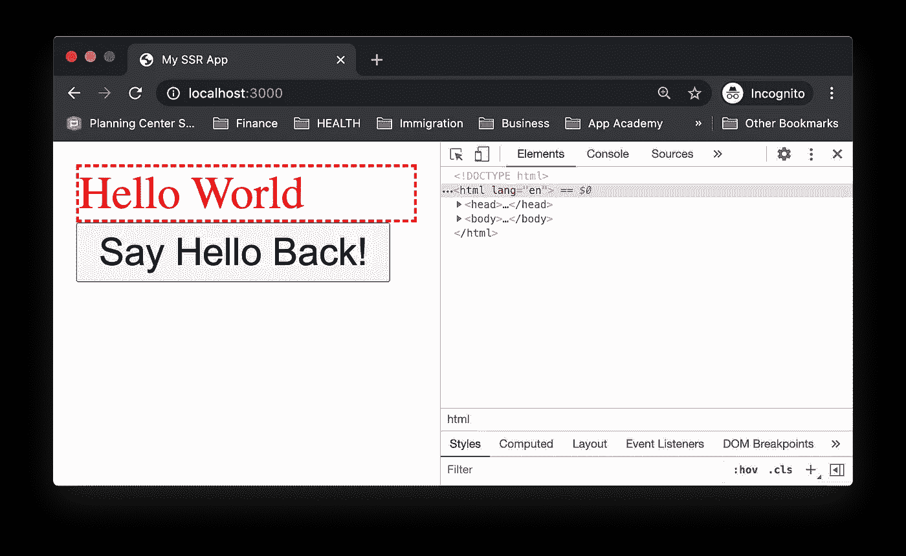
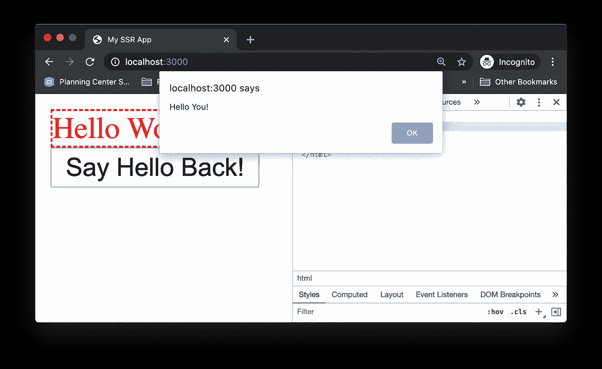
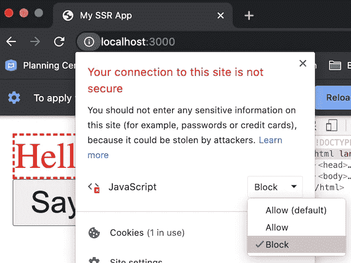
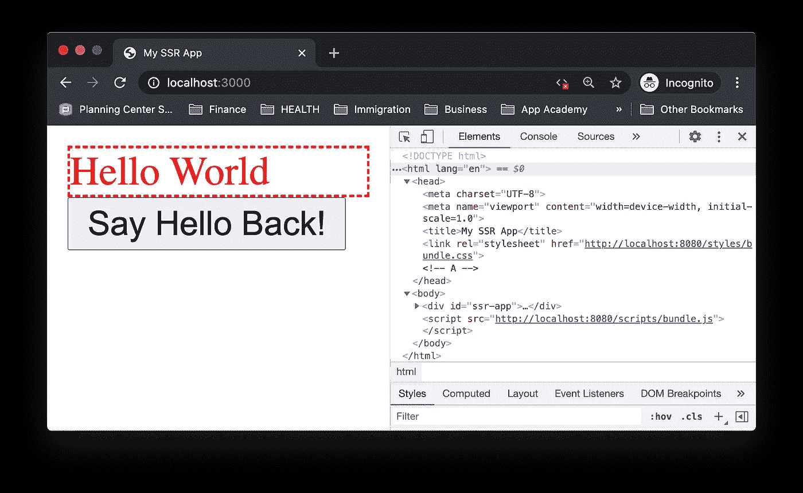

# React 服务器端渲染简介

> 原文：<https://javascript.plainenglish.io/intro-to-react-server-side-rendering-3c2af3782d08?source=collection_archive---------0----------------------->

## 如何在没有任何工具或框架的情况下构建一个 React SSR 应用程序


Source: [Reddit](https://www.reddit.com/r/ProgrammerHumor/comments/5lnsko/programming_environment_dilbert_comic_strip_on/) and Dilbert by Scott Adams

这是(希望是)记录我在构建和维护 SSR 应用程序中所学到的经验的系列文章中的第一篇。

本文不涉及 SSR 的优缺点，也不涉及不使用工具或框架的优缺点(例如，创建 React App、Next.js 等)。

我完全承认手动设置构建配置是痛苦的。有很多很棒的工具可以抽象出这些配置，所以你可能甚至不需要接触这些东西就可以构建很棒的应用。

但是对于那些准备好接受痛苦的人来说…

# 概观

让我们从基础开始。我们将使用 **React** 、 **webpack** 和 **Express** 构建一个 SSR 应用程序，其工作方式如下:

1.  浏览器向服务器发送 HTTP 请求以加载页面。
2.  服务器接收 HTTP 请求，并将 React JSX 转换为 HTML 标记。
3.  服务器将标记插入 HTML 模板，并将 HTML 响应发送回浏览器。
4.  浏览器呈现 HTML，下载客户端 JavaScript 包，并“水合”HTML。

此外，为了使本文简短，我将重点讨论开发模式。我正在为未来保存生产模式(大概😅)文章。

# 项目结构

在深入研究代码之前，让我们先了解一下项目结构。

```
.
+-- client
|   +-- components
|   |   +-- App
|   |   |   +-- index.js
|   |   |   +-- style.less
|   +-- index.js
+-- server
|   +-- index.js
+-- babel.config.js
+-- package.json
+-- webpack.client.config.js
+-- webpack.server.config.js
+-- webpack.shared.config.js
```

此项目中文件的快速概要:

*   `./client/components`包含 React 和 CSS 代码。
*   `./client/index.js`是 webpack 的客户端[入口点](https://webpack.js.org/concepts/entry-points/)，在这里我们“水合”了服务器端呈现的 HTML。
*   `./server/index.js`是 webpack 的服务器端[入口点](https://webpack.js.org/concepts/entry-points/)，我们在这里定义服务 HTML 页面的路径。
*   `./babel.config.js`是[的东西](https://babeljs.io/docs/en/config-files#configuration-file-types)让你可以在浏览器和 Node.js 中使用 React JSX 和 ES6+的特性，你可能见过这个文件的替代版本(`.babelrc`、`babel.config.json`等)。
*   `./webpack.shared.config.js`是 webpack 用于客户端和服务器端代码的配置。
*   `./webpack.client.config.js`是特定于客户端代码的配置。
*   `./webpack.server.config.js`是特定于服务器端代码的配置。

# 属国

下面是撰写本文时使用的依赖项(和版本)。我还将在下面的每一节中提到要安装哪些相关的依赖项。

现在让我们更详细地看看项目中的每个文件。

# 网络包

如果您习惯于构建 spa(单页应用程序)，您可能不需要 webpack 来处理您的服务器端代码。但是要启用 SSR，服务器必须能够读取 React 代码，或者更确切地说是 JSX。这意味着，我们现在需要 webpack 在我们的服务器端代码上发挥它的魔力。另外，您还可以使用 Node.js 中可能不支持的 ES6+语法，例如`import`和`export`。(旁注:如果你选择[根本不写 JSX](https://reactjs.org/docs/react-without-jsx.html) 就不需要 webpack。😬)

我不会详细介绍每个 webpack 选项，但是如果你感兴趣的话，这里有一个很好的解释器。

## *客户端和服务器端的通用 webpack 配置*

安装相关的依赖项:

```
npm i webpack webpack-cli babel-loader
```

webpack.shared.config.js

上面代码注释的注释:

`**[A]**`出于我们的目的，我们想要显式地将`mode`设置为**开发**。如果我们使用 **production** 的默认值，我们可能会丢失 React 等库中有用的控制台警告/错误，并且由于代码缩减，错误堆栈跟踪非常难以阅读。点击阅读更多关于**生产**和**开发**模式[的信息。](https://webpack.js.org/configuration/mode/)

`**[B]**`这告诉 webpack 用`babel-loader`预处理`.js`文件，后者[将](https://scotch.io/tutorials/javascript-transpilers-what-they-are-why-we-need-them#:~:text=Transpilers%2C%20or%20source%2Dto%2D,are%20said%20to%20target%20JavaScript.) ES6+和 JSX 代码转换成浏览器和 Node.js 服务器可读的 JavaScript 代码。该加载程序使用我们在`babel.config.js`中指定的选项。

`**[C]**`这意味着在导入带有这些扩展名的文件时，我不必再键入`.js`或`.less`。比如`import App from ‘./components/App’`。

## 巴贝尔配置

安装相关的依赖项:

```
npm i babel-loader @babel/core @babel/preset-env @babel/preset-react
```

babel.config.js

上面代码注释的注释:

这告诉 webpack 将 ES6+特性转换成 JS 代码，这在 Node.js 和(最现代的)浏览器中是本地支持的。阅读[文档](https://babeljs.io/docs/en/babel-preset-env)了解更多详情。

`**[B]**`这告诉 webpack 将 React JSX 转换成 JavaScript 代码。阅读[文件](https://babeljs.io/docs/en/babel-preset-react)了解更多详情。

## 客户端 webpack 配置

安装相关的依赖项:

```
npm i webpack webpack-cli webpack-merge webpack-dev-server mini-css-extract-plugin css-loader less-loader less
```

webpack.client.config.js

上面代码注释的注释:

`**[A]**`这是客户端代码的入口点，我们在这里将 React 应用程序渲染到 DOM 中。

`**[B]**`这告诉 webpack 将传输的客户端 JS 包输出保存为`./build/client/scripts/bundle.js`。这对于开发模式来说并不重要，因为我们使用`webpack-dev-server`在内存中传输客户端包。根据[文件](https://webpack.js.org/guides/development/#using-webpack-dev-server):

> `*webpack-dev-server*`编译后不写任何输出文件。相反，它将包文件保存在内存中，并像它们是挂载在服务器根路径上的真实文件一样提供服务。

`**[C]**``publicPath`选项告诉 webpack 我们将在哪里提供客户端捆绑包。注意，我们对`devServer`使用了相同的`clientPort`，它告诉`webpack-dev-server`服务来自`[http://localhost:8080/](http://localhost:8080/.)`的客户端包。由于`filename`选项告诉 webpack 将`bundle.js`嵌套在一个`scripts`文件夹中，客户端包将由`[http://localhost:8080/scripts/bundle.js](http://localhost:8080/scripts/bundle.js)`提供服务。

`**[D]**` [CSS 模块](https://css-tricks.com/css-modules-part-1-need/)和 CSS 预处理器(如 Less，Sass)值得一文。但是简单地说，这段配置告诉 webpack:

*   将文件转换成浏览器理解的 CSS 代码，
*   允许我们对导入它的组件进行本地范围**的`import style from ‘./style.less’`(也就是说，随着应用程序的增长，我们不必担心 CSS 类命名冲突或特殊性问题)，**
*   **生成一个独立于 JS 包的 CSS 包。在这种情况下，`MiniCssExtractPlugin`告诉 webpack 在开发模式下提供来自`http://localhost:8080/styles/bundle.css`的 CSS 包。**

**`**[E]**`还记得`webpack.shared.config.js`吗？这条线将`webpack.shared.config.js`与`webpack.client.config.js`合并。**

## **服务器端 webpack 配置**

**坚持住，这是我们将讨论的最后一个 webpack 配置。**

**安装相关的依赖项(并获取一个☕️):**

```
npm i webpack webpack-cli webpack-node-externals css-loader
```

**webpack.server.config.js**

**上面代码注释的注释:**

**`**[A]**`默认值是 **web** ，所以我们需要显式地将它设置为**节点**，这样 webpack 才能在服务器端代码上发挥它的魔力。**

**`**[B]**`这是服务器端代码的入口点。**

**`**[C]**`这告诉 webpack 将传输的服务器端 JS 包输出保存为`./build/server/bundle.js`。**

**`**[D]**`这告诉 webpack 不要将来自`node_modules`的代码包含在服务器端包中。**

**`**[E]**`这告诉 webpack 不要在服务器端的 CSS 代码上做任何工作，而只是确保每个 HTML 元素的`className`都与客户端的 CSS 代码相匹配。**

**`**[F]**`还记得`webpack.shared.config.js`吗？这条线将`webpack.shared.config.js`与`webpack.server.config.js`合并。**

# **反应组分**

**安装相关的依赖项:**

```
npm i react
```

**让我们创建一个简单的 React 组件`App`，它用一些基本样式呈现我们最喜欢的问候语，以及一个单击时显示警告对话框的按钮。我们将在服务器端呈现这个组件，并在客户端合成它。**

**client/components/App/index.js**

**client/components/App/style.less**

# **服务器端代码**

**安装相关的依赖项:**

```
npm i express react react-dom
```

**让我们创建一个 Express 服务器，并定义一个当用户访问`[http://localhost:3000/](http://localhost:3000/.)`时为 HTML 页面提供服务的路由**

**server/index.js**

**上面代码注释的注释:**

**`**[A]**`这将 React 组件`App`转换成 HTML 字符串，然后我们将它插入到 ID 为**“SSR-app”的`div`之间。****

**`**[B]**`还记得`webpack.client.config.js`中的`devServer`选项在 dev 模式下启动`webpack-dev-server`吗？这些脚本和链接标签告诉浏览器分别从运行在`[http://localhost:8080](http://localhost:8080.)`上的`webpack-dev-server`获取客户端 JS 和 CSS 包。**

# **客户端代码**

**安装相关的依赖项:**

```
npm i react react-dom
```

**在客户端入口点，我们将把经过 SSR 处理的 React 组件""合并到 ID 为 **"ssr-app"** 的根 DOM 容器中。**

**client/index.js**

**根据[文件](https://reactjs.org/docs/react-dom-server.html#rendertostring):**

> **如果您在已经有这个服务器呈现的标记的节点上调用`[*ReactDOM.hydrate()*](https://reactjs.org/docs/react-dom.html#hydrate)`，React 将保留它，并且只附加事件处理程序，让您有一个非常好的首次加载体验。**

**所以在这个例子中，客户端代码只需附加按钮的 click 处理程序，而不必在`App`组件中重新呈现任何标记。**

# **把所有的放在一起**

**安装相关的依赖项:**

```
npm i rimraf webpack webpack-cli webpack-dev-server npm-run-all nodemon
```

**这是`package.json`文件中的`scripts`键，在这里我们定义了几个`npm`脚本来构建并在开发模式下启动应用程序。**

**package.json**

**让我们来看看每一个:**

*   **`clear` —使用 [rimraf](https://github.com/isaacs/rimraf) 删除`./build`文件夹。**
*   **`build:server` —这告诉 webpack 构建服务器端代码并将包输出保存到`./build/server/bundle.js`(根据`./webpack.server.config.js`)。**
*   **`start:server` —这将在`http://localhost:3000`启动快速服务器。**
*   **`dev:server` —这使用 [nodemon](https://github.com/remy/nodemon) 来监控工作目录中的任何文件更改(减去`./build`)，并使用 [npm-run-all](https://github.com/mysticatea/npm-run-all) 来在有文件更改时重新运行`clear`、`build:server`和`start:server`。**
*   **`dev:client` —这告诉 webpack“构建”客户端代码，将包输出保存在“内存”中，并从`http://localhost:8080`提供服务(根据`./webpack.client.config.js`)。**
*   **`dev` —这用一个命令运行上述所有操作。**

**在终端中运行`npm run dev`启动 SSR 应用程序。在浏览器中打开`http://localhost:3000`。🎉🥳**

****

**Server-side rendering and client-side hydration**

**并点击按钮`Say Hello Back!`🙌🎊**

****

**Clicking the button triggers the alert dialog**

**现在，让我们禁用客户端 JavaScript…**

****

**Disable client-side JavaScript**

**…并刷新页面。这不是一张白纸！🤯**

****

**Server-side rendered page**

**旁注:如果你点击按钮，什么也不会发生。这是因为事件处理程序是由客户端代码附加的(也称为“水合”)。召回[文件](https://reactjs.org/docs/react-dom-server.html#rendertostring):**

> **如果您在已经有这个服务器呈现的标记的节点上调用`[*ReactDOM.hydrate()*](https://reactjs.org/docs/react-dom.html#hydrate)`，React 将保留它，并且只附加事件处理程序，让您有一个非常好的首次加载体验。**

**因为我们禁用了客户端 JavaScript，所以你看到的只是普通的 HTML。**

****

**Source: [CoderPedia](https://www.thecoderpedia.com/blog/programming-memes/)**

**将来(差不多)😅🤞🏻)的文章，我计划涵盖更多高级特性，如路由、数据获取、缓存、代码分割、延迟加载和部署生产应用程序。**

# **资源**

*   **由[瓦伦蒂诺·加利亚迪](https://twitter.com/gagliardi_vale)撰写的网络包 5 的基本完整指南**
*   **[JavaScript trans pilers:What&Why](https://scotch.io/tutorials/javascript-transpilers-what-they-are-why-we-need-them#:~:text=Transpilers,%20or%20source-to-,are%20said%20to%20target%20JavaScript.)by[Peleke seng stack](https://medium.com/u/1baf735d9bdc?source=post_page-----3c2af3782d08--------------------------------)**
*   **[什么是 CSS 模块，我们为什么需要它们？](https://css-tricks.com/css-modules-part-1-need/)作者[罗宾·伦德尔](https://medium.com/u/aae529a3f8b0?source=post_page-----3c2af3782d08--------------------------------)**

# **阅读更多**

**[](https://medium.com/javascript-in-plain-english/decouple-data-from-ui-with-react-hooks-6f7fe968c3e3) [## 用 React 钩子将数据从 UI 解耦

### 以及我如何用 JavaScript 函数“编程到一个接口”

medium.com](https://medium.com/javascript-in-plain-english/decouple-data-from-ui-with-react-hooks-6f7fe968c3e3) [](https://medium.com/javascript-in-plain-english/how-to-decouple-data-from-ui-in-react-d6b1516f4f0b) [## 在 React 第 2 部分中将数据与 UI 解耦

### 对钩子、渲染道具和特设模式的进一步探索

medium.com](https://medium.com/javascript-in-plain-english/how-to-decouple-data-from-ui-in-react-d6b1516f4f0b) [](https://tech.boxed.com/accessible-ui-stop-making-clickable-divs-264115938716) [## 可访问的 UI:停止制作可点击的 div

### 一次访问一个(少一个)分区。

tech.boxed.com](https://tech.boxed.com/accessible-ui-stop-making-clickable-divs-264115938716) 

📫*我们连线上*[*LinkedIn*](https://www.linkedin.com/in/suhanwijaya/)*或者*[*Twitter*](https://twitter.com/suhanw)*！***