# 面向软件开发人员的 SQL 介绍

> 原文：<https://javascript.plainenglish.io/intro-to-sql-down-to-the-basics-8d9d2330b4f3?source=collection_archive---------16----------------------->

## SQL 命令的基础

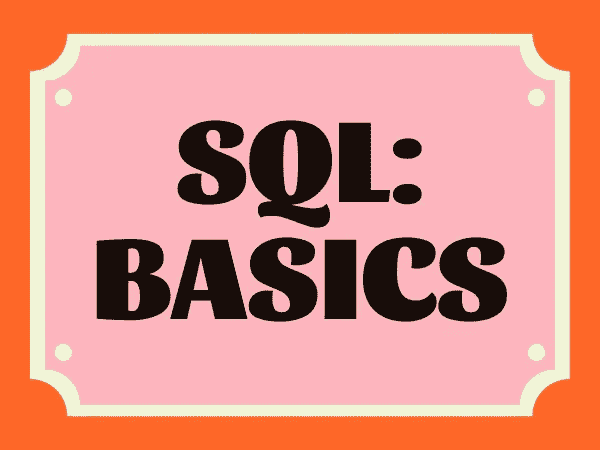

对于那些发现自己想要学习 SQL 并且想知道它是什么或者如何开始使用它的人来说，这是为你准备的博客！我将和您一起深入 SQL 的世界。开始了。

**SQL** 代表 **S** 结构化 **Q** 查询 **L** 语言。

发音为“Sequel”或“S-Q-L”。好玩吧？我们喜欢选择。特别是，我们发现我们使用 SQL 来操作和访问数据库，尤其是关系数据库。像 SQL 这样的查询语言是一种旨在帮助我们从数据库中检索特定数据的语言。有相当多的数据查询语言，但是 SQL 是开始学习数据查询的一个很好的切入点，也是我们现在要关注的。

# **SQL 的诞生**

SQL 的一个更基本的版本是由两位 IBM 开发人员 Donald D. Chamberlin 和 Raymond F. Boyce 在 20 世纪 70 年代首先开发的，他们将 SQL 开发为一种在 IBM 的准关系数据库中操作和存储数据的方法。1986 年**到了**，这是 SQL 成为美国国家标准协会(ANSI)确定的技术行业数据查询的技术标准的时候。

# 红色漫游者，红色漫游者，发送数据。

让我们讨论一下开始使用 SQL 进行查询的方法。您可以选择几种方式来使用 SQL 查询。我将在本地环境中使用 SQLite Mac 应用程序。如果你想设置它，这里有一个教程[这里](https://www.sqlitetutorial.net/download-install-sqlite/)。或者，你可以使用一个在线查看器，比如这个 [SQLite 查看器](https://inloop.github.io/sqlite-viewer/)。

# *选择。*

Select 语句是 SQL 查询的基础，也是每次调用数据库时要用到的语句。在其最简单的执行形式中，它允许您从一个或多个表中选择数据。请参见下面的语法。

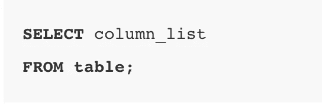

Example of SELECT statement querying from a single table.

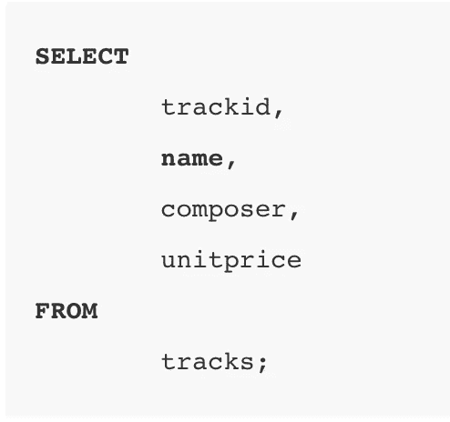

Example of selecting multiple specific columns from a table

如果要从单个表中选择所有列，可以使用*符号选择所有列。在测试代码时，这是一种更简洁明了的 SQL 查询的便捷方式。通常，在实际运行应用程序时使用它并不是一个很好的做法，因为它会返回不必要的信息并降低运行时间。请参见下面的语法。

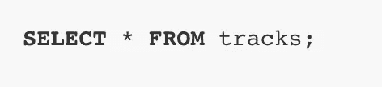

# 在哪里？

我们在 FROM 语句后使用 WHERE 来过滤和查找查询中的特定条件。

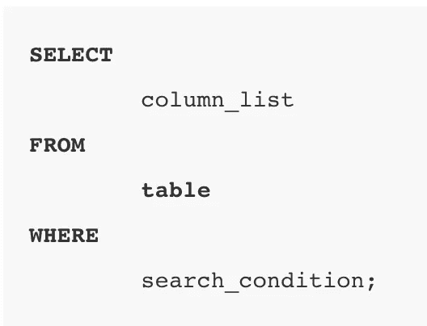

让我们看一个更具体的数据示例，看看 WHERE 语句是如何工作的。

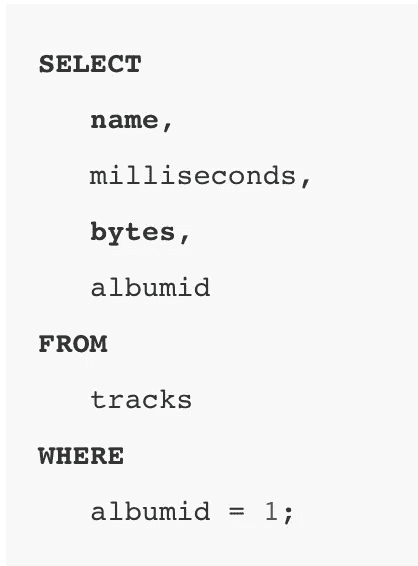

We are targeting to find the albumid that equals 1 in this query.

# **排序依据。**

ORDER BY 语句用在 FROM 语句之后，它允许我们基于一个或多个列，通常以升序或降序对查询结果进行排序。

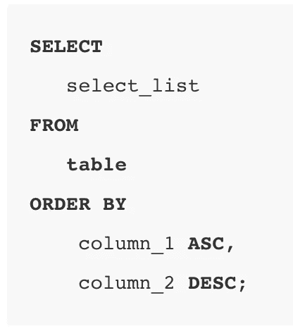

ASC stands for ascending, and DESC stands for descending.

下面是一个数据示例中 ORDER BY 的示例。

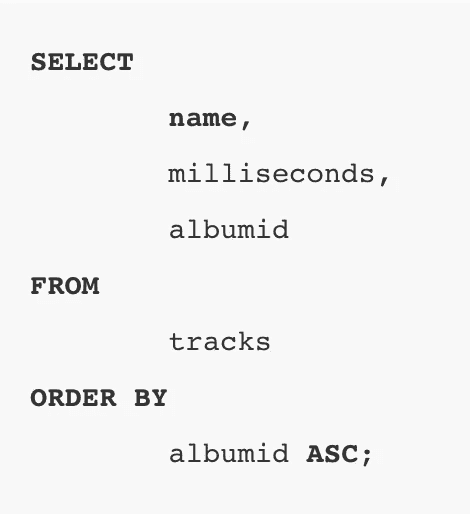

The albumid will be ordered from lowest first. Note with ORDER BY, SQlite’s default is to show data in ascending order.

# 分组依据。

GROUP BY 语句位于 FROM 子句和 WHERE 子句之后，使用它，我们将指定一列或多列，用逗号分隔，以指定组。通常我们会看到 GROUP BY 与 SQL 函数一起使用:MAX、MIN、COUNT、SUM 或 AVG。

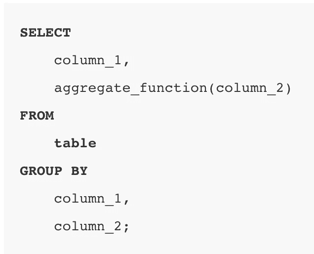

请参见下面的数据示例:GROUP BY、ORDER BY 和 COUNT 函数，后者对 trackid 进行计数。

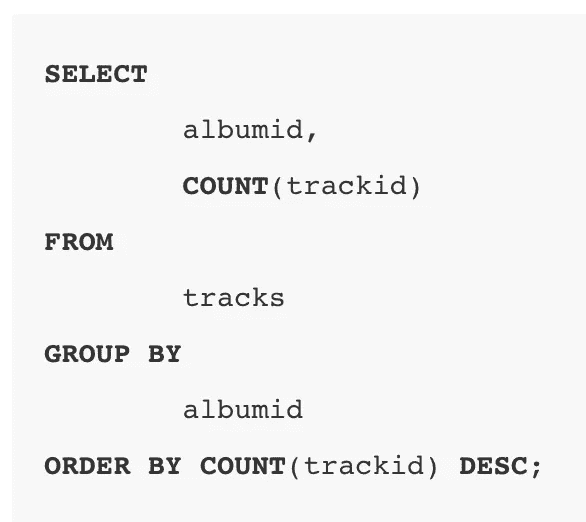

# **极限。**

当我们有约束时，我们需要添加到我们的查询限制是一个很好的 SQL 语句使用。假设我们有一百万个结果，我们可以设置“限制 1”来返回一个结果。更多示例见下文。

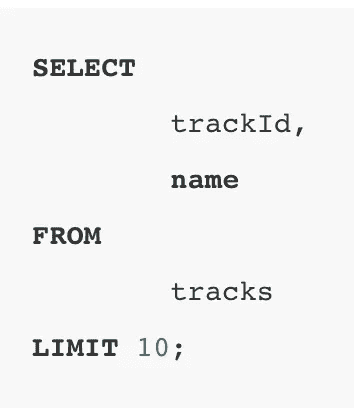

有一个选项，使用有限制的偏移键盘。这个例子向我们展示了跟踪表中第二长的跟踪。

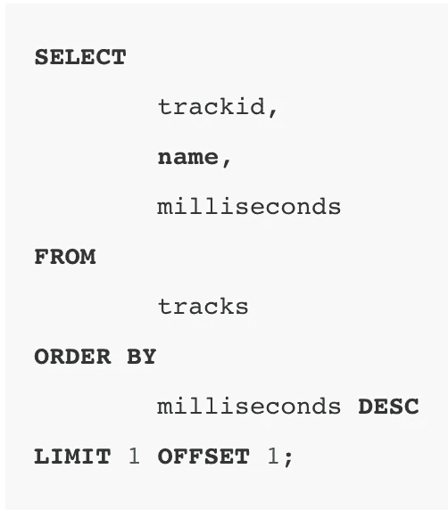

# 结论

所以你有它！一些令人愉快的基础知识，有望打开一些初学者的 SQL 知识的大门。表之间的 SQL 查询会变得非常高级，我希望在以后的博客中涵盖更多像“JOIN”这样的主题，并进行更深入的探讨。

感谢阅读&快乐的 SQL 查询！

*更多内容尽在*[***plain English . io***](https://plainenglish.io/)