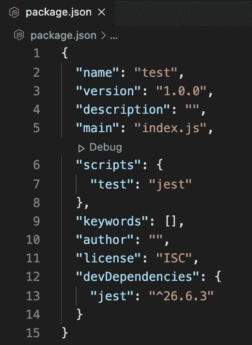
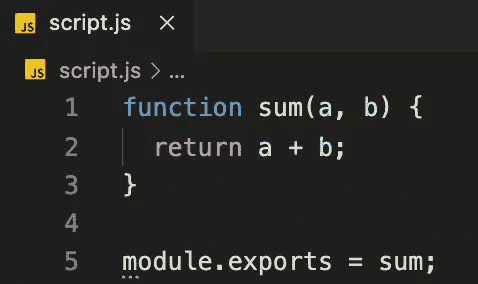
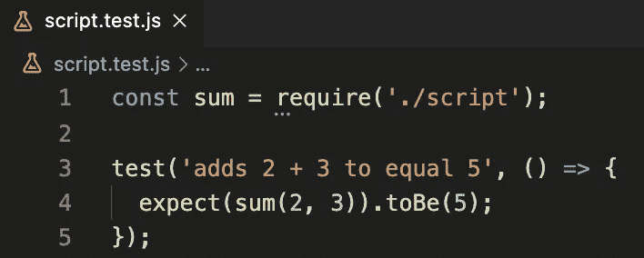
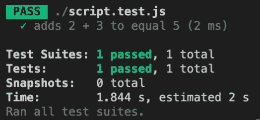
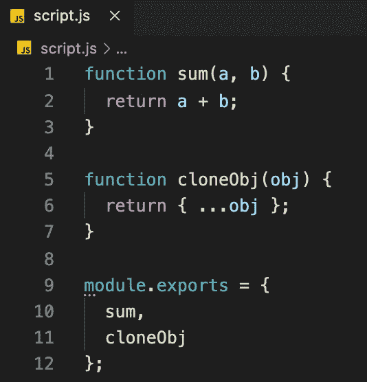
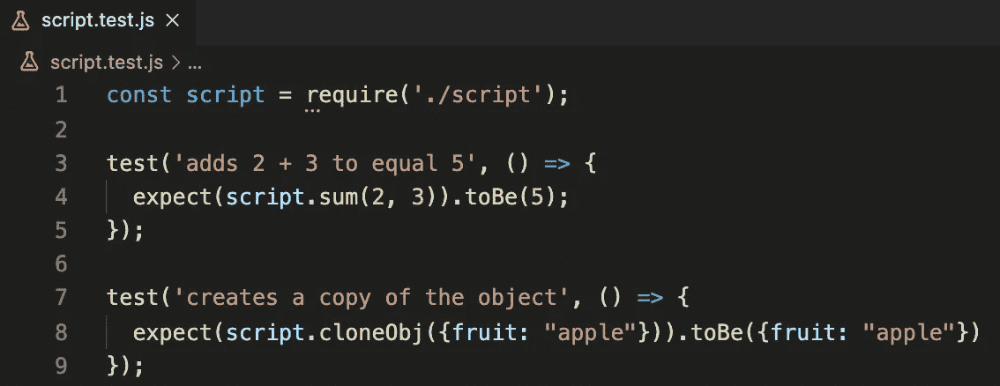
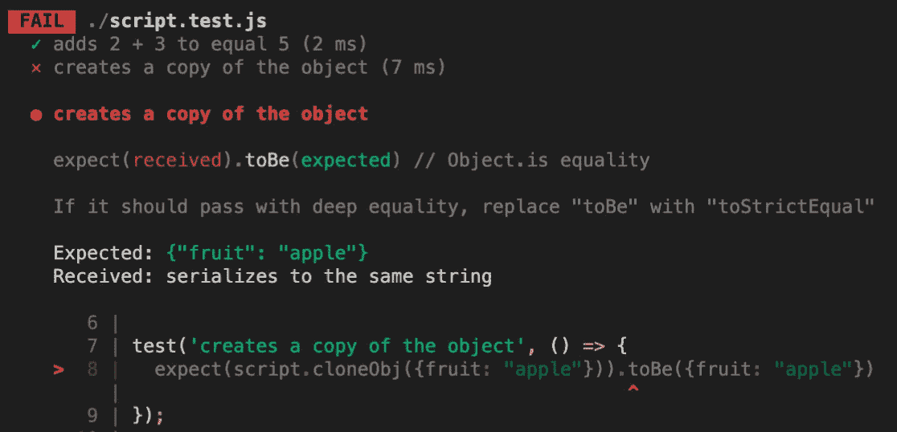
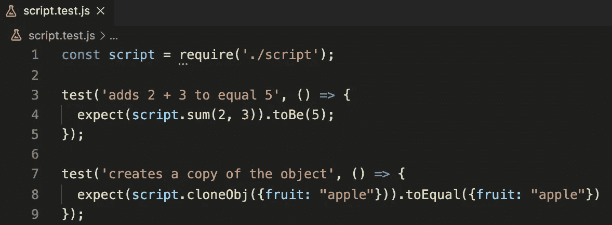
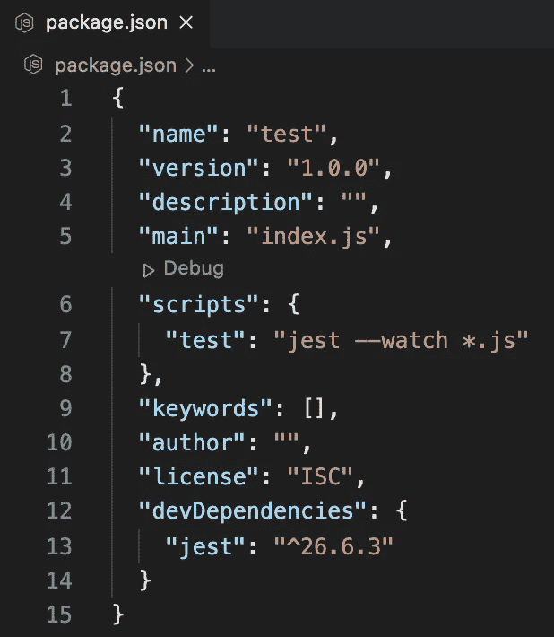

# Jest 单元测试简介

> 原文：<https://javascript.plainenglish.io/intro-to-unit-testing-with-jest-628aa3c6f832?source=collection_archive---------7----------------------->


## 测试驱动的开发和单元测试

测试是软件生产最重要的方面之一。测试让开发人员清楚地知道应用程序的某些部分应该完成什么。

许多公司使用被称为测试驱动开发(TDD)的编程方法来指导生产。TDD 规定，为了在编写任何代码之前指导软件生产，应该首先创建自动化单元测试。

但是什么是单元测试呢？

单元测试是一种测试可以从软件中分离出来的最小代码片段(也称为单元或组件)的方法。单元可以是单独的函数、方法、过程、模块或对象。

了解代码将如何被测试可以让开发人员知道代码应该如何被最好地组合和模块化。

[单一责任原则](https://en.wikipedia.org/wiki/Single-responsibility_principle)在开发测试中起着有益的作用，因为每个单元测试应该只检查井的完成，单一责任。这将促使代码以遵循相同原则的方式编写。

在 TDD 中，只有当测试失败时，才应该编写或修改新代码；测试总是推动开发。

## 什么是玩笑？

[Jest](https://jestjs.io/) 是一个令人愉快的 JavaScript 测试框架，专注于简单性。它与项目一起使用:[巴贝尔](https://babeljs.io/)、[类型脚本](https://www.typescriptlang.org/)、[节点](https://nodejs.org/)、[反应](https://reactjs.org/)、[角度](https://angular.io/)、 [Vue](https://vuejs.org/) 等等！”Jest 是开源的，由克里斯托夫·中泽友秀创建，由脸书维护。

它预装了 create-creat-app，最初是专门为测试 React 应用程序而设计的。

此后，它成为前端和后端应用程序最流行的 JavaScript 测试框架之一，也可以说是最容易使用的。截至 2021 年 4 月，Jest 的周下载量超过 1100 万。

## 构建我们的第一个测试

出于演示目的，我们将不使用 create-react-app，而是在 Node.js 中创建一个非常简单的应用程序。因此，让我们从命令行创建一个新目录，初始化 npm，创建一个文件，并安装 Jest:

```
$ mkdir test
$ cd test
$ npm init -y$ touch script.js
$ npm install --save-dev jest
$ code . (open the new dir in whatever code editor you use)
```

现在打开 package.json 并指定“test”来运行 jest，方法是将文本替换为“Jest”:



现在我们只需在命令行中输入“npm test”就可以运行 Jest 了。让我们打开 script.js 并创建一个简单的函数来获得两个数的和。我们将使用 CommonJS 模块来导出:



让我们创建一个新文件，与我们将要测试的文件同名，但是添加“. test.js”来保存我们的测试。

每一个使用 Jest 的测试文件都需要在名字的末尾有一个“. test.js”来作为测试用例。下面是一个用 Jest 语法创建的简单测试，用于测试 sum 函数的 2 + 3 结果是否为 5:



注意，它读起来几乎像一个句子，多好啊！

“test”函数有两个参数；第一个参数是一个字符串，我们在其中定义了测试要检查的内容(这只是为了便于阅读，它与测试的操作没有实际关系)。

第二个参数是包含我们将要运行的测试的函数。在这个函数中，我们有一个“expect”函数，它接受一个指定的要测试的函数(“sum”)和我们选择的参数。

然后使用类似的“匹配器”将结果与我们的预期结果进行核对。toBe(检查严格相等===)。点击查看完整的匹配者列表[。](https://github.com/sapegin/jest-cheat-sheet#matchers)

现在让我们运行:

```
$ npm test
```

终端应该输出类似如下的内容:



呜哇！我们第一次通过单元测试。让我们再做一个，这样我们可以看到如何在一个文件中管理多个单元的测试，以及如何使用另一个匹配器。让我们在 **script.js** 文件中创建一个名为 cloneObj 的新函数，它将使用 [ES6 扩展操作符](https://www.samanthaming.com/tidbits/70-3-ways-to-clone-objects/)获取一个对象并返回其副本。然后我们导出两个函数:



现在让我们在 **script.test.js** 文件中编写一个测试:



运行`$ npm test`看看会发生什么。检查我们的 cloneObj 函数的测试是*失败:*



如果你看一下 [Jest 小抄](https://github.com/sapegin/jest-cheat-sheet)，你可以看到匹配器。toBe 检查严格相等===。但是，两个对象永远不是同一个对象。

它们可能包含相同的属性和值，但这并不表示它们相等，因为两个对象在内存中占用不同的地址或空间。

有一种方法可以让[检查](https://dmitripavlutin.com/how-to-compare-objects-in-javascript/)一个对象的内容是否包含相同的属性和值，这就是所谓的“深度相等”或“深度相等”。如果你看了这条消息，Jest 建议我们使用“toStrictEqual”来检查深度相等，这听起来有点令人困惑。

更好的解决方案是:Jest 有匹配器”。这让我们的意图更加明确。因此，让我们交换匹配器，我们的测试现在都应该通过了:



值得注意的是，您可以在同一个文件中为您正在测试的每个单元编写多个测试。确保你收藏了[笑话小抄](https://github.com/sapegin/jest-cheat-sheet)！

## 等待测试

如果希望 node 监视对。js 文件，这样您就不必一遍又一遍地输入`$ npm test` ，只需将以下代码添加到 package.json 中的测试脚本中，运行`$ npm test`，测试就会在您对. js 文件进行更改的任何时候自动运行。

```
--watch *.js 
```



一如既往，感谢阅读。欢迎在 [LinkedIn](https://www.linkedin.com/in/kylefarmer85/) 上联系我！

*更多内容请看*[***plain English . io***](https://plainenglish.io/)