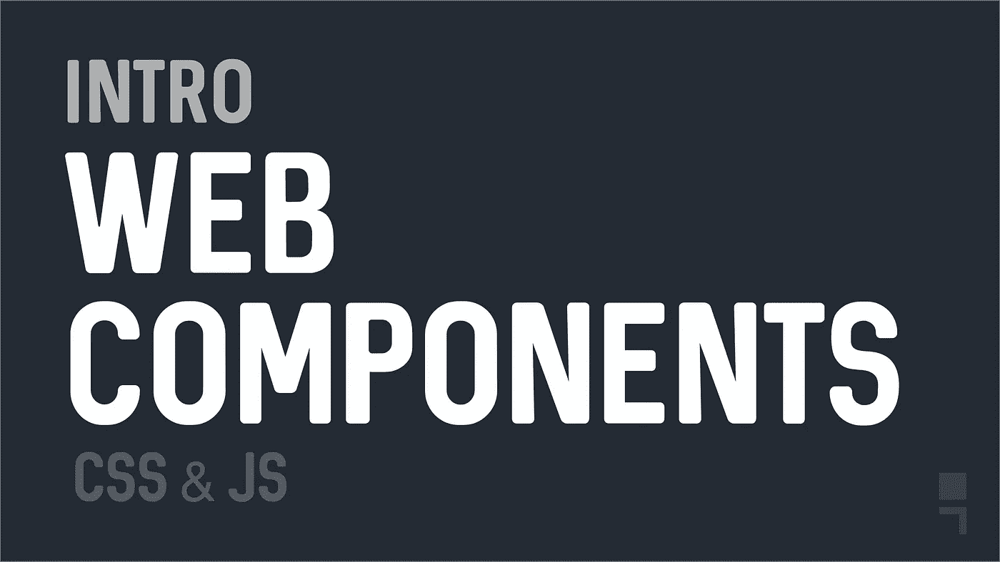
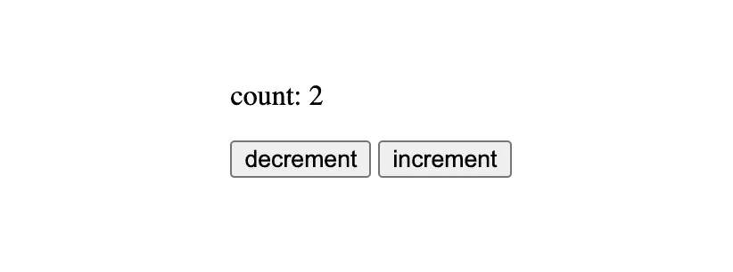
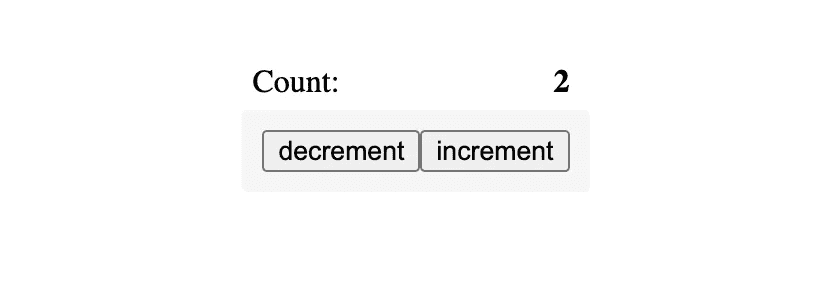
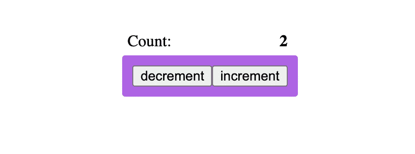
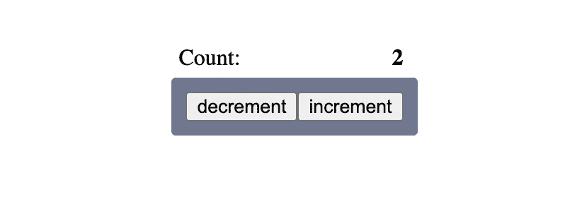

# Web 组件简介—深入探讨

> 原文：<https://javascript.plainenglish.io/intro-to-web-components-full-walkthrough-623023d365f1?source=collection_archive---------4----------------------->



随着更广泛和更好的支持，Web 组件技术越来越受欢迎，并成为我和许多其他人最喜欢的构建 web UI 的方式。这些新的 API 解决了许多 web 开发问题，并提供了一种更简单的方法来将您的网站分成更小的可消化的部分，同时允许您更好地组织这些部分。

## 什么是 Web 组件？

Web Components 不是一个单一的 API，而是一个技术集合，它允许您使用封装的逻辑和样式创建可重用的元素(标记)。这是一种构建组件的原生方式，就像您使用 React、Angular 或 Vue 一样，但是没有一大堆的包袱。

这些 API 包括:

*   [自定义元素注册表](https://developer.mozilla.org/en-US/docs/Web/API/CustomElementRegistry)
*   [暗影 DOM](https://developer.mozilla.org/en-US/docs/Web/Web_Components/Using_shadow_DOM)
*   [模板](https://developer.mozilla.org/en-US/docs/Web/HTML/Element/template)和[槽](https://developer.mozilla.org/en-US/docs/Web/HTML/Element/slot)标签

## 何时以及为何使用 Web 组件

虽然您可能不太听说它的采用，但它可以代替或与其他第三方 UI 库和框架一起使用，如 React、Vue、Svelte、Angular 等等。Angular 特别提供了使用它来创建角度组件的选项。

Web 组件不应该被视为第三方选项的替代品，而应该被视为增强器。也就是说，有几个原因让你应该考虑 Web 组件而不是第三方组件:

*   **小得多的包**:当你使用第三方库来创建你的组件时，你不仅要把那些组件的代码，还要把库发送到浏览器，这样组件才能工作。然而，已经创建了一些第三方库，或者提供了编译成 Web 组件的选项，所以 JavaScript 包要小得多。
*   **封装**:一些第三方选项提供了封装你的代码和风格的选项。您可以安装许多库来帮助您解决这个问题。Web 组件通过私有组件范围中的影子 DOM 提供了这种封装选项。
*   **小的学习曲线**:如果你已经熟悉 HTML、CSS 和 DOM API，学习 Web 组件应该会感觉超级容易，因为 Web 组件就是所有这些加上一些新东西。
*   **构建一次，随处使用**:事实上，你可以将它与其他库和框架一起使用，这使得它非常适合 UI 库。您不再需要为您使用的框架寻找 UI 库版本，或者维护同一个库的多个版本。

没有什么是完美的，所以这里有一些你需要知道的使用 Web 组件的缺点:

*   **浏览器支持**:因为是浏览器中的新事物，旧版本可能不支持，这意味着你需要使用 polyfills 才能 100%依赖它。但是有[聚合物项目](https://github.com/Polymer/polymer)和[其他库](https://lit.dev/)已经解决了这个问题。
*   SEO:任何需要生成 Javascript 的标记都会给搜索引擎带来挑战。Web 组件对 [shadow-dom](https://developer.mozilla.org/en-US/docs/Web/Web_Components/Using_shadow_DOM) 封装提出了额外的挑战。
*   **其他可能的 Web API 问题**:因为 Web 组件是创建 UI 的一种不同方式，所以您可能会遇到这样的问题，例如，如果您创建了一个自定义按钮，它将不会被 Forms API 或 ARIA 标签选中，这些标签有时可能需要在组件中设置得很深才能与其他标签一起工作。

Web 组件是一种新的、不断发展的构建 UI 的方式，与流行时起时落的第三方库不同，Web 组件会一直存在，并且会变得越来越好。

## Web 组件库

还有许多可用的库简化了您使用 web 组件的方式，并且已经包含了聚合填充，以确保您的组件可以在大多数浏览器中工作。以下是我最喜欢的几个:

*   [CWCO](https://www.npmjs.com/package/cwco)
*   [点亮](https://lit.dev/)
*   [模板](https://stenciljs.com/)
*   [打开网页组件](https://open-wc.org/)
*   [更多……](https://developer.mozilla.org/en-US/docs/Web/Web_Components#see_also)

## 创建和注册您的组件

要创建一个组件，你必须定义一个类来扩展 HTMLElement 或者一些其他元素，比如 HTMLButtonElement。要知道，Safari 浏览器不支持[扩展其他原生元素](https://developers.google.com/web/fundamentals/web-components/customelements#extendhtml)，因为苹果决定不实现它们。

为了能够扩展本地元素，你必须为 Web 组件使用 polyfills 或库，比如 [lit](https://lit.dev/) 。

```
class **CounterWidget** extends **HTMLElement** {
  ...
}
```

上面，一个`**CounterWidget**`类被定义为扩展`**HTMLElement**` **。你应该把元素类看作是我们创建的 HTML 标签的控制器，但是仅仅这样并不能给我们组件。我们还必须使用`***customElements.define***`注册我们的标签。**

```
customElements.define('counter-digget', **CounterWidget**);
```

define 方法采用标签的名称和控制它的类的名称。该名称必须遵循正常的 HTML 标记名称规则，并且不能是一个单词。您不必匹配类名，但我喜欢这样做，作为一种跟踪事物的机制。

如果我们要扩展一个原生元素，那么定义的方法将需要第三个参数，在这里指定要扩展哪个原生元素。

```
class **MyButton** extends **HTMLButtonElement** {
  ...
}customElements.define('my-button', **HTMLButtonElement, {extends: 'button'**);
```

## 渲染您的组件

创建并注册了组件后，您可以继续将它用作普通的 HTML 标记。

```
<**counter-digget**></**counter-digget**>
```

但是这不会渲染任何东西，因为我们从来没有定义它需要渲染什么。在`**CounterWidget**`类中，我们可以使用`*this*`关键字来访问元素并做我们想做的任何事情。

```
class CounterWidget extends HTMLElement {
  constructor() {
    super();

    **this.innerHTML = `
      <p>count: <span class="count">0</span></p>
      <div class="counter-buttons">
        <button type="button">-</button>
        <button type="button">+</button>
      </div>
    `**;
  }
}
```


因为我们正在扩展另一个类，所以如果我们定义构造函数，我们必须总是调用 *super* 。我们使用“ *this* ”来设置内部 HTML，这与选择标签并设置内部 HTML 的查询相同。

尽管这很好，但它没有利用影子 DOM 的封装，这意味着它的内部 HTML 很容易被 CSS 或任何其他 DOM 选择作为目标。

## 阴影 DOM

影子 DOM 是组件封装的一个重要部分，因为它将内容呈现在与文档分离的“分离”DOM 中。整个网页内容的根元素是文档本身，但是对于使用影子 DOM 的组件，根是影子根。

为了创建我们的影子根，我们必须调用我们可以访问的`**attachShadow**`方法，因为这是一个元素。

```
class CounterWidget extends HTMLElement {
  constructor() {
    super();

    const shadow = this.**attachShadow**({
      **mode: 'closed',** 
     ** delegatesFocus: true**
    }); **shadow.innerHTML** = `
      <p>count: <span class="count">0</span></p>
      <div class="counter-buttons">
        <button type="button">-</button>
        <button type="button">+</button>
      </div>
    `;
  }
}
```

attachShadow 函数不是特定于 web 组件的。您可以用同样的方式[将阴影 DOM 附加到一些 HTML 元素上](https://developer.mozilla.org/en-US/docs/Web/API/Element/attachShadow)，而无需创建组件。当您调用它时，您可以指定模式，该模式可以是“*打开*”或“*关闭*”，这定义了是否可以从元素外部访问影子根。

您还可以指定`**delegatesFocus**`选项，这几乎意味着每当内部的任何元素获得焦点时，整个标签都会获得标签的焦点样式。


与任何组件一样，也可以检测组件何时被附加到 DOM 或从 DOM 中移除，以及属性何时被设置或更改。

## 生命周期挂钩

Web 组件带有四个生命周期挂钩，您可以利用它们:

*   **connectedCallback** :每次将自定义元素追加到文档连接元素中时调用。每次移动节点时，这可能发生在元素的内容被完全解析之前。
*   **disconnectedCallback** 每次从 DOM 中删除定制元素时调用，例如，在选择元素后对元素调用`[**remove**](https://developer.mozilla.org/en-US/docs/Web/API/Element/remove)`方法。
*   **每次使用[adopted node](https://developer.mozilla.org/en-US/docs/Web/API/Document/adoptNode)方法调用将定制元素移动到新文档时，都会调用 adoptedCallback** 。例如，自定义元素存在于一个`iFrame`中，您想将它移动到您的文档中。
*   **attributeChangedCallback**在每次添加、删除或更改定制元素的属性时被调用。在静态 get `observedAttributes`方法中指定了哪些属性需要注意变化

为了给你一个我们如何使用这些生命周期的例子，我稍微重构了一下计数器小部件类，以利用`**connectedCallback**`来调用我们新的`**render**`方法。

```
class CounterWidget extends HTMLElement {
  constructor() {
    super();

    this.attachShadow({
      **mode: 'open',** 
      delegatesFocus: true
    });

  }

  **connectedCallback**() {
    **this.render();**
  }

  **render() {
    this.shadowRoot.**innerHTML **= `**      <p>count: <span class="count">0</span></p>
      <div class="counter-buttons">
        <button type="button">-</button>
        <button type="button">+</button>
      </div> **`;
  }**
}
```

[一些元素](https://developer.mozilla.org/en-US/docs/Web/API/Element/attachShadow#elements_you_can_attach_a_shadow_to)有它们的`**shadowRoot**` 属性，如果阴影是在模式设置为`*closed*`的情况下创建的，那么属性将是`null`。如果模式设置为`open`，则为[影子根元素](https://developer.mozilla.org/en-US/docs/Web/API/ShadowRoot)。

## 将数据传递给组件

有两种方法可以将数据传递给自定义组件，要么通过属性，要么在选择元素后通过元素。

*   **属性数据**:可以在标签上设置任意属性，设置想要传递的值。这个方法非常适合传递简单的数据，它总是以`String`的形式被接收。您可以将字符串解析为数字和 JSON 对象，但理想情况下，使用这种方法传递简单的字符串值。
*   **元素属性数据**:你可以使用这个方法将复杂的数据类型传递给元素，首先选择你的自定义标签，然后直接在元素上设置一个属性，这个属性在你的组件类中，你可以通过 setters 来处理。

## 处理属性更改

我想设置一个开始计数小部件的初始计数值，以及计数的最小值和最大值。因为这些是简单的数据，我们可以使用属性。

```
<counter-digget **max="10"** **min="-10"** **count="0"**></counter-digget>
```

为了处理属性，我们必须首先告诉组件我们想要[观察哪个属性的更新](https://developer.mozilla.org/en-US/docs/Web/API/MutationObserver)。接下来，我们可以使用`**attributeChangedCallback**`来处理更新。调用这个生命周期回调函数有 3 个参数:属性的名称、旧值和新值。

```
class CounterWidget extends HTMLElement {
  **min = 0;
  max = 10;
  count = 0;**

  ...

  static get **observedAttributes**() { 
    **return ['min', 'max', 'count'];** 
  }

  **attributeChangedCallback**(**name, oldValue, newValue**) {
    switch(name) {
      case 'min':
        **this.min = newValue || 0;**
        break;
      case 'max':
        **this.max = newValue || 10;**
        break;
      case 'count':
        **this.count = newValue || this.count;**
        break;
    }
  } ...}
```

我还用初始值定义了类中的属性，在 attribute changed 回调中，我为每个期望的属性使用了一个开关来更新那些内部属性。

如果属性没有值或者属性被删除，那么`newValue`将为空，所以当这种情况发生时，我将内部属性重置为默认值或当前值。

即使我们正在处理属性更新，我们还没有更新我们正在渲染的内容。我也没有处理按钮点击，这也应该更新呈现的内容。

## 更新时重新渲染

使用 Web 组件，您可以控制在更新时重新呈现整个组件，或者自己处理单个元素的更新。

在我们的例子中，当计数改变时，我想重新呈现包含总数的 span 标记。当计数改变时，我不需要重新呈现整个标记，为此，我需要选择我想要操作的元素。

```
class CounterWidget extends HTMLElement {
  min = 0;
  max = 10;
  count = 0;

  ...

  **updateCountElement**(newCount) {
    **if(!this.**[**isConnected**](https://developer.mozilla.org/en-US/docs/Web/API/Node/isConnected)**) return;** // make sure the count is withing range
    **newCount = Math.min(Math.max(this.min, newCount), this.max);**

    **if(this.count !== newCount)** {
      **this.count = newCount;
      this.countElement.textContent = this.count;**
    }
  }

  render() {
    this.shadowRoot.innerHTML = `
      <p>count: <span **class="count"**>**${this.count}**</span></p>
      <div **class="counter-buttons"**>
        <button type="button">**-**</button>
        <button type="button">**+**</button>
      </div>
    `;

    **this.countElement** = this.shadowRoot
      **.querySelector('.count');**
    const counterButtons = this.shadowRoot
      **.querySelector('.counter-buttons');**

    // decrement count  
    counterButtons.**children[0]**
      .addEventListener('**click**', 
      () => this.**updateCountElement**(this.count - 1));

    // increment count 
    counterButtons.**children[1]**
      .addEventListener('**click**', 
      () => this.**updateCountElement**(this.count + 1));
  }
}
```


通过选择按钮，很容易附加一个 click 事件并调用`**updateCountElement**` 方法，只要新的计数在范围内且不同于当前计数，该方法就用新的计数值更新计数元素文本内容。

还要注意，如果元素不在 DOM 上，updateCountElement 不会做任何事情，首先检查元素[是否连接了](https://developer.mozilla.org/en-US/docs/Web/API/Node/isConnected)。这是确保某些操作只在元素活动时发生的最好方法，这样可以避免不必要的或依赖于 DOM 的操作。

现在，当 count 属性得到更新时，我们也可以调用这个`**updateCountElement**`方法。

```
class CounterWidget extends HTMLElement {
  min = 0;
  max = 10;
  count = 0;

  ...

  attributeChangedCallback(name, oldValue, newValue) {
    switch(name) {
      case 'min':
        this.min = newValue || 0;
        break;
      case 'max':
        this.max = newValue || 100;
        break;
      case 'count':
        **this.updateCountElement(**newValue || this.count**);**
        break;
    }
  }

  ...
}
```

这意味着如果我选择定制元素并设置 count 属性，组件将更新它的计数

```
const counter = document.querySelector('counter-digget');counter.setAttribute('count', 5);
```

因为我们正在从属性更新中更新内部 HTML，所以知道在调用`**render**`方法的`**connectedCallback**` 之前可以调用`**attributeChangedCallback**`是很重要的，这可能是一个问题。因此，确保你从`**constructor**`函数中进行初始渲染。

```
class CounterWidget extends HTMLElement {
  min = 0;
  max = 10;
  count = 0;

  constructor() {
    super();

    this.attachShadow({
      mode: 'open', 
      delegatesFocus: true
    });
    **this.render();**
  }

  connectedCallback() {
    **// this.render();**
  } ...}
```

## 处理复杂数据

属性允许我们很好地处理简单的数据，但是如果我们想要发送一个 Map 对象或另一个类实例，甚至一个复杂的对象，属性就帮不了我们。为此，我们需要做一些选择并设置一个属性。

它就像选择我们创建的自定义标记并在元素上设置一个属性一样简单。

```
const **counter** = document.querySelector('counter-digget');// counter.setAttribute('count', 5);**counter.data = {
  max: 10,
  min: -10,
  count: 5
}**
```

现在，为了处理这些传入的数据，我们可以使用一个 [setter](https://developer.mozilla.org/en-US/docs/Web/JavaScript/Reference/Functions/set) 来读取数据，并对它做任何我们想做的事情。为此，我将使用传入的值来设置最小值和最大值，并更新 count 元素的内容。

```
class CounterWidget extends HTMLElement {
  min = 0;
  max = 10;
  count = 0;

  ...

 **set data(value) {**    this.min = **value**.min || this.min;
    this.max = **value**.max || this.max; this.updateCountElement(**value**.count || this.count); **}** ...}
```

我们还可以在使用数据之前验证 [setter](https://developer.mozilla.org/en-US/docs/Web/JavaScript/Reference/Functions/set) 中的数据以及进行任何格式化。使用 setter 的全部意义在于一旦数据被设置，就能够检测到它们。

您不一定需要 setter，例如，您也可以直接从元素中更改内部属性`min`、`max`和`count`，因为它们不是私有的。

```
const **counter** = document.querySelector('counter-digget');**counter.min = -10;
counter.max = 10;
counter.count = 5;**
```

如果您不希望这种情况发生，您可以将这些内部属性设为私有。对于我们的例子，我们可以将`count`设为私有和只读的，这样它只能从内部操作。为了对`min`和`max`有更多的控制，你也可以把它们改成[设置器](https://developer.mozilla.org/en-US/docs/Web/JavaScript/Reference/Functions/set)。

```
class CounterWidget extends HTMLElement {
  min = 0;  max = 10; **#count = 0;** get **count**() {
    return this.#count;
  } ...}
```

## 从组件中获取数据

您现在知道了如何使用属性和特性获取组件内部的数据，但是有时您还需要获取数据。

您可能想将一个函数传递给组件以用作回调，但这被认为不是一个好的做法，从一个元素中获取数据的最佳方式是像其他元素一样通过事件。

对于我们的计数器小部件，最好知道什么时候计数`changed`，这样我们就可以根据值做一些事情。

```
class CounterWidget extends HTMLElement {
  min = 0;  max = 10;#count = 0; ... **updateCountElement**(newCount) {
    if(!this.isConnected) return; newCount = Math.min(Math.max(this.min, newCount), this.max);

    if(this.#count !== newCount) {
      **this.dispatchEvent(new Event('changed'));**
      this.#count = newCount;
      this.countElement.textContent = this.#count;
    }
  } ...}*// from outside*const counter = **document.querySelector('counter-digget');**counter**.addEventListener('changed'**, (e) => {
  console.log('changed', **e.target.count**)
})
```

正如您在上面的代码中看到的，每次计数改变为不同的值时，我们都会调度一个`changed`事件。对您可以调度的事件类型没有限制，如果需要，您甚至可以调度适合您的组件的[自定义事件](https://developer.mozilla.org/en-US/docs/Web/Events/Creating_and_triggering_events#adding_custom_data_%E2%80%93_customevent)。

为了说明一个自定义事件，还将调度一个自定义事件`countforced`，用于当用户停留在最小值或最大值上，但继续单击按钮以向上或向下计数时。如果我们想向用户显示消息，这可能是有用的。

```
class CounterWidget extends HTMLElement {
  min = 0;  max = 10;#count = 0; ... **updateCountElement**(newCount) {
    if(!this.isConnected) return; newCount = Math.min(Math.max(this.min, newCount), this.max);

    if(this.#count !== newCount) {
      this.dispatchEvent(new Event('changed'));
      this.#count = newCount;
      this.countElement.textContent = this.#count;
    } else {
      **this.dispatchEvent(new CustomEvent('countforced', { 
        detail: {
          forcedValue: newCount === this.max 
             ? 'max' 
             : 'min'
         }
      }));**
    }
  } ...}*// from outside*const counter = **document.querySelector('counter-digget');***// listen to count forced event*
counter**.addEventListener('countforced'**, (e) => {
  console.log('countforced', **e.detail.forcedValue**)
})
```

## 模板

我们已经通过在 render 方法中设置 shadow 根的内部 HTML 进行了某种类型的模板化，但是随着其他 web 组件技术的发展，引入了`[template](https://developer.mozilla.org/en-US/docs/Web/HTML/Element/template)`和`[slot](https://developer.mozilla.org/en-US/docs/Web/HTML/Element/slot)`标签，这使得可重用模板变得更加容易。

在你的页面主体标签中，你可以定义你的模板，浏览器会知道不要呈现它们。模板就像一个特殊的[文档片段](https://developer.mozilla.org/en-US/docs/Web/API/DocumentFragment)，在其中它将只包含要重用的标记。我们也可以这样定义计数器小部件模板。

```
**<template id="counter">**
  <p>count: <span class="count">0</span></p>
  <div class="counter-buttons">
    <button type="button">-</button>
    <button type="button">+</button>
  </div>
**</template>**
```

如果我们这样做，从 render 方法，我们将查询它的 id，而不是使用它。

```
class CounterWidget extends HTMLElement { ...

  render() {
    **const template = document.getElementById('counter');**
    this.shadowRoot.**appendChild**(**template.content**);

    ...
  }
}
```

每个模板都有自己的内容，我们不需要设置内部 HTML，而是需要将模板内容附加到影子根中。关于我们的计数器小部件的其他一切都可以保持不变，这里唯一的区别是模板可以被另一个组件使用。

这是在组件之间共享模板的完美方式，并且整个组件主体不必是一个单一的模板。您可以使用许多模板来设置组件内容，也可以仅将模板用于组件内容的一部分。

例如，我们可以将按钮模板化，并保留包含计数的段落。

```
**<template id="counter-buttons">**
  <div class="counter-buttons">
    <button type="button">-</button>
    <button type="button">+</button>
  </div>
**</template>**...class CounterWidget extends HTMLElement { ...

  render() {
    **const template = document.getElementById('counter-buttons');**

    this.shadowRoot.**innerHTML** = `
      <p>count: <span class="count">${this.count}</span></p>
    `; this.shadowRoot.appendChild(**template.content**);

    ...
  }
}
```

## 使用插槽

插槽是将 HTML 注入模板或组件主体的强大方法。slot 标签充当 HTML 的占位符，如果没有提供任何内容，它可以包含默认标记。这也是用额外的标记来扩展定制组件的一种强大的方式，允许一些灵活性，而不是将模板硬编码为总是相同的。

对于我们的计数器小部件示例，我们可以让递增和递减按钮可以被任何其他按钮替换，从而允许人们对按钮的外观有更多的控制，特别是因为样式被封装在组件内部，不能被轻易覆盖。

我们可以修改计数器按钮模板来包含按钮的槽。

```
<template id="**counter-buttons**">
  <div class="counter-buttons">
    **<slot name="dec-btn">** <button type="button">-</button>
    **</slot>**
    **<slot name="inc-btn">** <button type="button">+</button>
    **</slot>**
  </div>
</template>
```

在没有提供任何内容的情况下，插槽标签内的内容将被用作默认值。插槽上的 name 属性是一个标识符，我们可以用它来指定用新标签替换哪个插槽。

现在，当我们想要呈现标签时，我们可以指定我们的新按钮，并使用 slot 属性来指定用这些新按钮替换哪个占位符。

```
<counter-digget max="10" min="-10" count="2">
  <button **slot="inc-btn"**>increment</button>
  <button **slot="dec-btn"**>decrement</button>
</counter-digget>
```



因为我们不是通过一个特定的属性来选择按钮，所以这些按钮工作得很好。

你不需要为插槽使用模板标签。如果我们像最初一样切换回使用带有内部 HTML 的普通模板，这仍然可以很好地工作。

```
class CounterWidget extends HTMLElement { **...**

  **render**() {
    this.shadowRoot.**innerHTML** = `
      <p>count: <span class="count">${this.#count}</span></p>
      <div class="counter-buttons">
        **<slot name="dec-btn">**
           <button type="button">-</button>
        **</slot>**
        **<slot name="inc-btn">**
           <button type="button">+</button>
        **</slot>**
      </div>
    `;

    **...**
  }
}
```

只有当您希望在组件之间共享模板时，才使用 body 标记中的模板。我不喜欢把不会呈现的东西放在 body 标签中，所以我把它们放在一个单独的文件中，这样我就可以随时查询或创建它们。

```
const templates = {
  get **couterButtons**() {
    const template = document.**createElement**('**template**');

    template.**innerHTML** = `
      <div class="counter-buttons">
        <slot name="dec-btn">
          <button type="button">-</button>
        </slot>
        <slot name="inc-btn">
          <button type="button">+</button>
        </slot>
      </div>
    `;

    **return template;**
  }
}
```

那么使用起来就容易多了…

```
class CounterWidget extends HTMLElement { **...**

  **render**() {
    const template = **templates**.**couterButtons**;
    this.shadowRoot.innerHTML = `
      <p>count: <span class="count">${this.count}</span></p>
    `;
    this.shadowRoot.appendChild(**template.content**);

    **...**
  }
}
```

因为它只是 JavaScript 和 DOM API，你能有多大的创造力只取决于你自己。

## 造型组件

使用您的自定义组件，您可以在其中添加一个样式标记，该标记将包含该组件的样式。如果你使用影子 DOM，这个样式不能被外部覆盖，这减少了破坏 UI 外观的 CSS 冲突。

我喜欢为样式设置一个 getter，让事情变得更简单。

```
class CounterWidget extends HTMLElement { **...** get **style**() {
    return `
     **<style>**
       p {
         margin: 0 0 5px;
         text-transform: capitalize;
         display: flex;
         justify-content: space-between;
         padding: 0 10px 0 5px;
       }

       p span {
         font-weight: bold;
       }

       .counter-buttons {
          display: flex;
          align-items: center;
          padding: 10px;
          background: #f6f6f6;
          border-radius: 3px;
       }p
     **</style>**
    `
  } **render**() {
    const template = templates.couterButtons;
    this.shadowRoot.innerHTML = `
      **${this.style}**
      <p>count: <span class="count">${this.count}</span></p>
    `;
    this.shadowRoot.appendChild(template.content);

    **...**
  }
}
```



你也可以把样式标签放在模板本身里面，这样它总是有它自己的样式，如果你想的话，你可以从组件里面覆盖它。

```
<template id="counter-buttons">
  **<style>
   ...
  </style>**
  <div class="counter-buttons">
    <slot name="dec-btn"><button type="button">-</button></slot>
    <slot name="inc-btn"><button type="button">+</button></slot>
  </div>
</template>
```

## 覆盖组件样式

控制组件的方法之一是留下槽，在那里可以插入元素，并且它们的样式已经打开。如果您知道您需要覆盖组件的样式，您可以保持阴影 DOM 打开，这样您就可以从 JavaScript 中查询它并设置样式，或者使用 [CSS 变量](https://developer.mozilla.org/en-US/docs/Web/CSS/Using_CSS_custom_properties)。

因为计数器小部件有一个打开的阴影 DOM，我可以锁定它，并使计数器按钮变成紫色。

```
const counter = document.querySelector('counter-digget');counter.**shadowRoot**
  .querySelector('.counter-buttons')
  **.style.backgroundColor = '#ae63e4'**
```



另一种方法是使用变量来设置计数器按钮的背景。CSS `var`采用要使用的变量的名称，以及在变量不存在的情况下使用的可选默认值。

```
**.counter-buttons** {
   display: flex;
   align-items: center;
   padding: 10px;
   **background: var(--grey, #f6f6f6);**
   border-radius: 3px;
}
```

因为变量是有作用域的，所以它们通过 web 组件的影子根。我们可以利用这一点，在组件内部创建变量占位符，以便从外部覆盖。

如果我们在计数器小部件标签的主体或任何父标签中定义了颜色，那么将使用该值。

```
body {
  --grey: #717790;
}
```



这是创建遵循主题或 UI 系统调色板的组件的好方法，您可以动态交换该主题和调色板，并使所有组件都相应地改变。

> **在 [**中可以找到本文使用的所有代码**，该代码链接](https://codepen.io/beforesemicolon/pen/BaRqLgV)** 。

## 通过例子学习

了解更多的最好方法是通过例子，我制作了一些视频，专门介绍如何在简单到复杂的例子中使用 Web 组件，你可以从中学到很多东西。**请查看以下视频**:

*   [用 Web 组件](https://www.youtube.com/watch?v=rkqqBA6ohc0)创建**音频播放器标签**
*   [用 Web 组件](https://www.youtube.com/watch?v=g1Zd0Y7OJuI)创建**日期选择器标签**

## 结论

网络组件将会一直存在，我相信一旦你尝到了它的味道，你会渴望更多。在学习了 JavaScript 和 DOM 之后，在进入诸如 reactor、Angular、Vue 或 Svelte 之类的库之前，总是会建议下一步。

慢慢来，探索、学习并创造令人惊叹的事物。


**YouTube 频道** : [分号前](https://www.youtube.com/channel/UCrU33aw1k9BqTIq2yKXrmBw)
**网站**:[beforesemicolon.com](https://beforesemicolon.com/)