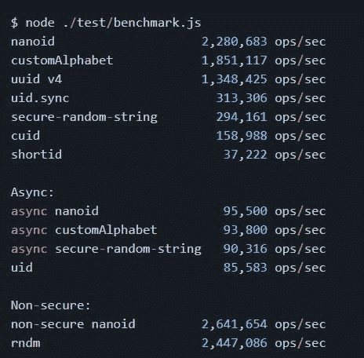

# 引入 URL 友好的唯一标识符— NanoID

> 原文：<https://javascript.plainenglish.io/introducing-a-url-friendly-unique-identifier-nanoid-fbf4d2162322?source=collection_archive---------3----------------------->


# 介绍

在每个软件系统中，我们需要唯一的 id 来区分几个对象。

最近，我写了一篇关于大规模分布式环境的[惟一 Id 生成的文章。在那篇文章中，我们稍微提到了 UUIDs。](https://medium.com/nerd-for-tech/unique-id-generation-in-distributed-systems-6f7aaa39c9af)

在这篇博文中，我将分享一个 uuid 的替代方案，它可以帮助您满足 uuid 的需求，并克服它们的一些缺点。

# 介绍 Nano ID

它是一个小巧、安全、URL 友好、唯一的字符串 ID 生成器。

*   **与 UUID** 相比，Nano ID 的尺寸较小。这种尺寸的减小影响很大。利用 NanoID 更容易传输信息和存储空间。在大规模系统中，这些数字可以产生很大的影响。
*   **NanoID 使用一种加密性很强的 API，与 Math 相比，它要安全得多**。随机()哪些是[不安全的](https://franklinta.com/2014/08/31/predicting-the-next-math-random-in-java/)。这些 API 模块使用不可预测的硬件生成的随机标识符。
*   **NanoID 在 ID 生成器的整个应用**中使用了自己的“统一公式”,而不是使用任意的`% alphabet`,这是编写 ID 生成器时经常犯的错误(在某些情况下，分布不均匀)。
*   **NanoID 使用更大的字母表**产生简短但唯一的标识符。
*   **NanoID 允许设计师使用个性化的字母**。这是 Nano ID 的另一个附加功能。您可以更改 id 的文字或维度，如下所示(将个性化字母指定为' 1234567890 abcdef '&Id 的维度指定为 10):

```
import { alphabet } from 'nanoid'; 
const nanoid = alphabet ('1234567890ABCDEF', 10); 
model.id = nanoid();
```

*   **NanoID 不太依赖任何种类的第三方依赖关系**，这意味着，它最终变得更加稳定，这有助于随着时间的推移最大化软件包范围，并使其更不容易受到依赖关系带来的问题的影响。
*   **NanoID 有多种编程语言**，包括— C#，C++，Dart & Flutter，Go，Java，PHP，Python，Ruby，Rust，Swift 等。

# [基准](https://github.com/ai/nanoid#benchmark)



# 示例用法

生成纳米机器人或 UUID 非常简单。在 JavaScript 中，你有 NPM 包可以帮助你生成它们。你可以从这里得到 NanoId = >【github.com/ai/nanoid 

*   主模块使用 URL 友好符号(A-Za-z0–9 _-)，并返回一个 21 个字符的 ID:

```
import { nanoid } from "nanoid";
model.id = nanoid() // X2JaSYP7_Q2leGI9b-MyA
```

*   您还可以指定所需的字符数:

```
nanoid(9); // "wMeKBp6th"
```

*   如果您有如上所述的特定需求，您也可以将用于生成哈希的字母表更改为您自己的字母表:

```
const alphabet = '0123456789ABCDEF';
generate(alphabet, 9); // F65BF3050
```

# 碰撞危险

即使它使用默认字母表每秒可以生成超过 220 万个唯一 id，仍然有可能生成相同的多个 id。

但是这种情况发生的几率有多大呢？

你可以根据给定的参数很容易地计算出:这里的和这里的。

你会注意到这个**概率非常小。**

# 一些缺点

*   在某些情况下，非人类可读可能是不利因素之一

想象一下，客户打电话来并被要求提供标识符，必须拼写完整的 NanoID 不是一种愉快的体验。与 UUID 相比，NanoID 更短，可读性更强，但在终端客户需要使用它的情况下仍然无法使用。

*   **它不能在任何 SQL 数据库表中用作主键**

如果使用 NanoID 作为表的主键，如果使用相同的列作为聚集索引，就会出现问题。这是因为**纳米机器人不是连续的。**

这是因为 NanoID(甚至 UUID)的性质是随机的，聚集索引按键对记录进行物理排序，因此对于每次插入，如果表上有索引，数据库必须确保新条目也是通过这些索引找到的，并保持索引顺序和树平衡。

为此，SQL 必须对磁盘上的记录重新排序，并因此从该索引中删除聚集。但是当你有像时间这样的序列时——在插入一条新记录后，聚类几乎是免费且容易的。

# 几句至理名言

软件世界中的任何方法都是主观的。权衡利弊并选择适合您的方法取决于您的需求。没有一个设计是具体到可以永远持续下去的，所以考虑到约束条件，我们选择了一个特定的设计，并且根据它对我们的作用，我们也可以进一步发展它。

👋感谢阅读，快乐学习！

*原发布于*[*https://apoorvtyagi . tech*](https://apoorvtyagi.tech/nanoid-url-friendly-unique-id)*。*

*更多内容请看*[***plain English . io***](http://plainenglish.io/)