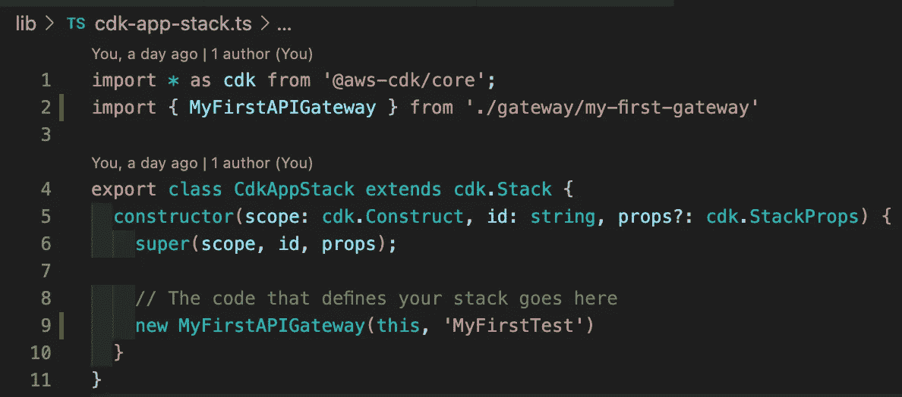

# 介绍 AWS CDK Gen

> 原文：<https://javascript.plainenglish.io/introducing-aws-cdk-gen-d59a6602d516?source=collection_archive---------12----------------------->

## 从命令行构建 TypeScript AWS CDK 项目


Photo by [Denis Pavlovic](https://unsplash.com/@itsdenispavlovic?utm_source=medium&utm_medium=referral) on [Unsplash](https://unsplash.com?utm_source=medium&utm_medium=referral)

对于许多公司来说，部署到云已经成为一个必不可少的战略，没有一个云提供商像亚马逊网络服务(AWS)一样无处不在。

在过去，在 AWS 云中维护您的基础设施可能是一个有点繁重的过程。最初，您必须通过控制台来配置您的基础架构，这使得设置和保持您的基础架构一致变得繁琐和手动，尤其是在您使用多个帐户的情况下。

后来，开发人员能够使用 YAML 和 JSON 中定义的云形成模板来定义基础设施。这允许开发者共享他们的基础设施，更好的是，版本控制它！缺点是这些配置文件很容易超过 1000 行，很难理解。

然后一个新的范例出现了——基础设施即代码。开发人员现在能够使用 AWS CDK 通过代码配置、版本控制和部署他们的 AWS 基础设施。

AWS CDK 一直是寻求在 AWS 中开发云原生解决方案的开发者的巨大推动者。但是，作为一名开发人员，我经常发现自己一遍又一遍地编写相同的样板代码。一定有更好的方法来减少这个代码。

# AWS CDK Gen——一种快速搭建 AWS 项目的方法

我想向你们介绍 AWS CDK Gen 。这个简单的命令行工具允许您通过回答几个提示来生成常见的 AWS 构造。这个工具不仅处理生成负责创建我们的 CDK 构造的 TypeScript 代码，还处理在使用这些构造时有用的附加文件。例如，NodeJs Lambda 将附带一个工作示例处理程序文件和一个 Lambda 集成构造，以便轻松集成到 API 网关中！开发人员需要做的只是用自己的 JavaScript 逻辑替换处理程序代码。

# 有哪些结构可用？

该工具中有许多常见的构造。以下是当前支持的选项:

*   **生成一个 Goλ**
*   **生成一个节点 JSλ**
*   **创建一个 API 网关**
*   **创建一个 S3 存储桶**
*   **生成一个 DynamoDB 表和 Lambdas**——依赖于已经生成的 API 网关
*   **向 API 网关添加 Lambda 路由—** 取决于是否生成了 API 网关和 Lambda。

让我们举一个例子来说明如何在实践中利用这个工具。我们将看看如何在 5 个简单的步骤中生成部署 Go Lambda 所需的所有基础设施。

# 在 5 个步骤中生成一个有效的 Go Lambda 和 API 网关

## 步骤 0。正在设置

为了演示的目的，我首先从一个基本的 AWS CDK 回购开始，但我们可以使用任何现有的 CDK 项目。我们将通过在一个空目录中运行`cdk init app --language=typescript`来初始化这个 repo。完成后，我们得到一个类似这样的空堆栈文件。


Our empty stack.

我现在使用`npm i --save-dev aws-cdk-gen`安装我的工具，并在我的项目中定义一个脚本来运行它。

```
"aws-cdk-gen": "aws-cdk-gen",
```

**注意:**如果你愿意，你也可以在全球范围内安装这个软件包。

## 第一步。生成 Go Lambda

我现在将运行我的程序并生成一个 Go Lambda。


Generating the files needed to define a Go Lambda just takes one input- the Lambda name.

我们只需命名我们的 Lambda 函数，就会得到一些为我们生成的文件。


Here is our generated construct with our Lambda and S3 Asset construct defined.

输出的许多文件中包括:


A working Go handler is provided in our generator.

*   一个 S3 资产上传我们的压缩编译的 Go 代码。
*   一个标准的λ函数指向我们的 S3 桶。
*   一个 API 网关 V2λ集成。
*   一个有效的 Go Lambda 处理程序。
*   关于构建 Go 代码的自述文件。
*   两个 Shell 脚本来安装依赖项，并自动构建和压缩编译后的 Go 工件。

正如你所看到的，我们已经提供了所有的工具来开始开发我们自己的 Go Lambda。

我们现在部署了一个 Lambda，但是没有 API 网关来将我们的 Lambda 公开为一个路由。没问题！我们可以使用该工具轻松生成一个。

## 第二步。生成 API 网关


Generating an API Gateway using AWS CDK Gen

我们重新运行我们的工具，并选择生成一个 API 网关。同样，我们只需要命名我们的 API 网关。


The comments in the API Gateway allow us to inject code like routes and imports.

我们现在有了一个带注释的准系统 API 网关。当然，我们可以开始手动将预先存在的 Lambda 导入到这个文件中，但是如果我们已经通过我们的工具生成了 Lambda，我们可以使用我们的工具来帮助我们定义 Lambda 的路径。我们将在下一节看到如何实现。

## 第三步。为我们的 Lambda 生成一条路线


Our tool can be used to connect our previously generated API Gateways and Lambdas.

由于我们使用我们的工具生成了我们的 Lambda，现在我们可以使用 AWS CDK Gen 在我们的 API 网关中添加一个路由

你会注意到，现在我们已经生成了一个 API 网关和一个 Lambda，有了一些额外的选项。在回答提示后，我们的 API 网关现在看起来像这样:


Our tool simplifies integrating our Lambdas with our API Gateway.

它现在导入了我们的 Go Lambdas 集成，并根据我们的输入定义了一个 GET 路由。我们现在已经完成了 90%的路程。我们只剩下几个步骤需要部署。

## 第四步。在我们的基本堆栈中创建 API 网关的实例

因为我们所有的逻辑都在我们的 API 网关栈中，我们只需要导入它并在我们的基础栈中实例化它。



One line of code is all this needed to start using our Gateway and Lambda.

就是这样。剩下的就是安装我们的项目尚未安装的、我们生成的代码所使用的任何依赖项。

## 第五步。安装任何依赖项，构建和部署

由于这是一个新项目，我们必须做安装任何缺失的依赖项这一小步。我们的构造使用了一些 aws-cdk 包。我们只需要使用 npm 安装它们。

此外，我们必须安装 Go 依赖项，并构建和压缩我们的 Go 代码。这两个工具都将花费我们不到几分钟的时间来处理 handler 文件夹中提供的有用的 Shell 脚本。


Helpful shell scripts help us do mundane things like building and zipping our code.

一旦这样做了，我们就可以部署和享受一个完全工作的 API 网关，并附带一个 Go Lambda！

# 我如何开始？


Photo by [Gia Oris](https://unsplash.com/@giabyte?utm_source=medium&utm_medium=referral) on [Unsplash](https://unsplash.com?utm_source=medium&utm_medium=referral)

我建议查看 npm 网站并安装软件包。在版本 1.85.0 之后，它与 aws-cdk 项目一起工作。

研究一下这个项目，让我知道你的想法。

# 离别赠言

这是我的第一个开源项目。因此，如果您有任何问题或反馈，或者想要做出贡献，我鼓励人们看一看并伸出手来。