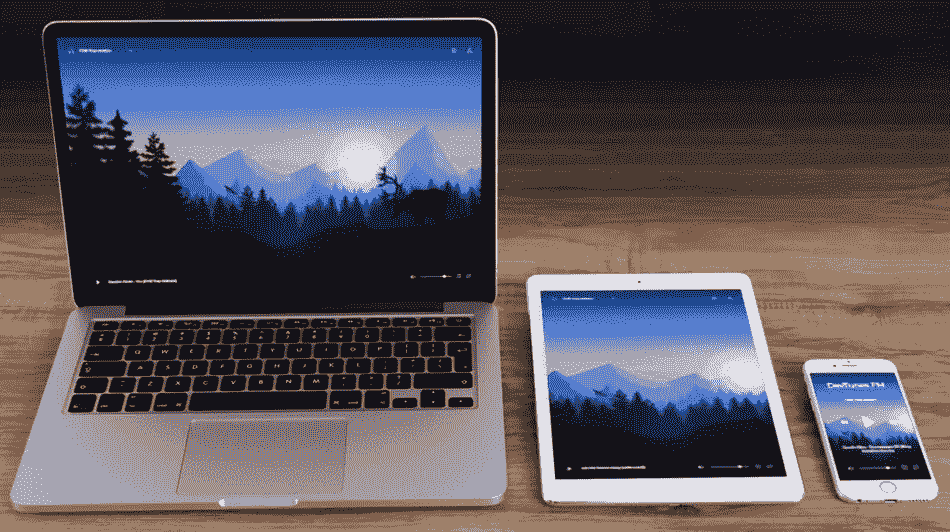

# 介绍 DevTunes FM:面向开发人员的在线电台📻🎶

> 原文：<https://javascript.plainenglish.io/introducing-devtunes-fm-the-online-radio-for-developers-d71bf7c373dd?source=collection_archive---------12----------------------->

创建一个广播应用程序是我想了很久的一个项目。我一直觉得自己与音乐有着特殊的联系。它一直激励着我，提高了我的工作效率。

不久前，我也做了一个[讨论](https://dev.to/madza/music-or-no-music-while-coding-which-type-of-person-are-you-5ei2)询问其他开发人员在编码时是否更喜欢音乐。我对积极回应的数量感到惊讶，所以我更想执行这个想法。

我开始建造 [DevTunes FM](https://radio.madza.dev) 。最初，它是一个供个人使用的宠物项目，但是我在它上面花的时间越多，它就越开始形成一些开发者社区也可以从中受益的东西，所以我决定与公众分享它。

## 该项目部署在 [radio.madza.dev](https://radio.madza.dev)

因为我经历了计划和执行的多个阶段，所以我认为写一篇关于这个过程的文章并向你展示它的特点是有价值的。

## 规划

从一开始，我的主要关注点就是简单。我从来不喜欢复杂的布局和多层次的设置。我想创造一台收音机，可以直接听音乐，而且第一次去的时候很容易理解。

我也关注可用性。这意味着收音机应该能够适应不同的情绪和不同的音乐类型偏好。它也应该在任何地方使用——例如，在编码、锻炼或通勤时。

最后，收音机应该有一个漂亮的设计。用户界面/UX 应该感觉流畅，在不同的设备上看起来都很棒。应该允许用户自定义收音机的外观和行为。

## 特征

一旦我定义了主要特征，就到了识别具体特征的时候了。

我想出了以下清单:

*   换台
*   更改背景
*   播放/暂停
*   重复音轨
*   音量控制
*   最近播放列表
*   保存上次设置
*   响应式设计
*   装载屏幕

## 线框

为了将特性放到 UI 中，我为组件创建了线框。

我从切换电台的下拉菜单开始。打开下拉菜单后，将显示可用电台列表，并突出显示当前激活的电台。

为了控制收音机的播放状态，有一个组件具有交替播放和暂停图标以及当前播放曲目的标题。

为了打开设置的不同面板，控制音量和重复当前曲目，我创建了由几个图标组成的导航。

上一首曲目面板显示收音机上最近播放的曲目。用户可以点击列表中的任何曲目开始播放。设置面板让用户控制收音机的行为。两个面板都可以通过单击它们的外部来关闭。

我用 Figma 制作了这些线框。你也可以看看 Diagrams.net 的，这是另一个神奇的工具。

## 设计

接下来，我必须为收音机做一个设计。在这个阶段，我关注的是如何定位组件，以及如何让项目看起来和感觉起来都很棒。

为了实现这个目标，我创造了 10 个不同的主题。

壁纸的来源是[壁纸](https://wallhaven.cc)。图标取自[平面图标](https://flaticon.com)。

## 主题 1

> 背景来自:[来源](https://wallhaven.cc/w/mpdz88)

## 主题 2

> 背景来自:[来源](https://wallhaven.cc/w/eo19kw)

## 主题 3

> 背景来自:[来源](https://wallhaven.cc/w/j8m3py)

## 主题 4

> 背景来自:[来源](https://wallhaven.cc/w/6kv1ow)

## 主题 5

> 背景来自:[来源](https://wallhaven.cc/w/r2jygm)

## 主题 6

> 背景来自:[来源](https://wallhaven.cc/w/xl56rv)

## 主题 7

> 背景来自:[来源](https://wallhaven.cc/w/rd3jv7)

## 主题 8

> 背景来自:[来源](https://wallhaven.cc/w/eyx3pl)

## 主题 9

> 背景来自:[来源](https://wallhaven.cc/w/k9k3r1)

## 主题 10

> 背景来自:[来源](https://wallhaven.cc/w/0w6j7q)

## 站

DevTunes FM 被设计成电子音乐收音机。电子音乐包括大量的流派和子流派，因此创建合适的电台是一个挑战。

我花了很多时间浏览 [SoundCloud](https://soundcloud.com) 上的可用播放列表，并播放了所有单独的曲目，以确定内容是否与我想在收音机上播放的内容相匹配。

我最终创建了 18 个电台。下面是完整的名单和他们的策展人:

*   环境(由[斯坦·克劳斯](https://soundcloud.com/stan-kraus)策划)
*   Chillstep(由[黄道传奇](https://soundcloud.com/zodiaclegends)策划)
*   低保真(由[后生作用](https://soundcloud.com/epigenes1s)策划)
*   冷阱(由 [TH3 和](https://soundcloud.com/t_he_end)策划)
*   未来车库(由[菲尔茨恩](https://soundcloud.com/ferzrrn)策划)
*   旋律配音(由 Alec Falzone 策划)
*   Dubstep(由 [ferzrrn](https://soundcloud.com/ferzrrn) 策划)
*   鼓和贝斯(由本·埃德加策划)
*   陷阱(由[乔那](https://soundcloud.com/chonah)策划)
*   Synthwave(由 [ferzrrn](https://soundcloud.com/ferzrrn) 策划)
*   液体鼓和贝斯(由汤姆·洛克伍德策划)
*   液态配音步骤(由[官方主持](https://soundcloud.com/officialjmt)
*   房子(由马斯特罗詹尼斯策划)
*   Techno(由 [Sazi Maqeda](https://soundcloud.com/sazi-maqeda) 策划)
*   进步之家(由 [Nola Kid 策划！](https://soundcloud.com/nola-kid))
*   渐进性恍惚(由 [jpache](https://soundcloud.com/jpache) 策划)
*   人声恍惚(由尼尔斯·科特拉尔策划)
*   波(由 [Raffie Loiero](https://soundcloud.com/raffie-loiero) 策划)

每次用户访问收音机时，每个电台上的曲目都会被随机打乱，因此曲目的顺序是唯一的。自发布之日起，该电台基于约 8K 曲目。

## 堆

收音机写在 [NextJS](https://nextjs.org) 里。它有一些很棒的特性，比如 API 路由、数据获取、CSS 模块的内置支持、静态文件服务、环境变量、热重载等等，我在创建这个应用的时候都用到了。

音源是 [SoundCloud API](https://developers.soundcloud.com/docs/api/explorer/open-api) 。它允许开发者获得关于用户、曲目、播放列表、喜欢、转发、评论、评论、收藏夹、追随者的数据，以及其他有用的数据。

我使用[威瑟尔](https://vercel.com)进行部署。部署应用程序就像在 [GitHub](https://github.com) 上托管源代码，然后在 Vercel 中导入它一样简单。它将完成所有繁重的工作——在幕后为您构建流程和配置。你需要做的就是设置环境变量。

## 移动响应能力

这款收音机的首要任务之一是对不同的屏幕宽度做出全面响应。通过这种方式，无线电可以在多个设备上高效使用。

为了实现这一点，我在`700px`设置了一个媒体规则，UI 从顶部和底部导航切换到全屏界面。

## 结论

几年前，创建我自己的广播应用程序是一个梦想。现在我很高兴地看到编码是一个强大的工具，可以用来帮助其他开发人员。

我已经用书签标记了这个工具，并计划每天使用它。请随意尝试，看看你是否也喜欢它。欢迎反馈。

在未来，我将专注于改进当前的代码库，测试它，并不断探索新的音乐，将它们添加到广播中，扩大歌曲列表。

欢迎向 [hi@madza.dev](hi@madza.dev) 提交功能请求、音乐推荐或其他相关内容。

## 我们连线吧！

写作一直是我的激情所在，帮助和激励他人给我带来了快乐。如果您有任何问题，请随时联系我们！

在 [Twitter](https://twitter.com/madzadev) 、 [LinkedIn](https://www.linkedin.com/in/madzadev/) 和 [GitHub](https://github.com/madzadev) 上连接我！更多项目请访问我的[作品集](https://madza.dev/code)。

*更多内容请看*[***plain English . io***](http://plainenglish.io/)