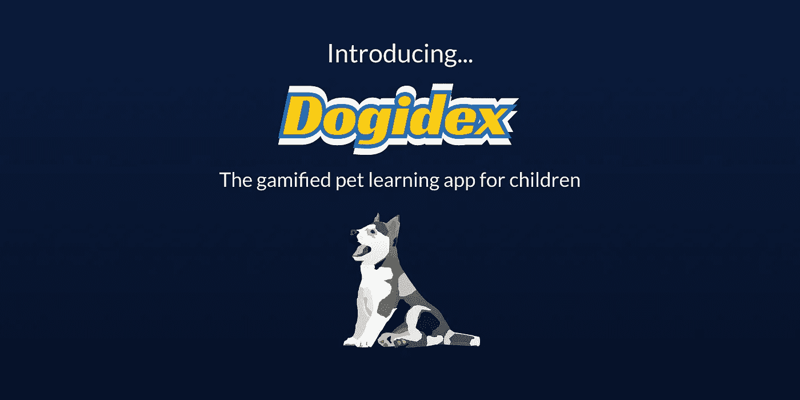
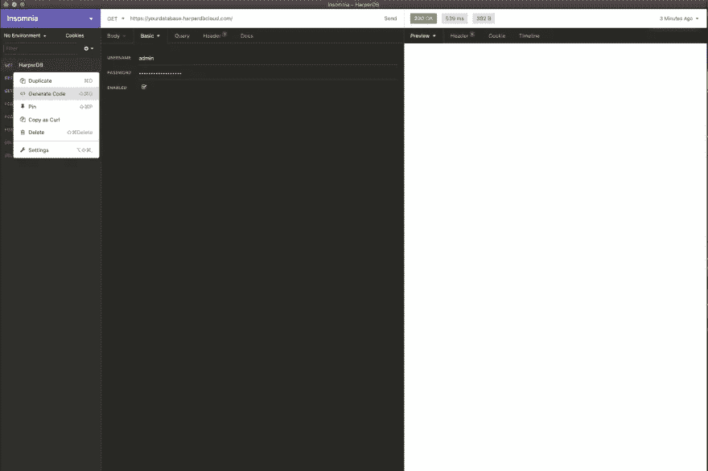
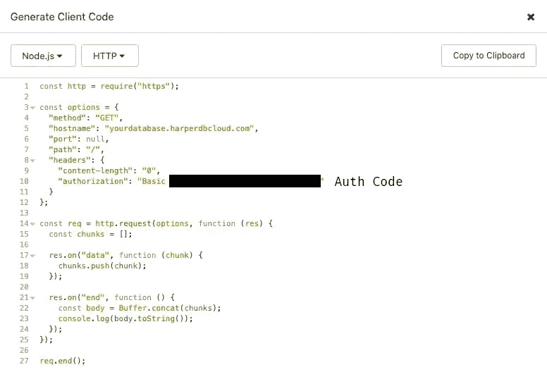

# 介绍 dogi dex——儿童游戏化宠物学习应用程序

> 原文：<https://javascript.plainenglish.io/introducing-dogidex-the-gamified-pet-learning-app-for-children-988f8482d2d9?source=collection_archive---------14----------------------->



我知道 HarperDB 已经有一段时间了，事实上我已经写了两篇关于它的文章。[创建连接到 PostgreSQL 和 HarperDB](https://andrewbaisden.hashnode.dev/creating-reactflask-apps-that-connect-to-postgresql-and-harperdb) 的 React/Flask 应用程序和[创建连接到 PostgreSQL 和 HarperDB](https://andrewbaisden.hashnode.dev/creating-reactnode-apps-that-connect-to-postgresql-and-harperdb) 的 React/Node 应用程序，这些应用程序在我开始交叉发布之前在开发平台上非常流行。无论如何，当我听说这个 Hashnode 和 HarperDB 黑客马拉松时，我必须想办法参与进来。

这个应用程序被称为 Dogidex，其背后的想法是，它可能被用作儿童的学习工具，这将使学习新事物变得有趣和有趣。由于在其他项目上工作的时间限制和当时有很多面试，该应用程序是准系统，不像我希望的那样功能齐全。尽管如此，该应用程序至少更符合 HarperDB 的品牌，并弥补了“黄金眼”的戏剧😂

# Dogidex 技术栈

**后端** : Node.js，HarperDB
**前端** : React

我决定使用可靠的 React/Node 组合，因为这是我的偏好，我对此最有经验。

# 设计

我用 Figma 设计了这个应用程序，它已经成为我最喜欢的矢量设计工具。就设计灵感而言，它很大程度上受到了口袋妖怪的启发。我使用 Figma 在主页上创建了狗创意，并使用 Photoshop 创建了需要透明背景的狗图像。

# 后端架构

后端相当简单，它只是一个连接到 HarperDB 实例的基本 Express.js 应用程序。我做的第一件事是为 REST API 创建数据。为此，我为数据创建了一个`.csv`文件。幸运的是，VS Code 通过林挺对`.csv`进行了很好的扩展，因此为数据库构建数据非常容易。完成后，我在 HarperDB 实例中创建了一个新表，然后将`.csv`数据导入到这个表中。

# 创建 HarperDB 数据库

首先需要创建一个 HarperDB 帐户，然后创建一个数据库。我把我的数据库叫做**狗**。创建和设置 HarperDB 数据库非常容易。只需观看 https://docs.harperdb.io/[HarperDB 云发布之旅](https://docs.harperdb.io/)的视频，您还可以在此查看 Harper db 与 Node 的文档。

**登录凭证**

你需要一个授权码来连接到 HarperDB。首先使用您的 API 工具向您的 HarperDB URL 发送一个 GET 请求，其中包含您的用户名和密码。你需要使用基本认证。然后使用生成代码按钮并选择 Node.js 和 HTTP，您将在标题代码中找到您的授权代码。下图向你展示了这是如何做到的。



**连接到 HarperDB**

一旦你设置好了，确保用你的 HarperDB 证书更新你的`.env`文件，如下所示。

```
HARPERDB_URL="https://yourdatabase.harperdbcloud.com/"
HARPERDB_USERNAME="admin"
HARPERDB_PASSWORD="yourpassword"
HARPERDB_AUTH="yourauthcode"
```

接下来，我用下面的代码更新了我的`index.js`文件。我导入了 HarperDB 的连接代码、数据库凭证，还创建了 GET routes。Axios 用于从 HarperDB API 获取数据。

```
const express = require('express');
const cors = require('cors');
require('dotenv').config();
const axios = require('axios');const app = express();app.use(express.urlencoded({ extended: false }));
app.use(express.json());// CORS implemented so that we don't get errors when trying to access the server from a different server location
app.use(cors());// HarperDB Database routes// GET: Fetch all dogs from the database
app.get('/online/harperdb', (req, res) => {
    const data = { operation: 'sql', sql: 'SELECT * FROM dev.dogs' }; const config = {
        method: 'post',
        url: process.env.HARPERDB_URL,
        headers: {
            Authorization: `Basic ${process.env.HARPERDB_AUTH}`,
            'Content-Type': 'application/json',
        },
        data: data,
    }; axios(config)
        .then((response) => {
            const data = response.data;
            console.log(data);
            res.json(data);
        })
        .catch((error) => {
            console.log(error);
        });
});// GET: Fetch dog by dogId from the database
app.get('/online/harperdb/:dogId', (req, res) => {
    const dogId = req.params.dogId;
    console.log(dogId); const data = { operation: 'sql', sql: `SELECT * FROM dev.dogs WHERE id = "${dogId}"` }; const config = {
        method: 'post',
        url: process.env.HARPERDB_URL,
        headers: {
            Authorization: `Basic ${process.env.HARPERDB_AUTH}`,
            'Content-Type': 'application/json',
        },
        data: data,
    }; axios(config)
        .then((response) => {
            const data = response.data;
            console.log(data);
            res.json(data);
        })
        .catch((error) => {
            console.log(error);
        });
});const port = process.env.PORT || 8000;app.listen(port, () => console.log(`Server running on ${port}, [http://localhost:${port}`));](http://localhost:${port}`));)
```

# 前端架构

如您所见，该应用程序非常简单。有一个狗的选择，你可以查看他们的个人资料。当然，我曾设想过一个功能丰富的应用程序，有这么多的功能，但基础是未来的发展。

现场版在这里[https://dogidex.netlify.app/](https://dogidex.netlify.app/)

# 需要更多时间才能做出的改进

对于初学者来说，更多的功能将是伟大的🤣像这样的应用程序有跨平台工作的潜力，可以很容易地变成一个成熟的儿童学习工具。

*   跨平台，使这个应用程序将可在网络上，桌面和移动
*   完整的 CRUD，以便用户可以添加和删除狗
*   更多的交互性我计划加入很多游戏化的特性，这样就可以像管理虚拟宠物或口袋妖怪一样管理所有的狗。能够喂养它们，了解不同类型的狗，我甚至有了一个很酷的进化想法，就像口袋妖怪一样，但小狗会长大。
*   鼓励学习，让孩子们明白在年幼时照顾宠物是什么感觉，以及需要多少时间和精力来保持它们的健康
*   游戏化的特点使它变得有趣，但一些潜在的概念会让孩子们知道如何进行良好的时间管理和富有成效，同时也帮助他们学习一个他们可能会觉得无聊的话题

这些只是一些改进，很明显，如果我花一个月的时间而不是几天的时间来开发这个应用程序，会有无限的想法可以融入其中😅

# 最后的想法

我真的希望你喜欢阅读这篇文章，并从中学到一些东西。作为一名内容创作者和技术作家，我热衷于分享我的知识并帮助其他人实现他们的目标。让我们通过社交媒体联系起来你可以在 [linktree](https://linktr.ee/andrewbaisden) 上找到我所有的社交媒体资料和博客。

和平✌️