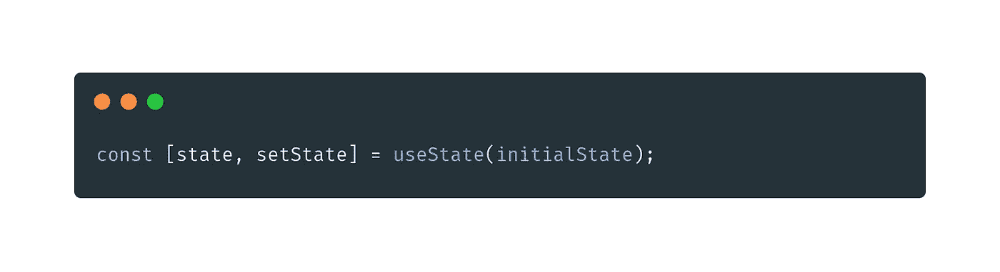
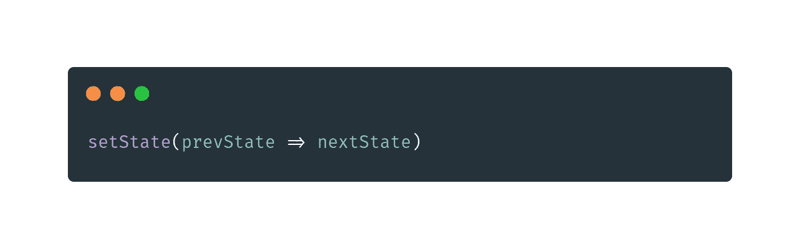
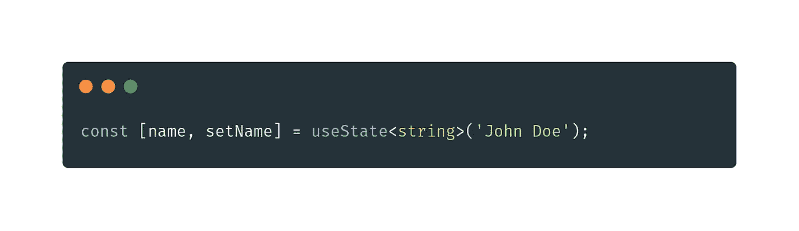

# 在 React (useState)中引入钩子

> 原文：<https://javascript.plainenglish.io/introducing-hooks-in-react-usestate-1de8b69adafc?source=collection_archive---------15----------------------->

大家好！

尽管钩子在 React 中已经不再是什么新奇的东西了(因为它们是在 16.8 版本中引入的)，但是仍然有大量的文档通过 React 组件中的类来展示传统的开发模型。

我将写一系列介绍性文章来讨论主要的 React 钩子，其中有**使用状态**(这将是我们的第一篇)**使用效果、**和**使用上下文。**然后，我们将讨论对某些用户来说稍微复杂一点的问题，例如 **useRef** 、 **useCallback** 、 **useReducer** 等等。你也可以创建自己的钩子，这在某些情况下非常有用(我们可以在下一期出版物中看到，留下你的评论)。

# 理论

## 什么是钩子？

概括地说，钩子只不过是一个函数，它可以让你访问 React 的功能组件的某些特性(是的，功能组件，因为钩子不能在类中工作)，这样你就可以访问你的状态和生命周期。

为了在组件中呈现状态和生命周期时具有良好的性能，钩子有一个基本规则，规定它永远不应该在循环、条件规则(例如 if，else)或嵌套函数中使用，请注意这个规则！

# 亲自动手

## 使用状态

这个钩子负责操纵你的应用程序的状态。它返回给我们一个数组，数组中有一个值和一个函数，当这个函数被调用时，它将负责改变这个值的信息。

当组件的初始呈现发生时，我们可以传递一个初始值。该值与 useState ( **initialState** )中初始参数内的标志相同。

在这个例子中，当我们想要更新组件中的状态变量时，使用了 **setState** 。它接收通知的新值，而不是立即更新，它将该值排队，从而将最近的值传递给该变量，这个过程在 react by**immutanbility**中是众所周知的。

您可以在几段代码中找到另一种方法，即调用通过回调更新状态的函数，举前面的例子，可以像这样重构它:

这样，基于前一个状态的新状态就会返回。由于不变性，这在一些应用程序中被广泛使用，例如，我们想对屏幕动画的状态变化进行一些比较。

当我们使用*类型脚本*时，我们已经在上面的例子`useState<string>('value')`中推断出了状态类型。然而，值得一提的是，对于主类型(例如字符串、数字、布尔值)，您不需要显式地定义类型，因为 typescript 解释器可以动态地定义它们，这样，代码就更干净，从而避免了在通知不同的数据类型时出现错误。

下面是一个关于在 useState 中使用 with TypeScript 的更完整的示例:

上面非常简单，展示了如何在 useState 中传递一组产品。这样，除了测试 array(这是 useState 中允许的另一种类型)的使用，我们还可以验证如何通过 typescript 进行这种类型化，并在代码中推断执行页面上的视图列表。

## 使用 useState 的重要提示

> *作为一个好的实践，总是试着在组件的开始调用 useState 钩子。即使你把它放在不同的地方，React 也会试图组织你的代码，但是，你会在你的 devtools 中出现几个警告。*
> 
> *避免在循环、条件或一些嵌套函数中创建 Usestate，这会导致组件呈现中的各种错误，破坏您的项目。*

从这一行开始，您可以加深对 React 和 React 钩子的了解。探索您在 React 功能方面的知识和研究，该功能允许您在应用程序中帮助完成各种任务。你可以在[官方文档](https://reactjs.org/docs/hooks-intro.html)或[使用状态](https://reactjs.org/docs/hooks-reference.html#usestate)的详细参考中找到关于钩子的所有信息。

如果你喜欢这篇文章，一定要分享和评论。如果你想知道更多一点，改变一些想法，你可以留下评论你对这个主题的看法，甚至为即将到来的文章提出一些建议。

访问网站 [www.fsenaweb.me](https://www.fsenaweb.me/) ，享受并了解一些我的工作。它有我的作品集，我的社交网络(包括 [GitHub](https://github.com/fsenaweb/) ，在那里你可以练习一些例子的应用)和联系链接。

 [## fsenaweb -概述

### www.fsenaweb.me 在我的项目中使用 PHP 的体验。我使用的工具有 Laravel、CodeIgniter、Lumen、Git、Docker 等

github.com](https://github.com/fsenaweb)  [## 钩子 API 参考-反应

### 钩子是 React 16.8 中的新增功能。它们允许您使用状态和其他 React 特性，而无需编写类。这个…

reactjs.org](https://reactjs.org/docs/hooks-reference.html#usestate)  [## 介绍钩子-反应

### 钩子是 React 16.8 中的新增功能。它们允许您使用状态和其他 React 特性，而无需编写类。这个…

reactjs.org](https://reactjs.org/docs/hooks-intro.html) 

就这样，下次见！我的名字是 *Matheus Ricelly* ，感谢他的关注！

*更多内容尽在*[plain English . io](http://plainenglish.io/)