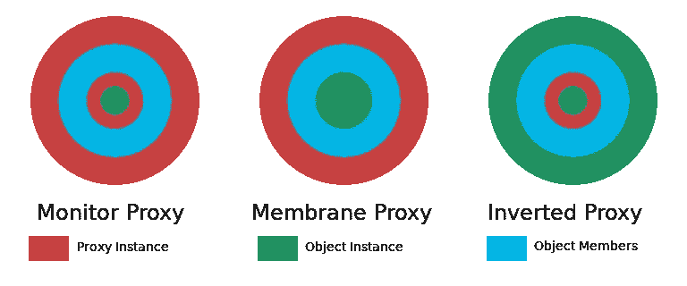

# 用 JavaScript 创建一个反向代理

> 原文：<https://javascript.plainenglish.io/introducing-inverted-proxy-8f53429534c6?source=collection_archive---------17----------------------->

对于那些熟悉(或者已经在积极使用)ES6 代理对象的人来说，你是否曾经希望它不会改变对象的身份？

您是否曾经希望可以使用带有本机功能的代理对象，这些功能需要原始的、非代理包装的实例？我做到了。

事实上，我正在做的一个项目需要这个功能。我一直在使用我在这里提到的 [ClassicJS](https://github.com/rdking/ClassicJS) 库开发一个基于 HTML 定制元素的新前端库:

 [## JavaScript 中的数据封装

### 当 JavaScript 在 Netscape Navigator 中首次发布后不久，我第一次遇到它时，它非常…

medium.com](https://medium.com/javascript-in-plain-english/data-encapsulation-in-javascript-76730d89c3dc) 

我喜欢像这样一起做多个相关的项目。不管你的测试套件看起来有多完整，在测试你创建的库时，没有什么比实际使用更好的了。这是了解你的库对于你的目标领域有多完整的最快方法。因此，带着这个想法，我在开发新的标记库时改进了 ClassJS。

正如您可能想象的那样，我在 ClassicJS 中使用代理来进行特权访问控制。唯一的问题是，这意味着 ClassicJS 产生的实例对象和`class` 构造函数总是被包装在一个代理中。这对构造函数来说不是问题，因为`customElements.define()`可以处理调用代理包装的构造函数。

From: Disney’s Aladdin

然而，为了与 HTML 定制元素兼容，`class`构造函数不允许返回除本机基`class`返回的对象之外的任何内容。

因此，即使是返回 tag 元素的代理包装版本也会导致`customElements.define()`抛出错误。我猜到会发生这种情况，但我想知道是否有一种方法可以返回本机对象，同时允许一些针对它调用的函数将`this`视为代理实例，从而允许`private`和`protected`数据继续工作。

这是一个有点奇怪的需求。代理的正常使用给予用户代理包装的对象，而对该对象的方法的调用接收本机实例(薄膜情况)或代理包装的对象(监视器情况)。我想要的是给用户原生的、未包装的对象，但干扰对成员的访问，用代理包装的对象替代任何调用。

这是反向代理背后的基本概念。

不想重复车轮，我首先在互联网上做了一些研究。可悲的是，我没有找到任何有用的东西。这看起来不太像是有人试图做同样的事情，或者也许我只是在错误的地方寻找。所以像往常一样，我试着自己做。事实证明这并不难做到，或者至少如果在代理构造的时候能够很容易地识别出需要做特权事情的函数，这并不难做到。

# **准备“倒置”代理**

因为与大多数编程工作相比，想要做这样的事情通常有点冒险，所以我将创建代理定制 html 标记。

看一看以下内容:

jsFiddle of an example Inverted Proxy

上面的代码给出了一个例子，说明如何从一个本地对象调用成员函数，在函数中使用你的代理对象作为`this`。您还可以使用包装函数来实现这种效果。这其实只是一个 6 步流程:

1.  获取本机实例对象。
2.  创建一个从预期原型继承的新原型对象。
3.  为新原型中需要使用代理的每个原型成员创建包装函数。这包括访问器方法！
4.  在实例上设置新原型。
5.  创建实例的新代理，并保存它。
6.  返回原始实例。

在上面的代码片段中，步骤 3 的包装函数是由`getDef`函数创建的。

Function used to wrap instance members for an inverted proxy.

这个函数查看原型的属性，使用`makeRedirect`为属性定义上的任何函数值创建包装函数。

这就是所有需要代理访问的呼叫被捕获的方式。

最后，我们需要实际的包装函数:

The actual wrapper generator

我知道，`eval`按说是邪恶的。对于那些相信这一点的人来说，我不想费事去说服你们。虽然`eval`可能很危险，但它也有它的好处。对于上面的函数，由于`fn`是一个函数，而`makeRedirect`正在创建另一个函数，所以使用`eval`来确保函数名被正确保存是没有问题的。

由`eval`语句创建的函数只是查找在上面的步骤 5 中创建的代理，并使用它来调用目标函数。

# 结论

差不多就是这么多了。有些细节你需要小心。例如，您需要小心处理对本机方法的调用。为了让反向代理为 ClassicJS 工作，我确保将本机函数绑定到原始实例对象。这意味着代理包装类原型。幸运的是，HTML 定制元素功能并不关心标签实例的原型是什么样子。

TC39 的本意只是让 Proxy 成为一种制造膜的工具，但事实证明，它的用途远远超出了他们的预期。这全在于你如何设置事情。现在，如果引擎开发者能让代理工作得更快就好了！

*更多内容看*[***plain English . io***](http://plainenglish.io)