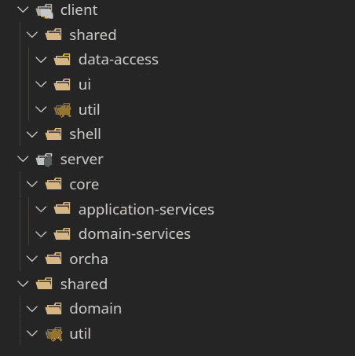
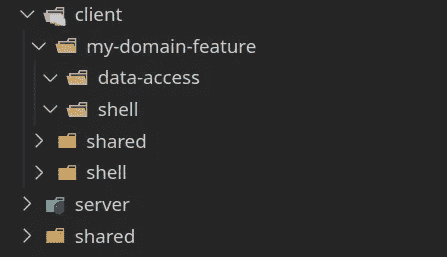

# OrchaJS 简介:一个类型脚本原生的客户机-服务器服务商

> 原文：<https://javascript.plainenglish.io/introducing-orchajs-a-typescript-native-client-server-facilitator-f5654efe258d?source=collection_archive---------13----------------------->


促进客户端和服务器之间的无缝通信；不仅在运行时，而且贯穿整个开发过程。

> 事不宜迟，下面是回购:[https://github.com/jczacharia/orcha](https://github.com/jczacharia/orcha)
> 注:回购内包含一个[功能齐全的示例待办事宜 app](https://github.com/jczacharia/orcha/tree/master/libs/todo-example-app) 。
> 此外，这里是用户认证启动器 repo，您可以使用它来启动自己的 Orcha 项目:[https://github.com/jczacharia/orcha-user-auth-starter](https://github.com/jczacharia/orcha-user-auth-starter)

# **什么是 OrchaJS？**

OrchaJS 是一个框架，用于安全、可靠和高效地构建可扩展的 web 应用程序，这些应用程序需要真实世界、高度相关的领域建模和基本功能，如**用户认证、文件上传、分页和实时更新**。同时提供前所未有的开发者体验。

简而言之，OrchaJS 使用特定于项目的 monorepository 来存放项目的前端和后端。这意味着领域建模、业务规则/计算和通信协议保存在一个共享文件夹中，客户端和服务器库都可以使用，为您的项目领域创建了一个单一的事实来源。这反过来促进了在开发和生产的所有阶段客户机和服务器之间的健壮通信。

在我们进入技术细节之前，我想说明它的局限性，这样你就知道会发生什么了。

# 限制

由于 OrchaJS 是用 TypeScript 编写的，这意味着只能使用 TypeScript 库和框架。此外，由于 OrchaJS 是一个框架，它最适合新项目。当前兼容的技术有(但不限于):

*   [](https://angular.io/)**(客户端)**
*   **[](https://nestjs.com/)**(服务器)****
*   ****[**字体**](https://typeorm.io/#/) (ORM)****
*   ****[**Nx**](https://nx.dev/) (单库)****

# ****一头扎进去****

****当开始一个新项目时，建议首先规划领域模型及其关系。使用 Orcha 的高级 TypeScript 泛型，使用一对一、一对多、多对一和多对多关系创建域模型:****

****Example for Orcha Domain Modeling. [Link To Example Project Domain Models](https://github.com/jczacharia/orcha/tree/master/libs/todo-example-app/shared/domain/src/lib/domain)****

> ****注意:Orcha 包含一个`IManyToMany`类型，但是不建议直接使用多对多关系，而是创建一个单独的实体，通过使用一对多和多对一关系将两个实体链接在一起(如上所示)。这有一个额外的好处，就是可以将列添加到链接的实体中。****

****请注意每个关系属性如何以两种方式描述它与另一个实体的关系:****

*   ****第一个模板参数是关系实体，****
*   ****第二个模板参数是指回实体的关系实体的属性。****

****例如，用户模型中的`todos`属性描述了与 Todo 模型中的`user`属性的一对多关系:****

```
**// On User model
todos: IOneToMany<Todo, 'user'>;// One user has many todos.// On Todo model
user: IManyToOne<User, 'todos'>;**
```

****一旦您为您的领域模型建立了单一的事实来源，您就可以在前端自由地使用这些模型。对于后端，还需要一个步骤来创建要在数据库中使用的实体。下面是一个使用 TypeORM 创建`UserEntity`和`UserRepository`的例子:****

****Settings up Entity and Repository [Link to Files](https://github.com/jczacharia/orcha/tree/master/libs/todo-example-app/server/core/domain/src/lib/tag)****

****注意,`IOrchaTypeormRepository`基类实现了所有的内置函数，可以轻松地读写数据库中的数据。****

****一旦描述了您的域模型，您就可以创建一个*编排*来定义您想要在您的实体上执行的*操作*。****

## ****什么是手术？****

****操作通过 HTTP POST 端点将服务器暴露给外界。每个操作应该描述一个*动作*。该操作可以读取或改变数据。****

## ****什么是配器？****

****流程编排将相关的操作组合在一个父端点下。一个端点看起来如下:`/orcha/<orchestration name>/<operation name>`。****

****Todo Orchestration Example. [Link To File](https://github.com/jczacharia/orcha/blob/master/libs/todo-example-app/shared/domain/src/lib/domain/todo/todo.orchestration.ts)****

****`IOperation`中的第一个模板参数是您希望从该操作中返回的基本实体或模式。第二个模板参数是数据传输对象(DTO ),它描述了执行所需的操作参数。dto 还包括验证以确保数据完整性。****

****Validating DTO example. [Link To File](https://github.com/jczacharia/orcha/blob/master/libs/todo-example-app/shared/domain/src/lib/domain/todo/todo.dtos.ts)****

****通过像这样描述您的域模型和操作，您可以创建一个 Orcha 查询，它定义了从一个操作返回的实体模式，包括任何需要的关系连接。****

## ****什么是 Orcha 查询？****

****Orcha 查询是一种基于 TypeScript 的简单而有效的方法，用来描述从给定操作返回的数据，包括连接数据库中的关系数据。每个 Orcha 查询由键-值对组成，其中每个键对应于一个`true`值(表示实体上的一个原语字段)或一个对象(表示与另一个实体的关系)。****

****创建 Orcha 查询时，开发人员可以对他们想要的数据进行严格的类型化和方便的智能感知:****

****Describing the response schema for Todo Operations using our Many-to-Many example. [Link To File](https://github.com/jczacharia/orcha/blob/master/libs/todo-example-app/shared/domain/src/lib/domain/todo/todo.queries.ts)****

****在描述了从给定操作返回的数据模式之后，接下来是设置客户机和服务器编排:****

****Client Orchestration. [Link To File](https://github.com/jczacharia/orcha/blob/master/libs/todo-example-app/client/shared/data-access/src/lib/todo/todo.orchestration.ts)****

****Server Orchestration (Unsecure). [Link To File](https://github.com/jczacharia/orcha/blob/master/libs/todo-example-app/server/orcha/src/lib/todo/todo.orchestration.ts)****

> ****注意，`token`是一个额外的字段，它是通过客户端拦截器添加的。[看到这里。](https://github.com/jczacharia/orcha/blob/master/libs/todo-example-app/client/shared/data-access/src/lib/auth.interceptor.ts)您还可以在这里看到通用操作[的通用 HTTP 主体模式。](https://github.com/jczacharia/orcha/blob/master/libs/common/src/lib/orchestration.ts)****

## ****等等，您说这些查询对象是从客户端发送来连接数据库上的关系数据并从服务器返回的，这难道不意味着坏人可以在查询中注入无关的数据来获取敏感数据吗？****

****没错，但是 OrchaJS 有一个安全特性可以防止这种情况。因为 Orcha 查询保存在客户机和服务器之间的共享文件夹中，所以从客户机发送的查询可以在服务器上进行验证，并检查是否有任何无关的数据，如键和值。****

****下面是我们利用查询验证的例子:****

****Server Orchestration (Secure). [Link To File](https://github.com/jczacharia/orcha/blob/master/libs/todo-example-app/server/orcha/src/lib/todo/todo.orchestration.ts)****

****如果一个坏的参与者试图将另一个键注入到查询对象中，那么将会抛出一个未经授权的错误。这样，私有数据很容易被控制。****

## ****好吧，那么这和服务器业务逻辑有什么关系呢？****

****从`ClientOrchestration`发出的呼叫将在`ServerOrchestration`上接收。一旦服务器操作收到调用，查询、令牌(如果需要)和 DTO 就被发送到服务器的业务逻辑部分。下面是 Todo 服务中读取和更新 Todo 实体的一个示例:****

****Todo Service. [Link to File](https://github.com/jczacharia/orcha/blob/master/libs/todo-example-app/server/core/services/src/lib/todo/todo.service.ts)****

****请注意如何在存储库方法中直接使用 Orcha 查询(如`this.todo.findOneOrFail`的第二个参数)，以便在整个开发过程中获得 Orcha 的便利。****

## ****从客户端服务发出调用怎么样？****

****通过依赖注入简单地使用`TodoOrchestration`,然后启动期望的操作。****

****Example Client Operation Calls via Service [Link To File](https://github.com/jczacharia/orcha/blob/master/libs/todo-example-app/client/shared/data-access/src/lib/todo/todo.effects.ts)****

****Orcha 查询`TodoQueryModel`通过 TypeScript 泛型进行解析，因此 Intellisense 将告诉您预期的类型，此外，如果您在客户端应用程序的任何其他地方使用了任何省略的字段，编译器将会抛出编译时错误。****

# ****集成测试****

****Orcha 自带集成测试。进行调用与使用客户端编排是一样的，只是增加了令牌字段。下面是一个用户身份验证的示例:****

****[Link To File](https://github.com/jczacharia/orcha/blob/master/apps/api-e2e/src/specs/user/user-e2e.spec.ts)****

## ****不错！如果我想使用这个框架创建一个可伸缩的 web 应用程序，那么高层架构是什么样的？****

****以下是最佳实践文件夹结构的示例:****

********

****自下而上描述每个文件夹:****

****包含所有与项目和平台无关的代码。****

****`shared/domain`存放所有模型、查询、业务规则/计算、编排接口和任何其他领域相关的设计数据。****

****`server/orcha`容纳所有调用应用服务业务逻辑的服务器编排。****

****`server/domain-services`容纳所有实体及其相应的存储库。[看到这里。](https://github.com/jczacharia/orcha/tree/master/libs/todo-example-app/server/core/domain/src/lib)****

****`server/application-services`容纳了所有的业务逻辑(大部分服务器代码将放在这里)。****

****`client/shell`包含所有可路由组件。****

****`client/shared/util`包含所有与项目无关的、特定于客户的代码。****

****`client/shared/ui`容纳所有哑元件。****

****`client/shared/data-access`包含所有状态管理代码(NgRx 首选)、客户端编排、智能组件和任何其他特定于客户端的域代码。****

****如果您的项目需要您想从`client/shell`中分离出来的附加特性，您可以通过在`client`下添加一个特性文件夹来实现，如下所示:****

********

## ******为什么我会选择这个而不是 GraphQL？******

****因为 OrchaJS 完全是用 TypeScript 编写的，所以在整个开发过程中，您可以获得完整的类型安全特性，而不需要任何代码生成或不可靠的 Intellisense。****

****此外，Orcha 查询不仅用于客户机和服务器之间，还通过 Orcha 存储库直接与数据库通信，从而能够向数据库请求您想要的数据，包括关系数据。****

# ****结论****

****如果你对这个新颖的框架感兴趣，那么请尝试一下，并给出一些反馈！****

****如果你已经做到这一步，那么你可能有兴趣成为一名贡献者！OrchaJS 目前由我开发和维护，但我正在寻找开发人员来帮助开发，维护和编写文档和集成测试。****

****干杯！****

*****更多内容看* [***说白了. io***](https://plainenglish.io/)****