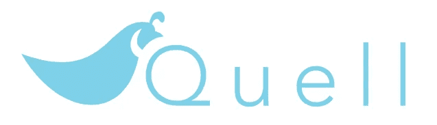
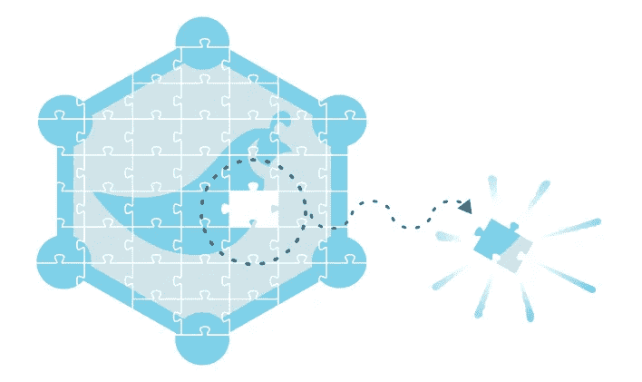
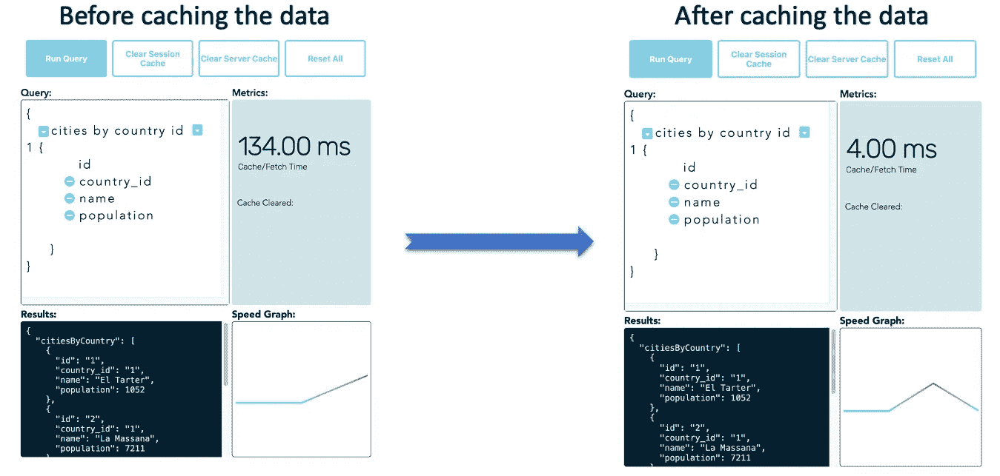
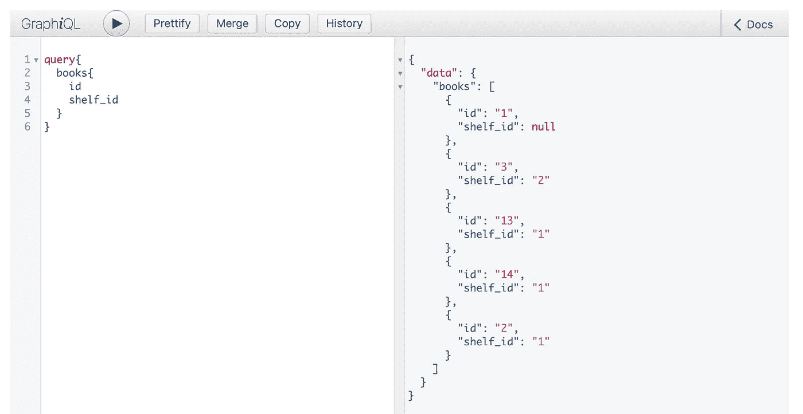

# 引入 Quell:一个更好的 GraphQL 缓存解决方案

> 原文：<https://javascript.plainenglish.io/introducing-quell-caching-solution-for-graphql-4579bdb4e231?source=collection_archive---------4----------------------->

## 缓存变得更容易了



Quell, caching solution for GraphQL

[Quell](http://www.quellql.io) 是一个轻量级的 JavaScript 库，为客户端和服务器端提供了一个配备了规范化缓存的 GraphQL 缓存解决方案。

# 什么是奎尔？

[GraphQL](https://graphql.org) 旨在使 API 快速、灵活且对开发人员友好。它甚至可以部署在一个名为 [GraphiQL](https://github.com/graphql/graphiql) 的[集成开发环境(IDE)](https://www.redhat.com/en/topics/middleware/what-is-ide) 中。作为 [REST](https://www.redhat.com/en/topics/integration/whats-the-difference-between-soap-rest) 的替代方案，GraphQL 允许开发人员在一次 API 调用中构造从多个数据源获取数据的请求。

Quell 是为 GraphQL 提供缓存的解决方案。Quell 是一个缓存 GraphQL，通过本地 [Redis](https://redis.io) 实例创建一个缓存层。

我们非常兴奋地向您展示奎尔。让我们开始缓存！



Quell only requests the data it needs.

# **奎尔是做什么的？**

Quell 的模式控制、类型级规范化算法将 GraphQL 查询响应分解为单个的图形节点，作为时间可读的键值对单独缓存，并引用连接的节点。

然后，根据缓存的数据存储检查后续的 GraphQL 请求，通过动态地重新构建一个新的查询来弥补缺失，从而允许 Quell 只请求它需要的数据。

然后，查询响应与缓存中的数据合并，无缝返回完整响应。

# 您如何使用奎尔？

[奎尔/客户](https://www.npmjs.com/package/@quell/client)

Quell/Client 是一个易于实现的 JavaScript 库，为 GraphQL 提供了客户端缓存解决方案。奎尔的模式控制、类型级规范化算法将 GraphQL 查询响应缓存为图形节点的展平的键值表示，使得部分满足浏览器会话存储的查询、重构查询以及仅从其他 API 或数据库中获取尚未缓存的数据成为可能。

不带 Quell 的提取请求的示例代码:

```
const sampleQuery = `query {
    countries {
        id
        name
        cities {
            id
            name
            population
        }
    }
}`

function fetchMe(sampleQuery) {
    let results;
    fetch('/graphQL', {
        method: "POST",
        body: JSON.stringify(sampleQuery)
    })
    .then(res => res.json())
    .then(parsedRes => {
      // use parsed results
     });

fetchMe(sampleQuery)
```

“平息”方法采用四个参数:

1.  **终点** —您的 GraphQL 终点为 sting(例如。/graph QL’)。
2.  **查询**——将您的 GraphQL 查询为字符串。
3.  **map**——一个将命名查询映射到它们返回的用户定义的 GraphQL 类型的对象。

```
const sampleMap = {
  countries: 'Country',
  country: 'Country',
  citiesByCountryId: 'City',
  cities: 'City',
}
```

4. ***fieldsMap*** —将字段映射到它们返回的[用户定义的 GraphQL 类型](https://graphql.org/learn/schema/#object-types-and-fields)的对象。

```
const sampleFieldsMap = {
  cities: 'City'
}
```

关于 Quell 客户端的更多信息，你可以在我们的[文档](https://www.npmjs.com/package/@quell/client)中了解更多。

# 奎尔/服务器

Quell/server 是一个易于实现的 Node.js/Express 中间件，可以满足并缓存 GraphQL 查询。Quell 的模式管理、类型级规范化算法将 GraphQL 查询响应缓存为图形节点的扁平键值表示，从而可以部分满足来自服务器 Redis 缓存的查询，重新制定查询，并仅从其他 API 或数据库获取尚未缓存的数据，下面是[安装](https://www.npmjs.com/package/@quell/server)步骤。

您的服务器文件可能如下所示:

```
const express = require('express');
const myGraphQLSchema = require('./schema/schema');
const { QuellCache } = require('@quell/server')

// create a new Express server
const app = express();

// instantiate quell-server
const quellCache = new QuellCache(myGraphQLSchema, 6379, 3600);

// apply Express's JSON parser
app.use(express.json());

// GraphQL route
app.use('/graphql',
    quellCache.query,
    (req, res) => {
    return res
        .status(200)
        .send(res.locals.queryResponse);
    }
);

// expose Express server on port 3000
app.listen(3000);
```

关于 Quell 和服务器端渲染的更多信息，你可以在我们的[文档](https://www.npmjs.com/package/@quell/server)中了解更多。

## 贮藏



Example of caching by Quell [Demo](http://www.quellql.io/#demo)

图形 QL:



Example of graphiQL with Quell [Demo](http://www.quellql.io/#demo)

## 证明文件

我们已经在我们的网站上提供了大量的文档。如果您在文档中发现错误，请通过 [GitHub](https://github.com/oslabs-beta/Quell) 提交问题。

## 开源和社区贡献

Quell 是在技术加速器[操作系统实验室](https://opensourcelabs.io/)下开发的开源项目。我们欢迎通过 [GitHub](https://github.com/oslabs-beta/Quell) 的贡献和反馈，如果你喜欢使用 Quell 或者你只是对这个项目感到兴奋，我们感谢每一位 GitHub 明星。

## 团队 QuellQL

基于: 基于: GitHub 基于: GitHub 基于: GitHub 基于: GitHub 基于: GitHub 基于: GitHub 基于: GitHub 基于: GitHub 基于: GitHub 基于: GitHub 基于: GitHub 基于: GitHub 基于: GitHub 基于: GitHub 基于: GitHub 基于: GitHub 基于: GitHub 基于: GitHub 基于: GitHub 基于: GitHub 基于: GitHub 基于: GitHub 基于: GitHub 基于: GitHub 基于: GitHub 基于: GitHub 基于:

*More content at* [***plainenglish.io***](https://plainenglish.io/)