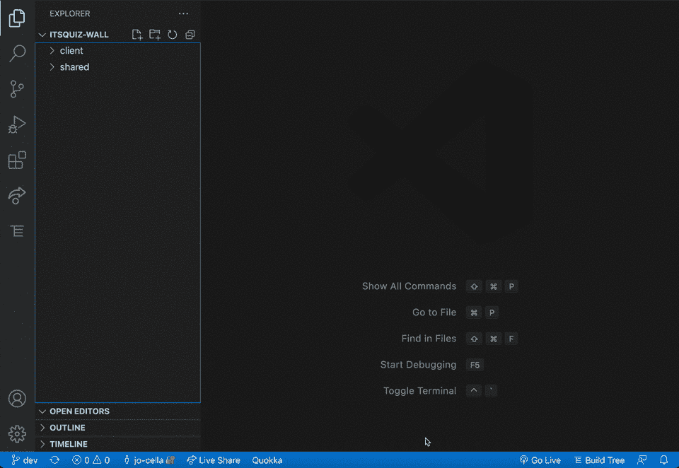
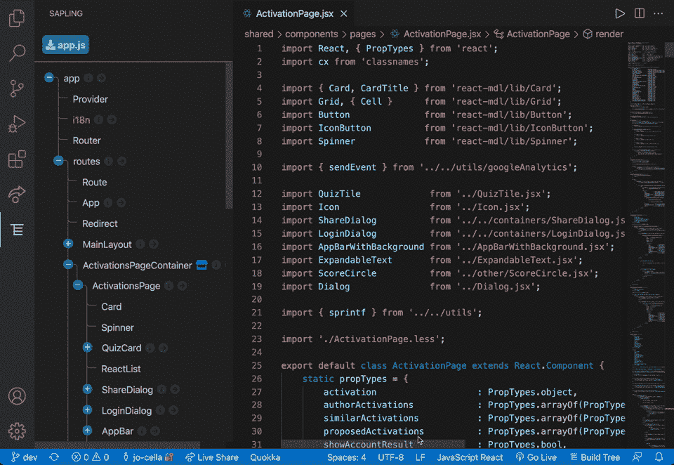

# 介绍 Sapling:一个用于遍历 React 组件层次结构的 VS 代码扩展

> 原文：<https://javascript.plainenglish.io/introducing-sapling-a-vs-code-extension-for-traversing-your-react-component-hierarchy-3ac94d95887e?source=collection_archive---------0----------------------->

React 是构建前端应用程序的强大工具，但在大范围内浏览组件的层次结构可能会很痛苦。 [***树苗***](https://marketplace.visualstudio.com/items?itemName=team-sapling.sapling)**旨在改变这种情况。**

**

*Photo by [Jan Huber](https://unsplash.com/@jan_huber?utm_source=medium&utm_medium=referral) on [Unsplash](https://unsplash.com?utm_source=medium&utm_medium=referral)*

*现代的 React 应用程序非常庞大。脸书由 50，000 多个部件组成。即使是相当简单的应用程序的父子关系和传承道具也可能变得难以管理。良好的文件组织会有所帮助，但是它没有反映出作为应用程序功能核心的组件结构。*

*当您需要确定哪些属性可用于您正在处理的组件时，您需要导航到该组件的父文件。即使您的组织模式将相似的组件聚集在一起，层次关系仍然不清楚，您仍然必须找到您传递的任何道具的确切来源。这个问题的行业标准是伟大的文件组织，但仍然没有简单的方法来提醒自己一目了然的大局。我们建造树苗来改变这种情况。*

*Sapling 是一个 VS 代码扩展，它创建了嵌入在 VS 代码侧栏中的交互式组件依赖树。树上的每个节点都提供了可用道具的摘要和一个导航按钮，可以快速打开相应的文件。其简单的用户界面使其易于阅读和直观使用，其高度响应的行为会在您每次保存时立即更新。Sapling 的视觉提示也很容易理解:对应于您的工作区的活动文件的节点将有粗体文本，如果 Sapling 发现 Javascript 语法错误或错误的导入语句，它会用警告颜色突出显示损坏的组件。甚至还有一个方便的图标，会告诉你哪些组件已经连接到 Redux 商店。*

**

**Turn your cluttered file system into a comprehensive tree**

*Sapling 的设计考虑到了用户。Sapling 具有强大的记忆力，即使在工作区会话之间也能保持其扩展状态；当您的应用程序有几百个组件时，您不必手动将树展开到您当前工作的组件。此外，如果您的应用程序使用第三方组件，如 Material-UI 或 React-Router，您可以通过在 VS Code 的扩展设置中打开和关闭它们来选择 Sapling 是否应该显示它们。为了更加方便，Sapling 可以从客户端的任何 React 文件中构建，如果您喜欢简化当前显示，Sapling 提供了一个有用的状态栏按钮“Build Tree ”,它将使用活动文件作为根来重建树。*

**

*Make your life easier by clicking Build Tree. It creates a tree based on the component defined in your current active file*

*那么 Sapling 是如何做到这一切的呢？Sapling 是使用 VS 代码扩展 API 和 VS 代码 Webview API 构建的，将它无缝集成到您的 VS 代码 IDE 中。*

*当您为组件层次结构选择根文件时，Sapling 读取它并使用 [@babel/parser](https://babeljs.io/docs/en/babel-parser) 从文件内容中创建一个抽象语法树(AST)。然后，Sapling 处理 AST，检测根文件的子 React 组件、定义这些组件的文件、它们的属性等。然后，Sapling 递归解析子组件文件，生成一个节点树数据结构，表示 React 应用程序的组件层次结构。*

*从那里，节点树被交给 Sapling Webview——一个本身使用 React 组件构建的 web 应用程序。Webview 在 VS 代码侧边栏中生成交互式层次树，允许您以比传统 VS 代码文件浏览器更直观的方式导航 React 应用程序。*

**

*Photo by [Ferenc Almasi](https://unsplash.com/@flowforfrank?utm_source=medium&utm_medium=referral) on [Unsplash](https://unsplash.com?utm_source=medium&utm_medium=referral)*

*Sapling 使用 Discord 和 Kickstarter 等公司使用的相同 transcompiler 来解析用 ES6 导入、JSX 标记、类型脚本和 TSX 标记编写的 React 组件，以及使用 React 路由器组件的“组件”或“子”属性调用的元素。这给了它灵活性和健壮性，这是开源产品的必要属性，它为未来考虑了更多的功能。Sapling 正计划容纳作为数组导入和调用的组件，并提供适当继承的指示，以帮助开发人员跟踪通过更改标签传递的属性。我们也知道使用路径别名，例如在 webpack 这样的 bundler 中，对于大型复杂的代码库非常有用，所以我们希望让 Sapling 解析这些路径。*

*更一般地说，尽管 VS 代码 IDE 是[开发人员中最受欢迎的 IDE 之一](https://insights.stackoverflow.com/survey/2021#most-popular-technologies-new-collab-tools)，但是那些喜欢其他 IDE 的人不应该被排除在外。类似地，虽然 React 肯定是[最流行的前端库](https://www.npmtrends.com/react-vs-vue-vs-@angular/core)，但是 Angular 和 Vue 等框架也被广泛使用。我们希望能够为使用其他流行框架的开发人员提供直观的组件层次导航。*

***如果你想安装扩展**，在你的 VS 代码扩展侧面板搜索 Sapling，或者直接去 VS 代码市场的 [Sapling 页面。](https://marketplace.visualstudio.com/items?itemName=team-sapling.sapling)*

***如果您有兴趣为这个开源产品贡献**，请访问我们的 [Sapling GitHub](https://github.com/oslabs-beta/sapling) 页面开始吧！*

*点击以下链接，关注树苗团队的成员:*

> *[T5【查理斯】古特沃思 ](https://github.com/charlesgutwirth)*
> 
> *[**乔丹·海塞尔**](https://github.com/jo-cella)*
> 
> *[**林赛·贝尔德**](https://github.com/labaird)*
> 
> *[**保罗·科斯特**](https://github.com/PLCoster)*