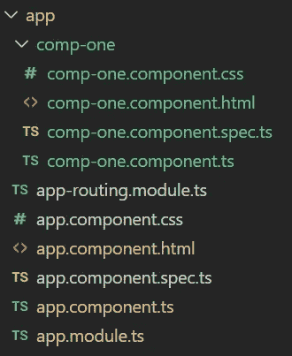

# 角度可观测量介绍

> 原文：<https://javascript.plainenglish.io/introduction-to-angular-observables-38dbe00dfa30?source=collection_archive---------7----------------------->

Photo by [Freddy Marschall](https://unsplash.com/@freddymarschall?utm_source=medium&utm_medium=referral) on [Unsplash](https://unsplash.com?utm_source=medium&utm_medium=referral)

在 Angular 中，可观察对象是从名为`rxjs`的包中导入的对象。

用简单的话来定义一个可观察对象，我们可以说一个**可观察对象**是数据发出的来源。此外，还有一个**观察器**，用于观察由可观察对象发出的任何数据包。在可观测者和观察者之间，有一个由可观测者发射多个事件的流。

可观察对象可以在各种情况下发出数据包。其中一些列举如下:

*   开发人员已经以编程方式配置了可观察对象来发出数据。
*   在 Angular HTTP 中，可观察对象与 HTTP 请求相链接。当响应到来时，它作为数据包发出。
*   observable 被配置为在用户输入时发出数据，如按钮点击、悬停等。

可观察对象发出的数据包是三种类型的通知，可以通过三种方式使用回调来处理

1.  `next` —它是每个交付值的处理程序。在执行开始后调用零次或多次。
2.  `error` —它是一个错误通知的处理程序。一个错误中止了可观察实例的执行。
3.  `complete` —是执行完成通知的处理程序。执行完成后，延迟值可以继续传递给下一个处理程序。

从上述三种方法中的第一种方法(即`next`)开始，我们编写代码，当我们接收到一个新的数据包时做一些事情。在第二种方法(即`error`)中，我们编写代码在收到错误消息时做一些事情。在第三种方法中(即`complete`)，我们编写代码在可观察完成时做一些事情。

HTTP 可观察对象是一种可以发出所有三种类型通知的可观察对象。但是附属于用户输入(如按钮点击等)的可观察的。)永远不会完成。

现在，让我们借助一个例子来理解这个概念。在本例中，我们将创建一个可观察对象，并模拟处理观察对象发出的数据包的所有三种方式。

首先，我们将打开终端，使用命令— `ng new exercise`初始化一个名为`exercise`的新 angular 项目。然后我们将导航到`exercise`文件夹。

默认情况下，Angular 将生成一个`app`组件。然后，我们将使用命令`ng g c comp-one`生成另一个组件。

现在，我们的`app`目录将如下所示:

然后，我们将打开`app-routing.module.ts`文件，并编写以下代码:

上面的文件设定了我们的路线。

在`app.component.html`文件中，我们必须按如下方式放置路由器出口——

现在，我们将为`comp-two.component.ts`文件中的可观察对象编写代码。

当上述组件被初始化时，它将创建一个可观察的对象，该对象每秒都会发出数据，并通过订阅该可观察的对象来接收数据。

现在，我们将在`comp-one.component.html`文件中创建一个按钮，它将打开`comp-two`，结果，它将创建可观察的。

然后，我们将在`comp-two.component.html`文件中创建另一个按钮，这将把用户带回到`comp-one`。

现在，如果我们使用命令`ng serve`运行我们的应用程序，那么我们可以看到下面的结果:

在这段视频中，我们观察到当我们第一次打开`comp-two`时，可观察到的东西被创建了，因为它开始将数据记录到控制台中。但是当我们离开这个组件时，可观察到的仍在发出数据。当我们再次打开这个组件时，一个新的可观察到的东西和旧的一起被创建了。这就是内存泄漏发生的方式。为了防止这种情况，一旦组件被破坏，我们就必须取消订阅可观察到的东西。

为解决上述问题，我们对`comp-two.component.ts`文件做如下修改:

现在，如果我们再次运行应用程序，我们将得到以下结果——

在前面的例子中，我们用`next`方法处理发射的数据只是因为我们知道`setInterval`不会产生任何错误。但是在 HTTP 请求的情况下，我们可能会得到错误。所以，我们必须妥善处理它们。

现在，让我们通过在前面的例子中创建我们自己的错误来理解错误处理部分。

上述修改将产生以下输出:

在上面的例子中，可观察到的将会发出一条错误消息，但是我们没有正确处理。所以，现在我们会妥善处理。为此，我们必须在代码中进行以下修改:

通过进行上述修改，我们将得到以下结果——

> 我们必须注意的是，当一个可观测值发出错误时，它**会抵消**该可观测值。

就像 HTTP observables 在请求-响应周期完成后发出一条完整的消息一样，我们将在下面的例子中通过修改`comp-two.component.ts`中的代码来模拟同样的情况。

运行应用程序后，我们将得到以下结果:

**参考**:【https://angular.io/guide/observables】T2—角度可观测量

*更多内容尽在*[***plain English . io***](https://plainenglish.io/)