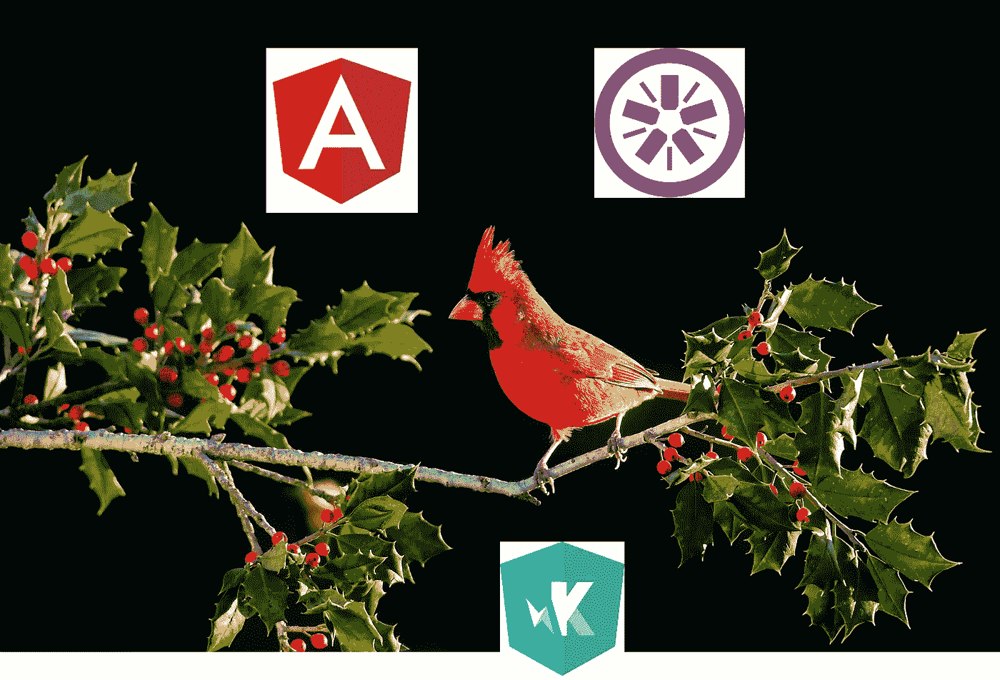
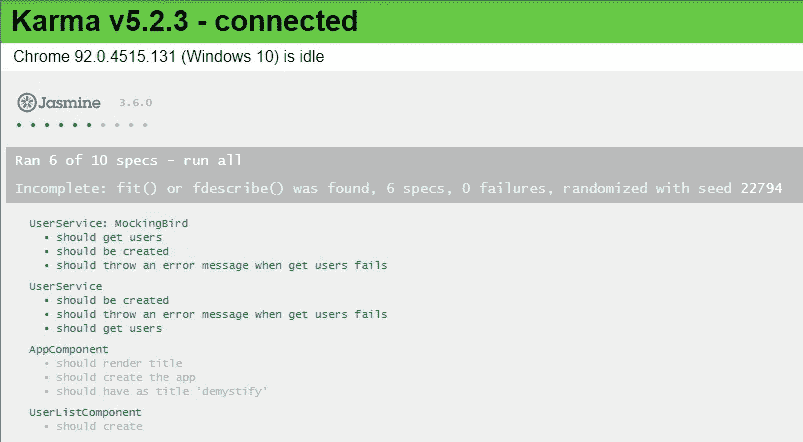
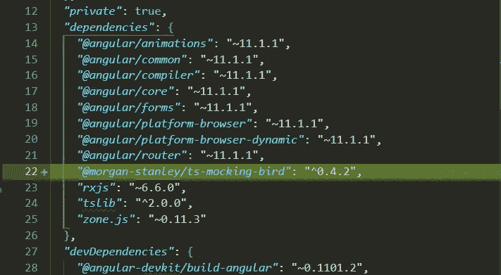
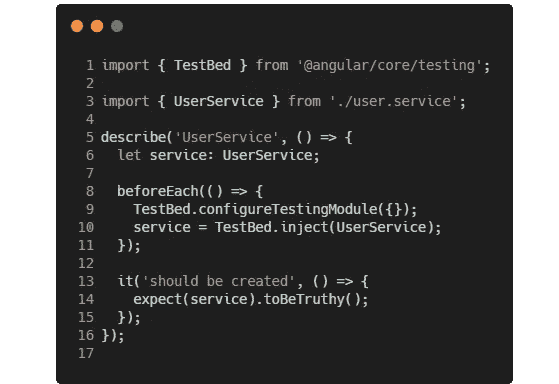
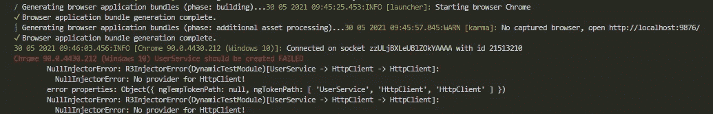
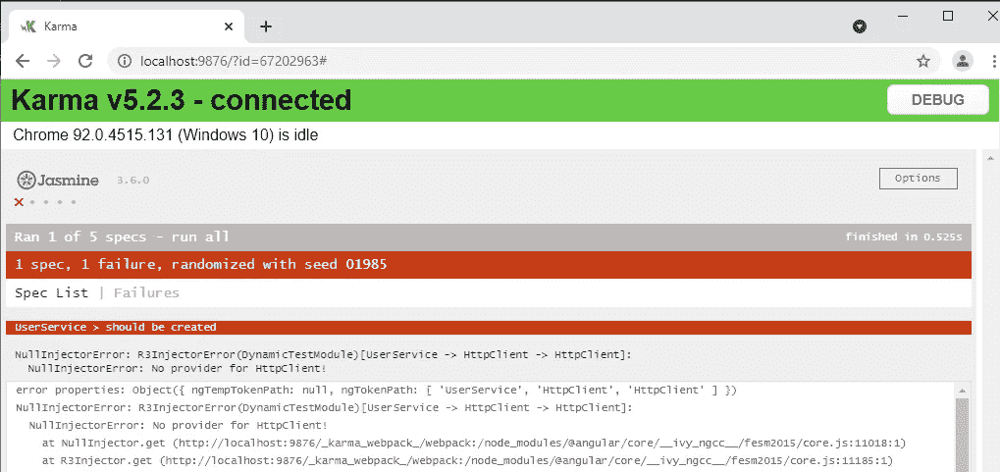
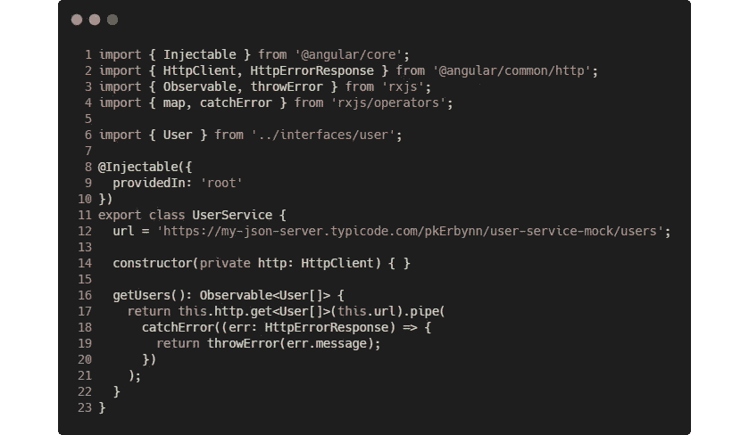
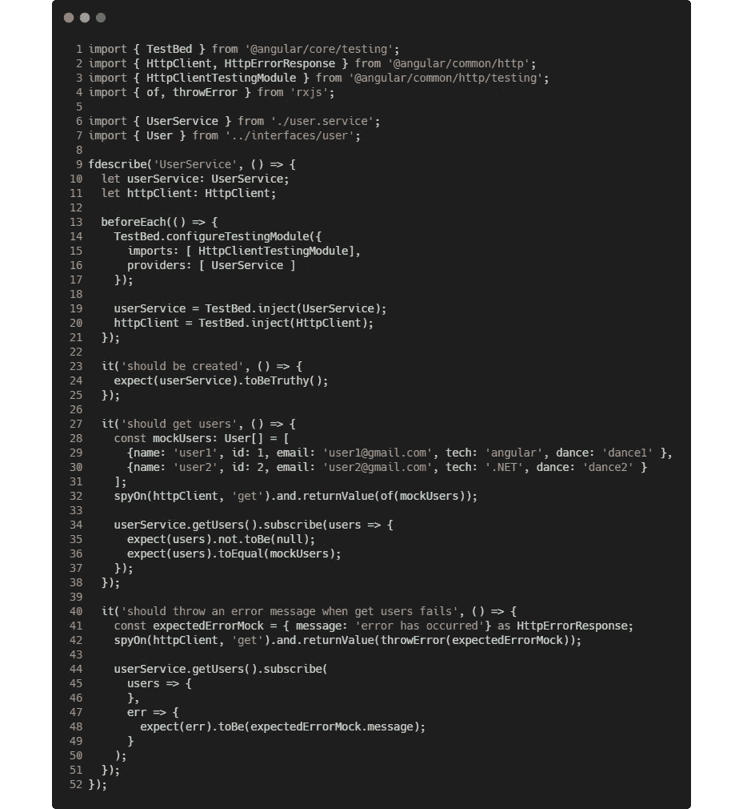
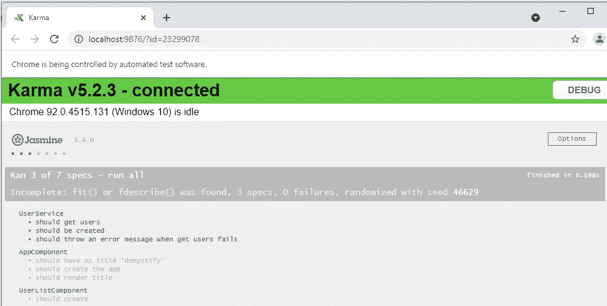
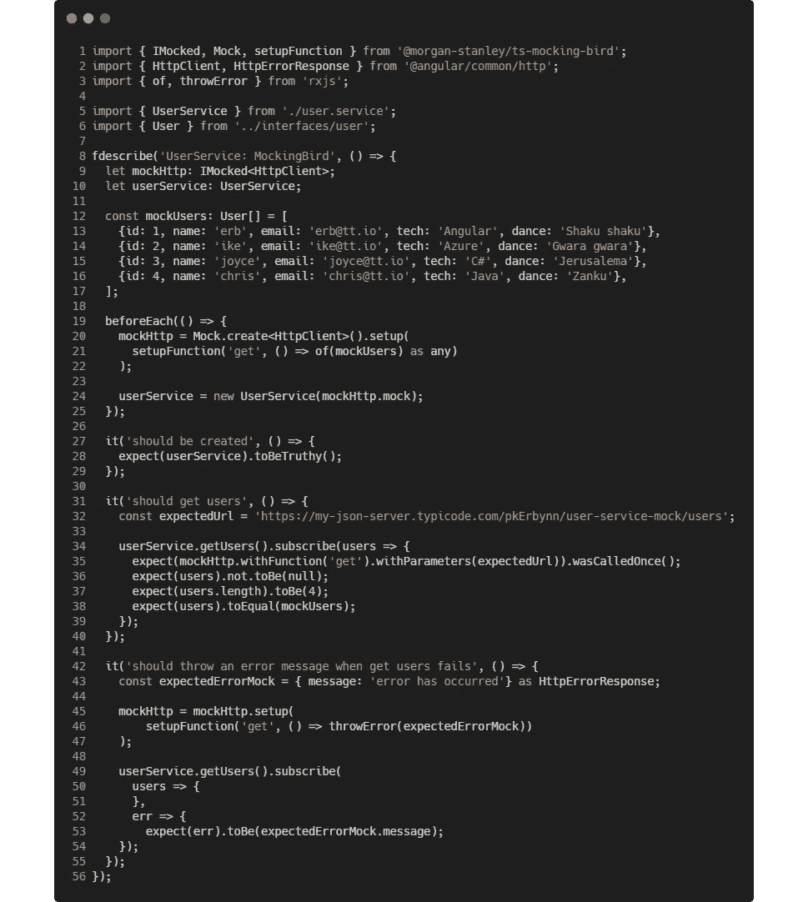

# 角度单元测试系列——第 2 集:Jasmine & ts-mocking-bird 角度单元测试介绍

> 原文：<https://javascript.plainenglish.io/introduction-to-angular-unit-testing-w-jasmine-ts-mocking-bird-3475a1d906e7?source=collection_archive---------7----------------------->

## 测试角度服务



serviceable mock wing

在本系列的前一集中，我们使用 Angular CLI 创建了一个样本 Angular 项目。但是，需要对其进行验证和确认，以确保代码按预期运行。随着应用程序的规模和复杂性的增长，这是一种扩展应用程序的好方法。

这篇文章旨在提供一个角度单元测试的介绍，并带你一步一步地为我们的 [*非角度应用程序*](https://github.com/pkErbynn/demystify/tree/9368cc50d5d0acb5389b2f862726b7ccf1c78d91) *编写单元测试。*

***我们所期待的:***

*使用 Jasmine 和 ts-mocking-bird 对用户服务文件的每一行进行测试，在下面的浏览中报告或显示。*

*项目代码库状态:* [*GitHub 链接*](https://github.com/pkErbynn/demystify/tree/abc2114e514cefeba548d22d4e3b95efe47583da)



user service test results (using ts-mocking-bird & Jasmine)

在本文结束时，您应该能够；

*   理解什么是单元测试以及它为什么重要
*   介绍可用的角度测试工具(Jasmine、Karma、ts-mocking-bird)
*   设置、配置和运行角度单位测试
*   了解如何构建测试规范文件
*   使用模拟和间谍测试服务返回的可观察性
*   使用 Jasmine 和 ts-mocking-bird 库发送 HTTP 请求的测试服务

让我们摇滚吧…

# 概观

## 什么是单元测试？

单元测试已经成为现代软件开发过程中不可或缺的一部分，它确保了一个质量至上的可靠的工程环境。

> 单元测试是一个软件开发过程，在这个过程中，一个应用程序的最小的可测试部分，称为**单元**，被单独和独立地仔细检查以确保正确的操作。来源:[https://searchsoftwarequality.techtarget.com](https://searchsoftwarequality.techtarget.com/definition/unit-testing)

强烈建议在实现过程的早期编写单元测试，因为它有助于检测代码中的早期缺陷，而这些缺陷在测试过程的后期可能更难检测。单元测试可以手动完成，但通常是自动化的。

## 为什么要进行单元测试？

单元测试…

*   改进实现的设计。
*   允许信任重构(对代码更改无罪)。
*   在不破坏任何东西的情况下推广新功能。
*   有助于在发布软件之前发现缺陷/错误。
*   通过确保所有代码在部署前符合质量标准，节省时间和金钱。

# 角度测试工具

Angular 应用程序可以用几种兼容的测试工具进行测试，包括 Karma、Jasmine、Mocha、ts-mocking-bird、Siesta 等等。在我们的例子中，我们将关注 Karma、Jasmine 和 ts-mock-bird 工具。

想知道茉莉、因果报应和 ts-mock-bird 之间的区别吗？在使用这些框架之前，让我们对它们如何工作和相互联系有一个高层次的概述。

## **茉莉**Vs**ts-嘲鸟 Vs 因果**

[***茉莉***](https://jasmine.github.io/pages/docs_home.html) 是一个**框架**编写的测试。它支持测试 DOM 相关的代码。其他种类的 Javascript 测试框架包括 QUnit、Mocha 等。

> Jasmine 是一个行为驱动的开发框架，用于测试 JavaScript 代码。它不依赖于任何其他 JavaScript 框架。— [茉莉 doc](https://jasmine.github.io/)

[***ts-mock-bird***](https://morganstanley.github.io/ts-mocking-bird/)*是一个与 Jasmine 一起工作的全类型安全嘲讽库。尽管 Jasmine 有一个内置的 *spyOn()* 库，可以模仿或删除任何确定的代码片段，但 ts-mocking-bird 可以用于替换或并列使用。但是，ts-mocking-bird 不支持 DOM 相关的测试。*

*[***Karma***](https://karma-runner.github.io/latest/index.html)是一个命令行工具，运行测试并在命令行和浏览器中显示报告。它从浏览器加载测试文件、运行并向命令行报告测试结果。Karma 观察开发文件的变化并自动重新运行测试。它开箱后带有棱角。*

*与 Jasmine 和 ts-mock-bird 不同，Karma 不是一个测试框架，而是一个**测试运行器**(它依赖于 *node.js)* 来运行我们用 Jasmine 或 ts-mock-bird 编写的测试。大多数情况下，Jasmine 和 Karma 一起使用来执行 Angular 中的测试。*

# *安装`morgan-stanley/ts-mocking-bird library`*

*现在我们已经理解了一些核心概念，让我们继续安装我们的工具。*

*Angular CLI 与 [Jasmine](https://jasmine.github.io/) 捆绑在一起，用于测试 Angular 应用程序，而 ts-mock-bird 是一个外部库，需要使用以下命令安装；*

```
*$ npm install @morgan-stanley/ts-mocking-bird*
```

*一旦安装完成，你的`package.json`*就应该将库添加到`dependencies` 块中，就像这样；**

****

**package.json after installation**

# **开始运行服务测试**

**当您使用 [Angular CLI](https://cli.angular.io/) 创建组件、服务等时，默认情况下，除了创建主代码文件，它还会创建一个简单的 Jasmine spec 文件，以`.spec.ts`结尾。**

**在我们的用户服务中，这将创建两个文件:**

*   **`user.service.ts` —这是主代码文件，我们将服务的代码实现放在这里。**
*   **`user.service**.spec.ts**` —这是服务的 Jasmine 测试套件。**

**[*spec*](https://github.com/pkErbynn/demystify/blob/master/src/app/services/user.service.spec.ts) 文件会有一些已经引导的代码:**

****

**user-service.spec.ts**

## **运行我们的初始用户服务单元测试**

**在项目目录的根目录下运行以下命令。这构建了我们的应用程序，然后运行 Karma，它是我们的测试运行程序，显示测试报告(在 CLI 和浏览器中)。**

```
**$ ng test**
```

> ****注意:**为了只运行我们的 userService 测试套件，让我们像这样在前面加上一个‘f’来集中注意力`**f**describe(‘UserService’...`。如果花色或规格是重点，只有那些将被执行。**
> 
> **顺便说一下，一个 suit 和 spec 可以通过在前面加上一个“x”来临时禁用(报告为待定和未执行)，分别是: `**x**describe(‘UserService’, ...)` 和 `**xit**(‘should be created’, ...)` 。**

**显然，您将从命令行和浏览器收到一个失败的测试结果:**

****

**Failed test result from the command line**

****

**Failed test result from the browser**

# **重写我们的用户服务测试**

**让我们重新编写我们的单元测试来修复 Jasmine 和 ms-mocking-bird 这两个测试框架中失败的服务测试。**

**我们的用户服务实现包含 at `getUsers()`方法来获取所有用户，并有一个`catchError`块来处理请求过程中可能出现的错误。**

**为了测试`UserService`类，也就是我们正在测试的系统(SUT)，让我们考虑以下三个测试用例场景:**

1.  **应该创建一个用户服务**
2.  **应该在成功时获取所有用户**
3.  **如果获取用户失败，应该抛出错误消息**

****

**user.service.ts (i.e. system under test)**

## ****用户服务测试(使用 Jasmine 框架)****

**现在让我们利用 Jasmine 框架来测试我们的`UserService`类。用以下内容更新`user.service.spec.ts`文件:**

****

**`user.service.spec.ts`**

**让我们明白这是怎么回事…**

*   ****第 9 行** `describe('UserService', ...`:描述了一组相关的单独测试，因此称为*测试套件，*，包含三个测试规格。**
*   ****行#13— #21** `beforeEach(()...`:它不仅在每个测试规格(`it(...`)的 *之前运行*，而且包含正确的配置(使用`TestBed`类)和所有必要的实例(#19 — #20)。它还提供了初始化服务所需的依赖关系。配置过程与普通*模块*相似。这称为*设置。*其他设置和拆卸方法包括`beforeAll(), afterEach(), afterAll()`。****
*   **第 23 行** `it('should ...`:定义一个单独的*测试规范。服务通过验证。*类似地*，*第 27 行和第 40 行分别描述了成功和失败的测试用例场景。
*   **line #32** `spyOn(httpClient ...`:用预期结果模拟 http `get`依赖关系。
*   **line #34** `userService.getUsers().subscribe...`:订阅`getUsers`返回的可观察对象，所以发送(假)HTTP 请求。调查响应`users`，以匹配预期响应。
*   **line #42** `spyOn(httpClient ...`:模拟调用 http `get`时抛出的错误消息。

现在，保存并重新运行测试，您应该有一个成功的浏览器测试报告，如下所示。耶！



browser success test report for User service

## 用户服务测试(使用 ms-ts-mocking-bird 库)

或者，我们也可以使用 ts-mocking-bird 库测试我们的用户服务。让我们创建另一个名为`user.service.mocking-bird.spec.ts`的规范文件。



user.service.mocking-bird.spec.ts

让我们强调一下这里发生的关键事情…

*   **第 8 行** `describe...`:将测试服描述为`UserService: MockingBird`
*   **行#20 — #22** `mockHttp = Mock.create<HttpClient>...`:模仿`HttpClient`依赖关系(用`get()`方法)并初始化声明的`mockHttp`。
*   **line #24** `userService = new ...`:创建一个`UserService` 的实例，将所需的模拟依赖项作为参数传递给它。
*   **行#27 — #29** `it(‘should ...’)` : 验证用户服务及其依赖项创建成功。
*   **line #34** `expect(mockHttp.withFuntion ...`:验证`get()`方法只使用正确的 url 调用一次。
*   **第 45 行— #47** `mockHttp = mockHttp.setup...`:用模拟错误响应覆盖 http `get()`方法。

> **注意:**当 Jasmine 使用`spy()`库模仿类方法时，ts-mock-bird 除了使用`Mock`库之外还使用了`setupFunction`。

如果一切顺利，您会看到这样一个成功的结果:


all user service tests result

## 结论

这篇文章展示了 Jasmine 和 mock-bird，它们是在 Angular web 应用程序中执行服务单元测试的强大工具。在我看来，与 Jasmine 相比，ts-mock-bird 提供了一个类型安全且干净的模仿系统。

我希望这篇文章对你有用。请随时*鼓掌*，*关注*或发送评论、反馈和问题:)

项目代码库状态: [GitHub 链接](https://github.com/pkErbynn/demystify/tree/abc2114e514cefeba548d22d4e3b95efe47583da)

“T”表示感谢！

> 下一篇文章:
> 
> [**角度单元测试系列-第 3 集:测试带 Jasmine 的角度组件**](https://medium.com/nerd-for-tech/angular-unit-testing-series-episode-3-component-testing-w-jasmine-2ed25082558f?source=friends_link&sk=344737eebdffa73b8aa2ceb569839919)
> 
> 前一篇文章:
> 
> [**【角度单元测试系列-第一集:入门(设置样本角度项目)**](https://pkerbynn.medium.com/angular-unit-testing-series-episode-1-getting-started-5ec86d645525)

*更多内容请看*[***plain English . io***](http://plainenglish.io/)