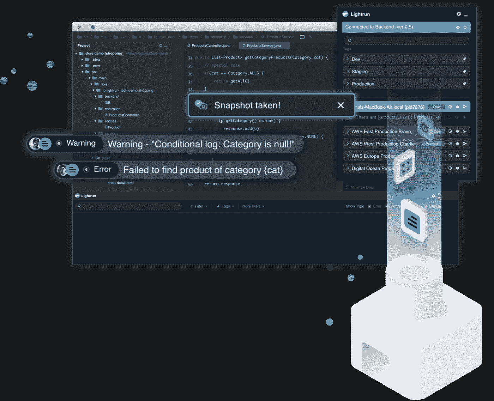
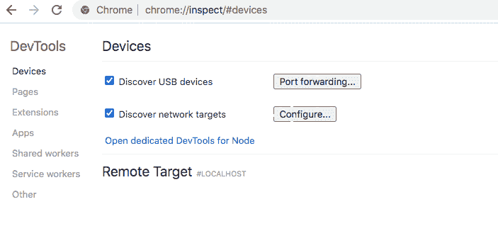
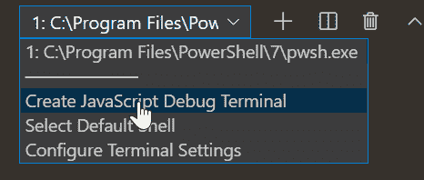

# Node.js 应用程序连续调试简介

> 原文：<https://javascript.plainenglish.io/introduction-to-continuous-debugging-for-node-js-applications-430b21506dfd?source=collection_archive---------10----------------------->


Photo by [Arif Riyanto](https://unsplash.com/@arifriyanto?utm_source=unsplash&utm_medium=referral&utm_content=creditCopyText) on [Unsplash](https://unsplash.com/?utm_source=unsplash&utm_medium=referral&utm_content=creditCopyText)

今天，您有许多现代框架/技术来开发前端和后端应用程序。因此，通过使用最新的技术，应用程序的开发变得很容易。然而，对于开发人员来说，找到应用程序中的错误并解决它们总是一项单调乏味的任务。在本地开发环境中重现相同的 bug 是复杂的。已经开发了许多工具来解决这个问题并改进调试。

在实时生产环境中，发现生产应用程序中的问题/缺陷总是一项复杂的任务。像 [Lightrun Cloud](https://lightrun.com/cloud/) 这样的免费工具可以帮助解决这些问题。

Lightrun Cloud 是一个基于云的解决方案，提供对生产应用程序的实时调试。它有三个方面:日志、快照和性能指标。您可以动态地将日志添加到现有的应用程序中，而无需发布应用程序的新版本。您可以使用快照选项提取修复问题所需的所有数据。最后，您可以使用性能指标，如计数器、计时器和函数持续时间，甚至可以添加定制的性能指标。

虽然 Lightrun 提供免费和付费的云解决方案，但它有一个对开发者免费的社区版。现在我们已经看了调试工具，让我们理解调试和手动过程。

# 什么是调试？

[调试](https://en.wikipedia.org/wiki/Debugging)是发现软件(手机、网络、桌面应用)中的 bug/问题并修复 bug 的过程。根据我的经验，与维护应用程序相比，开发应用程序很容易。为什么？因为在生产应用程序中发现问题总是一项具有挑战性的任务。我度过了许多不眠之夜，试图在一个应用程序中发现问题。

每个开发人员都需要调试技能。随着您使用越来越多类型的软件应用程序，您将更擅长调试。调试运行在不同于您的笔记本电脑/计算机的环境中的应用程序称为远程调试。

# 调试应用程序

在这里，我列出了一些关于如何调试应用程序的技巧。

1.使用调试工具:有许多可用的调试工具。根据您的需求选择合适的工具。然而，如果您不理解问题陈述和应用程序如何工作，使用工具将不会帮助您。

2.谷歌错误信息:这有助于你获得更多的信息和可行的解决方案。请阅读解决方案，并根据您的需要修改解决方案。不要直接复制粘贴解决方案。如果你这样做，它会吃掉你的调试时间，因为网上的解决方案可能不完全符合你的需要。

3.如果您发现代码中有错误，请始终使用 print 语句来了解结果:这个技巧是不言自明的。但是，在将应用程序发布到生产环境中时，请记住删除 print 语句。

4.编写测试用例并测试应用程序:测试将帮助您发现应用程序中的问题。如果您的应用程序没有通过测试，请不要发布应用程序。

5.向你的队友或你圈子里的熟人询问 bug/问题:如果其他开发人员经历过你面临的问题，你会从他们那里得到解决你问题的最佳方案。

# 调试 Node.js 应用程序



在这里，您会发现调试 Node.js 应用程序的各种方法。

# 打印报表

在控制台上打印输出是一种非常流行的调试技术。使用 print 语句，您可以查看每个阶段的数据，并轻松地发现和修复错误。在 Node.js 中，可以使用 log()函数在控制台上打印输出。

```
console.log(variable or text);
```

# 设置环境变量

当您调试 Node.js 应用程序时，首选的节点环境是**开发**模式，这为您提供了关于错误/问题的更多信息。

在 Mac/Linux 上，将节点环境变量设置为开发模式。

```
NODE_ENV=development
```

在 Windows 上，使用以下命令。

```
set NODE_ENV=development
```

您可以在 Node.js 应用程序中使用以下代码来检查是否启用了开发模式。

```
const DEVMODE = (process.env.NODE_ENV === ‘development’);
```

# 命令行选项

Node.js 有许多有用的命令行选项来调试应用程序。在调试 Node.js 应用程序时， **— trace-warnings** 命令是最有用的。它输出错误的堆栈跟踪。

使用以下代码可以更好地跟踪 Node.js 应用程序中的错误。

```
node — trace-warnings index.js
```

# 日志库

使用记录器将有助于您理解应用程序以及它运行时内部发生的事情。下面给出几个流行的第三方[日志库](https://stackoverflow.com/questions/32077673/what-is-the-meaning-and-purpose-of-a-logging-library):

*   loglevel
*   小木屋
*   皮诺
*   信号 e
*   情节串连图板
*   温斯顿
*   追踪者

# 使用 Chrome 调试

Chrome 是 Node.js 应用程序最好的调试工具。

使用— inspect 标志运行 Node.js 应用程序。

```
node — inspect index.js
```

在 chrome 浏览器中打开**关于:检查**。



点击**目标**检查链接，启动 DevTools。

# VS 代码调试器

VS 代码编辑器为 Node.js 应用程序提供了内置的调试工具。有了这个工具，您可以轻松地调试代码被编译成 JavaScript 文件的应用程序。根据 [VS 代码文档](https://code.visualstudio.com/docs/nodejs/nodejs-debugging)，您有三个选项来启用调试功能。使用命令面板中的**创建 JavaScript 调试终端**选项，如下图所示。这是一个快速且易于使用的选项。



# 摘要

当你从事软件应用程序维护项目时，调试是非常重要的。在开发阶段解决 bug 非常容易，因为您可以修改流程或创建新代码来解决问题。但是，在生产应用程序中查找和修复 bug 是一件很繁琐的事情，因为修改代码会对应用程序的各个模块/页面产生影响。所以，调试中一个简单的错误会让你付出更大的代价。

今天，您有许多云工具在生产服务器中提供实时调试。Lightrun 是实时调试的流行提供者之一。使用工具在生产应用程序的早期发现问题将提高应用程序的性能。它还允许你通过修复应用程序中的错误给用户一个更好的 [UI](https://www.indeed.com/career-advice/career-development/user-interface) 。

*更多内容看* [***说白了就是***](http://plainenglish.io/) ***。*** *报名参加我们的* [***免费每周简讯这里***](http://newsletter.plainenglish.io/) ***。***