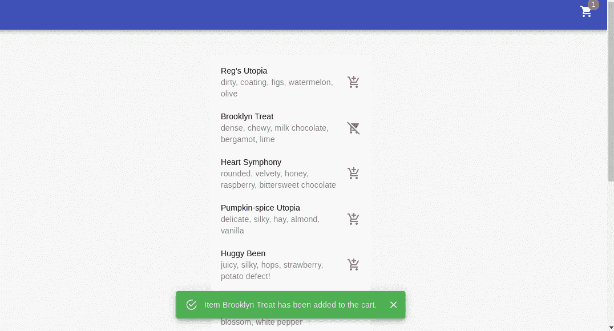

# 使用 React 测试库介绍 React 中的功能测试

> 原文：<https://javascript.plainenglish.io/introduction-to-functional-testing-in-react-using-react-testing-library-e83ab616e5b5?source=collection_archive---------9----------------------->

## 我们经历了一个简单的向购物车添加商品的工作流程

Photo by [Ferenc Almasi](https://unsplash.com/@flowforfrank?utm_source=medium&utm_medium=referral) on [Unsplash](https://unsplash.com?utm_source=medium&utm_medium=referral)

# 什么是功能测试？

你可能听说过三种常见的软件测试类型:单元测试、集成测试和端到端(e2e)测试。但是，您可能不熟悉术语*功能*测试。功能测试负责从*用户*的角度测试你的软件的*行为*。在某种程度上，单元和集成测试是功能测试的子集。我举个例子解释一下。

单元:我有一个组件，它是一个表单中的单个输入，用于检查输入文本的有效性。然后，通过模拟可能的输入并验证输出来隔离测试该组件。

**集成:**表单内有两个阶段或组件。当一个阶段完成时，状态更新，第二个阶段变为使能。我们验证这两个组件一起工作。

**功能性:**我们测试的是行为，而不是代码。从用户的角度来看，我们关心提交表单的功能，而不是单个组件的内部。

总的来说，我们进行测试是因为我们希望对我们的软件按照我们期望的方式运行有高度的信心。我们还想让它对重构具有弹性，否则会破坏一些相关的功能。

# **什么是 React 测试库？**

[React 测试库](https://testing-library.com/docs/react-testing-library/intro) (RTL)是一个测试工具，允许我们测试 React 组件。实际的测试是使用一个*测试运行器*来执行的，它是一个实际执行我们的断言的库。我相信大多数测试库，如 Mocha 或 Jasmine，都可以作为 RTL 的运行程序，但是在文档中使用的和最流行的似乎是 Jest。

与专注于测试状态(内部)的 [Enzyme](https://enzymejs.github.io/enzyme/) 不同，RTL 使用自己的虚拟 DOM 基于 DOM 进行测试。这对于功能测试来说是有意义的，因为我们最关心的是用户实际看到的和能够访问的内容。你可以在这里阅读更多关于 RTL 测试哲学的内容。

# 功能需求

我设置了一个小的演示程序，模拟用户向购物车添加商品。我认为这是一个有用的例子，因为这是一个你将在许多其他应用程序中看到的工作流。回购可在[这里](https://github.com/MikeZ77/functional-testing-demo)进行。稍后，我计划通过检查购物车中的商品来添加到这个演示中。这将允许我演示更多的测试模式，并展示 RTL 渲染的组件如何使用全局状态。

Store demo

用户点击其中一个商品的*添加到购物车*按钮:

*   按钮图标*应该*显示从购物车中移除的图像。
*   应该会出现一个绿色的 toast*,通知用户该商品已经添加到他们的购物车中。*
*   *导航条*中的购物车图标*应该增加 1。*

*用户点击同一商品的*从购物车中移除*按钮:*

*   *按钮图标*应*显示添加到购物车图像。*
*   *一个红色的 toast *应该会出现*，通知用户该商品已经从购物车中移除。*
*   *导航栏中的购物车图标*应该*减一。*

# ***测试***

## *RTL 基础*

*在我们深入演示测试之前，您应该了解构建测试套件所需的基础知识。*

1.  *`screen`对象表示我们的虚拟 DOM，它包含一些供访问器查询的方法。`userEvent`对象包含与虚拟 DOM 中的元素交互的方法(比如用户点击)。*
2.  *为了从虚拟 DOM 中查询元素，我们需要一个访问器。最优选的是通过**角色**访问，最不优选的是通过**测试 id** 访问。*为什么？ARIA 角色被构建到 DOM 中，并表示该元素的行为。test-id 必须手动添加，并且不反映在 DOM 中。你可以在这里阅读更多关于这个[的内容。](https://testing-library.com/docs/queries/about/#priority)**
3.  *理解不同的查询及其细微差别非常重要。以 *find* 开始的查询，例如`findBy`和`findAllBy` **等待**异步操作。以*开头的查询得到*，例如`getBy`和`getAllBy` **如果没有找到元素，就会抛出**错误。以*查询*开始的查询，例如`queryBy`和`queryAllBy`返回**空**并且不抛出错误。你可以在这里 阅读更多关于这个 [*的内容。*](https://testing-library.com/docs/react-testing-library/cheatsheet#queries)*

## *RTL 设置*

*因为设置相当简单，所以最好按照文档来做，因为我不需要添加太多东西。所涉及的大部分内容是安装必要的软件包。如果您使用 [create-react-app](https://create-react-app.dev/) 创建您的项目，那么大部分的包都已经设置好了，您只需要执行`yarn test`来运行您的测试。*

## *模拟服务人员*

*模拟服务工作器(MSW)充当代理，拦截我们的请求并返回一些设置测试条件的预定义数据。使用模拟对于功能测试是必不可少的，因为这区别于 e2e 测试。功能测试忽略后端，并假设服务器和数据库按预期工作。*

*参见 MSW 的[设置](https://mswjs.io/docs/getting-started/install)，这非常简单。在演示中，`mocks/server.js`将我们的 REST API 处理程序从`mocks/handlers.js`导入到服务器中。`setupTests.js`使用 Jest 的`beforeAll`、`afterEach`和`afterAll`在每次测试后创建和拆除模拟服务器。*

## *测试结构*

*组件的结构使得`Store`是父组件，它包含并传递道具给三个子组件:`Message`、`Navbar`和`ProductList`。`Store`包含组件之间的所有逻辑(状态)。因此，创建一个单一的测试文件`Store.test.js`是最有意义的，它贯穿整个工作流程，只呈现`Store`组件。*

*现在，考虑另一个更加模块化的组件结构，其中`Message`、`Navbar`和`ProductList`使用它们自己的状态。也许每个组件都有自己的请求(我们会为每个组件提供 MSW 处理程序)。现在，通过创建`tests/Navbar.test.js`、`tests/Message.test.js`和`tests/ProductList.test.js`来分别渲染和测试这些组件是有意义的。点击[此处](https://github.com/testing-library/react-testing-library/issues/167)查看与此相关的有趣讨论以及 [Kent C. Dodd](https://kentcdodds.com/) 的回应。*

## *商店.测试. js*

*就实际的测试文件而言，因为 Jest 语法可读性很强，所以我将只指出几个更有趣的断言。jest-dom 文档可从[这里](https://github.com/testing-library/jest-dom)获得。*

*`test`中的第一个参数是描述测试内容的字符串。第二个参数(回调)是异步的，因为我们执行了一个异步事件(调用 https://random-data-api.com/api/coffee/random_coffee 的)。*

*正如《RTL 优先》中所讨论的，我尽可能地尝试使用**角色**。但是线`const cartCount = screen.getByTestId('cart-count')`使用**测试 id** 。根据文档，当文本是动态的时，使用 test-id 是可以接受的。*

*查询`screen.getByRole(‘button’, { pressed: true })`通过来自[按钮角色](https://developer.mozilla.org/en-US/docs/Web/Accessibility/ARIA/Roles/button_role)的 ARIA 属性进行搜索。包含 ARIA 属性的对象的例子可以在[这里](https://testing-library.com/docs/queries/byrole)找到。出于测试目的，`pressed: true`表示该项目已添加，`pressed: false`表示该项目未添加。我认为这里的*复选框*角色更适合这个功能，尽管这个元素是一个按钮。*

*当我们期望`screen.queryByRole(‘button’, { pressed: true })`不在文档中时，注意我们使用`queryByRole`而不是`findByRole`。原因是`findByRole`会抛出一个错误，并在那时破坏我们的测试。*

*提醒 toast 在 DOM 中变得可见和不可见。如果您运行演示程序，您会注意到当前的 toast 关闭了，在新的 toast 打开之前还有一段时间。使用`waitFor`连续查询 DOM，直到找到元素(在我们的例子中，最终应该找到)。*

## *关于测试驱动开发的一点注记*

*测试驱动开发(TDD)就是在编写代码之前编写测试的过程。举例来说，我们不是从`Store.js`开始，而是开始用`Store.test.js`编写测试。这里的目标是最终让您在`Store.test.js`中的所有测试都通过。我喜欢这个想法，这也是我的目标。也就是说，在实践中很难执行，因为:*

*   *您需要能够轻松地编写测试，并对库有所了解。如果您不是，那么您可能会在特性实现后通过修改测试来完成双倍的工作(编写测试的方式可能需要完全改变)。*
*   *在实现该特性之前，您真的必须考虑并概述它的确切需求。这显然是一个好处，但在开始时可能会很耗时。*

*总的来说，我认为 TDD 使编写测试变得不那么乏味。通过在工作中集成测试，您可以避免花费大量时间编写测试套件。*

# *结论*

*希望这些信息可以作为测试您自己的 React 应用程序的良好起点。这些测试也可以很容易地集成到您的 CI/CD 管道中。实践也是很好的，因为这表明你有能力编写高质量的代码。*

*我喜欢功能测试，因为在我看来，它消除了执行 e2e 测试的需要。e2e 测试框架的一个例子是带有 Selenium web 驱动程序的 Jest。从我的经验来看，我发现编写 e2e 测试更加耗时且脆弱。您还需要任何相关的后端服务设置和任何填充了模拟数据的数据库。一种常见设置是用填充的 shell 脚本编写 docker-compose。*

*请随时留下任何意见或建议。*

* [## Mike z77/功能测试演示

### 在 GitHub 上创建一个帐户，为 Mike z77/功能测试演示开发做贡献。

github.com](https://github.com/MikeZ77/functional-testing-demo) 

*更多内容尽在*[***plain English . io***](http://plainenglish.io)*