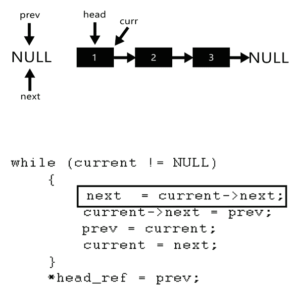

# 第 4 部分——如何在 JavaScript 中反转链表

> 原文：<https://javascript.plainenglish.io/introduction-to-linked-list-in-javascript-part-3-how-to-reverse-the-given-linked-list-ca393251ddfb?source=collection_archive---------7----------------------->

如果您直接阅读了这篇文章，那么在进一步阅读之前，请阅读我之前的一篇关于如何在 JavaScript 中实现链表的文章。


# **如何在 JavaScript 中反转链表**

## **样本输入和输出**

输入 1 = 10 –> 20-> 30-> 40->空

输出 1 = 40 -> 30 -> 20 → 10 ->空

输入 2 =空

输出 2 =空

这是大多数面试中最常见的问题之一。如果它是 array，并且访问者希望以相反的顺序打印数组元素，那么您可以从数组的后面运行一个循环，并打印如下所示的元素。

```
for(let i=array.length -1; i>=0; i--){
   console.log(array[i]);
}
```

## **解决方案 1。不推荐**

从头到尾遍历链表将元素复制到一个数组中，完成遍历后按逆序打印数组中的元素。我并没有为此编写解决方案，如果你读过我以前的文章，那么用于打印链表元素的相同逻辑也可以用于它。

**时间复杂度** —迭代链表 n，迭代数组 n 所以 n + n = **2n** 编程术语 **— n**

**空间复杂度** —因为我们维护所有元素的副本，所以空间复杂度是 n **。这是不推荐的，**如果链表包含 100 万个条目，通过复制它，你实际上增加了一倍的空间复杂度。

如果你不能实施任何更好的解决方案，或者你的新生不能参加面试，那么至少要实施上面的解决方案。

## **方案二。推荐**

这里的方法非常简单，您将更改元素的链接以指向前一个节点而不是下一个节点。如下图所示。您将不会使用任何额外的空间，并且您将只遍历列表一次。



Source — Geeks or geeks

时间复杂度:O(n)空间复杂度:O(1)

```
class Node {
// constructor
  constructor(element)
  {
     this.element = element;
     this.next = null
  }
}
class LinkedList {
   constructor()
    {
      this.head = null; 
      this.size = 0; 
    }
  add(element)
    {
    var node = new Node(element); // Create a node before adding
    var current;
    if (this.head == null) //For first element
        this.head = node; 
    else { // Iterate till the last item and add value
     current = this.head;
     while (current.next) {
         current = current.next;
     }
     current.next = node;
   }
  this.size++;
}
 printList()
  {
   var curr = this.head;
   var str = "";
   while (curr) {
     str += curr.element + " ";
     curr = curr.next;
   }
   console.log(str);
}reverseList(){
     var current = this.head, prev = null, next = null;
     while (current != null) {
            next = current.next;
            current.next = prev;
            prev = current;
            current = next;
      } // The prev will be pointing to last node, which you will point // to head now so if we start printing from head, list will be 
// reversed
    this.head = prev;
  }}var ll = new LinkedList();
// adding more elements to the list
ll.add(10);
ll.add(20);
ll.add(30);
ll.add(40);
ll.add(50);
// returns 10 20 30 40 50
ll.printList();
ll.reverseList();
ll.printList();
```

除了我引入了一个名为 **reverseList()的新方法之外，大部分代码与前几篇文章中使用的相同，该方法负责反转给定的列表。**

让我们在下一篇文章中赶上更多关于链表的有趣问题，快乐阅读。

[**第 5 部分—查找单链表中的第 n 个最后元素**](https://mevasanth.medium.com/part-5-find-nth-last-element-in-singly-linked-list-7a7043bfaf44)

**同一作者的其他文章:**

1.  [JavaScript 中的一切都是对象吗？](https://mevasanth.medium.com/how-everything-is-object-in-javascript-a4164d7e6a2d)
2.  [JavaScript 吊装:采访热点](https://mevasanth.medium.com/hoisting-in-javascript-hot-topic-for-interview-43b463a6a77?source=follow_footer---------0----------------------------)
3.  [JavaScript 中的记忆化——采访热点](https://mevasanth.medium.com/memoization-in-javascript-hot-topic-for-interview-815475544ab0)

点击[此处](https://mevasanth.medium.com/)查看作者所有文章。