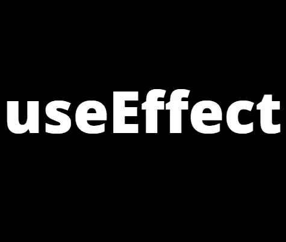
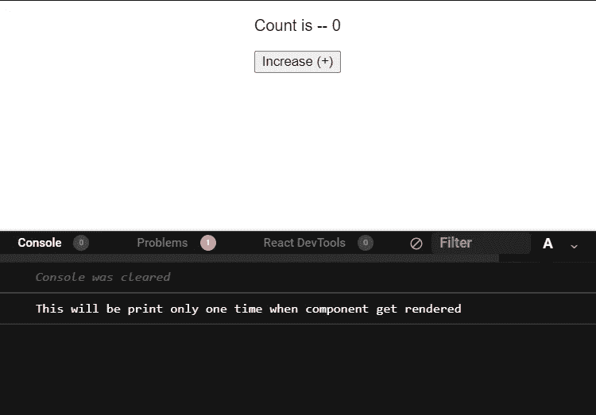
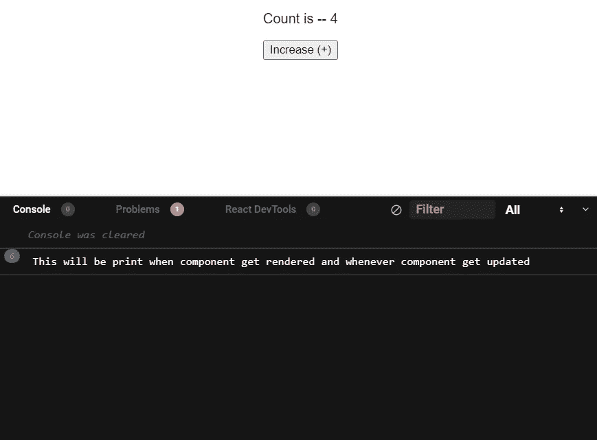
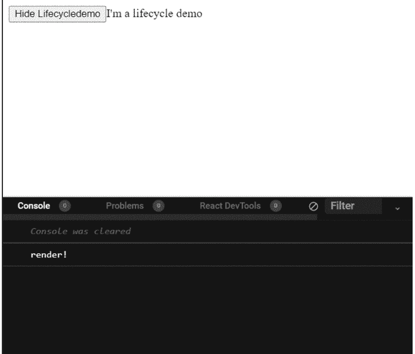

# React 挂钩简介—使用效果

> 原文：<https://javascript.plainenglish.io/introduction-to-react-hooks-useeffect-3108b78ca41b?source=collection_archive---------8----------------------->

## React 中的 useEffect 钩子是什么，如何使用(举例)？



> 在这篇**文章中，**我们将覆盖最**重要的**和**最好的**钩子，称为 **useEffect()** 。

# **注—**

我还写了一篇关于 React 钩子和 useState 钩子基础知识的博客，所以如果你是 React 新手或者你想复习一下，你一定要看看这篇文章。

[](/introduction-to-react-hooks-usestate-f39c6743a484) [## React 挂钩简介—使用状态

### React 钩子的基础——使用状态钩子

javascript.plainenglish.io](/introduction-to-react-hooks-usestate-f39c6743a484) 

# 先决条件—

你应该知道 HTML 的**基础知识，JavaScript，** **React** 和**React 如何工作，**和 React 钩子的**基础知识(****的链接，**React 钩子** **基础知识**和**使用状态钩子**在**上面提供)。****

**如果你满足了这些先决条件，那么你就**准备好了**。**

> **所以在我们理解什么是 **useEffect 钩子之前，**我们必须理解 **React 组件生命周期**到底是什么。**

# **什么是 React 组件生命周期？**

*   **顾名思义，React 组件生命周期基本上就是 React 中任何组件的生命周期。**
*   **React 中任何组分主要有三个相:**

1.  **第一个是在我们的 web 应用程序上创建和安装或使用组件的时候(称为 **componentDidMount** )。**
2.  **第二种是当组件的状态从初始状态变为给定状态时(称为 **componentDidUpdate** )。**
3.  **第三个也是最后一个是当组件从我们的 web 应用程序中卸载或删除时(称为 **componentWillUnmount** )。**

**现在，在理解了 React 生命周期之后，理解什么是**使用效果**挂钩以及我们如何使用它就变得更加容易了。**

# **什么是 useEffect 钩子？**

*   **因此， **useEffect** 是 React 中的一个钩子，每当新组件在 web 应用程序中呈现时( **componentDidMount** 阶段的**生命周期**的)或者当现有组件的状态更新时( **componentDidUpdate** 阶段的**生命周期**的)或者当现有组件从 web 应用程序中移除时(**componentDidMount**阶段的**
*   ****简单地说，useEffect 钩子用于处理 React 组件的生命周期。****
*   ****因此，主要有三种用例或 useEffect 挂钩:****

1.  ****用于在组件呈现时执行某些功能。****
2.  ****用于在组件更新时执行某些功能。****
3.  ****用于在组件被删除时执行某些功能。****

## ****useEffect 挂钩的语法—****

```
****useEffect(function (){
    //Code that you want to perform
},[parameters])****
```

****在上面的语法中，“function”是每当我们触发 useEffect 钩子时都会触发的主函数，数组中的参数指定了在改变哪个参数时 useEffect 钩子应该触发。****

****这是 useEffect 钩子的基本语法。如果你不明白也不用担心。一旦您阅读了示例部分，您对 useEffect 钩子的概念就会非常清楚。****

# ****使用状态的代码示例—****

****在本节中，我将使用 **useEffect 和 useState** 钩子创建一个简单的**计数器**，这样您就可以很容易地理解 useEffect 如何工作以及何时使用它。****

## ******1。componentDidMount 的 use effect—******

*   ******代码—******

*   ******输出和代码解释—******

********

1.  ****因此，在上面给出的代码中，我们使用`**useState**` hook 创建了一个简单的计数器，每当我们单击`**increase(+)**`按钮时，`**count**`状态变量的值就会增加 1。****
2.  ****在代码中，我们还为 componentDidMount 事件使用了`**useEffect**` 钩子。****
3.  ****所以我们在这个 useEffect 钩子中所做的是我们给了一个**函数**，它将`**console.log(“This will be print only one time when component get rendered”)**`，在参数数组中，我们传递了一个**空数组** ( `**[]**`)。现在，这种类型的 useEffect 挂钩语法将作为 componentDidMount 事件工作，因此当组件被呈现时(换句话说，当计数器被呈现时)，这个 console.log 将仅被触发一次。****

## ****2.componentDidUpdate 的 useEffect****

*   ******代码—******

*   ******输出和代码解释—******

********

1.  ****代码解释和上面的 componentDidMount 差不多。****
2.  ****唯一的区别是在 useEffect hook 中，在这段代码中，我们在 useEffect hook 中传递了一个**函数**，在**参数** **数组**中，我们传递了一个名为 **count(** `**[count]**` **)** 的状态变量，所以这意味着只有当组件得到**挂载**并且当`**count**` 变量**状态**改变时，才会触发。****
3.  ****因此，每当组件被渲染和组件被更新时(在我们的例子中，每当 counter 被渲染和 count 变量的值被更新时),这段代码将触发`**console.log(“This will be print when component get rendered and whenever component get updated”)**`。)所以在这里你可以看到 6 次`***“This will be print when component get rendered and whenever component get updated”***`被打印(组件渲染时 1 次，计数值从 0 更新到 4 时 5 次)。****

## ****3.use effect for component will unmount—****

*   ******输出和代码解释—******

********

1.  ****在这个代码示例中，我们创建了一个名为`**LifecycleDemo**`的虚拟组件，其中我们使用了 **useEffect** 作为 **componentWillUnmount** 事件。****
2.  ****不过在了解之前我们先来了解一下主要的 **App** 组件代码。****
3.  ****因此，在 **App** 组件中，我们所做的是创建一个名为`**mount**` 的**状态**变量，并赋予默认值`**true**` ，并创建一个名为`**toggle**` 的**函数**，该函数将把**状态**变量`**mount**` 的值从`**true**` 切换到`**false**` 或`**false**` 到`**true**`。****
4.  ****因此，每当我们单击显示时，挂载状态变量的`**“lifecycle button”**`值变为`**true**` ，并且**线-24** 的条件变为真，并且`**LifecycleDemo**`组件变为可见。点击**【隐藏生命周期】**按钮，将**从**应用**中卸载或移除** `**LifecycleDemo**`组件。****
5.  **所以现在在理解了 **App** 组件代码之后，我们将会看到在`**LifecycleDemo**`组件中我们使用了 **useEffect** 钩子。**
6.  **所以在 **useEffect** 中，我们所做的是在 useEffect 的**函数**中的**T5，在**函数**中，我们让**返回另一个有`**console.log("unmounting…").**`的**函数****
7.  **所以每当我们**安装**时，第一个`**LifecycleDemo**` 组件`**console.log**`被触发，每当我们**卸载时，该**功能的返回**部分**被触发。**
8.  **正如您在 GIF 中看到的，首先是应用程序**加载** `**“render !”**` **并打印**时，当我们**卸载**时，组件`**“unmounting…”**`得到了**打印的**。**
9.  **所以如果我们想在组件卸载时执行某项任务**我们必须在**中执行，返回**的**部分，使用 Effect** 钩子。****

# **我的其他文章——**

*   ****用于在反应中创建项目(包括 API 调用、useEffect、useState 等)。)—****

**[](https://nanditshah105.medium.com/creating-web-app-for-fetching-facts-about-numbers-using-react-and-axios-from-numbersapi-7d0311845168) [## 创建一个网络应用程序，用于从 NumbersAPI 获取关于数字的事实。

### 嘿！！！我叫南迪·沙阿。我是一名学生。我正在写我的第一篇博客，内容是关于如何使用 react 来创建一个网络应用程序…

nanditshah105.medium.com](https://nanditshah105.medium.com/creating-web-app-for-fetching-facts-about-numbers-using-react-and-axios-from-numbersapi-7d0311845168) 

*   **数据结构基础知识—**

[](https://python.plainenglish.io/data-structures-with-python-array-stack-queue-linked-list-1-19323bd3f62c) [## Python 数据结构简介

### 数组、堆栈、队列、链表

python.plainenglish.io](https://python.plainenglish.io/data-structures-with-python-array-stack-queue-linked-list-1-19323bd3f62c) [](https://python.plainenglish.io/an-introduction-to-python-data-structures-hash-map-tree-graph-9cf96078731a) [## Python 数据结构介绍—哈希映射、树、图

### 在本文中，我们将介绍 Python 中的非线性数据结构，如树、散列图和图。

python .平原英语. io](https://python.plainenglish.io/an-introduction-to-python-data-structures-hash-map-tree-graph-9cf96078731a) 

# 结论—

在本文中，我们已经介绍了 React 组件生命周期的**基础知识，什么是 useEffect 钩子，它是如何工作的，**和**如何实现它**。

希望你们喜欢阅读和学习。

如果你喜欢这篇文章，请为此鼓掌，并尽可能多地与人分享，这样他们也能从中学习。如果你喜欢阅读这类文章，**请关注我**。

# 和我联系—

[](https://www.linkedin.com/in/nandit-shah/) [## 印度古吉拉特邦甘地讷格尔政府工程学院

### 查看世界上最大的职业社区 LinkedIn 上 Nandit Shah 的个人资料。南迪教育上市于…

www.linkedin.com](https://www.linkedin.com/in/nandit-shah/) 

*更多内容请看*[*plain English . io*](http://plainenglish.io/)**