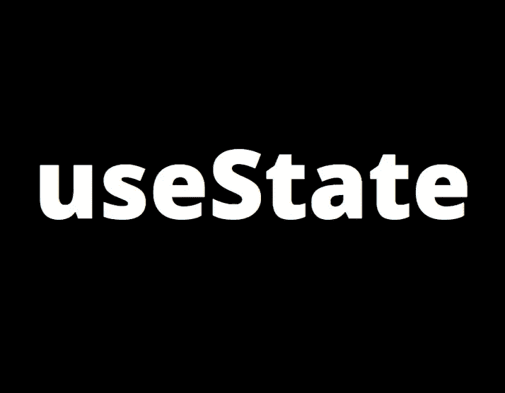
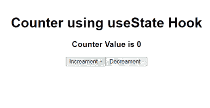

# React 挂钩简介—使用状态

> 原文：<https://javascript.plainenglish.io/introduction-to-react-hooks-usestate-f39c6743a484?source=collection_archive---------22----------------------->

## React 钩子的基础——使用状态钩子

> 在这个故事中，我们将讲述 React 钩子的所有**基础知识，并了解名为 **useState()的内置 React 钩子。****

# 先决条件—

你应该知道 HTML 的**基础，Javascript，** **什么是 React** 和**它是如何工作的**。

如果你满足了这些先决条件，那么你就**准备好了**。

# 什么是 React Hooks？

*   React 钩子是在 **React 16.8** 中引入的。
*   React 钩子基本上是让你处理 web 应用程序的状态的函数，它们让你不用写类就可以轻松地使用 React 的其他特性，比如 componenDidMount() 、**componendiddupdate()**。
*   您只能在**功能组件**中使用 React 钩子，而不能在类定义的组件中使用。
*   简而言之，我们可以将 React 挂钩定义为**功能，让您*“挂钩”* React 来自功能组件**的状态和生命周期特性。
*   有许多类型的内置 React 挂钩——

## 基本挂钩

1.  **使用状态()**
2.  **useEffect()**
3.  **使用上下文()**

## 附加挂钩

1.  **useReducer()**
2.  **useRef()**
3.  **useCallback()**
4.  **使用备忘录()**

还有其他一些附加的 React 挂钩，但这些对于基础来说已经足够了。

# 什么是使用状态？

*   useState 是最常见和最常用的 React 挂钩之一。
*   useState 用作特定组件的**状态管理挂钩**。
*   useState 钩子用于**处理我们组件的状态**。
*   useState 允许我们简单方便地**创建**和**处理** **状态变量**。
*   在使用状态中，我们设置状态变量的**初始状态**，并使用**使用状态定义函数**将该状态变量的状态从**初始状态**更改为**当前状态**。
*   我们只能在**功能组件中使用**使用状态**，不能在**基于类的组件**中使用**。
*   useState 与 React **基于类的组件**中的`**this.state**`和`**this.setState**`相同。
*   不要担心，如果你没有正确理解 state 和 useState，一旦你通过一个代码示例理解它，它就会在你的脑海中完全清晰。

# 使用状态的代码示例—

在本节中，我将使用 **useState** 钩子创建一个简单的**计数器**，这样您就可以很容易地理解 useState 如何工作以及何时使用它。

**This is what we are going to make**

*   **代码—**

*   **代码解释—**

1.  在这段代码中，我们从`**‘react’**`导入了`**useState**`钩子。
2.  之后，我们将在 App.js 文件中创建一个名为`**App**`的功能组件。
3.  在功能组件中，我们将创建名为`**count**` 状态变量，并使用名为`**setCount**`的状态函数。
4.  在这段代码的第**6**行，我们使用了 useState 钩子，在其中我们创建了一个名为`**count**` 的状态变量，为了改变这个计数的状态，我们创建了一个名为`**setCount**`的函数。
5.  这里用`**useState(0)**` 0 表示`**count**` 状态变量的初始状态。所以一开始当我们的 App 组件加载`**count**` 状态变量的值会是 0。并且使用`**setCount**`方法我们将能够改变`**count**` 状态变量的值。
6.  现在我们已经创建了一个名为`**decreament**`的方法，每当我们点击 ***(decrement -)*** 按钮时，它会将状态变量`**count**` 的值减 1。基本上，该方法的作用是使用`**setCount**`方法将`**count**`变量的状态设置为`**count-1**`。
7.  现在我们已经创建了一个名为`**increament**`的方法，每当我们单击 ***(increment +)*** 按钮时，该方法会将状态变量`**count**` 的值递增 1。基本上这个方法所做的就是使用`**setCount**`方法将`**count**`变量的状态设置为`**count+1**`。
8.  在这段代码的`**return**` 部分是不言自明的，在*(****【increment+)****按钮中我们已经传递了`**onClick**` 事件中的`**increament**` 方法，在 ***(decrement-)*** 按钮中我们已经传递了`**decreament**`方法。*

**还可以将状态变量和 useState 函数(* ***setCount 在此代码中为*** *)作为道具传递给其他组件。因此，您也可以从子组件中更改或设置父组件的状态。**

# *结论*

*因此，在本文中，我们已经介绍了 React 钩子的基础知识，什么是 useState 钩子，它是如何工作的，和**如何实现它**。*

*希望你们喜欢阅读和学习。*

*如果你喜欢这篇文章，请留下掌声并与他人分享，这样他们也可以从中学习。*

**更多内容请看*[*plain English . io*](http://plainenglish.io/)*