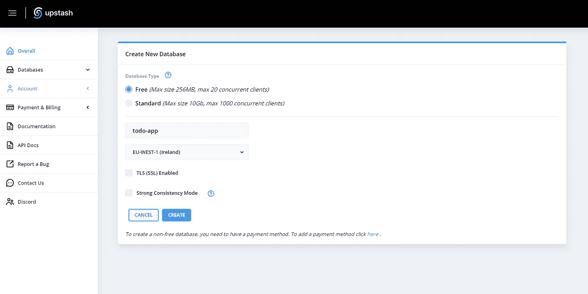
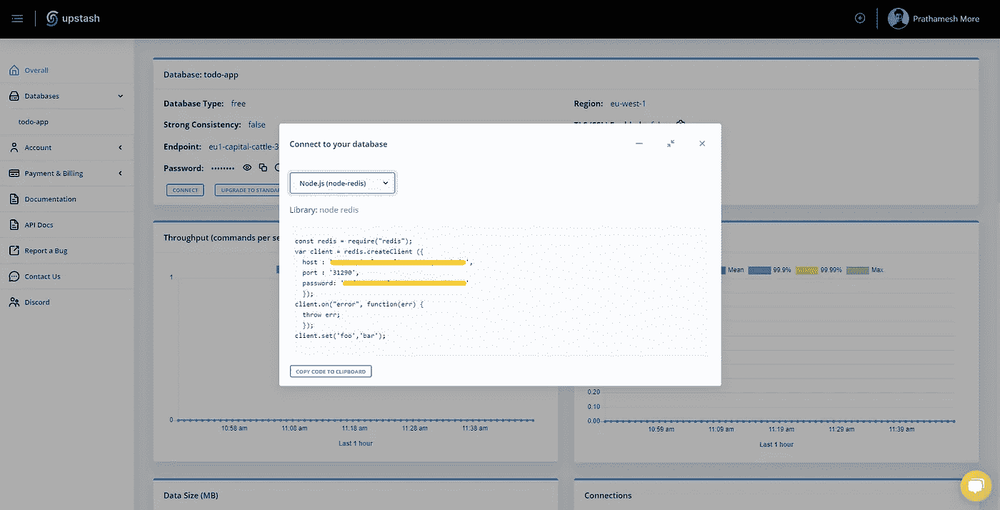
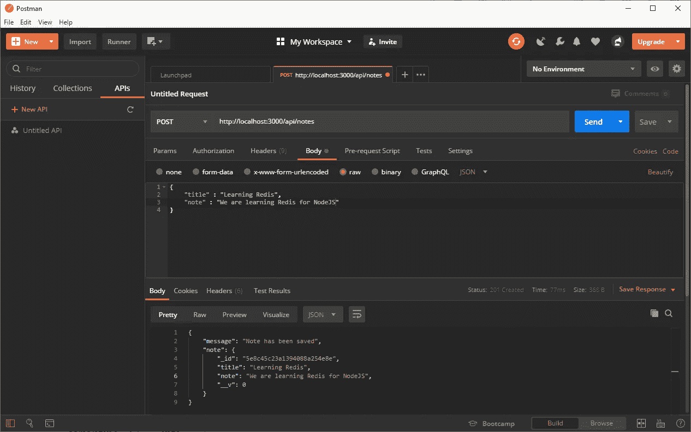
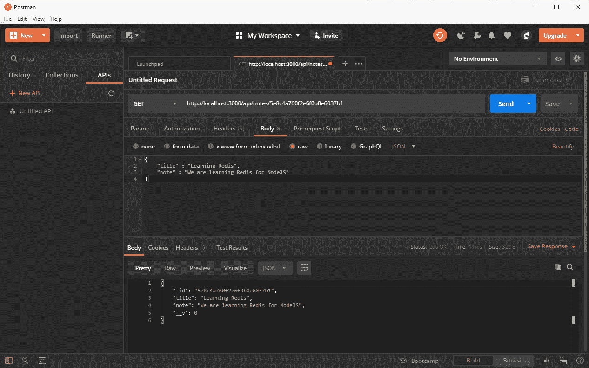

# 使用 Node.js 的无服务器 Redis 缓存

> 原文：<https://javascript.plainenglish.io/introduction-to-redis-and-caching-with-node-js-using-upstash-88efbe39eea2?source=collection_archive---------2----------------------->

## Redis 是用于缓存的内存中数据结构。在这篇博客中，我们将实现一个简单的 Node.js 应用程序，它使用无服务器 Redis，并且我们将使用 Upstash——无服务器
数据库用于 Redis。


Photo by [Clément Hélardot](https://unsplash.com/@clemhlrdt?utm_source=medium&utm_medium=referral) on [Unsplash](https://unsplash.com?utm_source=medium&utm_medium=referral)

## Redis 是什么？

Redis 是一个开源的内存数据结构存储，用作缓存的 NoSQL 数据库，以提高最频繁请求的数据的整体响应速度。

在这个博客中，我们将开发笔记应用程序 API，我们将实现两个功能，

1.  记下用户的笔记。
2.  将便笺返回给用户。

但是这里将使用 Redis，来缓存注释。如果用户频繁请求相同的笔记，我们将返回存储在 Redis 中的笔记。

```
REST API Routes1\. POST => /api/notes => Create notes
2\. GET  => /api/notes/:id => Get a note
```

**软件要求**

我们开始吧，

在本地计算机上安装所需的软件包:

```
npm install express body-parser mongoose redis --save
```

**用 Upstash 建立 Redis 数据库，**

是 Redis 的一个无服务器数据库，有服务器/实例，你按小时付费或固定价格。使用无服务器，您需要为每个请求付费。

这意味着当数据库没有被使用时，你是免费的。Upstash 为您配置和管理数据库。

让我们先在**上创建一个账户，**

https://upstash.co m/

现在设置数据库实例，



Create New Database



Connect to your database

创建一个简单的服务器并连接到 MongoDB 数据库:

Simple Express Server

现在，使用 Upstash 提供的配置连接到 Redis 服务器:

Redis connection with Upstash

猫鼬模型:

现在实现 API 的路由

从用户那里获取一条注释，并将其存储在 Redis 和 MongoDB 中:

Create notes

在代码中，我们使用了一个方法`setex`来存储 Redis 中的数据。

这个方法有 4 个参数

1.  `id`:必须提供唯一的 ID 来存储数据。必须是字符串。
2.  `seconds`:以秒为单位的到期时间。
3.  `value`:存储在 Redis 中的实际数据。必须是字符串。所以我们把`object`连载成`string`。
4.  `callback`:回调带两个参数`err`和`reply`。



Create a note

现在检索数据，首先，我们必须在 Redis 中检查数据，如果 Redis 中没有数据，那么我们必须在数据库中进行查询。

为此，我们必须编写中间件来检查 Redis 中请求的数据。

中间件:

Caching middleware

在上述中间件中，我们使用`get()`方法从 Redis 中检索现有数据。`get(id, callback())`。

这里我们将`string`解析回`object`。

现在在`get`请求上使用这个中间件:



First time retrieves data. It took 11ms


Next, we retried to get data, It took 5ms.

## 密码

Complete code

***退房新贵进行生产:***[](https://upstash.com/)