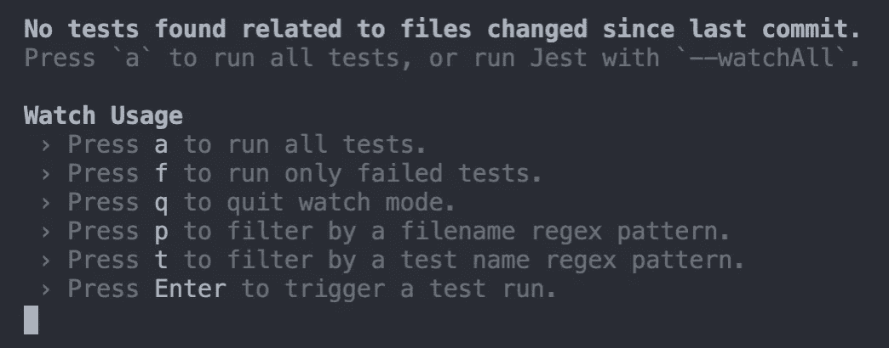
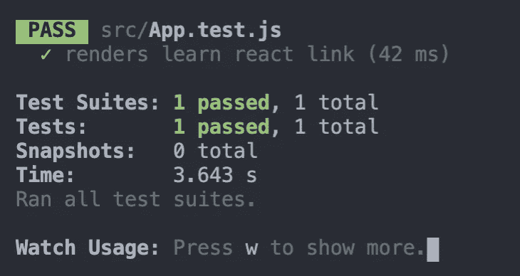
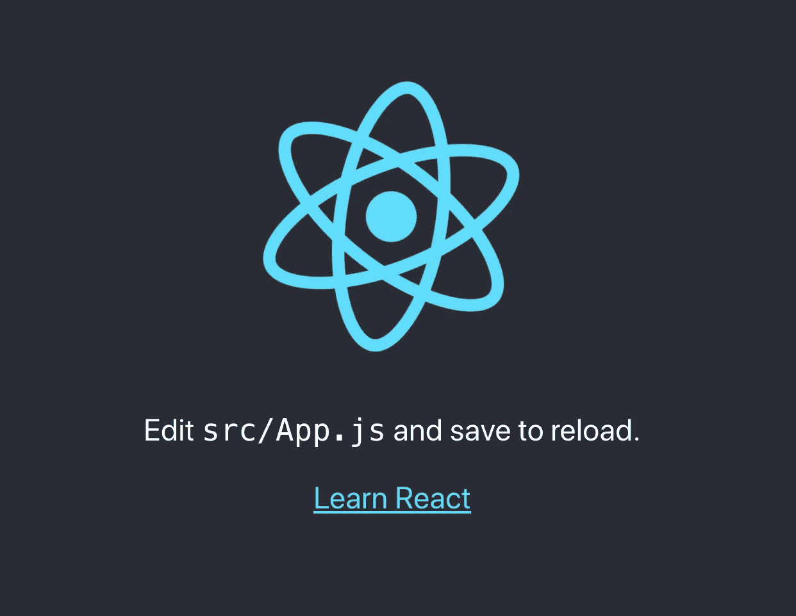

# React with Jest 和 React 测试库中的测试介绍

> 原文：<https://javascript.plainenglish.io/introduction-to-testing-in-react-with-jest-and-react-testing-library-c1c32bb11739?source=collection_archive---------5----------------------->

## create-react-app 中的 App.test.js 和 setupTests.js 文件是用来做什么的？


Photo by [Jerry Wang](https://unsplash.com/@jerry_318?utm_source=medium&utm_medium=referral) on [Unsplash](https://unsplash.com?utm_source=medium&utm_medium=referral)

如果你用过 create-react-app，我敢肯定你以前见过`App.test.js`和`setupTests.js`文件。如果你和我一样，开始一个新项目的第一件事就是删除那些文件。所有教程都是这么做的吧？

我从未想过在我的应用程序中包含测试。我一直认为我可以在开发的时候手动测试这个应用程序。我认为学习如何编写测试并在我自己的项目中编写它们是浪费时间。

直到现在。在我目前的工作中，我的任务是使用 Jest 和 React 测试库在 React 应用程序中编写测试。

在过去的几天里，我花了很多时间学习测试，我将在本文中分享我所学到的东西。我们将创建一个新的 create-react-app 应用程序，看看这两个文件，`App.test.js`和`setupTests.js`。该是我们了解它们的用途以及如何使用它们的时候了。

# 运行您的第一个测试

create-react-app 自带 Jest 和 react 测试库安装。这是在您的应用程序中运行单元测试的推荐方式。

如果我们创建一个新的应用程序并打开`App.test.js`文件，这将是它的样子。

这实际上是他们为我们创造的一个测试。如果你想知道会发生什么，在你的项目终端中运行`npm test`。

第一次运行`npm test`时，你会得到这个命令的提示。



Jest 有一个监视模式，检查自上次提交以来是否有任何测试文件被更改。按下`a`运行所有测试。然后，您将看到此消息出现。



绿色表示我们的测试通过了！但是我们到底测试了什么呢？让我们更仔细地检查代码。

# 应用测试网站

我们将首先看一下`App.test.js`文件，并逐行分解。

```
import { render, screen } from '@testing-library/react';
import App from './App';
```

这前两行似乎并不太奇怪。我们从`@testing-library/react`库中导入两个对象，并导入 App 组件。到目前为止，一切顺利。

```
test('renders learn react link', () => {

});
```

这就是考验。create-react-app 使用 [Jest](https://jestjs.io/) 作为测试框架。Jest 帮助我们设置和运行测试。

测试函数有三个参数；名称、功能和超时(可选，此处不包含)。

第一个参数是测试的名称。在我们的例子中，测试被命名为*“渲染学习反应链接”*。第二个参数是包含测试期望的函数。

```
render(<App />);
```

在函数中，我们首先将 App 组件从`@testing-library/react`库中传递给 render 方法。这就是[反应测试库](https://testing-library.com/docs/react-testing-library/intro/)发挥作用的地方。React 测试库帮助我们渲染组件、搜索和与虚拟 DOM 交互。通过使用 App 组件作为参数调用 render 方法，我们创建了 App 组件的虚拟 DOM。

```
const linkElement = screen.getByText(/learn react/i);
```

我们可以使用 screen 对象访问虚拟 DOM。我们在屏幕上调用`getByText()`方法。这是一个允许我们在页面上查找元素的查询。你可以在这里阅读更多关于查询[的内容。](https://testing-library.com/docs/queries/about/)

我们通过的论证是`/learn react/i`。这是一个不区分大小写的正则表达式。如果我们愿意，我们也可以只传递一个字符串。

基本上，上面的代码行是说用文本*“learn react”*(不区分大小写)在虚拟 DOM 中查找一个元素，并将其存储在一个名为`linkElement`的变量中。

```
expect(linkElement).toBeInTheDocument();
```

这里的最后一行代码称为断言。这将导致测试成功或失败。如果我们大声读出来，我们就能理解我们所期待的。*期望链接元素在文档中。*

我们从 Jest 调用 expect 函数，并传递一个`linkElement`参数。`linkElement`是我们正在检查的。断言的最后一部分称为匹配器。这是来自 Jest-DOM，我们将在下一节讨论。匹配器正在做它所说的事情。它正在检查`linkElement`是否在文档中。

如果测试可以在虚拟 DOM 中找到一个文本为*“learn react”*(不区分大小写)的元素，那么这个测试将通过。如果没有，就会失败。

如果我们启动我们的应用程序，我们会看到这一点。正如你所看到的，*【学反应】*的文字就在那里！



# setupTests.js

在上一节中，我们提到了 [Jest-DOM](https://testing-library.com/docs/ecosystem-jest-dom/) 和 matchers。这就是需要`setupTests.js`文件的地方。

和 Jest 和 React 测试库一样，Jest-DOM 是和 create-react-app 一起安装的。`setupTests.js`文件将库导入到我们的应用程序中，让我们可以访问匹配器。

在我们的示例测试中使用的匹配器是`toBeInTheDocument()`方法。我们可以用更多的匹配器。你可以在这里阅读更多关于他们的信息。

# 结论

感谢阅读！谈到测试，我们只是触及了表面。但是，我希望这篇文章能让你对我们使用 create-react-app 时这两个文件的作用有所了解。我自己知道，它们只是我马上删除的文件。

我正在使用 Jest 和 React 测试库更深入地测试 React 应用程序，敬请期待更多文章！

如果您想了解如何在 React 中处理错误，可以看看下面的文章。

[](https://levelup.gitconnected.com/how-to-handle-errors-in-react-with-react-error-boundary-436cf423bdca) [## 如何用 React 错误边界处理 React 中的错误

### react-error-boundary 包介绍及示例

levelup.gitconnected.com](https://levelup.gitconnected.com/how-to-handle-errors-in-react-with-react-error-boundary-436cf423bdca) 

*更多内容尽在*[***plain English . io***](https://plainenglish.io/)