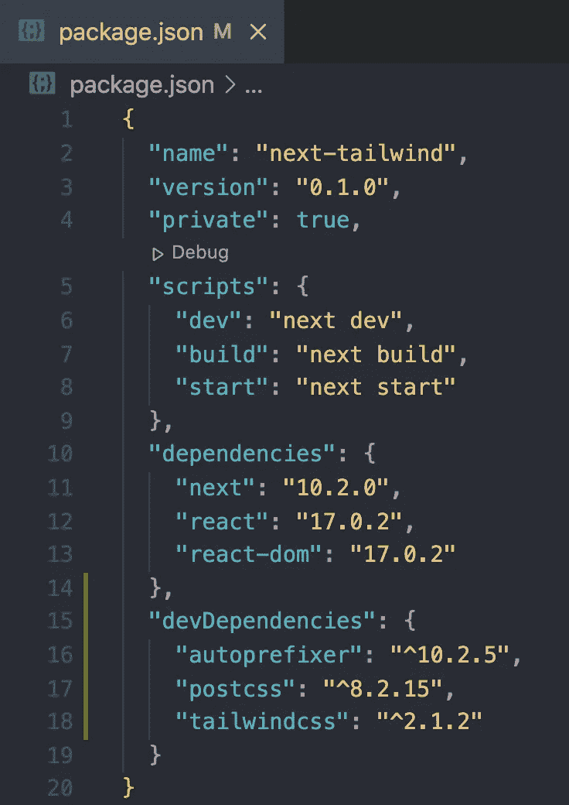
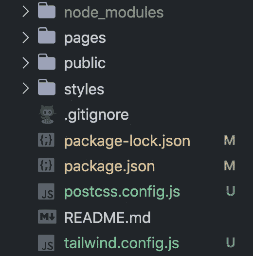
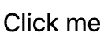

# 将 Tailwind CSS 用于 Next.js 的介绍

> 原文：<https://javascript.plainenglish.io/introduction-to-using-tailwind-css-with-next-js-d609be5b6e91?source=collection_archive---------12----------------------->

## 为什么应该在 Next.js 应用程序中使用 Tailwind CSS


Photo by [ELLA DON](https://unsplash.com/@elladon?utm_source=medium&utm_medium=referral) on [Unsplash](https://unsplash.com?utm_source=medium&utm_medium=referral)

Tailwind CSS 是一个实用优先的 CSS 框架，可用于直接在标记中构建设计。

Next.js 是一个 React 框架，支持诸如混合静态和服务器呈现、类型脚本支持、智能绑定、路由预取等功能。

将这些技术结合起来使用，可以有力地帮助您构建网站和 web 应用程序。

在本文中，我们将看看使用 Tailwind CSS 的一些好处。然后我们将学习如何建立一个新的 Next.js 项目并包含 Tailwind。最后，我们将学习顺风的一些基础知识，并一起创建一个组件。

# 顺风的好处

Tailwind 是最流行的 CSS 框架之一。使用顺风有很多好处。对我来说最好的事情包括以下几点:

*   **帮助您快速构建** —使用实用程序类直接在标记中设计您的应用程序。不需要单独的 CSS 文件。
*   **删除生产中未使用的 CSS**—purge CSS 用于删除任何未使用的 CSS，以最大化生产构建中的性能。
*   **轻松编写媒体查询** — Tailwind 使用移动优先的方法。您可以在任何断点处轻松地更改任何样式。
*   **创建一致的组件** — Tailwind 通过保持单一的事实来源，使得构建可重用的组件变得容易。标记和样式。
*   **定制一切** —您可以在`tailwind.config.js`文件中定义定制，如颜色、间距或任何您想要的东西。

# 用 Tailwind 创建一个新的 Next.js 项目

现在您已经知道了使用 Tailwind CSS 的一些好处，让我们学习如何设置一个 Next.js 应用程序来包含 Tailwind。

## 1.创建新的下一个项目

开始使用 Next.js 最简单的方法是使用 [create-next-app](https://nextjs.org/docs/api-reference/create-next-app) 。这是一个 CLI 工具，可以设置 Next.js 应用程序所需的一切。在命令行中运行以下命令:

```
npx create-next-app YOUR-PROJECT-NAME
```

然后，在文本编辑器中打开项目。

## 2.安装 Tailwind 及其依赖项

接下来，我们将安装顺风。在您创建的项目中，运行以下命令:

```
npm install -D tailwindcss@latest postcss@latest autoprefixer@latest
```

这将安装 Tailwind 及其所需的依赖项。如果打开`package.json`文件，应该会看到`autoprefixer`、`postcss`、`tailwindcss`为`devDependencies`。



## 3.创建配置文件

接下来，我们需要为 Tailwind 和 PostCSS 创建一个配置文件。您可以通过运行以下命令来实现这一点:

```
npx tailwindcss init -p
```

这将在您的项目中创建两个新文件，`tailwind.config.js`和`postcss.config.js`。



## 4.配置清除选项

打开`tailwind.config.js`文件。在此文件中，配置清除选项以包含所有页面的路径。通过这样做，Tailwind 将删除您的产品版本中未使用的样式。

替换空的`purge`属性以包含`.js`、`.ts`、`.jsx`和`.tsx`文件。`tailwind.config.js`文件将如下所示:

```
module.exports = {
  purge: ['./pages/**/*.{js,ts,jsx,tsx}', './components/**/*.{js,ts,jsx,tsx}'],
  darkMode: false, // or 'media' or 'class'
  theme: {
    extend: {},
  },
  variants: {
    extend: {},
  },
  plugins: [],
};
```

## 5.在项目中包含顺风

最后一步是在你的项目中加入顺风。有两种方法可以做到这一点:

*   在你的`pages/_app.js`文件中导入顺风
*   在你的`styles/globals.css`文件中包含顺风

对于这个例子，我们将采用第二种方法，因此我们可以根据需要使用任何自定义 CSS。

打开`styles/globals.css`并删除文件中的所有内容。然后添加以下代码:

```
@tailwind base;
@tailwind components;
@tailwind utilities;
```

通过使用`@tailwind`指令，我们将 Tailwind 的`base`、`components`和`utilities`样式注入到我们的 CSS 中。

# 使用顺风创建一个组件

现在一切都设置好了，我们终于可以使用 Tailwind 构建我们的第一个组件了。对于我们的例子，我们将创建一个简单的按钮。

首先，删除 styles 文件夹中的`Home.module.css`文件。然后打开 pages 文件夹中的`index.js`文件，删除所有内容。我们将简单地呈现这样一个按钮。

```
export default function Home() {
  return <button>Click me</button>;
}
```



要使用 Tailwind 添加样式，我们可以添加实用程序类。例如，我们可以通过向 button 元素添加以下类来更改背景色和文本色:

```
className="bg-blue-600 text-white"
```


我们还可以在 x 轴和 y 轴上添加填充，并添加边框半径，通过添加以下内容使角变圆:

```
className="bg-blue-600 text-white px-4 py-2 rounded"
```


我们还可以添加一个悬停状态，并删除焦点上的轮廓，如下所示:

```
className="bg-blue-600 hover:bg-blue-800 text-white px-4 py-2 rounded focus:outline-none"
```


只需向元素添加类名，我们就可以轻松地按照自己的意愿设计按钮的样式。

大量使用 Tailwind 会带来对类名的记忆，所以一开始你需要大量参考[文档](https://tailwindcss.com/docs)。但是，通过练习，你会记住它们，并能够快速构建。

# 结论

感谢阅读！这仅仅是使用 Tailwind 的开始，但是我希望你能更好地理解它是如何工作的，以及为什么你应该在下一个项目中考虑使用它。

js 和 Tailwind CSS 是我构建网站和 web 应用程序的新宠组合。Next.js 提供了许多基于 React 构建的特性，而 Tailwind 使其能够轻松快速地进行样式化。

敬请期待更多关于顺风的报道！

*更多内容尽在*[*plain English . io*](http://plainenglish.io/)