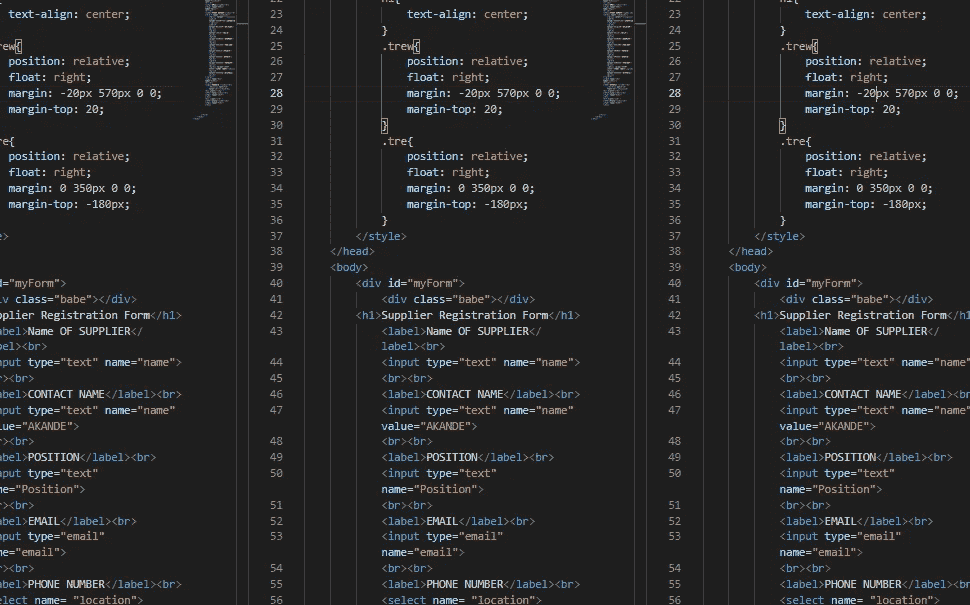

# Web 开发入门

> 原文：<https://javascript.plainenglish.io/introduction-to-web-development-81c7d3696f94?source=collection_archive---------4----------------------->

## 什么是 Web 开发？Web 开发仅仅意味着**编写标记**和**编码。**指建设网站的非设计方面。

本文解释了**网页、网页开发、**的含义，并对**网页设计有所涉及。它还强调了作为一个初学者，要有一个良好的开端，让你的职业生涯朝着正确的方向发展，所需要的技能、资格和一些工具。以下是我将触及的内容列表，以使文章易于探究:**

## **目录**

*   什么是 **Web 和 Web 开发**？
*   **Web 开发简史。**
*   成为认证的**网络开发人员所需的技能。**
*   成为一名**网络开发者需要的资格**。
*   **Web 开发的要求。**

## **网**

***网*** 只是许多人对**万维网** **网** (WWW)的俗称，是**互联网**的一部分，由可以通过**网络浏览器访问的页面组成。人们通常认为网络和互联网是一样的，但事实并非如此。然而，**互联网**是各种服务器的全球网络，使得通过互联网共享数据(信息)成为可能。**

互联网被用于很多事情，例如电子邮件、在线聊天、文件传输和其他万维网文档。它是全球最大的**计算机通信网络。**

## **网页开发**

Web 开发仅仅意味着**编写标记**和**编码。**指建设网站的非设计方面。它是为互联网(www)或内部网(专用网络)创建网站的工作。

基础 web 开发所需的 web 工具知识包括 HTML、CSS、JavaScript 等等。这些工具是职业生涯建设初学者所需要的。这些知识是将 web 开发人员分为三个主要类别的标准，这三个类别是

**前端开发人员**:负责行为和视觉。

**后端开发者**:处理服务器。

**全栈开发者**:以上两类的结合。

这些分类是基于一定的网络语言知识。

**网络发展简史**

网络是由英国科学家蒂姆·伯纳斯·李于 1989 年在欧洲粒子物理研究所工作时开发的，当时只是一个提议。Web 最初的构想和开发是为了满足世界各地大学和研究所的科学家之间自动化信息共享的需求。

他的第二个提案是在 1990 年，它概述了主要概念，并定义了网络背后的重要术语。该文件描述了一个名为“万维网”的“超文本项目”，在该项目中，“浏览器”可以浏览“超文本文件”的“网络”。

web 开发层次结构如下:

*   客户端编码。
*   服务器端编码。
*   数据库技术。

大多数 web 开发人员使用超文本标记语言(HTML)、层叠样式表(CSS)和 JavaScript(开发界面)以及 PHP、SQL、Node.js 和 RUBY(用于网站的服务器端)。

## **网页设计**

网页设计是指网页开发的设计方面。它处理互联网上网页的显示和外观。一名**网页设计师**负责网站的外观、布局，在某些情况下，还负责网站的内容。这可以通过一些基础语言的知识来完成，比如 CSS、JavaScript、jQuery 等等，这取决于设计者的专业领域。

## **成为网络开发人员所需的技能**

初学者应该明白，要使他/她的职业生涯和语言学习变得容易，需要很多技能。然而，成为一名**网页设计师**所需的技能不同于成为一名**网页开发人员**所需的技能；虽然在某些方面很相似。

以下是成为一名**网页设计师所需的技能:**

1.  想象
2.  创造力
3.  耐心
4.  注意细节
5.  分析技能
6.  沟通技巧
7.  技能
8.  出色的 IT 技能
9.  **SEO** 知识
10.  使用 **Photoshop 和 Indesign** 等程序的经验

而成为一名**网络开发人员**所需的条件是:

1.  计算机文化
2.  强大的数字技能
3.  创新能力强
4.  很强的沟通技巧
5.  注意细节
6.  出色的问题解决技巧
7.  合乎逻辑的工作方法
8.  能够清楚地解释技术问题
9.  对技术的浓厚兴趣

这两方面所需要的技能的相似性使得在两者之间切换变得容易，并且获得两种知识并成为两者。是的，两者都需要奉献和激情。

**成为一名网页开发者所需的资格**

成为一名网站开发人员所需的资格并不遥远。它们不同于技能，但非常重要，因为如果没有它们，你就无法实现你作为一名网站开发者的目标。它们列举如下:

*   用户体验(UX)
*   用户界面
*   视觉设计
*   编码语言包括 HTML 和 CSS
*   前端 web 编程语言，如 JavaScript、AJAX 和动画技术
*   C#或 Java、PHP、Ruby 等后端 web 编程语言，Photoshop、Sketch 等设计软件。
*   对 SEO 的理解
*   Web 服务器及其工作原理。

## **网络开发需求**

这些只是帮助学习和技能培养所需的工具。它们列举如下:

*   计算机系统
*   互联网来源
*   编写代码的编辑器

网络发展已经对许多人的生活产生了积极的影响，并且对当今世界具有重要意义。和互联网一起。希望你喜欢这篇关于如何用 Python 实现 Google 搜索算法的文章。请在下面的评论区提出你有价值的问题。

感谢阅读。

请随时在以下社交媒体上联系我:[推特](https://mobile.twitter.com/AkandeO08920463)、[脸书](https://www.facebook.com/akande.olalekan.1238)、 [Instagram](https://www.instagram.com/muh_toyyib_0/) 或 [WhatsApp](https://wa.me/message/BUW6NXAJ2A3HA1) 。

## 进一步阅读

 [## 代码文档被破坏了——但是我认为 Swimm 可能已经修复了它

### 传统的文档管理系统让软件开发人员失望了，是时候来点新的了。游泳吗…

javascript.plainenglish.io](/code-documentation-is-broken-but-i-think-swimm-may-have-fixed-it-daaa7547d834) 

*更多内容看* [***说白了。报名参加我们的***](https://plainenglish.io/) **[***免费周报***](http://newsletter.plainenglish.io/) *。关注我们关于* [***推特***](https://twitter.com/inPlainEngHQ) ，[***LinkedIn***](https://www.linkedin.com/company/inplainenglish/)*，*[***YouTube***](https://www.youtube.com/channel/UCtipWUghju290NWcn8jhyAw)*，以及* [***不和***](https://discord.gg/GtDtUAvyhW) ***。*****

***有兴趣规模化你的软件创业*** *？检查* [***电路***](https://circuit.ooo/?utm=publication-post-cta) *。*