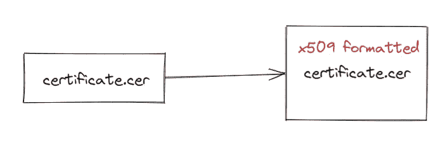

# Ionic 5 及以上版本:iOS 的 SSL Pinning

> 原文：<https://javascript.plainenglish.io/ionic-5-and-above-ssl-pinning-for-ios-b77f17d9e6a6?source=collection_archive---------2----------------------->

我花了点时间才想明白。事实上快两个月了。开始质疑我寻找这个问题的解决方案的理智，但我最终做到了！我能够理解如何使用 Ionic 框架为 iOS 进行 SSL 锁定。


Photo by [Sarah Le](https://unsplash.com/@sarahle?utm_source=medium&utm_medium=referral) on [Unsplash](https://unsplash.com?utm_source=medium&utm_medium=referral)

我写这篇文章，只是为了以防我自己需要回去，或者如果有一些不幸的灵魂在 StackOverflow/Google hole 的角落里寻找这个问题的解决方案。给你:

## 什么是 SSL pin？

如果你想知道更多关于什么是 SSL 固定，请通读下面的文章。

[](https://medium.com/flawless-app-stories/ssl-pinning-254fa8ca2109) [## SSL 固定

### SSL pinning 代表安全套接字层。SSL 证书通过建立一个安全的…

medium.com](https://medium.com/flawless-app-stories/ssl-pinning-254fa8ca2109) 

## **你需要知道什么(先决条件)？**

1.  在这里，使用 Ionic 开发移动应用程序至关重要。如果你不知道 Ionic，但对移动应用开发非常感兴趣，或者你是 Ionic 的新手，你可以查看以下页面:

[](https://www.ionicframework.com) [## 跨平台移动应用开发:Ionic 框架

### Ionic Framework 的应用程序开发平台构建了令人惊叹的跨平台移动、web 和桌面应用程序，只需一个…

www.ionicframework.com](https://www.ionicframework.com) 

2.你需要知道如何做 HTTPS 发布/获取请求。如果你对此不熟悉，对你来说这是一个陌生的概念，那么这篇文章就不适合你。

## **你需要什么？**

1.  一个准备实现 SSL 锁定的 Ionic 应用程序
2.  我用电容器构建了这个 Ionic 应用程序，但我认为这种方法与 Cordova 完全相同，因为这是使用 Cordova 插件
3.  您的服务器的 SSL 证书(确保您有一个带有 SSL 证书的 HTTPS 服务器准备就绪)
4.  确保你的 Ionic 应用上安装了这个插件(【https://ionicframework.com/docs/native/http】T4)
5.  Xcode(嗯，因为你知道，iOS)
6.  x509 格式的。cer 文件(下面将详细介绍)

## 如何生成 x509 格式的？cer 文件？



如果您将 certificate.cer 文件放在证书中，并且它工作正常，那么，*对您来说，*一切正常。

但有时，certificate.cer 文件不起作用，这就是它让您疯狂地寻找这个问题的解决方案的原因。

*你已经拥有了。cer 文件，那么它应该正常工作吧？？？？*

不→这花了我 2 个月才搞清楚 ok。

那么，如何解决这个问题，以及如何继续确保您收到的 certificate.cer 正常工作呢？

答案是确保您收到的 certificate.cer 文件是用 **x509 格式化的。**

如何判断是否有 x509 格式的 certificate.cer 文件？运行以下命令:

```
**openssl x509 -in certificate.cer -inform der -text -noout**
```

更多的时候会喷出一大堆台词。这可能是一件好事，但是，如果结果以类似于*‘无法加载证书…’*的内容开始

那么，您没有 x509 格式。cer 文件。重要的是，您需要运行以下命令来生成 x509 格式的。cer 文件:

```
openssl x509 -in certificate.cer -outform PEM -out cert.pemopenssl x509 -outform der -in cert.pem -out certificate.cer
```

一个接一个地运行这些命令，然后您可以使用前面的`openssl` 命令再次测试，以检查您的 certificate.cer 文件是否是 x509 格式的并且工作正常。

如果一切都好，那么你可以继续前进。

## 如何在您的 Ionic 应用程序中进行 SSL 锁定？

## 第一步

确保您在首次加载应用程序时激活了 SSL pin。在我的例子中，这是在构造函数内部的 app.component.ts 中完成的，如下所示:

当然，这不用说，你将需要安装 Cordova 高级 HTTP 的离子电容器。安装该插件的指南可从以下网址获得:

[](https://ionicframework.com/docs/native/http) [## HTTP 服务器插件文档:iOS 和 Android 的优势

### HTTP 是用于与 HTTP 服务器通信的 Cordova / Phonegap 插件。查看我们的文档以了解…

ionicframework.com](https://ionicframework.com/docs/native/http) 

## 第二步

运行以下命令:

```
ionic buildnpx cap add ios (run only once)npx cap copy iosnpx cap sync ios
```

这些命令将生成一个 ios 文件夹，其中包含您的 Ionic iOS 应用程序。现在您需要做的就是将 certificate.cer 文件(x509 格式的。cer 文件！记住这个！)放入以下文件夹:

```
ios/App/App/www/certificates/
```

我知道有些人可能会说，有一种更简单的方法可以做到这一点，那就是将证书文件放在 assets 文件夹中。我想真正确保证书确实在它的位置上，所以我通常自己手动将其放入。

## **第三步**

使用 Xcode 构建您的应用程序。你可以试着在一个模拟器上运行它，或者只是在一个连接到你的 Mac 的设备上试用它。

在构建应用程序之后，您应该能够检查您的 SSL 连接是否有效。我已经在模拟器和本地 iPhone 上进行了尝试，SSL 工作正常。就是这样！

## 结论

这是我的个人经验:我必须强调，我花了一段时间才想出这个问题。通过写下它，这对我来说更多的是一种治疗，除了提醒我如何解决这个问题，为我自己，也为你，在未来。

能够把一个问题打得落花流水，这种感觉真的很棒。一种满足感，我相信类似于在世界杯决赛中对巴西的进球。这就是移动应用开发者的生活。

谢谢你和 *Selamat Mengaturcara！*

*更多内容尽在*[*plain English . io*](http://plainenglish.io/)*。在这里注册我们的* [*免费周报*](http://newsletter.plainenglish.io/) *。*