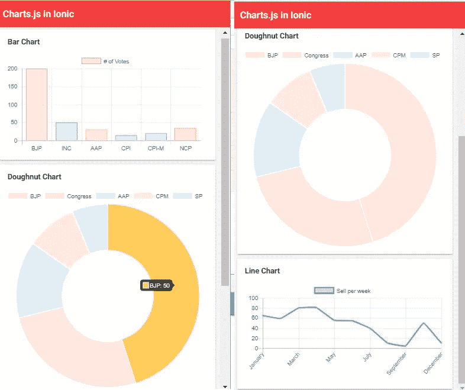

# 使用 Chart.js 库的 Ionic 5 图表和图形

> 原文：<https://javascript.plainenglish.io/ionic-5-charts-graphs-using-chartjs-library-5ce69b83b2a9?source=collection_archive---------0----------------------->


Photo by [Slidebean](https://unsplash.com/@slidebean?utm_source=medium&utm_medium=referral) on [Unsplash](https://unsplash.com?utm_source=medium&utm_medium=referral)

Chart.js 是一个开源的 JavaScript 库，简单明了，使用了基于 HTML5 的 JavaScript 图表。Chart.js 是一种在你的网站上免费添加动画、互动图表的简单方法。在本教程中，我们将在 Ionic (Angular)应用程序中添加 Chart.js 中的图表。

# 1.安装 Chart.js

我假设您已经创建了一个 Ionic 项目，您希望在其中设置图表——我们将通过一个示例来添加图表，这些图表可以添加到您喜欢的任何页面。

首先，我们将使用 npm 安装 **Chart.js** 库。只需运行以下命令:

```
**npm install chart.js --save**
```

现在我们可以在任何地方使用 Chat.js 在任何 page.ts 或任何 component.ts 中添加以下代码

在您的项目中导入如下内容:

```
**import { Chart } from 'chart.js';**
```

我们将学习创建**甜甜圈**、**条形**和**线形**图表，为了显示图表，我们需要一个画布元素。我们有 3 张卡片，每张卡片都有一个元素 canvas 元素，我们为每张画布添加一个像#barCanvas 这样的局部变量，以便在我们的 TypeScript 文件中获得对它的引用。

您的 typescript 文件应该具有以下代码:

# 2.设置模板

**Chart.js** 使用 HTML5 canvas 元素来显示图表，所以我们需要在模板中设置它。

您的模板(HTML)文件应该包含以下代码:

应用程序中的图表应该如下所示:



> 希望这有所帮助！
> 
> 再见👋👋
> 
> 欢迎在评论框中发表评论。
> 保持联系获取更多文章:
> [https://medium.com/@AnkitMaheshwariIn](https://medium.com/@AnkitMaheshwariIn)

如果你不介意给它一些掌声👏 👏既然有帮助，我会非常感谢:)帮助别人找到这篇文章，所以它可以帮助他们！

永远鼓掌…


# 阅读更多👇

[](https://ankitmaheshwariin.medium.com/javascript-interview-coding-questions-bfbdd4bd3f08) [## JavaScript 面试编码问题。

### 点这里知道为什么(0.1 + 0.2 === 0.3)不等于真。

ankitmaheshwariin.medium.com](https://ankitmaheshwariin.medium.com/javascript-interview-coding-questions-bfbdd4bd3f08) 

*更多内容请看*[*plain English . io*](http://plainenglish.io/)