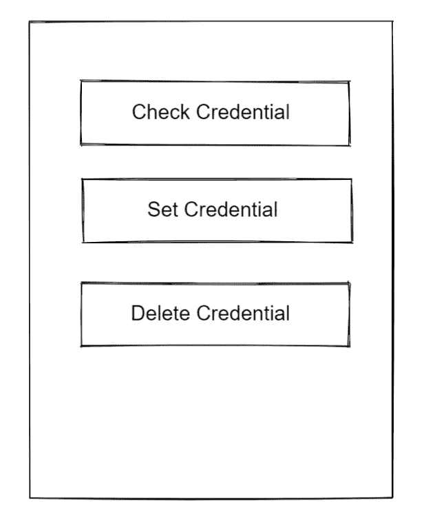

# 具有生物识别 ID 的离子角电容器

> 原文：<https://javascript.plainenglish.io/ionic-angular-capacitor-with-biometric-id-2d5666ce1410?source=collection_archive---------0----------------------->


Photo by [Franck](https://unsplash.com/@franckinjapan?utm_source=medium&utm_medium=referral) on [Unsplash](https://unsplash.com?utm_source=medium&utm_medium=referral)

使用 Capacitor native bridge(撰写本文时为 3.0)，创建使用生物识别 id 的移动 Android 或 iOS 应用程序真的很容易。电容器，Ionic(该公司)的一部分，有相当多的插件可供选择。插件列表如下:

[](https://capacitorjs.com/docs/plugins) [## capacitor:web 应用的跨平台本地运行时

### 电容器中的插件使 JavaScript 能够直接与本地 API 接口。官方插件官方插件是…

capacitorjs.com](https://capacitorjs.com/docs/plugins) 

在本文中，我想向您展示使用 Ionic Angular 和 Capacitor 创建一个具有生物识别 id 的 Android 应用程序是多么简单。

我正在使用的版本:

离子 CLI 6.17.0

*离子角版本 5.5.2*

## 0.设置离子

关于如何设置 Ionic 的更多信息，请访问以下网站:

[](https://www.ionicframework.com) [## 跨平台移动应用开发:Ionic 框架

### Ionic Framework 的应用程序开发平台构建了令人惊叹的跨平台移动、web 和桌面应用程序，只需一个…

www.ionicframework.com](https://www.ionicframework.com) 

## 1.安装电容原生生物识别插件

第一步是在你的 Ionic Angular 应用中安装插件。

```
npm i capacitor-native-biometric
```

这将安装电容原生生物插件，我们将在我们的应用程序中使用。一旦这样做了，就进入控制插件的下一步。

## 2.创建一些按钮并添加控件



home.page.html user interface

为了简单起见，我将在应用程序的 home.page.ts 和 home.page.ts 部分进行所有的构建。在这个例子中，我将使用用户名:用户名和密码:密码存储 www.example.com[网站](http://www.example.com)

这些凭证将存储在 iOS 设备自己的钥匙串或 Android 设备的密钥库中。

同样，只是为了强调这一点；这是一个示例，请根据您自己的用途修改代码。

建议的实现是使用服务，其中所有必要的流程都在服务中运行，并由各自的页面调用。这将大大简化您的应用程序，使其更容易调试和识别将来是否有任何错误。

所以，回到手头的任务。对于 home.page.html，我只想创建 3 个按钮，将执行 3 种不同的功能。这是我的 home.page.html 全集:

在上面的例子中，我创建了 3 个不同的按钮。以下是我的完整的 TypeScript 文件:

**以上代码的一些要点:**

1.  **在 HTML 的第 8 行和 TS 文件的第 32 行**

***检查凭证按钮和功能***

这将检查生物统计功能在设备上是否可用。例如，如果该设备没有任何生物特征读取器，例如 Face ID 或指纹读取器，那么很明显，用户不能使用该功能

**2。在 HTML 的第 10 行和 TS 文件的第 16 行**

***设置凭证按钮和功能***

这将为应用程序设置凭据。您可以使用函数*native biometric . set credential({…})*在上述设备自己的 Keychain(对于 iOS)或 Keystore(对于 Android)中设置和存储用户凭证。对于这个示例应用程序，同样，为了简单起见，我编写了通过按下按钮来设置它。

3.在 HTML 的第 12 行和 TS 文件的第 25 行

***删除凭证按钮和功能***

这将清除设备的钥匙串/密钥库中与您之前传递的服务器名称相关的任何凭据。

## 3.将您的代码转换成 Android APK 进行测试

不确定这是否适用于仿真设备。但是根据我的经验，您可能需要在实际设备上测试它，看看这种方法是否有效。

考虑到这一点，下一步是将 Ionic Angular 项目构建成一个 Android 项目。有一些关于如何做到这一点的指南，但这里是如何实现这一点的一步一步:

A.`ionic build`

B. `npm install @capacitor/android`

C.`npx cap add android`

D.`npx cap copy android`

E.`npx cap sync android`

F.`npx cap open android`

这将打开您的 Android Studio，您应该可以使用它来构建您的 Android 应用程序。

## 4.尝试一下

好的，根据您的设备，您现在可以通过以下方式使用生物识别登录:

A.通过按下设置凭证按钮来设置凭证

B.按下检查凭证按钮，检查凭证

C.通过按下删除凭证按钮来删除凭证

就是这样。使用离子电容插件非常简单，而且这个库还在不断增长。虽然 Cordova 插件仍然可以在任何 Ionic 应用程序上使用，但我强烈推荐使用 Ionic Capacitor 插件，因为它比 Cordova 插件感觉更接近本机，而且如果与 Cordova 版本相比，它很容易实现。

如果你有任何疑问，一定要看看并在 Twitter 上回复我。

*塞拉马特·孟加图拉*

*更多内容请看*[***plain English . io***](http://plainenglish.io/)