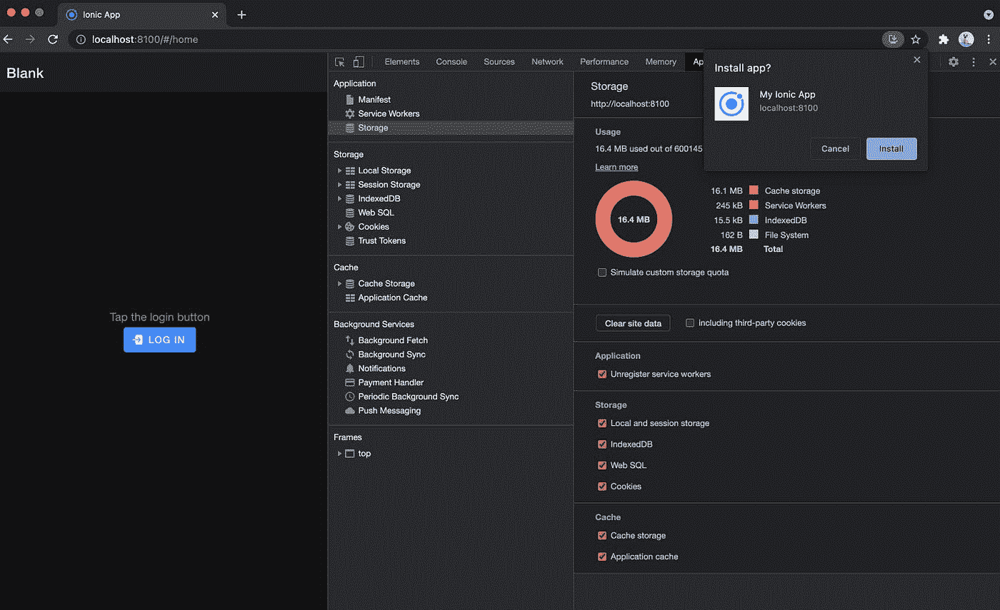
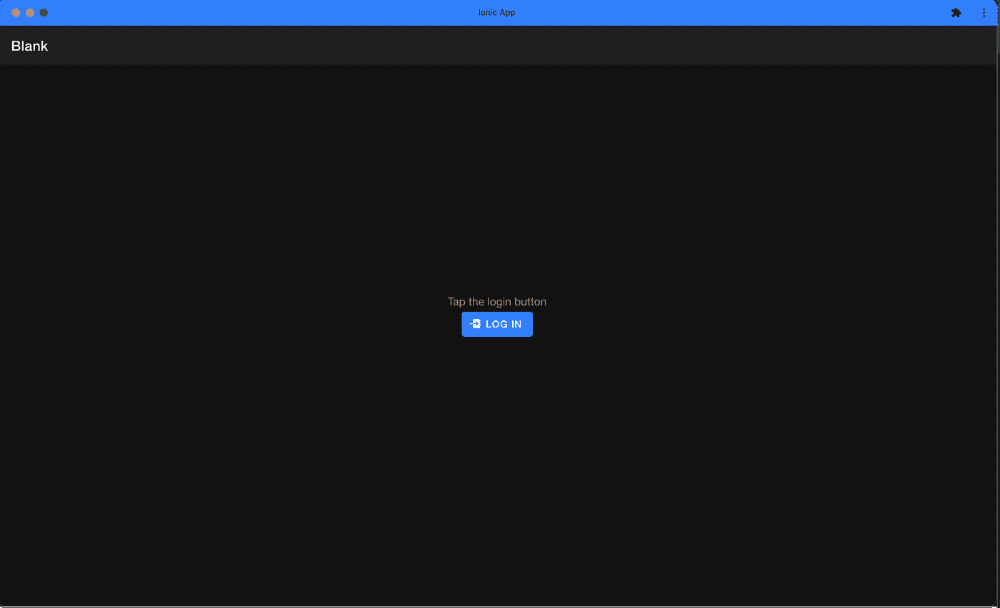
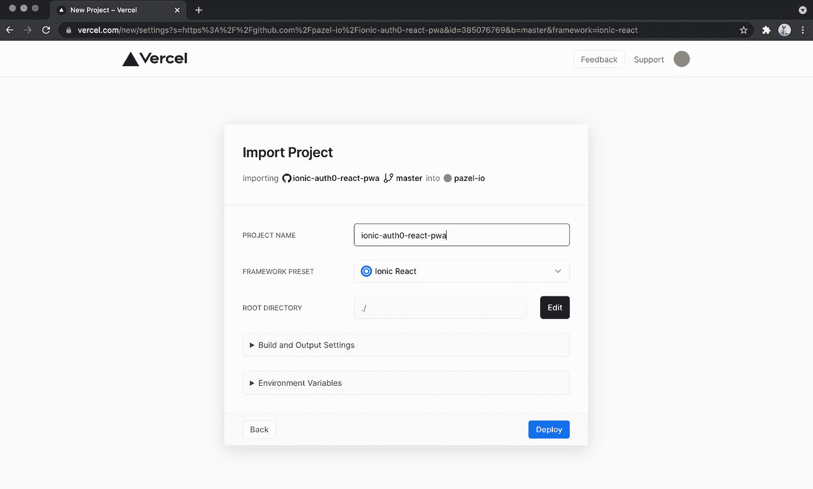

# 如何集成 Ionic 和 React 与 Auth0 Login 来构建 Web 和移动的 PWA

> 原文：<https://javascript.plainenglish.io/ionic-react-pwa-with-auth0-login-for-web-and-mobile-no-plugin-required-d627f52d8e97?source=collection_archive---------14----------------------->


本文构建了一个 Ionic [PWA](https://web.dev/progressive-web-apps/) 应用程序，它使用 Auth0 进行身份验证。

我们将一步一步地介绍如何做到这一点。

这里是[最终演示](https://ionic-auth0-react-pwa-deploy.vercel.app/#/home)。

Git 回购:[github.com/pazel-io/ionic-auth0-react-pwa](https://github.com/pazel-io/ionic-auth0-react-pwa)

本文最初发表于 [pazel.dev](https://pazel.dev/ionic-react-pwa-with-auth0-login-for-web-and-mobile-no-plugin-required)

# 正在配置 Auth0

首先，让我们为您设置 Auth0。请前往 auth0.com[注册一个免费账户。注册后，您可以登录您的帐户。您将登陆 Auth0 仪表板。从左侧菜单中，选择应用程序页面，然后单击“创建应用程序”按钮。](https://auth0.com/)

单击显示新的单页 web 应用程序的选项，选择一个名称，然后单击创建(pwa 是行为类似于本机应用程序的 Web 应用程序)。


选择您的前端使用的技术，或者使用纯 JavaScript 版本。我会在这里作出反应。这个选择有助于 Auth0 提供相关的例子和代码片段。


选择前端技术后，您会看到一个快速入门指南，引导您将 Auth0 集成到 web 应用程序中。在此之前，让我们使用 Ionic CLI 创建我们的 Ionic 应用程序。这个应用程序的代码差不多就是我将在 Ionic PWA 集成中使用的代码。

如果您之前没有安装 Ionic CLI，请前往[ionicframework.com/docs/intro/cli](https://ionicframework.com/docs/intro/cli)并按照说明安装 CLI。

接下来，让我们通过运行`ionic start ionic-auth0-pwa`使用 CLI 创建一个应用程序。CLI 应提示您选择前端技术和更多选项。


我将使用 React 和空白启动项目。选择选项后，CLI 将下载所有必需的 npm 软件包。(这可能需要几分钟)

Ionic CLI 询问您在 npm 软件包安装后是否需要一个免费的 Ionic 帐户。这不是本教程所必需的。您最终会看到一些日志，表明设置已经完成。


让我们`cd`到我们刚刚创建的新项目，并运行`ionic serve`。这将运行本地 web 服务器，并在您的默认浏览器中打开应用程序。(默认端口为 8100)


现在，我们可以基于示例添加 Auth 服务。我将按照 Auth0 React 示例中的说明添加 Auth0 登录。

第一步将 Auth0 React 包添加到我的 Ionic app 中。

```
npm install @auth0/auth0-react
```

接下来打开`index.tsx`并将`<App>`组件像这样包裹在`Auth0Provider`中。

```
import React from 'react';
import ReactDOM from 'react-dom';
import App from './App';
import { Auth0Provider } from '@auth0/auth0-react';ReactDOM.render(
    <React.StrictMode>
        <Auth0Provider
            domain="REPLACE_WITH_YOUR_DOMAIN"
            clientId="REPLACE_WITH_YOUR_CLIENT_ID"
            redirectUri={window.location.origin}
        >
            <App/>
        </Auth0Provider>
    </React.StrictMode>,
    document.getElementById('root')
);
```

ClientId 和 Domain 的值是根据您的应用程序填充的。您也可以在应用程序的设置部分找到它们。


接下来，我们为登录和注销创建两个组件。

```
import React from "react";
import { useAuth0 } from "@auth0/auth0-react";
import { IonButton, IonIcon } from "@ionic/react";
import { logIn } from "ionicons/icons";const LoginButton = () => {
    const { loginWithRedirect, loginWithPopup } = useAuth0(); return <IonButton onClick={() => loginWithPopup()}>
        <IonIcon slot="start" icon={logIn} />
        Log In
    </IonButton>;
};export default LoginButton;
```

Auth0 示例中的登录组件使用重定向方法，将您的应用程序留给 Auth0 网站，进行登录并使用 Auth token 返回到您的应用程序。loginWithPopup 还有另一个方法，我将在本例中使用它。loginWithPopup 不会离开你的应用程序，并使认证流程更简单。

这是我们的 LogoutButton 组件。

```
import React from "react";
import { useAuth0 } from "@auth0/auth0-react";
import { IonButton, IonIcon } from "@ionic/react";
import { logOut } from "ionicons/icons";const LogoutButton = () => {
    const { logout } = useAuth0(); return (
        <IonButton onClick={() => logout({ returnTo: window.location.origin })}>
            <IonIcon slot="start" icon={logOut} />
            Log Out
        </IonButton>
    );
};export default LogoutButton;
```

让我们利用新创建的组件。我将用下面的代码替换`ExploreContainer.tsx`的内容，它是我们 Ionic app 的默认主页。

```
import './ExploreContainer.css';
import LoginButton from "./LoginButton";
import LogoutButton from "./LogoutButton";
import { useAuth0 } from "@auth0/auth0-react";interface ContainerProps {
}const ExploreContainer: React.FC<ContainerProps> = () => {
    const {isAuthenticated} = useAuth0();
    if (isAuthenticated) {
        return (
            <div className="container">
                <LogoutButton/>
            </div>
        );
    }
    return (
        <div className="container">
            <LoginButton/>
        </div>
    );};export default ExploreContainer;
```

这是为了检查`isAuthenticated`标志并决定显示`LoginButton`或`LogoutButton`。结果应该是这样的。


# 测试登录

单击登录按钮应该会打开一个弹出窗口并显示登录表单。如果您看到的不是登录表单，而是一条消息:“哎呀！出事了”。您可能错过了为您的 Auth0 应用程序设置回调 URL 的步骤。


为此，请转到你的应用设置。向下滚动到“允许的回拨 URL”部分，并在那里输入您的应用程序 URL。我们需要为“允许的回调 URL”、“允许的 Web 源”和“允许的注销 URL”添加`http://localhost:8100`。

如果您现在单击登录，您应该会看到这个屏幕。


你可以用用户名/密码注册并登录，或者使用谷歌账户登录。提供的登录选项基于您在 Auth0 中添加应用程序时的默认设置。很明显，你可以通过 Auth0 来改变这些，以添加其他社交登录，如脸书、苹果或启用多因素认证。

# 添加用户配置文件以显示用户信息

现在我们有了登录和注销，让我们添加一个 UserProfile 组件来显示一些用户详细信息。

```
import React from "react";
import { useAuth0 } from "@auth0/auth0-react";const UserProfile = () => {
    const {user, isAuthenticated, isLoading} = useAuth0(); if (isLoading) {
        return <div>Loading ...</div>;
    } if (isAuthenticated) {
        return <div>
            
            <h2>Hello, {user?.name}</h2>
        </div>
    }
    return <p>Tap the login button</p>
};export default UserProfile;
```

我将在`ExploreContainer`中使用新的`UserProfile`组件。新更新的代码是:

```
import './ExploreContainer.css';
import LoginButton from "./LoginButton";
import LogoutButton from "./LogoutButton";
import UserProfile from "./UserProfile";
import { useAuth0 } from "@auth0/auth0-react";interface ContainerProps {
}const ExploreContainer: React.FC<ContainerProps> = () => {
    const {isAuthenticated} = useAuth0();
    if (isAuthenticated) {
        return (
            <div className="container">
                <UserProfile/>
                <LogoutButton/>
            </div>
        );
    }
    return (
        <div className="container">
            <UserProfile/>
            <LoginButton/>
        </div>
    );};export default ExploreContainer;
```

现在，在你登录后，你应该会看到你的名字，头像和一个注销按钮。


# 做一个 PWA

我们快到了。我们需要做的就是让这个 Ionic app 成为 PWA。这很容易。打开你的`index.tsx`文件，在第 24 行找到`serviceWorkerRegistration.unregister();`，把它改成`serviceWorkerRegistration.register();`

为了确保我们的 PWA 准备就绪，我们需要构建应用程序并使用 Lighthouse 进行测试。运行`ionic build`构建应用程序。这将创建一个包含所有构建文件的构建目录，包括 PWA 的服务工作器和清单文件。

服务人员要求应用程序托管在安全的环境中。为了服务于构建，我们使用本地节点服务器。运行`npm i serve -g`安装[npmjs.com/package/serve](https://www.npmjs.com/package/serve)。

接下来，我们可以运行`serve build`命令。这在`http://localhost:5000`上运行应用程序，幸运的是，本地主机被认为是安全的，你现在不需要 HTTPS origin 来测试我们的 PWA。


在 chrome 中打开一个隐身窗口，打开`http://localhost:5000`。你会注意到另一个问题。当您刷新页面时，应用程序将不会加载。这是因为`serve`试图找到`localhost:5000/home`并期望一个包含`index.html`文件的`home`文件夹，而这个文件并不存在。有多种方法可以解决这个问题。对于本教程，我将使用散列路由。

你所需要做的就是转到你的`App.tsx`文件，用`IonReactHashRouter`替换`IonReactRouter`。现在页面 URL 将看起来像这样`localhost:5000/#/home`，并且您可以毫无问题地刷新。

解决路由问题后，打开`http://localhost:5000`。然后，打开 Chrome Devtools，打开 Lighthouse 选项卡，为 Progressive web app 生成一个报告。这是我的测试结果，显示 PWA 应用程序有几个问题需要解决。


问题是:

*   没有提供某些图标大小。
*   没有苹果触摸图标。
*   meta 标记中没有指定主题颜色。

为了解决第一个问题，我们需要在`manifest.json`文件中提供所有尺寸的图标。该文件位于项目的`public`文件夹中。我将使用在线 PWA 清单&图标生成器(【simicart.com/manifest-generator.html】T21

只需在此处指定您的应用程序图标(最小 512px x 512px)和名称。然后单击生成清单下载一个 zip 文件。它应该包含我们需要的所有图标。我将在资产文件夹中使用 Ionic 提供的默认图标。您的 zip 文件内容应该如下所示:


继续将所有图标复制到您的项目的`public -> assets -> icon`文件夹下。

您的新 manifest.json 将包括这些图标，它应该是这样的:

```
{
  "short_name": "Ionic App",
  "name": "My Ionic App",
  "icons": [
    {
      "src": "assets/icon/icon-192x192.png",
      "sizes": "192x192",
      "type": "image/png",
      "purpose": "maskable any"
    },
    {
      "src": "assets/icon/icon-256x256.png",
      "sizes": "256x256",
      "type": "image/png",
      "purpose": "maskable any"
    },
    {
      "src": "assets/icon/icon-384x384.png",
      "sizes": "384x384",
      "type": "image/png",
      "purpose": "maskable any"
    },
    {
      "src": "assets/icon/icon-512x512.png",
      "sizes": "512x512",
      "type": "image/png",
      "purpose": "maskable any"
    }
  ],
  "start_url": ".",
  "display": "standalone",
  "theme_color": "#ffffff",
  "background_color": "#ffffff"
}
```

这是对第一个问题的修正。

将以下代码添加到您的`index.html`的`head`标签中，以解决第二个和第三个问题。

```
<link rel="apple-touch-icon" href="%PUBLIC_URL%/assets/icon/icon-192x192.png"><meta name="theme-color" content="#ffffff"/>
```

我们都准备好了。让我们再次构建和测试 PWA 应用程序。运行`ionic build`，然后运行`serve build`。打开 Chrome 隐姓埋名窗口，用 Lighthouse 测试。

您应该看到这样的结果，表明您的 PWA 已经准备好并可以安装了。


如果你想测试安装，你可以在一个正常的窗口打开你的应用程序(不是匿名的)，你应该可以在 Chrome 地址栏看到安装按钮。



如果您尝试登录该应用程序的已安装版本，您会注意到您会得到与之前相同的错误，即“哎呀！出事了”。这是因为原点改为`localhost:5000`。运行服务器时，可以将新的源添加到 Auth0 设置或指定端口。`serve build -p 8100`

该应用程序在桌面上安装后如何工作的一些截图。



恭喜你。！🥳 🎉 👏 🥂

现在你有了一个可以使用 Auth0 登录的实用 PWA 应用程序！

你可以在手机上使用它，并将其安装为 PWA 应用程序。

你可以从 Github 下载我在这个博客中构建的代码(项目)。

[github.com/pazel-io/ionic-auth0-react-pwa](https://github.com/pazel-io/ionic-auth0-react-pwa)

# 加分—使用 Vercel 在不到 5 分钟内部署您的新应用

为了在手机上测试我们的 PWA，如果我们部署应用程序，通过 HTTPS 上的 URL 轻松访问它，会更容易。为此我将使用 [Vercel](https://vercel.com/) 。Vercel 是一个零配置的云 CI/CD，它可以理解我们的 Ionic 项目的结构，并开箱即用地进行部署。

为此，请前往[vercel.com](https://vercel.com/)注册一个免费账户。

登录，您可以选择从您的 Git repo 导入一个项目。如前所述，我正在使用 Github。所以我将从我的 Github 导入项目。


Vercel 已经知道您的项目是 Ionic React，并且知道运行什么命令来构建它。只需点击部署即可。这将运行构建并为您提供一个 URL，您的项目将在该 URL 上可用。



只需点击“访问”按钮即可访问您部署的应用程序。


请记住，您需要为允许的回拨 URL、允许的注销 URL 和允许的 Web 源添加新的源(Vercel 部署域)到 Auth0 设置，以便成功登录。你可以像这样添加新的。把`YOUR_APP_NAME`换成自己的 Vercel app。

```
http://localhost:8100, [https://{YOUR_APP_NAME}.vercel.app](/{YOUR_APP_NAME}.vercel.app)
```

现在我可以在电话上测试了。


继续，打开应用程序的安装版本并尝试登录。


本教程到此为止。只要你在浏览器中运行它或者把它安装成 PWA，这个实现对 Web 和移动设备来说已经足够好了。

在我的下一篇文章中，我将把 Ionic & Capacitor 与 Auth0 集成为一个原生应用。

感谢阅读。如果你有任何问题，我是有空的。在这里给我留言或者在 Twitter 上给我发消息。

Git 回购:[github.com/pazel-io/ionic-auth0-react-pwa](https://github.com/pazel-io/ionic-auth0-react-pwa)

演示:[ionic-auth0-react-pwa-deploy.vercel.app/#/h..](https://ionic-auth0-react-pwa-deploy.vercel.app/#/home)

推特:[_ 帕泽尔](https://twitter.com/_pazel)

*更多内容请看*[***plain English . io***](http://plainenglish.io/)