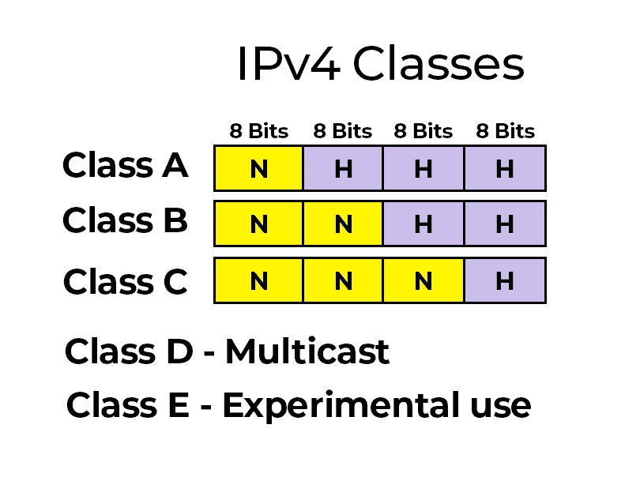

# IPv4 类简要指南

> 原文：<https://javascript.plainenglish.io/ipv4-classes-ff898ff531bb?source=collection_archive---------14----------------------->

**(互联网协议版本 4 类)**

*   有 5 个 IPv4 类。它们是 A 类、B 类、C 类、D 类和 e 类。
*   A 类、B 类和 C 类由互联网上的设备使用。但是 D 类和 E 类是有特殊用途的。

> A 类地址可用于拥有大量主机的网络。这里，1 个二进制八位数用于网络 ID，另外 3 个二进制八位数用于主机 ID。 **Ex : N.H.H.H**
> 
> B 类地址可用于主机数量中等的网络。这里，2 个二进制八位数用于网络 ID，另外 2 个二进制八位数用于主机 ID。 **Ex : N.N.H.H**
> 
> C 类地址可用于主机数量较少的网络。这里，3 个八位字节用于网络 ID，另外 1 个八位字节用于主机 ID。 **Ex : N.N.N.H**

*   每个班级之间都有一些不同。下面的列表显示了他们拥有的重要的东西。A 类、B 类和 C 类必须满足两个条件。

# ***A 级***

*   **条件 01:** 第一个八位字节的第一位应该是' **0** '(以二进制书写时)。
*   **条件 02:** 子网掩码应该是 255.0.0.0 / 8。

第一个八位位组 IP 值范围:从 0 到 127。

第一地址:0 . 0 . 0 . 0/**0**0000000.00000000.0000000.0000000

最后的地址:127 . 255 . 255 . 255/**0**11150 . 486868686616

网络数量:126

每个网络的主机数量:16 777 216

# B 类

*   **条件 01:** 第一个八位字节的前 2 位应该是' **10** '(二进制写的时候)。
*   **条件 02:** 子网掩码应该是 255.255.0.0 / 16。

第一个八位位组 IP 值范围:从 128 到 191。

第一个地址:128 . 0 . 0 . 0/**10**0000000.00000000.00000000

最后地址:191 . 255 . 255 . 255/**10**11153853515

网络数量:16 384

每个网络的主机数量:5 534

# C 类

*   **条件 01:** 第一个八位字节的前 3 位应该是' **110** '(二进制写的时候)。
*   **条件 02:** 子网掩码应该是 255.255.255.0 / 24。

第一个八位位组 IP 值范围:从 192 到 223。

第一个地址:192 . 0 . 0 . 0/**110**00000.00000000.00000000

最后地址:223 . 255 . 255 . 255/**110**12555 . 225565656516

网络数量:2 097 152

每个网络的主机数量:254

> 对于 D 类和 E 类，条件 01 就足够了。

# D 类

*   **条件 01:** 第一个八位字节的前 4 位应该是' **1110** '(以二进制书写时)。

第一个八位位组 IP 值范围:从 224 到 239

第一个地址:224 . 0 . 0 . 0/**1110**0000.00000000.0000000.0000000

最后的地址:239 . 255 . 255 . 255/**1110**11111 . 468686866616

网络数量:未定义

每个网络的主机数量:未定义

# E 类

*   **条件 01:** 第一个八位字节的前 4 位应该是' **1111** '(二进制写的时候)。

第一个八位位组 IP 值范围:从 240 到 255

第一个地址:240 . 0 . 0 . 0/**1111**0000.00000000.00000000

最后的地址:255 . 255 . 255 . 254/**1111**1111 . 158658656667

网络数量:未定义

每个网络的主机数量:未定义

*更多内容请看*[*plain English . io*](http://plainenglish.io/)