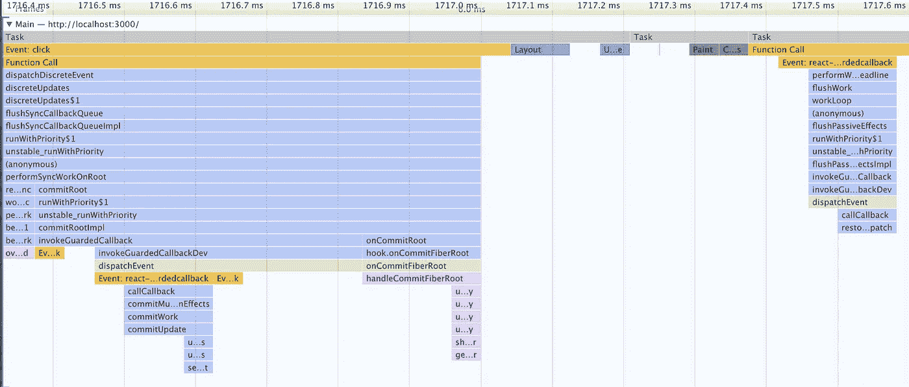

# 反应被动效果是人为事件吗？

> 原文：<https://javascript.plainenglish.io/is-a-react-passive-effect-an-artificial-event-2535977b9a91?source=collection_archive---------8----------------------->


Photo by [Florian Olivo](https://unsplash.com/@florianolv?utm_source=medium&utm_medium=referral) on [Unsplash](https://unsplash.com?utm_source=medium&utm_medium=referral)

React passive effect 与`useEffect`一起使用，它调用一个新的 JavaScript 任务，而回调中实现的所有东西仍然可以以同步方式运行。

在 React 完成渲染并提交之后。它收集光纤下的被动效应。

```
function enqueuePassiveEffectMount(fiber, effect) {
  passiveEffectsMount.push(effect)if (!rootDoesHavePassiveEffects) {
    rootDoesHavePassiveEffects = true
    scheduleCallback(() => { flushPassiveEffects() })
  }
}
```

但是它不会立即调用每一个，相反，它做事情的方式有点不同。

首先，它使用一个标志`rootDoesHavePassiveEffects`等待所有的效果被收集。它确保每次提交最多可以进行一次刷新。

其次，它使用一个调度器来调度刷新，类似于`setTimeout`(比那更复杂)，刷新被推迟到一个新的 JavaScript 任务。这通常被称为异步调用。



假设我们树立了一个榜样。

```
const Title = () => {
  useEffect(() => {
    setState(1)
  }
}
```

在上图中，有三个任务，标题在任务 1 中呈现，而`setState`在任务 3 中被调用。任务 2 是非常短暂的。但至少我们在这里非常清楚地看到了这种异步的本质。

## 什么是 JavaScript 任务？

任务是任何由标准机制安排运行的 JavaScript 代码。在左边的第一个任务中，我们完成了一次更新的*渲染*和*提交*。通常这就是我们需要知道的关于在 React 中运行 *JavaScript* 代码的全部内容。

但是，由于 *JavaScript* 是单线程引擎，在当前任务执行期间，可以有更多的工作添加到挂起队列中。一个典型的例子是`setTimeout`调用，它将回调添加到队列中，而不是在同一个任务中立即调用它们。API 调用(承诺)通常也属于这一类。这是这些回调被称为异步操作的主要原因。

没有规定每项任务需要多长时间。当一个任务完成时，它会在挂起队列中查找所有工作，然后逐个调用它们，在所有工作完成后，它会再次查看挂起队列。这个过程永远重复着。

## 调度是同步的还是异步的？

现在问题来了，调度呼叫，比如`setState`是同步还是异步呼叫？这不是一个简单的答案，因为要回答这个问题，我们必须有一个好的参考时间点。

我们确实知道，一个`useEffect`回调在一个新的 JavaScript 任务中被调用，假设这个任务叫做 Task 1。如果我们在内部调用`setState`，它将是同步代码，包括整个渲染和提交。

那么为什么我们有时会调用`state`更新的异步直到新的渲染？

```
 useEffect(() => {
    setState(1)
    // state value hasn't been changed yet
  }, [])
```

那是因为就在`setState`之后，这个值还没有改变。只有在*渲染*时，它才会被设置为新版本，但是调用`setState`异步操作不够准确(如果没有错的话)，因为所有的异步操作都是在同一个 *JavaScript* 任务中执行的。

> 我们在讨论中使用的是 React17 阻塞代码，而不是并发的 React18 代码。

## 人为事件？

这让我怀疑被动效应是否真的是一个人为事件。我听到 React 文档称它们为被动的“事件”，但并不真正知道“事件”来自哪里。

但是从调用回调的方式来看，当回调被调用时，它的行为实际上类似于`onClick`事件处理程序。

```
 const onClick = () => {
    setState(1)
    // state value hasn't been changed yet
  }
```

该事件通常在新的 JavaScript 任务中被调用，因为除了用户之外，没有人能控制它们何时发生。但是一旦它被处理，里面的代码就以同步的方式运行，包括前面解释的`setState`。

反应会带来几个效果，突变，布局以及被动。突变和布局效果都是作为同步操作来实现的，而被动的效果在新的 JavaScript 任务中被调用。它们被设计用来处理任何副作用。

```
 useEffect(() => {
    ...
  }, [a, b])
```

根据其实现，它只在依赖关系数组中的任何元素发生变化时被调用。在前一种情况下，`a`或`b`。所以这个回调依赖于状态变化，而不是用户事件。当然，状态变化通常也是由用户事件引起的。

## 摘要

事件是一个动作，状态是一个比动作更被动的值。但是，两者都可以作为物理事件来调用其他同步代码。如何处理回调的过程在 reactor 中非常相似。

*多内容于* [***中***](http://plainenglish.io/)