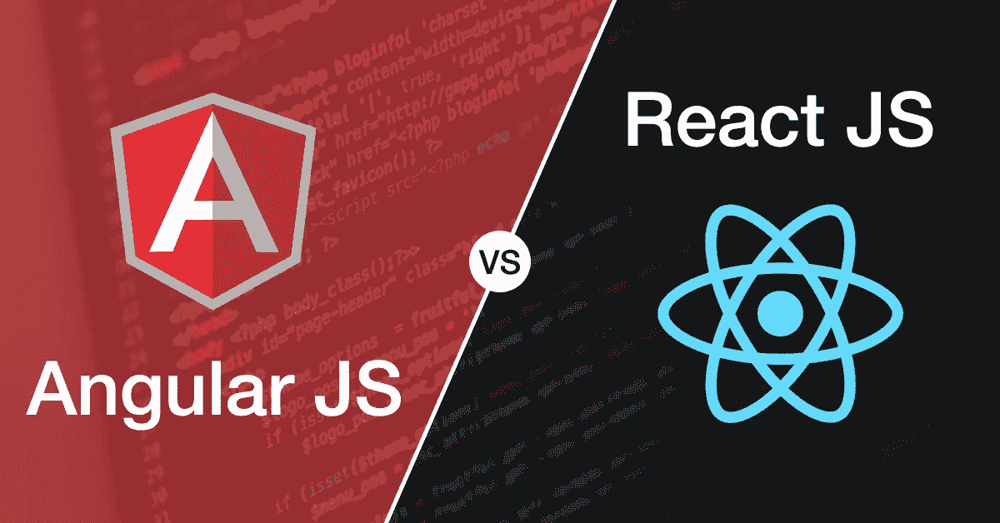
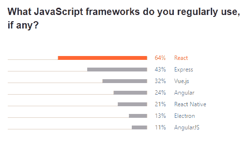
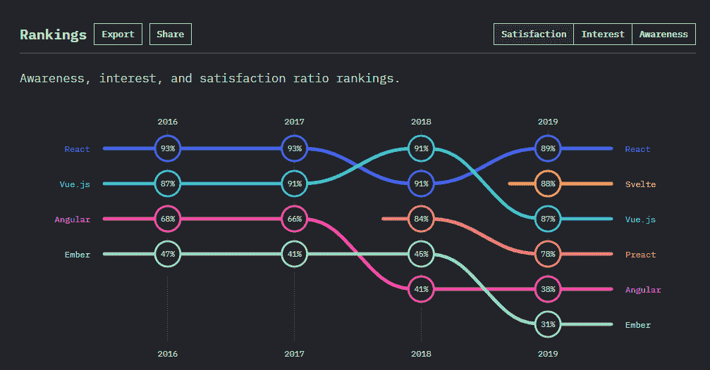
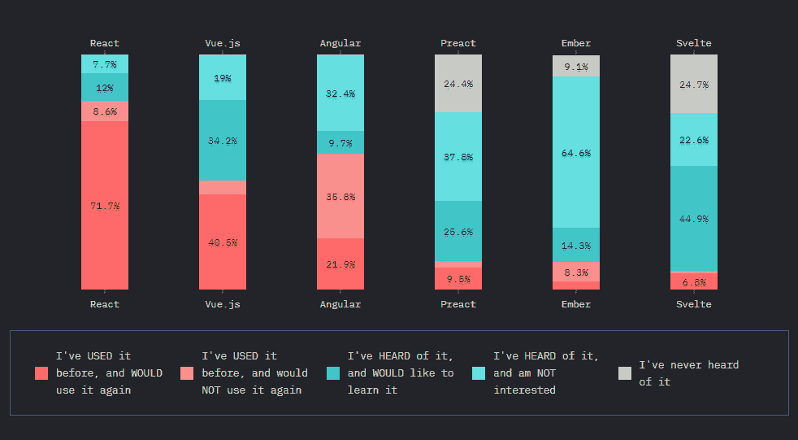
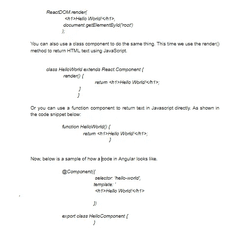

# Angular 比 React 好吗？

> 原文：<https://javascript.plainenglish.io/is-angular-better-than-react-7f3c60e90d39?source=collection_archive---------5----------------------->

## Angular vs React 用于 App 开发:哪个更好？

Image By: Author

对于创建 web 应用程序应该选择的技术类型，有很多选择。两个最流行的 JavaScript 框架包括 Angular 和 React。它们对于创建任何网站的前端都是必不可少的。随着时间的推移，这两种技术都会给彼此带来激烈的竞争。这是一件了不起的事情，但也可能在开发人员和供应商中引起许多困惑。很难选择一个而不是另一个，尤其是因为在这个问题上有很多争论。许多应用程序所有者质疑他们应该使用 React 应用程序开发还是 [**Angular 应用程序开发**](https://www.suntecindia.com/angularjs-development-services.html) 。

在本帖中，我们将澄清困惑，帮助你开始你的项目。在接下来的段落中，我们将提到各种因素，并尝试简化 JavaScript 框架的选择。我们在这里的目的不是定义哪一个是最好的，而是简单地传授知识。您可以在这里分析所有信息，并使用它来选择您喜欢的框架。我们将讨论这两种技术，它们的区别和优势。

这么有棱角还是有反应？让我们找出答案。

# **2021 年 Angular vs React:一些事实和数字**

在我们开始之前，让我们先来看一些对理解 2020 年市场至关重要的数字。它将帮助你了解其他开发者在开发他们的 [**web 应用**](https://www.suntecindia.com/web-application-development-services.html) 时选择了什么。你也可以跟随他们的分析，或者在收集所有信息后选择一个平台。

***据***[***Jetbrains***](https://www.jetbrains.com/lp/devecosystem-2020/javascript/)***，*** *64%的开发者定期使用 React，相比之下，2020 年这一比例为 11%。这使得 React 成为全球最受欢迎的 JavaScript 框架。*

Image Source: ([https://www.jetbrains.com/lp/devecosystem-2020/javascript/](https://www.jetbrains.com/lp/devecosystem-2020/javascript/))

**根据 2019****JavaScript 调查的** [**状态，** React 在过去四年里一直很受欢迎。自 2018 年以来，Angular 的认知度、兴趣度和满意率一直处于下降趋势。](https://2019.stateofjs.com/front-end-frameworks/)

Image Source: ([https://2019.stateofjs.com/front-end-frameworks/](https://2019.stateofjs.com/front-end-frameworks/))

**根据他们对******的研究，71.7%的开发者已经在使用 React，并将在未来继续这样做。相比之下，只有 21.9%的开发者会选择在未来再次使用 Angular。****

********

****Image Source: ([https://2019.stateofjs.com/front-end-frameworks/](https://2019.stateofjs.com/front-end-frameworks/))****

****在选择 JavaScript 框架时，您需要考虑很多因素。受欢迎程度只是一个参数。很多时候，最受欢迎的选择可能不符合项目需求、复杂性或截止日期。你需要保持开放的心态，选择最适合你的项目。****

****从统计数据来看，很明显 Angular 和 React 在可用性、受欢迎程度和可重用性方面都名列前茅。让我们更深入地了解两者之间的差异，并决定一个最适合您的 web 应用程序开发的框架。****

## ******性能和速度哪个更好？******

****这是在 React 和 Angular 之间确定更好的框架的关键因素。为了理解 web 开发技术的性能和速度，您需要学习一些新概念。****

****其中之一是 DOM 或文档对象模型。Angular 使用直接 DOM 渲染，React 使用虚拟 DOM，即真实 DOM 的副本。这意味着每次我们做任何改变，Angular 都会一次次渲染真实的 DOM。然而，虚拟 DOM 保存所有的更改，并且仅当更改完成时才呈现真实的 DOM。这将花费更少的时间并提高框架的性能****

****在这两种情况下，DOM 的工作方式成为决定哪种框架执行起来更好的决定性因素。因为 React 在最后一次修改完成时渲染 DOM 一次，所以在性能和速度上更好。而 Angular 在每次有变化时都会呈现 DOM。这使得 React 的性能比 Angular 好数倍。****

## ******是反应过激固执己见？******

****React 和 Angular 都有创建定制 HTML 元素的编写组件。下面是在 React 中打印“Hello World”的示例代码。我们在这里使用 ReactDOM，一种将 DOM 元素呈现到程序中的方法。****

********

****Image By: Author****

****它使用 TypeScript 装饰器将类返回到组件中。这将该类链接到一个 HTML 模板，并输出句子“Hello World！”。这里我们看到了反应和角度之间的区别。虽然 React 提供了多种方法来做同样的事情，Angular 只提供了一种。**这使得 Angular 固执己见，**因为它有严格的准则和模式可循，而 **React 则不然。******

****React 对许多风格和语法都是开放的，而 Angular 需要严格的规则和指导方针。因此，Angular 比 React 更固执己见，这允许开发团队在做什么上有很多选择。****

## ******项目复杂程度******

****React 是一个很小的库，可以作为小代码片段添加到他们的网页中。这使得它非常适合在现有应用程序中包含更多功能或创建单页 web 应用程序。不需要担心添加和构建任何 JavaScript 代码。只需将代码添加到您的页面，React 就会启动并运行。****

****Angular 更像是一个完整的框架，有很多自己的特性。你需要下载几百兆的代码才能开始。这就是 Angular 更适合更复杂的应用程序，并且对于一个简单的单页解决方案来说是压倒性的原因。****

****Angular 更适合需要强大解决方案的企业解决方案。然而，React 将非常适合初创企业和概念应用程序，开发者可能会更自由地表达自己。当然，也有例外，初创企业开始教授 Angular，高端机构教授 React to their employees。****

## ******学哪个比较好？******

****如果你是一个开发人员，你可以清楚地了解两个框架的编码的区别。React 是一个简单的框架，没有过于复杂的特性。如果你已经熟悉了 JavaScript，这就很容易理解了。****

****Angular 有一个巨大的图书馆。你可能需要训练和实践来理解所有的概念并完美地实现它们。尽管 Typescript 与 JavaScript 非常相似，但是学习所有的概念仍然需要时间。框架也有很多更新，需要开发者额外的努力。****

****与反应相比，角度更难理解。作为框架核心的一部分，它具有更复杂的特性。这意味着开发人员需要学习每个概念，如果他们将来要使用它的话。****

## ******测试******

****对于开发 web 应用程序的开发人员来说，测试是痛苦的。但 Angular 却不是这样。它带有一个内置的测试功能，可以与 Jasmine 和 Karma 等其他测试工具顺利配合。你可能会对这些新术语感到疑惑。Jasmine 是 JavaScript 的开源测试框架。Karma 是 Angular 团队自己设计的测试跑者。****

****在 React 中，我们通过各种工具进行测试，如 Jest、Enzyme 和 skin-deep testing。开发人员可以自由选择自己的方法和工具来测试 React 应用程序。如今，Jest+酶是最流行的反应测试方法。****

****与测试，反应和角度是相同的。****

# ******那么有棱角比有反应好吗？******

****这里没有正确的答案。Angular 是一个完整的框架，而 React 只用于 UI 开发。但是，在其他库的帮助下，您可以轻松地将 React 升级为成熟的解决方案。React 似乎更容易理解，但是它要求您学习额外的 JavaScript 框架和工具。Angular 比较复杂，需要特殊训练才能掌握。它是一个强大的工具，对于创建完整的 web 解决方案非常有用。一旦你学会了，你就会成功。****

****事实是没有更好的框架。两者都在不断更新以跟上竞争对手。当你看到一方获胜时，另一方会创造一些独特的东西来扳平比分。有多个例子可以支持这一点。最终，最重要的是个人偏好。您可以选择 Angular 或 React，因为两者各有优缺点。你可以作为一个初学者开始使用 React，当你完全理解这项技术的工作原理时，你可以选择 Angular。****

****可以借助专业人士进行 Angular 或者 [**React app 开发**](https://www.suntecindia.com/reactjs-development-services.html) 。这将帮助你节省大量的精力、时间和金钱。这篇文章包含了为你的项目决定一个 JavaScript 框架的所有信息。相应地进行规划，并选择最适合您的业务需求的开发技术。****

# ****另请参阅:****

> ****[**如何创建一个交友 App？(特性、成本、时间等等)**](https://www.suntecindia.com/blog/how-to-create-a-dating-app/)****
> 
> ****[**如何将 iOS 应用转换为 Android 应用？(步骤、成本和挑战)**](https://medium.com/dev-genius/how-to-convert-ios-app-to-android-app-steps-cost-and-challenges-a064ebc0e636)****
> 
> ****[***开发消息应用前需要考虑的 6 件事***](https://medium.com/javascript-in-plain-english/6-things-to-consider-before-developing-a-messaging-app-11c3a8bd16f6)****
> 
> ****[***2021 年打造自己的优步 App:综合指南***](https://www.suntecindia.com/blog/how-to-make-an-app-like-uber/)****
> 
> ****[***开发一个送餐应用程序(它的特性、成本和功能)***](https://medium.com/flutter-community/develop-a-food-delivery-application-its-features-cost-and-functionality-454b228b8111)****
> 
> ****[***给货车司机开发一个 App 要多少钱***](https://medium.com/flutter-community/how-much-does-it-cost-to-develop-an-app-for-truckers-features-development-process-cost-etc-e61f609c2668)****