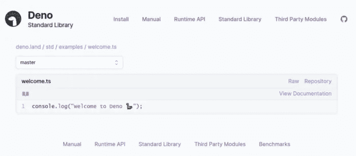

# Deno.js 值得 Node.js 竞争吗？

> 原文：<https://javascript.plainenglish.io/is-deno-js-worthy-competition-for-node-js-2d7c962a788f?source=collection_archive---------11----------------------->

## Deno.js Vs Node.js


就 Javascript 运行时环境而言，除了节点，别无其他。但 Deno 的创始人、Node.js 的前创始人决定改变这一点。现在 Deno 已经发布了，是时候看看它能否成为 Node.js 的有力竞争对手了。

Deno 项目始于 2018 年，当时 Node.js 背后的原始开发人员之一瑞安·达尔(Ryan Dahl)在一次名为“Node.js 我后悔的 10 件事”的演讲中宣布了 Deno 的开发。是的，这说明了一切。那么，问题是什么？我们为什么需要 Node 的替代产品？

# 什么是德诺？

Deno 是一个安全稳定的运行时环境，支持在 V8 引擎上运行的 JavaScript 和 TypeScript。这是用铁锈写的。Deno 的创建者打算充分利用 JavaScript 语言的所有最新特性。例如，它的 API 支持 Promise 对象，并使用 es 模块作为默认模块系统。它们还被设计成自给自足——不需要外部依赖。安全是 Deno 的主要设计重点。对光盘或联机的所有访问操作必须在脚本中明确发出。

# Deno vs Node.js


Deno 的创建者们非常希望为 Node.js 提供一个强大的替代品。因此，毫不奇怪，尽管他们有很多共同点，但这两者之间有一些主要的差异。

现在“Deno”基本上只是 Node.js 的变位词，事实上，正如我们在他们的官方页面下载中看到的那样，他们知道 Deno 是 JavaScript 和 Typescript 的安全运行时。如果我们看一看 nodejs.org，我们会发现它离我们在那里发现的并不太远。Node.js 是建立在 chrome 的 V8 JavaScript 引擎上的 JavaScript 运行时，事实上，现在，最终，它是由 Node 的发明者开发的新的 JavaScript 运行时。

让我们来看一个简单的并列比较:

**DENONODE** 使用 RUST 编写的 V8，然后使用 C++编写的 TypeScript 和在沙箱中运行的 JavaScript，访问受限——脚本中需要显式命令发布。访问问题仅限于运行脚本的用户的特定访问权限。分散模块——从 URL 加载。NPM ES 模块 CommonJs、API 和标准库充分利用了 ES 和 Promise。API 和标准库是基于回调的。

# 我们来练习一下！

和任何技术一样，实践胜过理论。但在我们进入最精彩的部分之前，让我们先安装 Deno 平台，并快速浏览一下应用程序结构。


Photo by [Brad Barmore](https://unsplash.com/@bradbarmore?utm_source=medium&utm_medium=referral) on [Unsplash](https://unsplash.com?utm_source=medium&utm_medium=referral)

# 装置

你得到的只是一个没有任何额外依赖的可执行文件。你可以通过操作系统软件包管理器来完成。例如，对于自制软件，命令将是 *brew install deno* 。你也可以直接从官方的 Deno 库获得二进制文件。

[https://github.com/denoland/deno/releases](https://github.com/denoland/deno/releases)

# 应用程序结构

从一开始就非常突出的一点是，您可以直接用 TypeScript 编写应用程序。不需要自己编译成 JavaScript。此外，使用 Rust 编译 TypeScript 的方法目前也在规划阶段。

Deno 的创建者做出了一个大胆的决定，去掉了一个集中的包管理器，比如 npm 或 NuGet。相反，代码是直接从 URL 加载的。运行脚本后，会从指定位置下载包，然后进行缓存。

```
import { Application, Router } from “https://deno.land/x/denotrain@v0.5.0/mod.ts";
```

有趣的是，您可以在一个文件中使用给定库的不同版本。你需要做的就是导入它并添加别名。

```
import { Application as AppOld } from “https://deno.land/x/denotrain@v0.4.0/mod.ts";
```

# 简单的基于模块的应用和单元测试

让我们编写一个以数字为参数的简单脚本。然后，我们将使用一个模块将所有整数相加。结果将输出到控制台。

我们将使用内置工具为模块编写一个简单的测试。为了简化，我们可以将所有参数转换为整数。

让我们做三个文件。

*   *index.ts -* 应用程序的主脚本、
*   *mathService.ts -* 一个拥有将一个数乘以 2 的公共方法的类，
*   *mathService.test.ts -* 乘法类的测试。

```
export class MathService { 
  sum(numbers: number[]) { 
    return numbers.reduce((value, number) =>   Number.isInteger(number) ? value + number : value, 0) 
  }
}
```

Deno 有一个内置的测试运行器和现成的断言。你可以在这里看到他们:[https://deno.land/std/testing](https://deno.land/std/testing)

目前，没有关于创建存根的信息。

```
import { assertEquals } from "https://deno.land/std/testing/asserts.ts"; 
import { MathService } from './mathService.ts';Deno.test('MathService', () => { 
  // given 
  const sut = new MathService();// when 
  const result = sut.sum([1, 3, 5]);// then 
  assertEquals(result, 9); 
})
```

我们可以使用 *deno test* 命令直接从控制台启动测试。

```
$ deno testrunning 1 tests
test MathService ... ok (3ms)
test result: ok. 1 passed; 0 failed; 0 ignored; 0 measured; 0 filtered out (4ms)
```

剩下要做的就是写主脚本了。值得注意的是，Deno 让我们可以在所有脚本中直接访问 Deno 名称空间。

```
import { MathService } from './mathService.ts';const mathService = new MathService(); 
const numbers: number[] = [];Deno.args.forEach(number => numbers.push(parseInt(number, 10))); 

console.log(`Result: ${mathService.sum(numbers)}`);
```

要运行脚本，我们转到控制台并运行命令:

```
$ deno run index.ts 2 7 6
```

# 简单 API

简单的基于 shell 的脚本很难达到 Deno 的能力范围。自从 Deno 发布以来，开发者已经添加了越来越多的第三方库。即使(很像 Node 刚开始的情况)，其中一些还是很粗糙的。

现在让我们使用 denotrain 库的功能来创建一个简单的 API。这个库显然是受 Node 的 Express.js 的启发，所以代码可能看起来很熟悉。要运行一个基本的 API，我们只需要一个 I*index . ts*文件和 8 行代码。

```
import { Application, Router } from "https://deno.land/x/denotrain@v0.5.0/mod.ts";const app = new Application(); 
const routes = new Router();routes.get("/status",() => { 
  return 'ok'; 
});app.use("/api",routes);await app.run();
```

提到 Deno 支持顶级 Await(上面代码的最后一行)是一个很好的时机。如果这是正确的解决方案，那就另当别论了，但是对于这个简单的例子来说已经足够了。

我们现在可以使用下面的命令运行脚本(在此过程中授予网络访问权限):

```
$ deno run --allow-net index.tsServing on [http://0.0.0.0:3000/](http://0.0.0.0:3000/)
```

# 在教程中，我们在构建什么？


在本教程中，我们将开发 **Newzzer** :一个简单的 CLI 应用程序，使用 Deno 向我们展示最新的新闻。在此过程中，我们将学习和使用 Deno 的不同功能。
该应用程序将具有以下两个主要功能:-

1.  通过查询搜索新闻
2.  按类别搜索新闻

# 先决条件

1.  Deno
    你可以参考 https://deno.land/#installation 的下载说明。对于所有主要平台，安装都非常简单。您可以通过运行`*deno --version*` *来验证安装。*在撰写本文时，最新版本是 Deno v1.0.3。您也可以运行`deno --help`来查看其他命令。
2.  我们将使用 NewsAPI 的 API 服务来获取新闻。我们可以通过在[https://newsapi.org/account](https://newsapi.org/account)上创建一个账户来免费获得 API 密匙
3.  JavaScript/ TypeScript 的基础知识。
4.  Visual Studio 代码(可选，如果您喜欢智能感知和自动完成)

**注意:-** 我将在整篇文章中使用 TypeScript。如果您不习惯使用 TypeScript，可以移除类型并继续操作。

# 入门指南

让我们从官方的“欢迎”计划开始吧。在 Deno 中，我们可以直接从文件 URL 运行程序。在你的终端中运行`deno run https://deno.land/std/examples/welcome.ts`即可。


太棒了。你刚刚运行了你的第一个 Deno 程序。第一次运行该命令时，会下载、编译并运行该文件。下次运行相同的文件时，既不会下载也不会编译。这是因为 Deno 缓存了依赖项和编译后的文件。

如果我们想刷新缓存并强制它使用新版本呢？

`--reload`为了挽救这一局面，您可以使用该标志运行文件来重新加载源代码缓存。

我们去代码[网址](https://deno.land/std/examples/welcome.ts)偷偷看看文件里面是什么。



这是一个简单的`console.log`，但是这个页面的风格是什么？Deno 网站可以检测到流量来自 web 浏览器，并以一种风格化的方式呈现文件，但当从非浏览器环境访问时，它会返回原始文档。不相信我？让我们尝试使用`curl`下载文件并检查内容。


# 文件结构

```
newzzer
├── api.ts
├── deps.ts
├── error.ts
├── mod.ts
└── types.d.ts
```

我们将创建如上所述的 5 个文件，每个文件服务于一个特定的目的。

**mod.ts** :这是我们 app 的入口。根据著名 Deno 程序和标准库中的约定，主文件的名称通常是 mod.ts，但它可以被命名为任何名称。

**types.d.ts** :这个文件将存放我们的自定义接口定义。

**deps.ts** :该文件将存储我们从外部依赖项导入的所有内容，并将作为一个集中存储，从中导入所有依赖项。

**api.ts** :该文件包含与 NewsAPI 交互的逻辑。

**error.ts** :这个文件将包含我们应用程序中错误处理的逻辑。

如果您来自 NodeJS 后台，您会注意到没有`package.json`文件。

***德诺没有集中/官方包经理***

这是 Deno 有意的设计选择。Deno 使用 URL 导入外部模块，就像浏览器一样。因为没有官方的软件包管理器，任何人都可以在互联网上托管他们的模块，并可以从 URL 下载。

**注意:**如果你正在使用 VSCode，我建议你下载 [**vscode-deno**](https://marketplace.visualstudio.com/items?itemName=denoland.vscode-deno) 扩展来帮助自动完成、智能感知和格式化。

**类型定义**

首先，让我们在`types.d.ts`中定义我们的类型定义。我们将使用其网站上提供的示例作为参考，为 NewsAPI 响应创建类型定义。我们还将为配置文件创建一个接口，该接口将托管访问 NewsAPI 所需的`secret-key`。

```
// types.d.ts
export interface IArticle {  
source: Object;  
author: string;  
title: string;  
description: string;  
url: string;  
urlToImage: string;  
publishedAt: string;  
content: string;
}export interface IConfigFile {  
apiKey: string;
}
```

# 获取依赖关系

让我们再次明确我们的目标。该应用程序将:-

1.  允许我们在配置文件中设置我们的 NewsAPI api-key(使用`--config`标志)
2.  显示十大最新新闻
3.  应用类别过滤器(使用`--category`或`-c`标志)
4.  应用查询过滤器(使用`--query`或`-q`标志)
5.  显示帮助文本(使用`--help`或`-h`标志)

让我们先定义所有的外部依赖，并把它们去掉:-

1.  std/flags:帮助解析命令行参数
2.  std/fs:帮助执行文件操作
3.  STD/fmt:colored console . log(为我们的输出添加颜色)

正如你所看到的，所有的依赖项都在形式`std/*`中，这意味着它们是 Deno 标准模块。Deno 网站维护着`standard`库中所有模块的列表。您可以在此查看完整列表[。](https://deno.land/std/)


您还可以在此查看社区[创建的第三方模块列表。在本教程中，我将把自己限制在标准模块。](https://deno.land/x)

让我们导入`deps.ts`中的模块

```
// deps.ts
export { parse, Args } from "https://deno.land/std/flags/mod.ts";
export { readJsonSync } from "https://deno.land/std/fs/read_json.ts";
export { writeJsonSync } from "https://deno.land/std/fs/write_json.ts";
export { existsSync } from "https://deno.land/std/fs/exists.ts";
export {  
red,  
green,  
bold,  
cyan,  
yellow,  
magenta,
} from "https://deno.land/std/fmt/colors.ts";
```

**幕后**

Deno 使用 ECMAScript 模块(ESM)标准。如果你来自 NodeJS，你必须熟悉 CommonJS 模块系统。

```
// ESM
import abc from "abc";// CommonJS
const abc = require("abc");
```

当 NodeJS 建立时，没有浏览器模块的标准，NodeJS 决定采用 CommonJS 的方式。后来，ECMAScript 将 ESM 模块标准化为浏览器的模块系统。对 ESM 模块的支持现已内置于主要的现代网络浏览器中。关于 ES 模块的更多信息，请查看 flaviocope 的文章。

Deno 和 ECMAScript 为什么偏离了 CommonJS 的方式？嗯，它有问题——非常复杂的模块分辨率。我会尽力解释的。考虑一个节点内部的导入，js 为，`const abc = require("abc")`。
在解析依赖关系 abc 时，Node.js 必须检查:

*   `abc`是标准的 NodeJS 模块吗(类似 fs)
*   `abc`是外部 NodeJS 模块吗？(在 node_modules 中检查它)
*   `abc`是项目的文件吗？(检查项目中的文件/文件夹名称)
*   `abc`是指文件 abc.js 还是指文件`abc/index.js`？(请记住，您不必显式指定 index . js。NodeJS 会为您推断出来)

这些功能虽然有用，但却使模块解析成为一项复杂的任务。ESM 标准只允许绝对和相对 URL，从而降低了一些复杂性。

# 基本帮助消息

如果没有可通过`-h`或`--help`访问的帮助消息，或者当传递了一些无效配置时，每个 CLI 都是不完整的。让我们在`error.ts`中创建基本的帮助信息

```
//error.ts// Importing colors
import { red, bold, cyan } from "./deps.ts";// Shows help text, error message(if present) and exits the programexport const displayHelpAndQuit = (error?: string): void => {  
 if (!error) {  
 } else if (error === "INVALID_KEY") {    
  console.log(      
   bold(red(`Error: Invalid API key. Use --config flag to set key`)),    
);  
} else console.log(bold(red(`Error: ${error}`)));  console.log(`Usage: newzzer [filters]\n`);  
console.log(`Optional flags:`);  
console.log(`   ${bold("-h, --help")}\t\t Shows this help message and exits`);  
console.log(`   
${bold("-q, --query")}\t\t Find news related to a specific keyword`,  
);  
console.log(    
  `   ${      
    bold(        
      "-c, --category",      
    )
    }\t Find news in a valid category\n\t\t\t The valid categories are: business, entertainment, general, health, science, sports, technology`,  
);  
console.log(    
 `   ${      
   bold(        
    "--config <API_KEY>",      
   )    
   }\t Set API key for news API. The key can be recieved from ${           cyan(        
 `https://newsapi.org/register`,      
 )    
}`,  
);  
// Exits the program  
Deno.exit();
};
```

`displayHelpAndQuit`函数接受字符串错误作为参数。如果错误被通过，它显示错误和帮助信息，否则它只显示帮助信息。帮助消息包含有关支持的标志及其用途的信息。

由于我们在`deps.ts`中引入的`std/fmt/colors`标准模块，给日志添加颜色非常简单直接。要创建绿色背景的红色粗体文本，代码很简单

```
console.log(bgGreen(bold(red("Error"))));
```

在`displayHelpAndQuit`结束时，我们使用`Deno.exit()`退出 Deno 过程

现在我们已经完成了帮助消息部分，让我们将它与我们的入口点，即`mod.ts`集成并测试它。

```
// ***************
// IMPORTS
// ***************
import { parse, green, bold } from "./deps.ts";
import { displayHelpAndQuit } from "./error.ts";
// ***************
// FUNCTIONS
// *************** 
const displayBanner = (): void => {  
// Clears the terminal  
console.clear();  
console.log(bold("---------------"));  
console.log(    bold(      green(`   Newzzer`),    ),  );  console.log(bold("---------------"));  
console.log(    bold(      green(        `\nFind your quick news byte at your terminal. Powered by News API\n`,      ),    ),  );}; // ***************
// Main method
// ***************
if (import.meta.main) {  
 const { args } = Deno;  
 const parsedArgs = parse(args);  
 displayBanner();  
 if (args.length === 0 || parsedArgs.h || parsedArgs.help) {        displayHelpAndQuit();  
 } else displayHelpAndQuit("Invalid argument");
}
```

`import.meta.main`检查当前文件是否已经作为主输入执行，而不是导入到另一个文件中执行。与 python 中的`if __name__ == "__main__"`和 NodeJS 中的`require.main === module`颇为相似。
Deno 名称空间中的 args 返回参数向量。`parse`用于解析这些标志，并以类似 Map 的结构返回标志的键值对。

```
// test.tsimport { parse } from "https://deno.land/std/flags/mod.ts";
const {args} = Deno;
console.log(args);
console.log(parse(args));// deno run test.ts -a --b=123[ "-a", "--b=123" ]
{ _: [], a: true, b: 123 }
```

现在让我们运行我们的文件并检查输出

`deno run mod.ts --help`应该显示帮助信息


现在让我们尝试使用一个无效的标志`deno run mod.ts --blah`


# 配置 API 密钥

我们希望用户从 NewsAPI 配置自己的 API 键来获取新闻。为此，我们将 API 密钥保存在用户主目录的文件`.newzzer.json`中。

但是每个操作系统都有不同的主目录，我们如何获得主目录的路径呢？我们可以从终端内部的“HOME”环境变量中获得它。Deno 提供了一个方法`Deno.env.get`来获取环境变量。

让我们编辑我们的`mod.ts`并包含逻辑

```
// ***************
// IMPORTS
// ***************
import {  
parse,  
green,  
bold,  
Args,  
existsSync,  
writeJsonSync,  
readJsonSync,
} from "./deps.ts";
import { displayHelpAndQuit } from "./error.ts";
import { IArticle, IConfigFile } from "./types.d.ts";// ***************
// FUNCTIONS
// ***************const setApiKey = (parsedArgs: Args): void => {  
// Get home directory address  
let homeEnv: string | undefined = Deno.env.get("HOME");  
let home: string = "";  
if (typeof homeEnv === "string") home = homeEnv;  
let configFilePath: string = `${home}/.newzzer.json`;  
//   Check if api-key is provided  
if (typeof parsedArgs.config === "string") {    
//   If the file is not present, then create file    
if (!existsSync(configFilePath)) {      Deno.createSync(configFilePath);    
}    
// Write apiKey in the file    
writeJsonSync(configFilePath, { apiKey: parsedArgs.config });    console.log(`${green(bold("Success"))} ApiKey set Successfully`);    displayHelpAndQuit();  
} 
//   Handling if apiKey is not present after --config  
else displayHelpAndQuit("Config flag should be followed by apiKey");
};const getApiKey = (): any => {  
// Get home directory address  
let homeEnv: string | undefined = Deno.env.get("HOME");  
let home: string = "";  
if (typeof homeEnv === "string") home = homeEnv;  
let configFilePath: string = `${home}/.newzzer.json`;  
try {    
//   try to read ~/.newzzer.json    
let file = readJsonSync(configFilePath);    
if (typeof file === "object" && file !== null) {      
let configFile = file as IConfigFile;      
if (configFile.apiKey) return configFile.apiKey;      
//   If apiKey not present in file show error      
else displayHelpAndQuit("apiKey not found in the config file ");    
}  
} catch (err) {    
//    if file is not present, show error message and quit    displayHelpAndQuit("Config file not present. Use --config to set apiKey");  
}
};const displayBanner = (): void => {  
// Clears the terminal  
console.clear();  
console.log(bold("---------------"));  
console.log(    
bold(      
green(`   
Newzzer
`),    
),  
);  
console.log(bold("---------------"));  
console.log(    
bold(      
green(        
`\nFind your quick news byte at your terminal. Powered by News API\n`,      
),    
),  
);
}; 
// ***************
// Main method
// ***************
if (import.meta.main) {  const { args } = Deno;  const parsedArgs = parse(args);  displayBanner();  
//   If option to set API Key i.e. --config flag is passed  if (parsedArgs.config) setApiKey(parsedArgs);  
//   otherwise Check for API key  
let apiKey: string = getApiKey();  
console.log(`Found API key: ${apiKey}`);  
if (args.length === 0 || parsedArgs.h || parsedArgs.help) {    displayHelpAndQuit();  
} else displayHelpAndQuit("Invalid argument");
}
```

从 NewsAPI 获取 API 密钥，并将其设置到我们的配置文件中。

`deno run mod.ts --config "API KEY HERE"`


似乎有一个错误。我们无法访问环境变量，但是为什么呢？

**幕后**

还记得开头提到的 Deno 特性之一吗？

***安全代码默认运行在沙箱中***

安全性是 Deno 优于 NodeJS 的主要 USP 之一。在 Deno 中，您的代码运行在沙箱中，您无权访问:-

*   文件系统
*   环境变量
*   网络存取
*   高分辨率时间测量
*   正在加载插件

这些权限必须在使用标志运行代码时显式给出。您可以从`deno run --help`中找到所有的标志

让我们使用`deno run --allow-read --allow-write --allow-env mod.ts --config "API KEY HERE"`给出许可并设置我们的配置密钥


我们可以使用`deno run --allow-read --allow-write --allow-env mod.ts`检查是否设置了 API 键


# 连接 API

现在让我们添加有趣的部分。从 API 获取新闻并显示出来。API 的所有逻辑都将嵌套在`app.ts`中

```
// api.ts
import { IArticle } from "./types.d.ts"; 
class Api {  
// private property  readonly #baseURL: string = "https://newsapi.org/v2/top-headlines";  
#apiKey: string = "";   
// set API key  
constructor(apikey: string) {    
this.#apiKey = apikey;  
}getNews = async (    
category: string | undefined,    
query: string | undefined,  
): Promise<IArticle[] | string> => {    
let additional: string = "";    
let country: string = "IN"; 
// Use US for USA , refer documentation for the complete list    
if (category) additional += `&category=${category}`;    
if (query) additional += `&q=${encodeURI(query)}`;    
try {      
const rawResult = await fetch(        
`${this.#baseURL}?language=en&pageSize=10${additional}&apiKey=${this.#apiKey}&sortBy=popularity&country=${country}`,      
);      
const result = await rawResult.json();      
if (result.status === "error") 
return "INVALID_KEY";      
let news: IArticle[] = result.articles;      
return news;    
} catch (err) {      
return "Cannot connect to server. Please check your internet conection";    
}  
};
}export default Api;
```

Deno 试图尽可能地遵守 W3C 标准。因此，Deno 支持`fetch` API 与 web 服务器交互。

现在让我们使用`mod.ts`中的 API。这是最后的文件以及一些错误处理。

现在让我们运行我们的应用程序，不要忘记添加`--allow-net`以允许互联网接入。

```
deno run --allow-net --allow-read --allow-write --allow-env run mod.ts --category technology
```


Yayyy！我们一起构建了第一个全功能的 CLI 应用程序。

# Deno 摘要


Photo by [Warren Wong](https://unsplash.com/@wflwong?utm_source=medium&utm_medium=referral) on [Unsplash](https://unsplash.com?utm_source=medium&utm_medium=referral)

随着您对 Deno 的了解越来越多，您可能会想到的一个问题是 Deno 是否可以取代 Node.js，或者至少是 Node . js 的强大替代者。Node 做得很好，我想不出放弃它的好理由。此时此刻，思考 Deno 的最佳方式是将其作为一个有趣的替代方案，而不是一对一的替代方案。

即使 1.0 版本得到了适当的发布，我仍然对用 Deno 编写产品代码保持警惕。我只是觉得它不够成熟。另一个挑战是正确保护我们的应用程序免受外部模块的影响。我们肯定会遇到挑战，比如某个包暂时不可用。另一方面，Deno 的一个非常有趣的方面是能够用 TypeScript 编写 shell 脚本。

继续探索 Deno 绝对是值得的，因为在未来，它可能会成为目前被严重垄断的 JavaScript 运行时环境领域的重要参与者。尤其是 Node.js 开发者的准入门槛几乎不存在。

*更多内容请看*[***plain English . io***](http://plainenglish.io/)