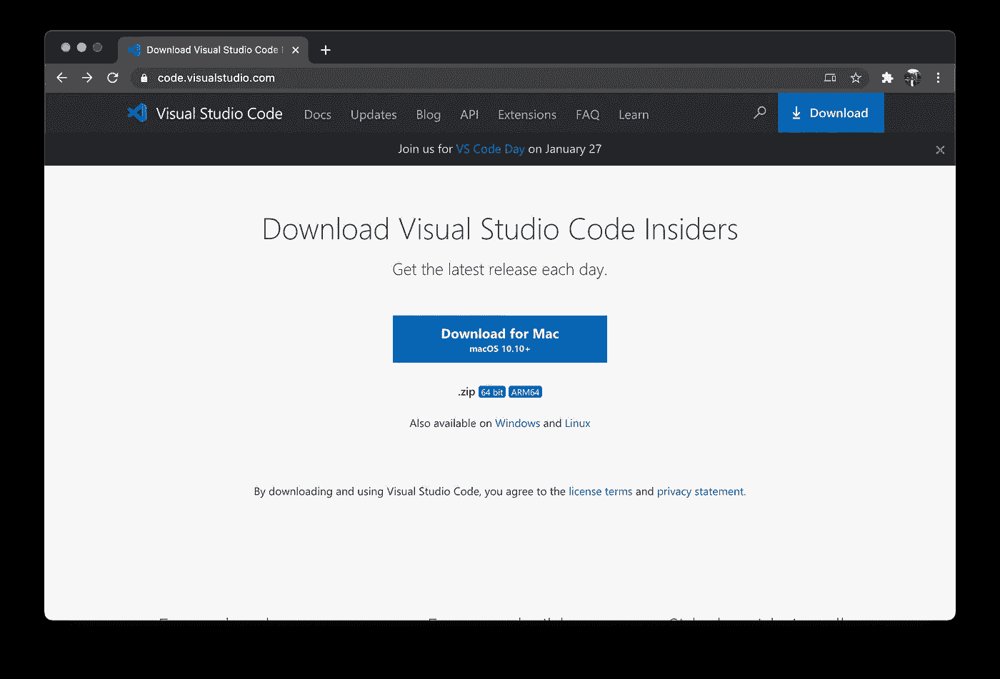

# 装有 M1 芯片的 MacBook 可以进行网络开发了吗？

> 原文：<https://javascript.plainenglish.io/is-macbook-with-m1-chip-ready-for-web-development-71770b9c9e02?source=collection_archive---------2----------------------->

## 从 JavaScript 开发者的角度看 M1 MacBook 如何展示自己

Photo by [Tianyi Ma](https://unsplash.com/@tma?utm_source=medium&utm_medium=referral) on [Unsplash](https://unsplash.com?utm_source=medium&utm_medium=referral)

我是一名 JavaScript 开发人员，几周前，我买了一台装有苹果 M1 芯片的新 MacBook Pro。似乎 JavaScript 甚至可以写在冰箱上。但事实证明，我们使用了相当多不同的工具和应用程序。它们与新处理器配合得好吗？嗯，不全是。我来分享一下我的经历。

## 饭桶。Python。Node.js。

我合并了它们，因为它没有问题。Git 和 Python 可以用一个命令`xcode-select — install`安装。
之后就可以安装 nvm 和 NodeJS 了。我在文章中解释了为什么要安装 nvm 以及如何安装它。

 [## 重新安装 Node.js 的最佳方法(Mac/Linux/Windows)

### 指导如何在几秒钟内完全卸载 Node.js 并安装任何版本的 Node。(Mac/Linux/Windows)

medium.com](https://medium.com/javascript-in-plain-english/the-best-way-to-reinstall-node-js-mac-linux-windows-d5f3212fdd2e) 

苹果 M1 采用 Git、Python 和 NodeJS，运行速度超快。

这是必须的，我不能跳过，让我们继续。

## Visual Studio 代码

现在我们需要一些东西，在那里我们可以写我们的 JS 代码。我们可以去官方网站，下载 VS 代码，一切都会好的。但是，不太好。因为 ARM 架构不采用目前的稳定版本，所以会通过 Rosetta 2 运行。我没有感觉到 M1 的新 MacBook 和我以前的英特尔酷睿 i5 的 MacBook Pro 2016 有什么不同。幸运的是，微软已经开发了一个支持 ARM 的内部版本。你可以从 [VS 代码网站](https://code.visualstudio.com/insiders/)下载。

ARM 版的很牛逼。凭感觉，它发射速度至少快 2 倍。

大概当你会读到这篇文章的时候，微软大概会发布一个稳定的 ARM 版本，你就不需要 Insider 了。

如果你的主要 IDE 是 **WebStorm** ，你很幸运，JetBrains 已经采用了它。你只需要安装最新的版本。

现在我们有了开发所必需的一切，但是部署呢？

## 码头工人

苹果 M1 的 Docker 目前正在开发中。在官方网站上，您可以找到不建议在生产中使用的信息。但是我们能用它做什么呢？

我们可以下载[科技预览版](https://docs.docker.com/docker-for-mac/apple-m1/)。

也许你不会遇到任何问题，但我决定将我的项目转移到 Google Cloud Build。谷歌每天提供 120 分钟免费时间来构建你的容器。你不需要安装 Docker，它完全可以投入生产。

详细说明可在 [GCP 文档](https://cloud.google.com/cloud-build/docs/deploying-builds/deploy-cloud-run)中找到。

让我们假设我们决定使用 GCP，应该完成的第一个任务是安装 Google Cloud SDK。

## 谷歌云 SDK

也不是领养的。连安装都无法完成，因为是为 x86 架构写的。

M1 处理器没有内部版本。那现在怎么办？

我们可以通过 Rosetta 2 自动安装，没有任何提示。

之后就没事了。您将能够使用 GCP，构建映像，部署它们，等等。

## 结论

你肯定可以用苹果和 M1 来开发产品，而且会更好。VS 代码内部版速度惊人。它几乎立即用 angular 打开项目。Docker 正在建设中，但相信用不了多久就会发布 ARM 版本。任何 npm 包和 CLI 都可以很好地工作，因为采用了 NodeJS。所以总的来说，你可以放心地购买新的 Mac 电脑。在最坏的情况下，我们不得不使用罗塞塔 2。

如果你对 M1 的软件支持有任何问题，欢迎在评论中或在 Twitter 上提问。

**感谢阅读！**