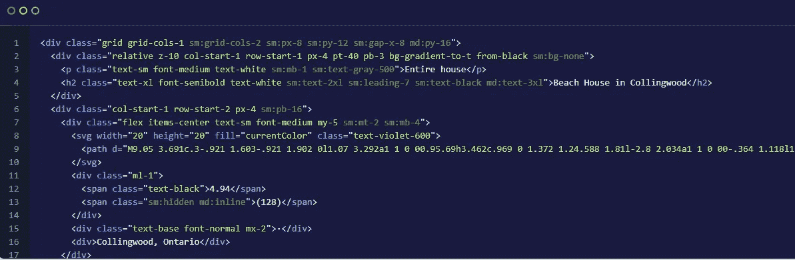

# 顺风真的值得吗？

> 原文：<https://javascript.plainenglish.io/is-tailwind-css-really-worth-using-1830a706231a?source=collection_archive---------4----------------------->

Tailwind CSS — is it worth it?

我从来没有打算故意抨击任何技术。我相信每项技术都有其有效的用例。但是作为一名开发人员，在追随为了技术而采用技术的潮流之前，有必要对技术及其利弊进行分析。

最近，一项备受关注的新技术是 Tailwind CSS。当我第一次听说它时，我立刻就感兴趣了，因为我天生就喜欢前端世界。

Tailwind 是一个 CSS 实用框架。它是为实用目的而创建的，这意味着它应该使开发更容易。与 Bootstrap 等其他常见 CSS 框架不同，Tailwind 不提供任何内置的 UI 组件。

简而言之，Tailwind 的主要好处是它让你不必写大量的 CSS，你可以直接在你的 HTML 中使用 Tailwind。这也是他们在官方网站上推广的第一件事——不需要离开你的 HTML。

前端社区是如此创新，人们不断创造新的技术来方便我们的日常工作。这些开发人员肯定值得一些赞扬，但是在跳上任何列车或使用一种被大肆宣传的技术之前，我们应该在采用它之前考虑利弊。

关于这个新的实用框架已经有了很多教程，看起来它确实有很多好处。在讨论采用顺风是否是一个好的选择之前，我们先来过一遍顺风的利弊。

# 顺风的好处

## 1.这使得造型过程更快。

毫无疑问，Tailwind 可以帮助你更快地设计 HTML 元素的样式。因为您不必留下标记，所以实际上您可以直接设置元素的样式。你可以在比从头开始更短的时间内创建好的布局。

## 2.它提供了更多的便利。

您不必处理许多开发人员在使用 CSS 时面临的许多问题。众所周知，很多开发人员不喜欢 CSS，或者觉得它很难处理。对于这样的开发人员来说，使用 Tailwind 提供的内置类将使开发人员从与 CSS 的斗争中解脱出来。

## 3.它提供了安全感。

这适用于人们在生产中安全使用的任何经过测试的框架。因为它是经过测试的，而且框架是稳定的，所以您可以使用它，并确信它不会崩溃。此外，因为你有一个由经验丰富的工程师创建的框架作为后盾，如果框架中出现任何问题，他们都会帮你解决。

让我们移动一下，讨论一下使用 Tailwind CSS 的一些可能的缺点。

# 顺风的坏处

## 1.您的标记变得非常冗长。

如果您已经看到了 Tailwind 通常是如何使用的，那么您可以为 HTML 元素提供一组负责样式的 Tailwind 类。我发现很难理解这些班级在做什么。在我看来，这不是一种处理 CSS 的自然方式，它破坏了“关注点分离”的概念。我喜欢把我的样式和我的标记分开，不要把它们混在一起太多。

为了说明我的意思，这是一个他们官方网站上使用 Tailwind 的例子:

Example of Tailwind classes

我不知道你怎么想，但对我来说，这是非常冗长的，很难阅读。

## 2.有时你可能不得不围绕这个框架工作。

这是你可能会陷入的另一个问题。当您在文档中找不到对您的特定用例的支持时，您可能不得不稍微调整一下框架来满足您的需求。你将围绕顺风创建你自己的小框架。我宁愿从一开始就完全控制我的造型，而不是在以后的道路上不得不忽略内置的顺风风格。

## 3.是不太懂 CSS 的开发者的拐杖。

一个优秀的前端开发人员应该能够轻松地从头开始编写 CSS，甚至创建一个个人框架。当你依赖一个框架为你做所有繁重的工作，却不知道后台发生了什么时，你可能会失去对风格的控制，不知道如何调试任何问题。

## 4.用它变得有效率需要时间。

这当然是与任何框架的权衡。但是事实仍然是，当你采用一个新的框架时，需要时间来提高效率。

这里困扰我的事情是，你需要学习一堆类名，而事实上任何熟练的前端开发人员都可以很快地从头开始编写这些 CSS 类。因此，我真的看不出顺风会给这样的开发商带来多少好处。

在这里，我想这一切都归结为个人喜好。如果你愿意花时间学习这个框架，以便从长远来看加快你的 CSS 样式，那么就去做吧。就我个人而言，我喜欢从头开始写，因为这样我可以更好地控制我的 CSS 类。

# 临终遗言

如果你不擅长 CSS，那么在使用像 Tailwind 这样的实用框架之前，你应该优先学习它，因为否则你可能会在不知道它们实际在做什么或者如何工作的情况下使用它们。

如果你对 CSS 很在行，但是想加快设计过程，并且愿意花时间学习框架，那么 Tailwind 可能是你的一个很好的选择。

我可能会在未来更多地探索顺风，也许以后会改变主意。但是现在我认为没有它会更好，因为我看不出使用它比编写定制 CSS 有更大的价值。