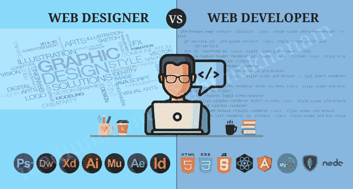
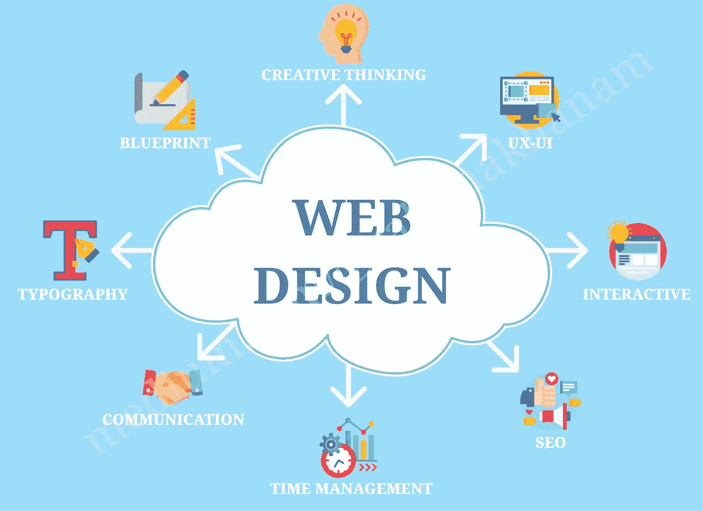
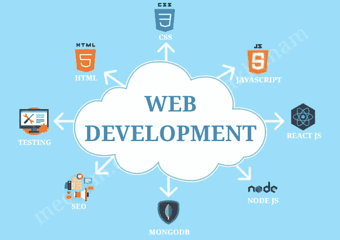
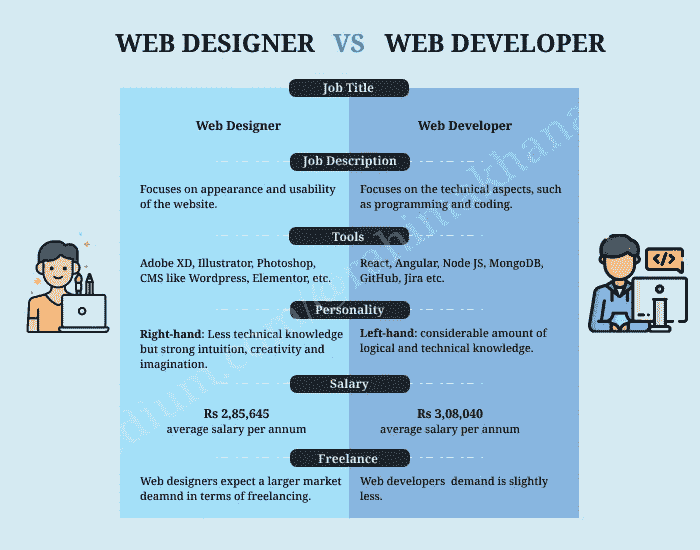

# 网页设计和网页开发是一样的吗？

> 原文：<https://javascript.plainenglish.io/is-web-design-and-web-development-the-same-bce70952506c?source=collection_archive---------8----------------------->

## 在网页设计和网页开发之间选择正确的职业道路。

Web designing and Web Development

如果你正在寻找网页技术的职业道路，你应该知道网页开发者和网页设计师之间的区别。你一定已经对这些术语很熟悉了，但是大多数初学者都没有领会它们的精髓。如果你对这两个词感到困惑，或者需要一些深入的见解，那么你来对地方了，因为这是我们博客的主要焦点。所以，请继续阅读。

在学习 web 技术的初始阶段，大多数设计人员和开发人员会对这两个术语感到困惑，并经常互换使用。在我的例子中，我假设一个设计师设计了网站，一个开发者为它写了代码。

嗯，我不能说我错了，但它仍然需要更多的细微差别，因为大多数现代设计师持有 HTML 和 CSS 的基本知识。就前端开发人员而言，他们负责编码网站的完整布局。那么，让我们深入这两个概念，了解它们的类型、技能、作用和区别。

# 什么是网络？

WWW 是[万维网](https://en.wikipedia.org/wiki/World_Wide_Web)的缩写，包含互联网上托管的多个网页和网站。用 HTML 编写的网页是通过超链接链接的网站。

web 浏览器在接收到 HTTP 请求时与服务器进行交互，在客户端从服务器检索副本。数据使用 [TCP/IP](https://en.wikipedia.org/wiki/Internet_protocol_suite) (传输控制协议/互联网协议)在互联网上传输。

# 谁是网页设计师？

Skills of a Web designer

我们可以说，网页设计师是那些将一个想法或一个故事转化为视觉美学设计的人，这样浏览者在浏览网站时可以有更好的用户体验。所以，设计师主要关注的是网站的感觉和外观。这类似于建筑师如何创建我们房子的蓝图。网站设计者为网站的布局建模，这样网站开发者就可以开始开发了。

一个好的网页设计师需要具备图形和基本的技术技能。他们应该有能力预测一个特定的布局将会是什么样子(图形设计)，以及当它被编程时它将如何工作(将一个蓝图转换成一个工作网站)。

## 类型(工作简介)

**1。用户体验设计师:**他们确保网站吸引访问者。他们在最终确定网站设计之前检查数据。他们还会运行复杂的测试，并在需要时重新构建网站，以保持最佳的用户体验。

一个好的 UX 设计师需要理解内容层次的重要性，并且知道是什么造就了一个成功的最终产品。当用户遵循他们预定的路径，并对产品有积极的体验时，UX 设计师就会成功。它允许访问者根据自己的需要快速方便地访问他们需要的信息。

**2。UI 设计师:**网页设计的另一个方面是 UI 设计。除了 UX 设计者提供的体验，UI 设计者优先考虑交互，即处理用户交互。他们确保用户可以与网站上的元素进行交互。UI 是访问者访问网站时看到的一切，它应该根据用户预期的工作流程来设计。UI 设计师的主要角色是通过对 UX 设计师提出的线框进行直观的解释，来创造整个产品的一致性。这两位设计师将在项目的整个生命周期中并肩工作。

一个典型的用户界面设计师会从 UX 设计师那里获得战略上的线框，并开始为产品的用户界面组件工作。UI 设计师会花大部分时间来试验组件，并回答类似这样的问题:“按钮会如何出现？”"当按钮被点击时会出现什么样的效果？""当鼠标悬停在按钮上时，按钮会如何显示？"这些乏味的交互看起来很小，没有必要，但是它们可能会影响或破坏一个网站或应用程序的可用性。

**3。视觉设计师:**UI 和 UX 设计师的共同职责使视觉设计师成为一个独立的形象。他必须创建既美观又方便使用的界面。他们的技能包括创造力和编程。

大多数设计师使用大量的工具、软件和程序来实现视觉上吸引人的网站。最重要的是设计和编辑软件和程序，比如 Adobe Photoshop。他们可能会使用库存摄影资源以及图像优化和压缩工具。他们甚至可能使用 WordPress 之类的 CMS，以及 Elementor 之类的网站构建平台。此外，线框和原型工具的使用有助于设计师可视化网站的框架，然后创建样机和模型，以测试整个开发过程。

## 技能

作为一名网页设计师，我们不需要有一个正式的资格来进入这个领域，所以我们建议有设计领域的经验或通过大学或自学接受网页设计软件的培训。

网页设计师需要掌握的一些技能是:

1.  **基本设计工具:**他们应该具备设计工具的工作知识，如 Adobe Illustrator、Photoshop、Dreamweaver 等。
2.  **UX/UI 与视觉设计:**人们通常根据网站的外观和感觉来评判网站，这意味着网站设计师必须掌握自己的 UI 和 UX。它可以使用各种工具来应用，如网格系统、色彩心理、排版和网络字体。除此之外，他们还必须确保不同设备的视图的响应性。
3.  **HTML 和 CSS:** 这不是必须的，但是你必须对这些软件包有基本的了解，因为它们可以增加你的技能。
4.  **时间管理:**这一点至关重要，因为你将在一个需要持续创作、迭代和开发的快节奏环境中工作。
5.  **沟通:**设计师还应具备良好的沟通技巧，使其能够清晰、透明地传达各种技术信息。如果你的同事和客户能更好地与你联系，这将直接促进你的设计技巧和愿望。
6.  **搜索引擎优化(SEO):** 当您通过学习新技能成为网页设计师时，您也应该知道 SEO 是如何工作的，以及如何使用它来使您的网站对 SEO 友好。
7.  **内容管理系统(CMS):** 他们还应该采用 CMS 的知识，CMS 是一种无需编写代码就能帮助开发网站内容的工具。CMS 的一些基本功能包括内容创建、内容存储、工作流管理和发布。

## 角色

网页设计师的主要职责是确保布局能够吸引目标受众，从而吸引他们的注意力。但是，除了这一主要问题之外，它们还包括以下涉及的其他方面:

1.  了解客户需求并定期与他们沟通。
2.  与客户一起分析创意，比如在网站中加入新的功能或特性。
3.  视觉结构应该确保它符合公司的品牌政策。
4.  制定详细的网站规范，同时指定设计指南、标准和最佳实践。
5.  持续测试和改进网站的布局/设计，使其符合当前的要求。
6.  良好的图形、动画和数字照片操作技能。
7.  使用各种图形工具(如用户流、流程流、站点地图和线框)展示设计思想。
8.  与其他网络专业人士合作，包括网络开发人员和平面设计师。
9.  一旦结构准备就绪，准备设计计划并展示网站布局。
10.  通过提供售后技术支持。
11.  通过持续专业发展(CPD)活动了解最新设计趋势。

# 谁是网络开发人员？

Skills of a Web developer

web 开发人员是使用客户机-服务器体系结构参与开发的人。开发中涉及的语言在客户端是 HTML、CSS、JavaScript，在服务器端是 PHP、Java、Python、Node.js。除此之外，不同的协议被用于通信。

web 开发人员使用编程范例来构建和维护全功能网站的完整结构。编程能力的复杂性包括高端的分析思维和解决问题的技能。它需要编码、配置服务器和数据库、测试、调试、发布后功能、托管和维护。一个 web 开发人员应该有扎实的技术技能和对概念的全面理解。

## 类型(工作简介)

**1。前端开发人员**
前端开发人员负责制作网站的外观、感觉和智能部分。当我们在电话、平板电脑或 PC 上看到文本、图片和音调时，他们经常被网站专家混淆，并负责将它们放在网站上。当你悬停在它上面时，你看到变化了吗？或者当你点击页面上的某个东西时，弹出窗口是什么样子？它让你成为一名前端开发人员。它们确保你看到的一切都是协调的、时尚的、令人满意的、实用的。

**2。后端开发人员**
后端开发人员也是 web 开发必不可少的一部分。他们是服务器端技术的工作人员。他们负责建立网站的基础设施并保持其运行。它们维护交互性，并协调前端和后端之间的工作。

**3。全栈开发人员**
全栈开发人员是卓越的设计师类型，因为他们可以在网站的前端和后端进行编程和工作。他们可以创建一个完整的、功能强大的网站，因为他们理解了 web 改进的两个封闭性。总的来说，全栈开发人员将有能力利用他们的洞察力和经验用多种编程语言进行编码。与改进周期中的前端和后端工程师相比，他们是功能最可用的。他们还负责部署、托管和维护。

## 技能

1.  **HTML:** 超文本标记语言用于开发网页及其内容。
2.  **CSS:** 需要级联样式表来样式化 HTML 文档。它还描述了页面内容应该如何显示。
3.  **JavaScript:** 是一种用于构建网页逻辑的高级轻量级编程语言。
4.  jQuery: 这是一个 JavaScript 库，用于 HTML 文档的操作和事件处理。
5.  **React:** 它是一个 JavaScript 框架，用于构建交互组件，使开发变得高效。
6.  **Angular:** 它是一个用于 web 应用开发的 JavaScript 框架。
7.  **Java:** 它是一种高级的基于类的编程语言，用于构建 web 应用。
8.  PHP: 它是一种用于 web 开发的脚本语言。
9.  **Ruby 和 Ruby On Rails:** 它是一种用于构建 web 应用程序的开源编程语言。
10.  **Python:** 是一种面向对象的函数式编程语言，用于 web 开发、数据分析、AI 等。
11.  这是一个运行在。NET 框架。
12.  **MySQL:** 它是一个关系数据库管理系统，用于数据处理和数据仓库。
13.  **MongoDB:** 是一个基于文档的数据库，以 JSON 格式存储。
14.  **SEO:** 搜索引擎优化用于提高网站在互联网上的知名度。
15.  **测试:**需要检查 web 应用程序的漏洞、安全性、性能等。

## 角色

1.  规范与客户或高管的会议，以检查网站或界面的必要性、计划和有用性。
2.  将蓝图、声音和视频整合到网站中。
3.  制作和测试网站的应用程序、界面和路由菜单。
4.  利用 HTML 或 XML 等编程方言为网站编写代码。
5.  与他人合作分析网站。
6.  监控网站的流量。

# 网页设计师 vs 网页开发者:区别在哪里？

希望现在你能很容易区分网页设计师和网页开发者。为了将所有的东西放在一起，让我们简要地分析一下这两个角色之间的显著区别:

1.  设计师关注网站的外观和可用性，这是确保 UX 和用户界面稳定的必要条件。而开发人员关注项目的技术方面，比如编程和编码。设计师的重要角色是在网站上概念化的想法和外观，同时创建一个基于视觉、UX 和 UI 元素的模型。而开发者的角色是确定这个想法在经济上和技术上是否可行，如果可行，他们就对网站进行编程和编码。
2.  网页设计师通常使用 Adobe XD、Illustrator、Photoshop 等设计编辑软件，WordPress 等 CMS，Elementor 等网站构建工具，以及线框和原型制作工具。而 web 开发人员使用的工具和程序包括编码库和框架，如 React、Angular、Node.js 等。、Github 之类的代码版本控制，以及吉拉之类的问题跟踪平台。
3.  Web 开发人员需要大量的逻辑思维和技术知识，包括理解复杂的编程语言和框架。相比之下，网页设计师需要较少的技术知识，但必须有很强的直觉，创造力和想象力。
4.  网页设计师新生的平均年薪是 285645 卢比。而对于网络开发的新生来说，则是 308040 卢比。
5.  就自由职业而言，与网页设计师相比，网页开发者期待更广阔的市场，因为客户更喜欢长期项目的设计师。由于客户更喜欢设计的一致性，他们相信雇佣长期的设计师，而不是能够独立管理项目，同时让客户了解最新情况的开发人员。

Web Designer vs Web Developer

# 结论

最后，我们可以说网页设计者和网页开发者都在设计、开发和维护网站中扮演着重要的角色。他们在提供高质量产品方面有着相互依赖的作用。然而，它们在技术上有所不同。在涉足这个行业之前，我们必须充分了解这些。有一个好的理解有助于我们规划我们的职业道路，同时关注我们的优势和能力。

现在我们有了。我希望你已经发现这是有用的。谢谢你阅读我的博客。感谢 Sana Eram 帮助我编辑和改进博客。

# 参考

 [## 网页设计和网页开发有什么区别？

### 我记得在我学习 web 开发的早期阶段，我发现自己对……

hackernoon.com](https://hackernoon.com/what-is-the-difference-between-web-design-and-web-development-cc23171de85c) [](https://elementor.com/blog/web-designer-vs-web-developer/?__cf_chl_captcha_tk__=d5101eed5b3f6890734c13423fced8c3b975dacd-1625351043-0-AVceD1WKIoQ93iZDvwyTaPho7J7MPZIxBXygUrSH3mW-T_vZ50mb94REg5Ym18j2905xrCcWri4ZrJ8FJ5MQgWIPMxyUZQpzEwe1KNrvq9a3_anw5U2izH2coQmzNy_62mxOpiMZZeZ4lRJNrStOIewmQmaB51jsXOxHLgpO_O8tW9UBKSRLcnu4kP_v4U3aKYHj9mdg74Go09vL-LlLY-llkULDUWzs_x43QK9wWO6NGIltv20flLO3EnX1yF66IDIR57klpML4b0PpPjH_UfVNnzRFVau98K69gEE4N3pxu7ENQBp5pALidXEXKfRky2Arh1t9zk36TmvjXW09qyeQoemDYpdvqgaoOqQICfDDrXWfhXc9Puzcfkjx3gvYta1T8-JVVDn4aHK2YoUSNVDULWYK7QjpzlsnRK_DQ3OLqA7OLc6vwIpk829XQYIyS_zBR0nAvS3upKUHqBm1EvjkwSfTFwRplYEcOWTUmD2Wpcsay_KmcSctmaEk6cVIz8pWz3ZALarDMZV-_kqcTkUqeqElnSdPZ90275iD12yr552wQqNMA3Ima6yB_5FEdcnIn-CPSg463OXovSk5QSFVC50MzGMxZAO1ule29t262PLl7uUWXmIhSF0Mm6tU8SKhz51txRLgjlFSaxa5WKgGAksorZcMX2AaD4dHl96Ww0v4tCyTQ4rNL_OrjBni1ZIXVOWcb2jOsN2oLS6Aopg) [## 网页设计师 vs 网页开发者:有什么区别？元素符

### 你正在寻找一个网页设计师的职业道路吗？不确定网页设计师和网站之间的区别…

elementor.com](https://elementor.com/blog/web-designer-vs-web-developer/?__cf_chl_captcha_tk__=d5101eed5b3f6890734c13423fced8c3b975dacd-1625351043-0-AVceD1WKIoQ93iZDvwyTaPho7J7MPZIxBXygUrSH3mW-T_vZ50mb94REg5Ym18j2905xrCcWri4ZrJ8FJ5MQgWIPMxyUZQpzEwe1KNrvq9a3_anw5U2izH2coQmzNy_62mxOpiMZZeZ4lRJNrStOIewmQmaB51jsXOxHLgpO_O8tW9UBKSRLcnu4kP_v4U3aKYHj9mdg74Go09vL-LlLY-llkULDUWzs_x43QK9wWO6NGIltv20flLO3EnX1yF66IDIR57klpML4b0PpPjH_UfVNnzRFVau98K69gEE4N3pxu7ENQBp5pALidXEXKfRky2Arh1t9zk36TmvjXW09qyeQoemDYpdvqgaoOqQICfDDrXWfhXc9Puzcfkjx3gvYta1T8-JVVDn4aHK2YoUSNVDULWYK7QjpzlsnRK_DQ3OLqA7OLc6vwIpk829XQYIyS_zBR0nAvS3upKUHqBm1EvjkwSfTFwRplYEcOWTUmD2Wpcsay_KmcSctmaEk6cVIz8pWz3ZALarDMZV-_kqcTkUqeqElnSdPZ90275iD12yr552wQqNMA3Ima6yB_5FEdcnIn-CPSg463OXovSk5QSFVC50MzGMxZAO1ule29t262PLl7uUWXmIhSF0Mm6tU8SKhz51txRLgjlFSaxa5WKgGAksorZcMX2AaD4dHl96Ww0v4tCyTQ4rNL_OrjBni1ZIXVOWcb2jOsN2oLS6Aopg)  [## 了解不同类型的网页设计师|数字中心线

### 认识什么好的设计师吗？简而言之，当然。真正的问题是:你需要什么类型的设计师？在过去…

centerline.net](https://centerline.net/blog/understanding-different-types-of-web-designers/)  [## 网页开发者与网页设计者:主要区别——道德网络中心

### 当谈到使用网页设计师和网页开发者这两个术语时，人们经常会感到困惑。他们都参与了…

moralwebhub.co.in](https://moralwebhub.co.in/web-developer-vs-web-designer/#:~:text=UX%20Designers)  [## 什么是网页设计师？

### 网页设计师是负责设计布局、视觉外观和可用性的 IT 专业人士

www.technojobs.co.uk](https://www.technojobs.co.uk/info/it-job-roles/what-is-a-web-designer.phtml)  [## 2021 年印度网络开发人员的薪资[针对大学新生和有经验者] | upGrad 博客

### 万维网是迷人的。尽管它已经存在了几十年，但全球每个人都可以…

www.upgrad.com](https://www.upgrad.com/blog/web-developer-salary-in-india-freshers-experienced/)  [## 2021 年印度网页设计师的薪水(适用于大学新生和有经验者)

### 由于其多才多艺的性质，网页设计已经成为世界上需求量最大的工作之一。作为…

www.upgrad.com](https://www.upgrad.com/blog/web-designer-salary-in-india-freshers-experienced/) 

*更多内容看*[***plain English . io***](http://plainenglish.io/)