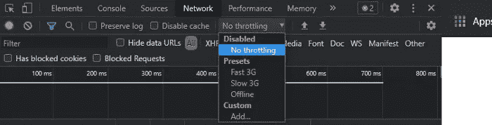
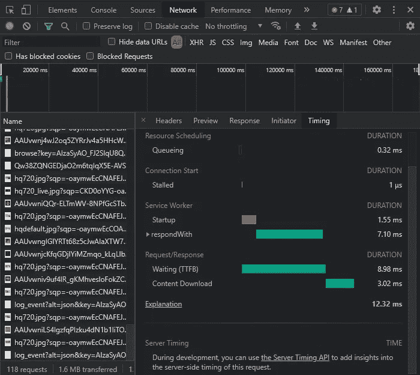

# 2021 年你的网站够快吗？

> 原文：<https://javascript.plainenglish.io/is-your-website-fast-enough-in-2021-2d9b3b95834a?source=collection_archive---------19----------------------->

## 当你的网站花 5 秒钟加载时，38%的用户会反弹。

Photo by [Oscar Sutton](https://unsplash.com/@o5ky?utm_source=medium&utm_medium=referral) on [Unsplash](https://unsplash.com?utm_source=medium&utm_medium=referral)

归根结底，消费者并不真正关心你写的代码；他们关心的只是从代码中获得的效用。

web 开发最重要的方面是速度和响应能力。

开发一个加载时间很长的网站有什么好处？

根据 [Pingdom](https://www.pingdom.com/blog/page-load-time-really-affect-bounce-rate/) 的说法，当你的网站需要 2 秒钟加载时，大约有 10%的用户退出，并且这个比例随着时间的流逝而快速增长。

加载时间长达 8 秒的网站将会有近 60%的用户退出。这些数字一定让你产生了一些疑问。

> 你上一次花 5 秒钟等待网站加载是什么时候？

也许我们愿意为我们信任并每天使用的网站多等一会儿，但不会为我们在谷歌搜索中偶然发现的网站多等一会儿。

测试你的网站速度，并在开发过程中牢记加载时间，可以带来很高的有机牵引力。

有许多工具可以促进网络和速度测试，但在我看来，有两个免费的服务很容易上手，并提供了很好的工具来监控，调试和测试网站速度。

## 1. [Chrome DevTools](https://developer.chrome.com/docs/devtools/)

Chrome DevTools 是 Chrome 浏览器中的一个免费的以开发为中心的工具。

它为开发人员提供了网络测试能力以及其他相关工具。

高分辨率图像可能在您的计算机上加载很快，但在 3G 手机上加载可能需要时间，或者设备具有良好的互联网连接，但服务器需要时间来发送数据。

这些东西可以通过 DevTools 轻松测试。

Source: Author

你可以选择快速和慢速 3G 以及离线模式来测试你的应用程序。

类似地，从 network 选项卡中，您还可以看到响应的开始和结束等等。

Source: Author

从上图中，您可以看到等待时间(绿色条)是 8.98 毫秒，而下载时间是 3.02 毫秒。这意味着服务器响应缓慢。

你可以在这里找到其他指标的解释显示。

这只是 DevTools 提供的一些测试功能的简要概述，您可以在网上找到更深入的指南。

如果你想了解更多关于 DevTools 的有趣特性，那么可以看看我最近的博客，在那里我讨论了 DevTools 的特性。

 [## Chrome DevTools 的 9 个隐藏功能

### 大多数人不知道的疯狂功能。

javascript.plainenglish.io](/9-hidden-features-of-chrome-devtools-78856b2a96de) 

## 2.[谷歌核心指标](https://support.google.com/webmasters/answer/9205520?hl=en)

Google Core Vitals 的一个突出特点是能够根据[真实世界的使用](https://support.google.com/webmasters/answer/9205520?hl=en#about_data)来衡量你的网站性能。

另外，你可以找到[真实世界的案例研究](https://wpostats.com/)，它显示了谷歌核心重要报告是多么有效。

有三个度量:LCP( [最大内容油漆](https://web.dev/lcp/))、FID( [首次输入延迟](https://web.dev/fid/) ) & CLS( [累计布局移位](https://web.dev/cls/))。

LCP 是你的网站显示内容所需要的时间。换句话说，它看到用户打开网站是什么样子。

FID 是网站响应用户交互(点击链接、按钮等)所需的时间，而 CLS(累积布局偏移)是指网站加载时发生的意外布局偏移。

你可能已经注意到，有时当你正在阅读一段文字时，突然一个广告出现在文字之间，你失去了你在段落中的位置。这是一个 CLS 的例子。

Google Core Vitals 使用这三个指标来评估你的网站。您可以在搜索控制台帐户的“增强”部分找到核心网络生命数据。

你可以在这里找到一个很好的指南[涵盖了谷歌的核心要素及其重要性。](https://backlinko.com/hub/seo/core-web-vitals)

有几种方法可以提高你的网站的加载速度，也可以提高核心生命体征评分。

## 1.优化代码

使用 DRY(不要重复)规则编写一次代码并多次重用，以及使用现代编程实践是减少文件大小的最佳方式。

延迟加载图像和媒体文件也可以大大减少你的网站的加载时间。

此外，像 Next.js 的 Image 组件这样的几个组件减小了图像大小，进行了优化，并以非常小的现代格式提供它们。

此外，尽量只加载您需要的数据，不要过度获取数据。在某些情况下，您可以考虑使用 GraphQL 来实现这一点。

在生产版本的构建过程中，您的 IDE 将向您显示最终构建文件夹中包含的文件大小，您可以监视并尝试减小它。

## 2.贮藏

缓存很少改变的数据和页面是一个很好的做法。这可以大大减少加载时间。

有许多现有的包使缓存变得简单，但一般来说，它并不复杂，在很短的时间内你就可以实现它。

Redis 是实现缓存的流行选择，你可以在网上免费找到许多指南。

## 3.服务器端呈现(SSR)

SSR 对于 SEO 分数和整体用户体验至关重要。

这并不意味着运行在客户端的单页应用程序(SPA)很慢，但是 SSR 页面对于 SEO 来说很棒，而且当你分享网站链接时，它可以很容易地在社交媒体上预呈现它们。

此外，使用 SSR，您可以轻松地在服务器上仅填充页面所需的数据，然后发送它。这使得实现缓存变得更加简单。

我已经在[最近的博客中讨论了服务器端渲染的 SEO 优势。](/a-beginners-guide-to-seo-for-javascript-web-applications-c67d55728291)

另外，你可以阅读[亚历克斯·格里戈良](https://medium.com/u/54a709eacdb7?source=post_page-----2d9b3b95834a--------------------------------) [的博客](https://medium.com/walmartglobaltech/the-benefits-of-server-side-rendering-over-client-side-rendering-5d07ff2cefe8)讨论 SSR 的优势。

## 4.使用 CDN

使用内容交付网络(CDN)可以极大地提高网站的速度和加载时间。

此外，内容不仅限于文本，还包括高清视频和其他媒体文件。等待时间也减少了。

cdn 在许多地理区域存储您的站点内容的保留再现(缓存版本)。

此外，通过使用 CDN，您还可以获得 DDoS 保护、100%正常运行时间以及更多。

现在有一大堆 CDN 提供商供你选择。

## 结论

随着越来越多的人出于各种目的使用网站，从交易到体育赛事，再到举办虚拟会议，速度和加载时间比以往任何时候都更加重要。

各种案例研究表明每一秒钟的延迟对用户来说是多么重要。

令人欣慰的是，有免费的工具来测量、检查和调试速度，以及各种实践和模式，开发人员可以遵循以使他们的网站加载更快。

有些模式在编码时很容易实现，并且会极大地影响网站速度。

感谢阅读！

*更多内容请看*[*plain English . io*](http://plainenglish.io/)