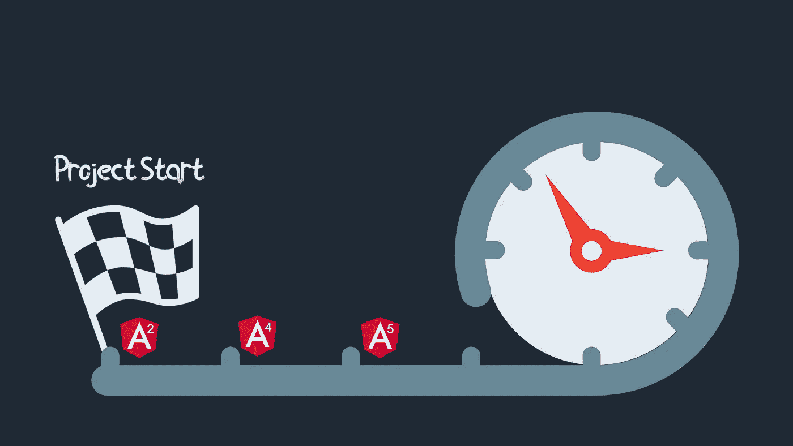
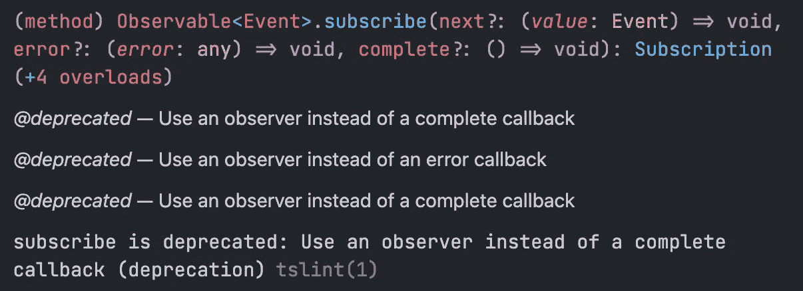

# 长期项目中的角度问题

> 原文：<https://javascript.plainenglish.io/issues-with-angular-on-long-term-projects-3679bc335eb8?source=collection_archive---------4----------------------->

## 如何解决它们:支持从 v2 到 v11 的角度项目



Long-term Angular project

从 AngularJS 的第一个版本开始，我就是一个角度开发者。在此期间，我有机会工作并交付不同规模的项目。我总是对我的主要框架选择感到满意。今天，它仍然是我最喜欢的框架。目前，我有三个积极的、长期的、繁重的项目。所以我来分享一下这类项目上最常见的陷阱，以及如何应对。

# 版本更新

假设你在 Angular 2 的乞求下创建了一个 MVP app。您按照指南配置了项目，一切都很好。后来，Angular 发布了越来越多的新版本，这很棒，因为它还活着，还在成长。因此，你需要遵循[指令](https://update.angular.io)关于如何从一个版本迁移到最新版本。

大约在 Angular 7 的某个时候，Angular 团队发布了原理图。**超级酷的特性，这是我在其他 web 框架上没见过的**。现在我们可以添加新的库，自动更新框架和依赖关系。嗯，几乎是自动的。

为什么差不多？因为成千上万个项目的代码基础是不同的，很难毫无问题地转换它们中的每一个，这很好。我们需要感谢自动化至少是我们日常工作的一半。

但有时，在成功迁移后，它可能会错误地工作。这是最坏的情况。

例如，我很不幸地为服务器端渲染添加了@angular/universal 而没有问题。在我的情况下，它可以开始渲染，永远不会停止这个过程。或者服务器可以根据请求抛出超时错误。问题的根源是以前的配置，原理图中没有涉及。你永远不知道配置出了什么问题。它不会出现在变更日志中。

**解决方案** 可以单独新建一个项目，安装@ angular/universal with schematics，比较所有配置文件。有一次，我设法找到了不同之处，并解决了一个问题。但是上一次，我必须将 src 文件夹移动到新项目中，设置 angular.json，并且只有在 SSR 开始工作之后。

所以请注意，更新过程可能需要时间和精力。

# 相关库中的重大更改

如果你想在 Angular 框架中拥有最新的特性或者 bug 修复，你总是需要更新相关的库。它唤醒努力和时间。我们为什么要这么做？因为这些库使用彼此的组件作为依赖项。并且 ng update 或 schematics 不会工作，直到一切都是最新的。

如果您计划使用最新的 Angular 版本，这里是您需要更新的顶级库的列表。

*   角状材料
*   角火
*   RxJS
*   @angular/cdk
*   @nguniversal/express-engine

有了角度示意图，它变得更好，但它不是万能的。我仍然需要每年重构代码 3-5 次。

**这很好，因为这个框架是活的。**但是你需要明白保持你的应用程序新鲜需要开发和测试的努力。

**解决方案** 冻结你的代码，如果它是稳定的，你不需要最新的功能。万一你需要它们，你必须接受这个事实，并计划有时重构。

# RxJS

打开[官方文档，假设是关于服务工作者](https://angular.io/guide/service-worker-communications)，复制第一个代码示例，并将其粘贴到您的项目中。我们会看到什么？

正确，我们将看到 RxJS 的新弃用。



Subscribe callback deprecation

RxJS 是 Agular 中作为核心部分使用的扩展库。一切都用 RxJS。当它有制动变化时，你需要重构…很多。

我们使用了多年的订阅和两次回调:

```
observable.subscribe((success)=> { … }, (err)=> { … });
```

现在，我们必须用回调函数将它更改为对象:

```
observable.subscribe({
   complete: () => { … }, // completeHandler
   error: () => { … }, // errorHandler
   next: () => { … }, // nextHandler
   someOtherProperty: 42
});
```

这不是第一次重大的重构，我很确定也不是最后一次。只需查看[之前的迁移指南](https://rxjs-dev.firebaseapp.com/guide/v6/migration)。它是巨大的。

RxJS 是一个很棒的库，减少了应用程序端的许多逻辑，但他们的突破性变化不断引入大量工作。

**解
解**无解。如果你对 RxJS 或他们的突破性改变不满意，可能的解决方法是使用 React 或 Vue。

但是不要把它当成痛苦。他们关心他们的消费者，当他们引入到 v6 的迁移时，变化如此之多以至于他们提供了一个迁移库。使用`rxjs-compact`，您可以一步一步地迁移。为此感谢他们，但我们仍然记得那些变化=)。

# 隐藏的更新和改进

最后一个问题并不重要，因为它不会对您的项目产生重大影响。但是当我试图修复上面列出的问题时，我经常在创建新项目后看到一些新的改进。

例如服务人员的附加参数:

```
ServiceWorkerModule.register(‘ngsw-worker.js’, {
   enabled: environment.production,
   registrationStrategy: ‘registerWhenStable:30000’
})
```

还是改良过的`tsconfig`。

或区域标志(您可以禁用某些区域检测以提高性能)。你知道这件事吗？

```
// disable patching requestAnimationFrame
(window as any).__Zone_disable_requestAnimationFrame = true;// disable patching specified eventNames
(window as any).__zone_symbol__UNPATCHED_EVENTS = ['scroll', 'mousemove'];/*
 * in IE/Edge developer tools, the addEventListener will also be wrapped by zone.js
 * with the following flag, it will bypass zone.js patch for IE/Edge
 */
(window as any).__Zone_enable_cross_context_check = true;// disable patch onProperty such as onclick
(window as any).__Zone_disable_on_property = true;
```

**解决方案** 如果你保持警惕，经常查看是否有更新，那会很有帮助。有时这样的提示在有角度的新闻中并没有被强调。

# 结论

Angular 是一个很好的框架，但是你应该花一些时间来保持你的项目不断更新，这似乎比 React project 更频繁。如果 Angular 团队能减少重构量就好了。我希望它在他们的路线图上🤞。

**感谢阅读！你可以在 Medium 上关注我，获取更多科技文章，也可以在 Twitter 上找到我。**