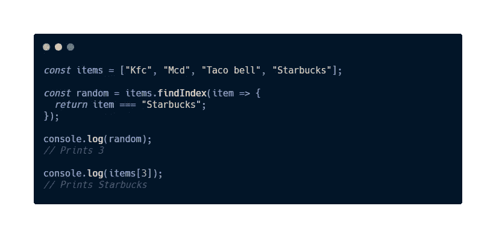

# 新手应该知道的 JavaScript 迭代器

> 原文：<https://javascript.plainenglish.io/iterators-in-javascript-you-should-know-as-a-newbie-c1bf23fb50b2?source=collection_archive---------13----------------------->

## 迭代器平滑了我们的代码，增加了可读性

Picture of JavaScript By [Eugene Goh](https://medium.com/u/e4b30737c09a?source=post_page-----c1bf23fb50b2--------------------------------)

## 什么是迭代器？

**你可能会问我为什么要在图片中加入循环？**

想象一下，当您想要遍历一个数组并使用一个`**for loop**`时。这段代码可能太长了。所以让我给你介绍一下什么是**迭代器**。

**迭代器**是**内置的 JavaScript 方法**，使我们能够轻松地迭代数组并操作数组内的数据，它们被称为**迭代方法**。

# 1.forEach()

从顶视图来看，`**.forEach( )**`方法接受参数作为回调，然后执行数组中的每个元素。

**例如:**

Example for **.forEach( ) method**

让我们更深入地了解一下`**.forEach( )**` - >

*   `**.forEach( )**`方法正在**项**数组上被调用。
*   `**.forEach( )**`接收一个参数作为回调。
*   `**.forEach( )**`将遍历数组，并对数组中的每个元素执行一次。
*   **返回值** `**.forEach( )**`将始终为`**undefined**`。我将在下面详细解释。

## 为什么会说**未定义**？不是用 **console.log( )** 打印出来的吗？

**Why undefined?**

> 从上面的**顶部的示例中，**您使用**方法**将数组中的每个项目记录到控制台。
> 
> 向**控制台**记录一些东西和由方法生成的值`return`是**两件不同的事情**。
> 
> 从上例中的**底部的**，会显示出**的返回值**也就是**未定义的**。

综上所述，`**.forEach( )**`方法唯一的目的是帮助我们在**模式下迭代数组** **唯一的**模式。

# 2.地图( )

`**.map( )**`方法将接受一个回调函数的参数，并返回一个全新的数组。

**例如:**

Example of **.map( ) method**

正如你所看到的，当使用`**.map( )**`方法时，它可以在数组内部操作**数据**，而你不能在`**.forEach( )**`方法中这样做。

**操纵/替换数组内数据**的能力:

Example of **manipulating/alternating data** inside an **array**

而且，`**.map( )**` 方法允许我们**链接其他方法**而你**不能**使用`**.forEach( )**` 方法做到这一点:

Example of **chaining**

## 总结一下 **map( )** 和 **forEach( )** :

Example of **.map( )** VS **.forEach( )**

# 3.findIndex()

为了找到数组中元素的位置，我们将使用`**.findIndex( )**` 方法。

在数组上调用`**.findIndex( )**`将返回数组中特定元素的索引。

例如:

Example of **.findIndex( )**

# 4.过滤器( )

这个方法非常简单，从名字就可以猜到。

`**.filter( )**`将从原数组中过滤出元素后返回一个新数组。

根据传入的元素，`**.filter( )**`方法的回调函数应该返回`**true**`或`**false**`。导致回调函数返回`**true**`的元素随后被添加到新数组中。

**例如:**

Example of **.filter( )**

Example of **.filter( )**

# 5.减少( )

`**.reduce( )**`方法在完成对数组的迭代后，只返回一个**单输出值****。我们可以说**“阵列被缩小了”。****

**例如:**

****

**如果你对`**.reduce( )**` 方法感到困惑，这里有一张它的图片:**

****

**Analyze the picture**

*   **在**第一次迭代**时，`**x**`值等于 **5** ，因为数组中零索引的**值为 5，而`**y**`值将等于 **10** ，因为它已经从位于索引为 1 的**的**数组**中取出。******
*   然后`**x**`的**值**加上`**y**`，返回 **15** 。
*   在**第二次迭代**期间，第一次迭代的**返回值将用于`**x**`中的值，并且`**y**`的值将等于 **15** ，因为数组中的**第二个索引** **元素**是 **15** 。**
*   在**第三次迭代**期间， **第二次迭代**的**返回值将用于`**x**`中的值，并且`**y**`的值将等于 **20** ，因为数组中的**第三个索引元素**是 **20** 。**
*   最后，整个数组的返回值将是 **50** 。
*   就是这样！我们已经**缩小了**阵列。

## **更多关于** `**reduce( )**`

我们也可以初始化**初始值**，这里有一个我们如何做的例子。

Example of **.reduce( )**

从上面的例子中，我们已经将**初始化**，将**的初始值**设为 **100** 。因此起始值将从 **100** 开始，然后加上其余的值。

# 6.一些( )

这个方法只会返回一个**布尔值**。

`**.some( )**` 将检查数组中是否至少有一个元素确实如函数所愿，然后返回`**true**` 否则为`**false**`。

> 什么叫**布尔值**？我推荐你看看这篇我写的关于 **JavaScript 的 [**文章**](https://medium.com/dev-genius/master-javascript-basics-in-8-minutes-97b3c679eade?sk=23d12b4bbb8741747352d003aa68859d) 。**

# 例如:

Example of **.some( )**

# 结论

作为初学者，这些是你应该知道的一些最常用的 JavaScript 迭代器。与其使用`**for loop**`遍历数组，不如现在升级自己，使用 **JavaScript** 提供的**内置方法**。希望你觉得这篇文章有用，谢谢你的阅读。

如果你还没有看过我之前的文章，请点击这里查看:

 [## 为什么我开始自学编码？

### 如果你从来没有先学会如何爬行，你就永远不会学会如何行走。

medium.com](https://medium.com/dev-genius/why-did-i-start-teaching-myself-to-code-1e1a5a51610c) 

通过 [**LinkedIn**](https://www.linkedin.com/in/eugene-goh-5236241a9/) 和 [**Twitter**](https://twitter.com/EugeneGohHere) 与我联系。

*更多内容请看*[***plain English . io***](https://plainenglish.io/)