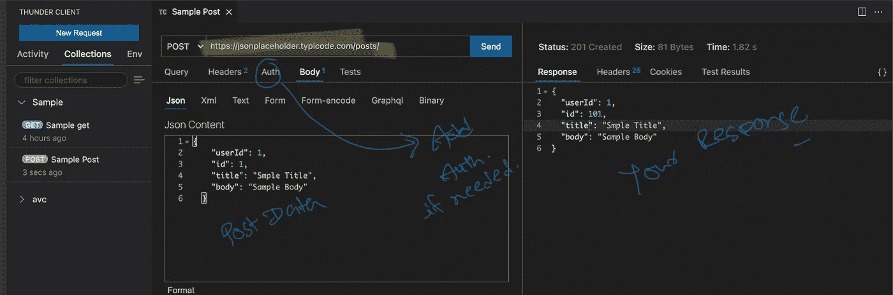

# 我已将邮递员从我的机器中永久删除

> 原文：<https://javascript.plainenglish.io/ive-deleted-postman-from-my-machine-permanently-b40874a15c2?source=collection_archive---------9----------------------->

## 我已经用一个 VSCode 插件取代了邮递员


Photo by [Bundo Kim](https://unsplash.com/@bundo?utm_source=medium&utm_medium=referral) on [Unsplash](https://unsplash.com?utm_source=medium&utm_medium=referral)

对于测试和处理 API，长期以来，邮递员一直是开发人员的默认选择。

但是我认为是时候从你的机器中删除并替换邮差了，因为现在有一些令人兴奋的插件可以用于 VSCode，比如用于 VS Code 的[雷霆客户端](https://www.thunderclient.io)。

本文将展示如何设置、一些应用编程接口演示以及如何在团队中共享。

## 设置

*   安装加长件`Thunder Client`
*   重新加载 VSCode，您可以看到雷霆客户端图标 VSCode。


Thunder Icon in your VSCode

## 它是如何工作的

**GET 请求**

```
https://jsonplaceholder.typicode.com/todos/1
```


Sample GET request

**开机自检请求**

```
https://jsonplaceholder.typicode.com/posts/
```



Sample POST request

## 将其保存在收藏和共享中

您正在开发或测试的所有请求都可以轻松共享。


Just export and share the JSON with you team.

谢谢你的阅读。干杯！

*多内容于* [***中***](http://plainenglish.io)