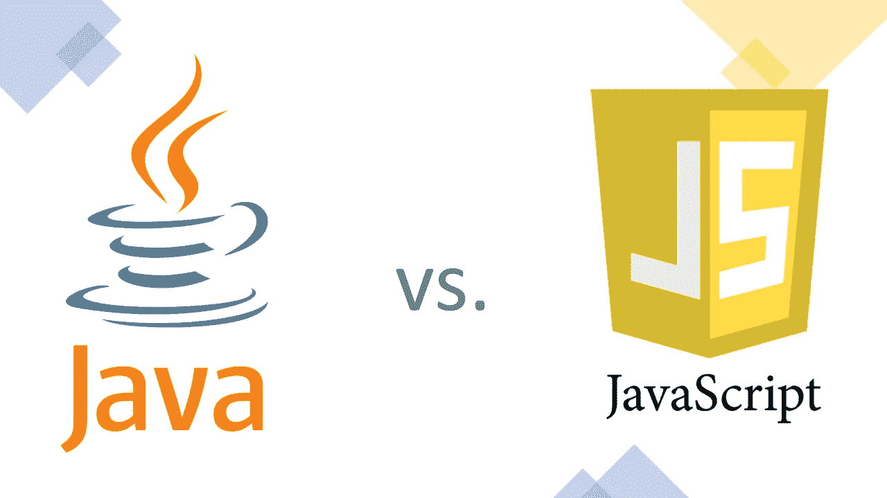
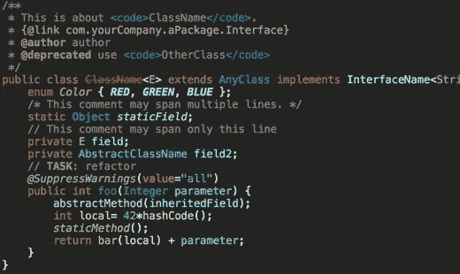
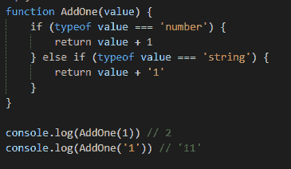

# Java 与 JavaScript——有什么区别？

> 原文：<https://javascript.plainenglish.io/java-vs-javascript-6e670dca91cf?source=collection_archive---------18----------------------->

甚至在今天，许多人还在问“Java 和 JavaScript 有什么区别”这个问题。但不仅如此。Java 和 JavaScript 这两个术语经常被用作同义词，被误认为或简单地认为是另一种语言的演变，这是完全错误的。

因此，现在是一劳永逸地澄清这件事的时候了。但是在我们考虑编程语言 JavaScript 和 Java 之间的区别之前，让我们先了解一下这两个术语的含义以及这两种语言的用途。

# 什么是 Java

这里的 Java 是一种基于类的、面向对象的编程语言，也是世界上最流行的语言之一。它与 Java 开发工具包(JDK)和 Java 运行时环境(JRE)一起构成了 Java 技术的。运行时本身由几个库和 Java 虚拟机(JVM)组成。重要的是要知道，JRE 不仅可以运行从 Java 编译的字节码，还可以运行从其他编程语言编译的字节码，如 [Scala](https://www.scala-lang.org/) 、 [Groovy](https://groovy-lang.org/) 或 [Kotlin](https://kotlinlang.org/) (理论上，如果其他语言有字节码编译器，也可以运行这些语言)。

Java 应用程序是以人类能够理解的形式编写的，也就是所谓的源代码。这些源代码不能直接运行，需要由 Java 编译器编译成计算机可以理解的字节码，Java 编译器是 JDK 的一部分。运行字节码的机器通常是虚拟机。这意味着代码不是直接由硬件运行，而是由目标平台上的软件运行。这种虚拟化支持平台无关性，这是 Java 的一大特性。如果安装了相应的运行时环境，用 Java 编写的应用程序几乎可以在任何设备和计算机架构上运行。

# Java 是谁发明的？

Java 最初是由詹姆斯·高斯林在 20 世纪 90 年代初在太阳微系统公司工作时发明的，因为他对 C++的能力不满意。第一个原型被称为 Oak(对象应用内核),它的目标是交互式电视和其他娱乐设备。最初的编译器是用 C 语言编写的，不久之后，这种语言被重命名为 Java，重心转移到万维网上。

自 2010 年以来，Java 属于甲骨文公司，作为收购太阳微系统公司的一部分。

# 什么是 JavaScript

JavaScript 是一种脚本语言，被标准化为 [ECMAScript](https://www.ecma-international.org/publications/standards/Ecma-262.htm) ，被描述为解释型、动态类型、面向对象但无类。从 ECMAScript 6 开始，由于原型的引入，JavaScript 可以和其他面向对象语言竞争。在 JavaScript 中，人们可以编写面向对象的、过程的或函数式的代码——无论哪种最合适。

# JavaScript 是谁发明的？

1995 年，Brendan Eich 在 Netscape 工作期间创建了 JavaScript(最初称为 LiveScript ),目的是在 web 浏览器中动态 HTML，以分析用户交互以及更改、生成和更新内容。基本上是为了扩展当时 HTML 和 CSS 的能力。

# js 是什么意思？

人们经常使用术语 js 作为术语“JavaScript”的缩写。此外，许多库和框架，如 [Next.js](https://nextjs.org/) 、 [Vue.js](https://vuejs.org/) 或 [Reactjs](https://reactjs.org/) 都用这个来表示它们是用 JavaScript 编写的。

# JavaScript 是解释型语言吗？

这是一个在软件工程工作面试中经常被问到的问题。最初，JavaScript 被设计成一种解释的、高级的动态编程语言。在这个上下文中，解释意味着源代码可以直接由解释器逐行执行。相比之下，Java(或 C++)是一种编译语言，这意味着源代码不能直接运行，而是必须先由编译器编译成字节码。

很多人会告诉你，根据语言规范，JavaScript 确实是一种解释型语言。然而，这不再是一个确定的答案。随着驱动谷歌 Chrome 浏览器的 V8 引擎的兴起，解释型和编译型之间的明显区别变得有些模糊。V8 在执行它和其他现代 JS 实现如 [Rhino](https://developer.mozilla.org/en-US/docs/Mozilla/Projects/Rhino) (实际上是用 Java 写的)之前将 JavaScript 源代码编译成本机代码！)或者 [TraceMonkey](https://wiki.mozilla.org/JavaScript:TraceMonkey) 做类似的事情。

因此，虽然 JavaScript 在理论上是一种解释型语言，但实际的实现是使用解释器和编译器的特性来结合两者的优点。

那么 JavaScript 是解释型语言吗？是的。JavaScript 是编译语言吗？也是的。只是视角的问题。

# Java 是用来做什么的

一般来说，编程语言 Java 用于以人类可读的方式编写代码，这些代码被编译成字节码，在任何类型的设备上的虚拟机上运行。尤其是随着物联网的兴起，数字暴涨。事实上，Java 现在运行在数十亿台设备上。由于其独立于平台的特性，Java 也被用于许多应用程序。

以下是一些例子:

*   API 后端
*   机器学习后端
*   存储后端
*   金融行业中的后端处理
*   原生 Android 应用
*   工业控制系统

大公司使用 Java 作为他们技术栈的基础部分。比如亚马逊的大部分栈包括 AWS 都是基于 Java，用 Java 编写的。

# Java 是做什么的？

Java 作为一种编程语言——如前所述——用于编写在机器上编译和执行的编程代码。你计算机上的 Java(这个问题经常提到的)指的是 Java 运行时环境，JRE。它本身什么也不做，但提供了在本地计算机或分布在网络上的虚拟机上运行基于 Java 的应用程序的基础设施。

# 我需要 Java 吗？

这个问题经常和你是否需要在电脑上安装 Java 的问题联系在一起。虽然一般来说没有必要安装它，但是今天许多应用程序都依赖 Java 运行时环境来运行。因此，如果您想安装一个用 Java 编写的应用程序，是的，您需要安装 Java 运行时环境。但是你不需要安装 JDK 或者了解 Java 编程语言！了解编程语言 Java 的主要原因是如果你想成为一名 Java 开发人员。

# JavaScript 是用来做什么的

JavaScript 使网站具有交互性，并为网络服务器和 API 提供动力。虽然 JS 的使用最初只限于浏览器(客户端)，但今天它也可以用于服务器端，例如使用 node.js。在网站上，JavaScript 处理诸如提交表单、验证用户输入、执行第三方脚本、调用 API 获取数据之类的事情。简而言之，创建交互式应用程序。如果没有 JavaScript，大多数网站将会是我们所说的静态网站。

# 我需要 JavaScript 吗？

今天几乎所有的网站都需要你的浏览器执行 JavaScript 才能正常运行。没有 JS，就不会有脸书、Twitter、亚马逊、insta gram……基本上，这些网站上的所有交互都是由 JavaScript 驱动的。虽然你可以在浏览器中禁用 JavaScript，但这样做并不明智，因为你将不再享受大多数网站的愉快体验。曾经有一段时间，JavaScript 被谴责为邪恶，人们建议阻止它的执行。但时至今日，JavaScript 已经成为互联网不可或缺的一部分，现代浏览器会处理执行 JS 的所有与安全相关的方面。

与 Java 一样，您不能在您的计算机上安装编程语言 JavaScript。一些用 JS 编写的应用程序，比如 web 服务器，需要一个运行时环境才能工作，例如 node.js。但是对于普通用户来说，这是不必要的。

# Java 和 JavaScript 有什么区别？

我希望您现在已经很好地理解了 JavaScript 和 Java 之间的区别。除了名字和都是编程语言之外，JavaScript 和 Java 有着本质的不同。Java 主要用于编写通过 Java 运行时环境在虚拟机上运行的应用程序。JavaScript 用于编写主要由浏览器执行的代码，以创建交互式网站和应用程序。

Java 是一种编译的、严格类型的语言，而 JavaScript 是一种解释的、动态类型的语言。然而，正如你已经读到的，解释语言和编译语言之间的界限在最近几年变得有些模糊。

与 JavaScript 语法相比，Java 的语法也有很大不同:

**Java 语法**

**JavaScript 语法**

# Java 是 JavaScript 的简称吗？

绝对不行！除了相似的名字，这是两种根本不同的编程语言。这种混乱的原因以及它今天仍然存在的原因是有历史原因的。因为 JS 的原名 LiveScript 一直存在版权问题，网景决定将该语言更名为 JavaScript，以从当时 Java 的流行中获利。但是 Java 实际上更接近 C++而不是 JavaScript。

# 什么是 Java 开发者？

Java 开发人员是软件开发人员或工程师，他们专门研究 Java 编程语言，或者对 Java 编程语言有一定的了解，能够用它来编写应用程序。这可以是他们日常工作的一部分，也可以只是一种爱好。因为 Java 主要用于编写服务器端应用程序(后端),所以人们通常称 Java 开发人员为后端开发人员。

因为世界各地的许多公司都使用 Java 作为他们技术体系的一部分，而且这种语言本身也非常受欢迎，所以 Java 开发人员的需求量很大，一般来说收入也很高。

# 什么是 JavaScript 开发者？

JavaScript 开发人员知道如何使用编程语言 JavaScript 编写应用程序。术语“JavaScript 开发人员”通常被用作软件开发人员、软件工程师甚至 web 开发人员的同义词。在 JavaScript 领域，人们和公司经常区分客户端(前端开发人员)和服务器端(后端开发人员)的 JavaScript 开发人员。有些甚至有 React 开发人员或 Vue 开发人员的职位描述，表明他们正在寻找了解特定 JavaScript 框架的工程师。

由于有如此多的网站和应用程序运行 JavaScript，网络开发人员的需求非常大，而且通常收入丰厚。因为 JS 可以在客户端和服务器端使用，所以现在工作机会非常多。

# Java 和 JavaScript——哪个更好？

对于这个问题，只有一个有效的答案:视情况而定。因为 JavaScript 和 Java 的用例以及一般概念是如此的根本不同，所以并不存在孰优孰劣的问题。

Java 比 JavaScript 有一些优势，反之亦然。Java 通常作为计算机科学学位的一部分来教授，而 JavaScript 开发者通常是自学的。而且有些人觉得 JavaScript 更容易学一般编程。但是最好的方法是对这两种语言都持开放态度，并且总是根据具体情况来决定。

*   什么语言对项目或公司最合适？
*   我想在客户端、服务器端还是两者都做(作为一个全栈开发人员)？
*   有多少像学习材料、教程、课程、库、框架等这样的语言资源？
*   我所在的国家或城市的就业市场情况如何？有更多面向 Java 或 JavaScript 开发人员的工作吗？

这里有一个很棒的视频，它也解释了一些关键的区别！

所以很明显，没有一种语言比另一种语言更好，学习 JavaScript 或 Java 的最好方法是实际编写代码。而且有很多可用的资源，有些是免费的，有些你必须付费来支持你的学习。如果你正在寻找可以用 JavaScript 构建的项目，这里有一些很棒的 [JavaScript 项目](https://thesmartcoder.dev/9-awesome-projects-you-can-build-with-vanilla-javascript/)。如果你正在寻找[编程书籍集](https://thesmartcoder.dev/10-must-read-books-for-software-engineers/)，我们也为你准备好了！

这篇文章最初发表在智能编码器的[上。](https://thesmartcoder.dev/java-vs-javascript/)

**如果你喜欢我写的东西并想支持我和我的工作，请跟随我在** [**推特**](https://twitter.com/simonholdorf) **上了解更多关于编程、制作、写作& careers🥰**