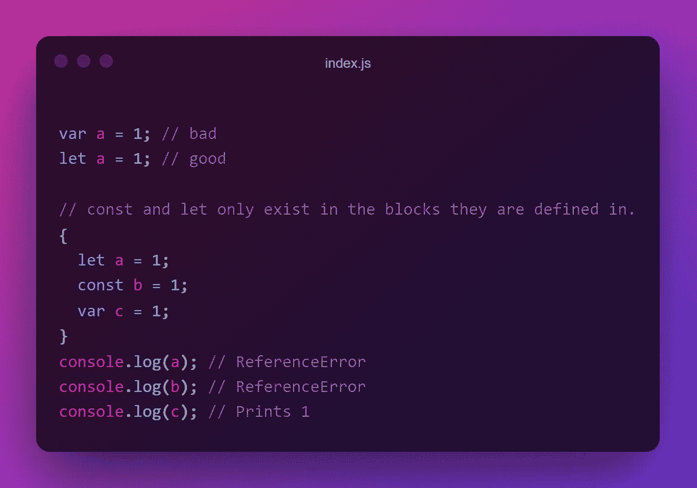
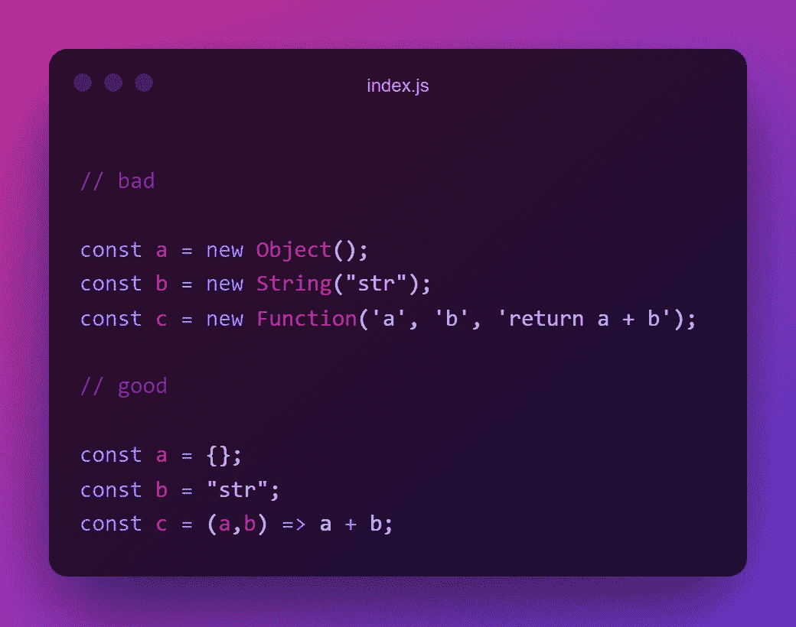
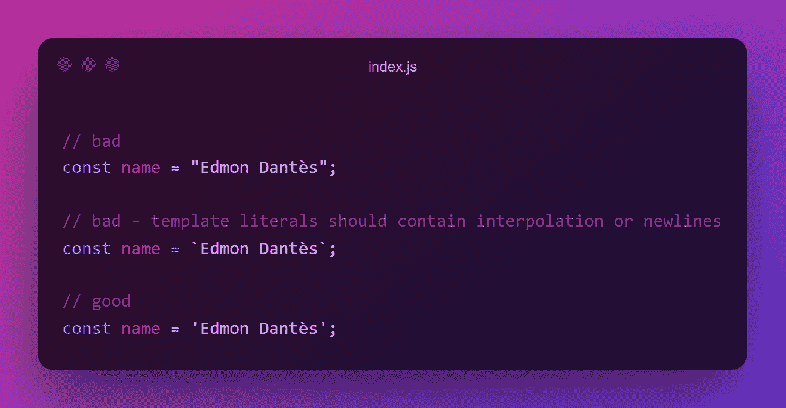
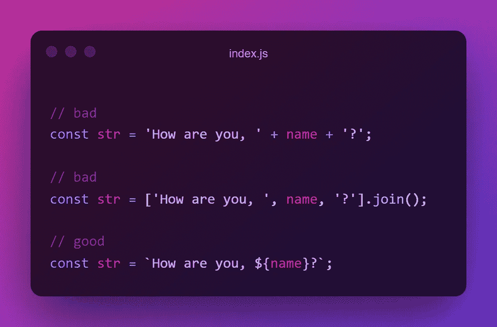
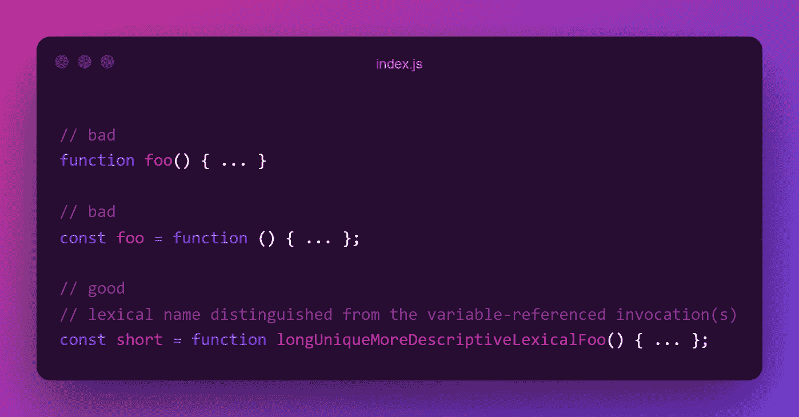
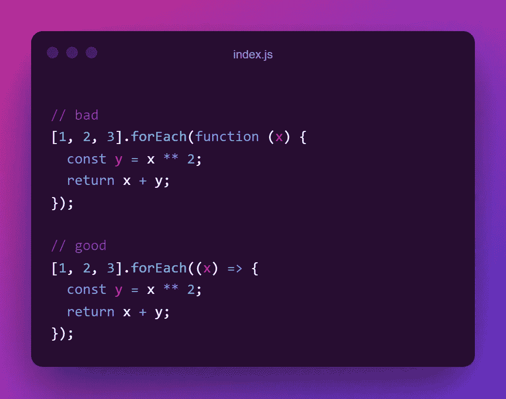
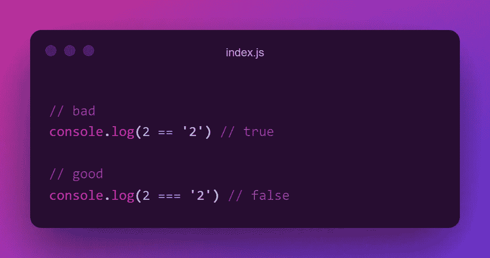
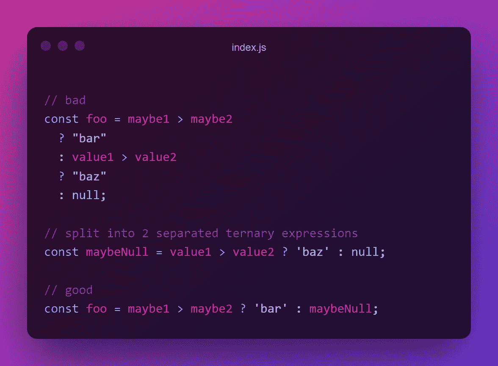
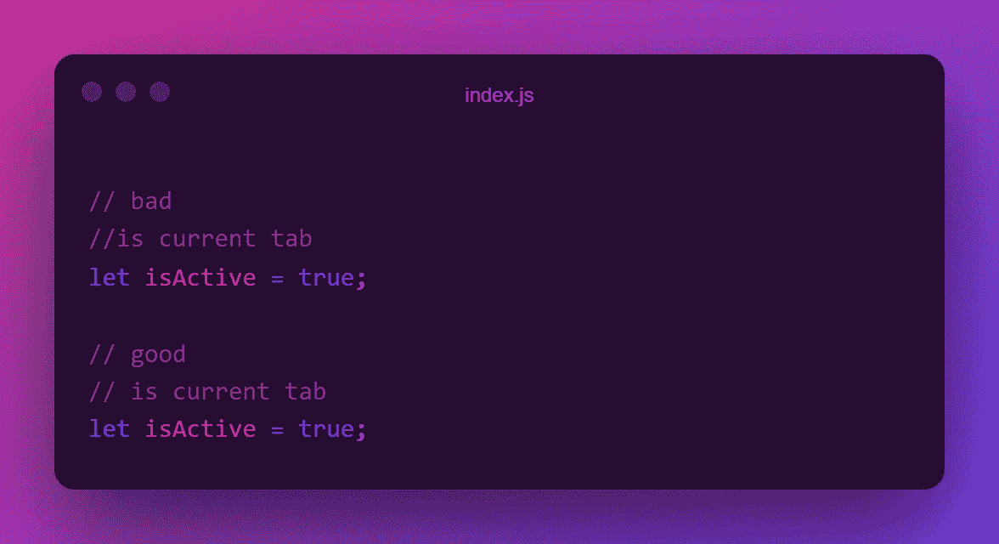
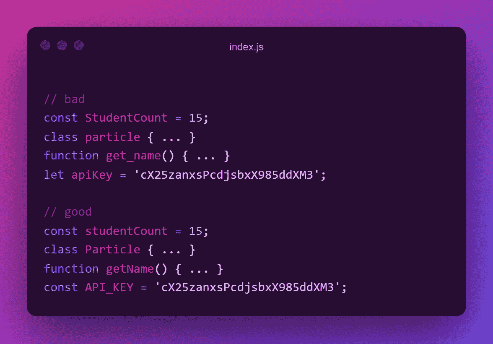

# JavaScript 美学 101:漂亮代码的风格规则

> 原文：<https://javascript.plainenglish.io/javascript-aesthetics-101-style-rules-for-beautiful-code-9d25642512d?source=collection_archive---------6----------------------->

## 亲爱的开发者，这就是合法的 JavaScript 代码的样子。如果你遵循这 10 条规则，你也可以写出这样的代码。


Photo by [Magda Ehlers](https://www.pexels.com/@magda-ehlers-pexels?utm_content=attributionCopyText&utm_medium=referral&utm_source=pexels) from [Pexels](https://www.pexels.com/photo/number-10-text-1339845/?utm_content=attributionCopyText&utm_medium=referral&utm_source=pexels)

你知道为什么很多人反感 PHP 吗？主要是因为它的长相。PHP 可以像你希望的那样丑陋。因为 PHP 的创建者没有为 PHP 建议任何大小写或格式。一些开发人员使用 under_score，而另一些使用 PascalCase。因此，这种不一致最终在 PHP 上造成了巨大的仇恨。

幸运的是，JavaScript 不是这样的，因为编写 JavaScript 代码有一些官方规则。例如，camelCase 是官方推荐的 JavaScript 大小写方法。然而，将这些样式规则提升到一个新的水平并为 JavaScript 创建一个通用的可视化是至关重要的，原因如下:

*   在整个代码库中保持一致的风格使得阅读和修改变得容易。
*   当另一个 JS 开发人员看到你写的代码时，他/她不会感到不舒服，因为一切都很熟悉。
*   随着项目的进行，你写的代码越多，如果没有风格指南，维护和改进就越困难。

因此，这里是我在 Airbnb 的 [JavaScript 风格指南](https://github.com/airbnb/javascript/blob/master/README.md)中的最佳选择。使用这些规则将使您的代码更具可读性和一致性。而且你写的代码，4 个月就能被其他开发者甚至你轻松读懂。

[](https://betterprogramming.pub/11-rare-javascript-one-liners-that-will-amaze-you-331659832301) [## 11 个罕见的 JavaScript 一行程序会让你大吃一惊

### 因为谁不喜欢只用一条线来建造东西呢

better 编程. pub](https://betterprogramming.pub/11-rare-javascript-one-liners-that-will-amaze-you-331659832301) 

# 1.对变量声明使用 Let 和 Const

`let`和`const`关键字是 ES2015 中引入的，它们将取代`var`。但是`var`怎么了？嗯，很多。

`var`从一开始就在 JavaScript 中，但对于今天的标准来说，它有一些缺点。随着项目的发展，它被提升并限定了功能范围，这导致了全球范围内意想不到的行为和污染。例如，因为`var`不是块范围的，所以它也被定义在块级标记之外，比如`if`和`for`。例如，迭代变量`i`是在循环完成后定义的。如果你想了解更多，你可以[访问这里](https://www.javascripttutorial.net/es6/difference-between-var-and-let/)。



Use const and let over var to declare a new variable.

# 2.尽可能使用隐式构造函数

如果您正在开发 JavaScript，您应该知道有多种方法可以完成相同的任务。例如，您可以使用 ternaries 或 if-else 块来创建条件逻辑。这种多样的选择有时会导致您编写的代码不一致。

要创建一个空对象，可以使用`Object`构造函数或者隐式构造函数`{}`。字符串、函数、数组、数字等也是如此。为了保持一致性和易读性，尽可能使用隐式构造函数。



Don’t use explicit constructors while there is an implicit alternative.

# 3.字符串首选单引号

为了保持一致性，在所有代码库中，对字符串使用单引号`'`而不是双引号`"`和模板文字(反斜杠)```。为了简化这个过程，你可以使用更漂亮的格式立即。



It is really crucial to use one type of quotes across all codebase.

# 4.尽可能使用字符串插值

正如我提到的，在 JavaScript 中，有许多方法可以获得相同的结果，但其中一些方法比其他方法更复杂。要连接字符串，可以在数组上使用`+`操作符、`join`方法，或者在字符串上使用`concat`方法。然而，使用模板文字是完成这项任务最复杂、最简单的方法。



Using template literals for string concatenation is one of the most elegant ways.

# 5.选择命名函数表达式

一般来说，每个人都有自己喜欢的方法来创建函数，因为 JavaScript 在方法方面非常丰富。有箭头函数，匿名函数表达式，函数声明等。但是要编写一致且可读的 JavaScript 代码，您应该在任何地方都使用一种类型。

使用命名函数表达式代替声明有一些重要的优点。函数表达式是不提升的，这意味着要使用一个函数，你需要首先在顶层或者在另一个模块中定义它。此外，名称可以很长并且是描述性的，这样可以防止单独使用注释。因此，代码可读性更好。



Named function expressions prevent confusion and let you add a long descriptive name to functions.

# 6.在回调中首选箭头函数

还有像`map`或`filter`这样的方法，它们将匿名函数作为参数。在这些情况下，您有很多选择，但是使用 arrow 函数是最方便、最优雅的方式。因为，它在`this`的上下文中创建了一个版本的 arrow 函数，这通常是你想要的，是一个更简洁的语法。



Using arrow functions in inline callbacks is a more concise way to do it.

# 7.使用严格等于进行相等比较

有两种类型的相等运算符:宽松运算符和严格运算符。松散的是比较无牵挂型的`==`和`!=`。例如，`2`和`'2'`根据宽松的比较是相等的。然而，如果你使用严格的，`===`和`!==`，那么它也会考虑类型，这通常是预期的结果。



Always use strict equality in comparisons.

# 8.不要筑巢

三元运算符允许您创建内嵌条件语句。在`if-else`语句中使用它，您真的可以节省许多行代码。然而，根据定义，它必须是内联的和短的。因为嵌套的 ternaries 极大地损害了代码的可读性。



Ternaries are intended to be inline. Use them for 1 condition.

# 9.注释以空格开始

为了增加可读性，一定要在注释的开头加一个空格。



Putting a space before a comment makes it easier to read.

# 10.选择正确的套管样式

正如我在引言中提到的，如果代码是一致的，那么大小写风格是使代码看起来不错的最重要的概念之一。在 JavaScript 中，大小写样式有一些约定。

*   命名对象、函数、变量和实例时使用`camelCase`。
*   仅在命名构造函数或类时使用`PascalCase`。
*   命名不可重新分配的变量和枚举时，使用`UPPERCASE_VARIABLES`。
*   根本不要用`snake_case`或`kebab-case`。

如果你想进一步阅读更多的例子，一定要看看这篇博文。



写一个计算机能理解的代码一点也不难。然而，编写人类容易理解的代码是一个挑战。这就是为什么有一些关于编码的基本规则，真的会产生好代码和坏代码的区别。

在这篇文章中，我试图分享我在编写优秀 JavaScript 代码时不可或缺的规则，使用 AirBNB 的 [JavaScript 风格指南](https://github.com/airbnb/javascript/blob/master/README.md)。这些是我的首选，但是如果你看一下这份全面的风格指南，我相信你会发现一些你还不知道的东西。

谢谢你们的阅读。如果你喜欢，一定要鼓掌，如果你有更多对你很重要的风格规则，留下回应。下一个故事再见。

***延伸阅读***

[](https://betterprogramming.pub/7-must-know-websites-to-boost-your-frontends-b3ea0bb282e6) [## 7 个必须知道的网站来提升你的前端

### 简单而有用的网站，你会每天使用

better 编程. pub](https://betterprogramming.pub/7-must-know-websites-to-boost-your-frontends-b3ea0bb282e6) [](https://betterprogramming.pub/did-you-know-html-thinks-chuck-norris-is-a-color-9f67edf4c34) [## 你知道 HTML 认为查克·诺里斯是一种颜色吗？

### 很奇怪，不是吗？原因如下

better 编程. pub](https://betterprogramming.pub/did-you-know-html-thinks-chuck-norris-is-a-color-9f67edf4c34) [](https://medium.com/nerd-for-tech/3-extremely-useful-react-tips-to-speed-up-the-development-process-c4c966814c52) [## 3 个非常有用的 React 技巧来加速开发过程

### 如今，React 已经慢慢成为了 web 应用程序的新标准，而且看起来它不会有任何发展…

medium.com](https://medium.com/nerd-for-tech/3-extremely-useful-react-tips-to-speed-up-the-development-process-c4c966814c52) 

*更多内容看*[***plain English . io***](http://plainenglish.io/)