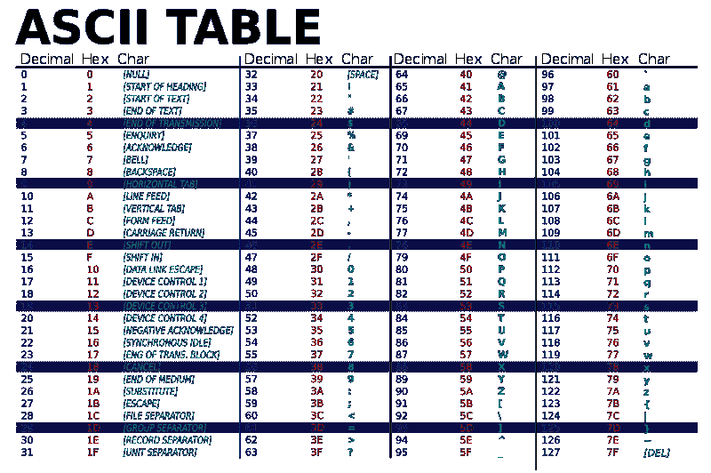

# JavaScript 算法:将字符串转换成 ASCII

> 原文：<https://javascript.plainenglish.io/javascript-algorithm-convert-string-characters-into-ascii-bb53ae928331?source=collection_archive---------4----------------------->

## 创建一个函数，该函数将返回一个包含字符串中每个字符的 ASCII 码的数组。


Photo by [Alexander Sinn](https://unsplash.com/@swimstaralex?utm_source=medium&utm_medium=referral) on [Unsplash](https://unsplash.com?utm_source=medium&utm_medium=referral)

我们将编写一个名为`getCharCodes`的函数，它将接受一个字符串`s`作为参数。

该函数的目标是从我们的字符串输入中返回一个包含每个字符的 ASCII 码的数组。

示例:

```
getCharCodes("I like JavaScript")//output: [73,32,108,105,107,101,32,74,97,118,97,83,99,114,105,112,116]
```



[ASCII-Table.svg: ZZT32derivative work: LanoxxthShaddow](https://commons.wikimedia.org/wiki/File:ASCII-Table-wide.svg), Public domain, via Wikimedia Commons

该图显示了一个 ASCII 表。如果您查看我们示例中的字符串中的每个字符，您会在 **Decimal** 列下看到它的十进制等价字符。

我们通过创建一个空数组并将其赋给一个名为`charCodeArr`的变量来开始我们的函数。这个数组将包含我们在`s`中每个字符的 ASCII 码。

```
let charCodeArr = [];
```

接下来，我们将使用 for 循环来遍历我们的字符串。为了获得我们的 ASCII 代码，我们将使用一个叫做`charCodeAt()`的 JavaScript 字符串方法。该方法的作用是检索字符串中特定位置的字符的 Unicode 值(或 ASCII 码)。

我们将该 Unicode 值赋给一个名为`code`的变量，然后将该值添加到`charCodeArr`数组中。

```
for(let i = 0; i < s.length; i++){
    let code = s.charCodeAt(i);
    charCodeArr.push(code);
}
```

在我们遍历字符串之后，我们返回数组。

```
return charCodeArr;
```

下面是完整的函数:

如果您发现这个算法很有帮助，请查看我的其他 JavaScript 算法解决方案文章:

[](https://levelup.gitconnected.com/javascript-algorithm-power-calculator-372c5f2d41eb) [## JavaScript 算法:功率计算器

### 使用给定的电压和电流计算电量的功能。

levelup.gitconnected.com](https://levelup.gitconnected.com/javascript-algorithm-power-calculator-372c5f2d41eb) [](/javascript-algorithm-convert-string-to-an-array-of-characters-197f3f64ab79) [## JavaScript 算法:将字符串转换为字符数组

### 创建一个将字符串转换为字符数组的函数。

javascript.plainenglish.io](/javascript-algorithm-convert-string-to-an-array-of-characters-197f3f64ab79) [](https://levelup.gitconnected.com/javascript-algorithm-return-an-array-of-words-from-a-sentence-b9b74e97ebd3) [## JavaScript 算法:从句子中返回单词数组

### 创建一个函数，该函数将返回一个包含字符串中所有单词的数组。

levelup.gitconnected.com](https://levelup.gitconnected.com/javascript-algorithm-return-an-array-of-words-from-a-sentence-b9b74e97ebd3)