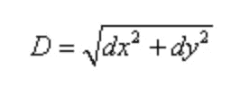

# JavaScript 算法:两点之间的距离

> 原文：<https://javascript.plainenglish.io/javascript-algorithm-distance-between-points-7fe0026857e3?source=collection_archive---------1----------------------->

## 创建一个函数来计算由 x 和 y 坐标定义的两点之间的距离。


Photo by [Isaac Smith](https://unsplash.com/@isaacmsmith?utm_source=medium&utm_medium=referral) on [Unsplash](https://unsplash.com?utm_source=medium&utm_medium=referral)

我们将编写一个名为`getDistance`的函数，它将接受四个整数(`x1`、`x2`、`y1`和`y2`)作为参数。

给我们两个点的坐标(x1，y1)和(x2，y2)。该函数的目标是返回这两点之间的距离。

为了得到这两点的距离，我们使用下面的公式:



***dx*** *是点的 x 坐标之差，而* ***dy*** *是点的 y 坐标之差。*

示例:

```
getDistance(100, 100, 400, 300)// output: 360.5551275463989
```

在上面的例子中，我们有点 1: (100，400)和点 2: (100，300)

如果我们得到`x1`和`x2`的值并减去差值，我们得到 dx。如果我们对`y1`和`y2`做同样的处理，减去差值，我们得到 yx。

现在我们可以用上面的公式把 x 和 y 的差加在一起，然后开平方得到我们的答案。

让我们把上面的小伪代码翻译成代码。

为了得到 x 坐标之间的差值，我们从`x1`中减去`x2`，并将其赋给一个名为`x`的变量。

```
let y = x2 - x1;
```

我们对 y 坐标做了同样的处理:

```
let x = y2 - y1;
```

使用上面的公式，我们平方`x`和`y`。之后，我们将它们的平方结果相加。

```
x * x + y * y
```

接下来，使用来自数学对象`Math.sqrt()`的 JavaScript 方法，我们可以对上面的结果求平方根并返回它。

```
return Math.sqrt(x * x + y * y);
```

下面是完整的函数:

如果你觉得这个算法有帮助，看看我的其他 JavaScript 算法解决方案:

[](https://levelup.gitconnected.com/javascript-algorithm-record-collection-fc107c1eb612) [## JavaScript 算法:记录收集

### 我们编写一个函数来修改一个包含多个音乐记录的 JSON 对象。

levelup.gitconnected.com](https://levelup.gitconnected.com/javascript-algorithm-record-collection-fc107c1eb612) [](/javascript-algorithm-hiding-the-card-number-413801b267e9) [## JavaScript 算法:隐藏卡号

### 编写一个函数，只显示信用卡号的最后四位数字。

javascript.plainenglish.io](/javascript-algorithm-hiding-the-card-number-413801b267e9) [](/javascript-algorithm-convert-string-characters-into-ascii-bb53ae928331) [## JavaScript 算法:将字符串转换成 ASCII

### 创建一个函数，该函数将返回一个包含字符串中每个字符的 ASCII 码的数组。

javascript.plainenglish.io](/javascript-algorithm-convert-string-characters-into-ascii-bb53ae928331)