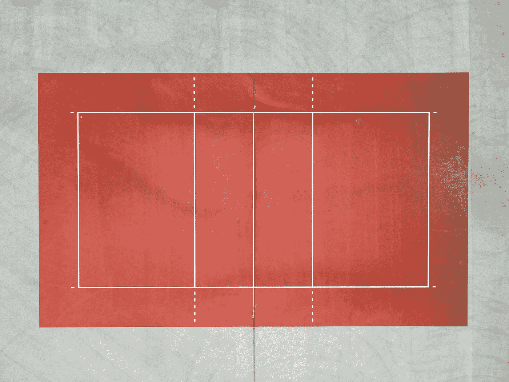

# JavaScript 算法:求矩形的周长

> 原文：<https://javascript.plainenglish.io/javascript-algorithm-find-the-perimeter-of-a-rectangle-96ecb7ab0ea2?source=collection_archive---------8----------------------->

## 创建一个寻找矩形周长的函数。



Photo by [Michele Feola](https://unsplash.com/@smikefeola?utm_source=medium&utm_medium=referral) on [Unsplash](https://unsplash.com?utm_source=medium&utm_medium=referral)

今天，我们将编写一个名为`findPerimeter`的函数，它将接受两个整数`length`和`width`作为参数。

给你一个矩形的长度和宽度。该函数的目标是输出矩形的周长。我不知道你在学校什么时候开始学习简单的几何，但是你可以用这个来计算一个矩形的周长:

```
perimeter = (length + width) * 2
perimeter = length + length + width + width
perimeter = (length * 2) + (width * 2)
```

上面所有的例子都是获得矩形周长的多种方法。它们都是以不同的方式完成的，但是它们都指向同一个答案。

既然我已经帮你重新学习了几何，这里有几个例子:

```
findPerimeter(6, 7) ➞ 26
findPerimeter(20, 10) ➞ 60
```

如果您将这些输入值代入上述周长公式，您的函数将按照箭头输出数字。

这是第一个例子的一步一步的过程。

```
Length = 6
Width = 7Perimeter = (6 + 7) * 2
Perimeter = (13) * 2
Perimeter = 26
```

既然你明白了这一点，让我们把它变成代码。

因为您知道计算矩形周长的公式，所以您可以将该公式分配给一个名为`perimeter`的变量，并返回该变量。你也可以只返回公式(上面计算周长的任何不同方法都是有效的)。

```
return (length * 2) + (width * 2);
```

以下是剩余的代码:

如果您发现这个算法很有帮助，请查看我的其他 JavaScript 算法解决方案文章:

[](https://levelup.gitconnected.com/javascript-algorithm-validate-code-with-simple-regex-827bbbc066dd) [## JavaScript 算法:用简单的正则表达式验证代码

### 编写一个使用正则表达式验证数字代码的函数。

levelup.gitconnected.com](https://levelup.gitconnected.com/javascript-algorithm-validate-code-with-simple-regex-827bbbc066dd) [](https://levelup.gitconnected.com/javascript-algorithm-title-case-a-sentence-995da42238f0) [## JavaScript 算法:标题大小写一句话

### 我们写了一个将字符串转换成标题大小写的函数

levelup.gitconnected.com](https://levelup.gitconnected.com/javascript-algorithm-title-case-a-sentence-995da42238f0) [](https://medium.com/javascript-in-plain-english/javascript-algorithm-vowel-remover-c8808868ee55) [## JavaScript 算法:元音去除器

### 我们将创建一个函数来删除字符串中的所有元音

medium.com](https://medium.com/javascript-in-plain-english/javascript-algorithm-vowel-remover-c8808868ee55)