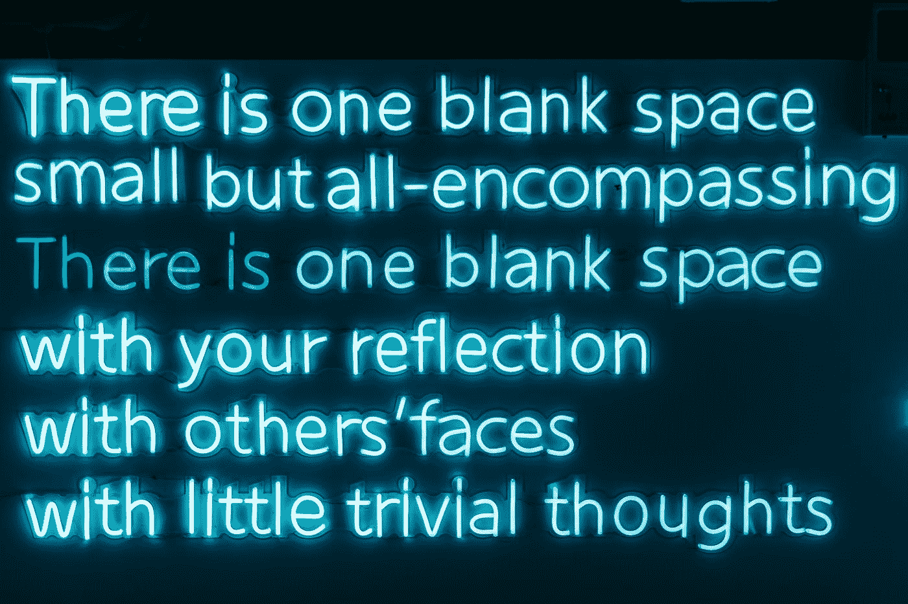

# JavaScript 算法:查找字符串中最长的单词

> 原文：<https://javascript.plainenglish.io/javascript-algorithm-finding-the-longest-word-in-a-string-2e7458ef4cef?source=collection_archive---------10----------------------->

## 创建一个函数来返回包含字符串中最长单词的数组。



Photo by [Road Trip with Raj](https://unsplash.com/@roadtripwithraj?utm_source=medium&utm_medium=referral) on [Unsplash](https://unsplash.com?utm_source=medium&utm_medium=referral)

今天我们将编写一个名为`getLongestWords`的函数，它将接受一个字符串`text`作为参数。

该函数的目标是返回一个包含字符串中最长单词的数组。如果多个字具有相同的字长并且字长也是最大的，则该数组可以有多个字。

示例:

```
let text = "Everyone should learn how to program a computer because it teaches you how to think";getLongestWords(text)// output: *["Everyone", "computer"]*
```

字符串中最长的单词是`"Everyone"`，但是因为`"computer"`也有相同的单词长度，所以两个字符串都被添加到数组中。

首先，我们将使用`replace()`方法删除字符串中的所有标点符号，并使用`split()`将字符串转换为数组。我们将该数组赋给一个名为`textArr`的变量。

```
let textArr = text.replace(/[^A-Za-z0-9\s]/g, "").split(" ");
```

接下来，我们将根据单词长度对数组进行排序，最长的单词排在第一位。我们将创建另一个名为`sortByLength`的函数，它将使用`sort()`函数和一个比较函数对数组进行排序。

```
function sortByLength (array) {
    return array.sort((x,y) => y.length - x.length);
}
```

我们将排序后的数组赋给一个名为`textArrSort`的变量。

```
let textArrSort = sortByLength(textArr);
```

我们创建两个额外的变量。第一个变量`letterCount`将保存每个单词的字母数。我们将`0`赋给这个变量。第二个变量`largestWords`将是保存最长单词的数组。

我们现在给它分配一个空数组。

```
let letterCount = 0;  
let largestWords = [];
```

我们已经处理完变量了。接下来，我们将循环通过`textArrSort`。

```
for(let i = 0; i < textArrSort.length; i++){
    if(textArrSort[i].length >= letterCount){
        largestWords.push(textArrSort[i]);
        letterCount = textArrSort[i].length;
    }
}
```

在 for 循环中，我们检查当前字长是否大于`letterCount`的当前值。如果是，我们将该单词添加到我们的`largestWords`数组中，并将我们的`letterCount`变量更新为该单词的长度。

由于我们已经对数组进行了排序，我们将继续添加到`largestWords`数组中，直到下一个字长小于当前的`letterCount`。

一旦循环结束，我们返回数组。

```
return largestWords;
```

以下是我们节目的其余部分:

如果您发现这个算法很有帮助，请查看我的其他 JavaScript 算法解决方案文章:

[](https://levelup.gitconnected.com/javascript-algorithm-calculate-sum-of-all-numbers-in-a-jagged-array-94230951d726) [## JavaScript 算法:计算交错数组中所有数字的和

### 创建一个计算交错数组中所有数字之和的函数。

levelup.gitconnected.com](https://levelup.gitconnected.com/javascript-algorithm-calculate-sum-of-all-numbers-in-a-jagged-array-94230951d726) [](https://levelup.gitconnected.com/javascript-algorithm-array-plus-array-19e17c70e9fe) [## JavaScript 算法:数组加数组

### 写一个计算两个数组之和的函数。

levelup.gitconnected.com](https://levelup.gitconnected.com/javascript-algorithm-array-plus-array-19e17c70e9fe) [](/javascript-algorithm-hex-to-decimal-3400f3742d1e) [## JavaScript 算法:十六进制到十进制

### 写一个将十六进制数转换成十进制数的函数。

javascript.plainenglish.io](/javascript-algorithm-hex-to-decimal-3400f3742d1e)