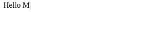
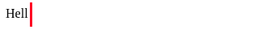
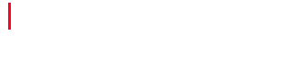
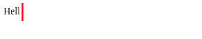
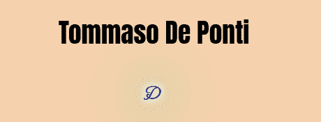

# JavaScript 惊人的打字机写-重写动画

> 原文：<https://javascript.plainenglish.io/javascript-amazing-typewriter-write-rewrite-animation-8e36d36cc793?source=collection_archive---------13----------------------->

## 简单且易于实现的动画，用于创建令人惊叹的效果。


Photo by [Markus Winkler](https://unsplash.com/@markuswinkler?utm_source=medium&utm_medium=referral) on [Unsplash](https://unsplash.com?utm_source=medium&utm_medium=referral)

打字机写/重写效果是一个简单的 JS 动画，已经在许多网站的前端流行起来。它用一个伟大的设计给你的页面增添了一点活力。

在这篇文章中，我将向你展示如何使用一个轻量级的 JS 插件在几分钟内以一种极其简单的方式实现这个动画。

# 设置

在开始 JS 代码之前，我们需要一个 HTML 页面。此外，我们将通过`<script>`标签从 HTML 中导入[打字机](https://github.com/tameemsafi/typewriterjs)。

```
<!DOCTYPE html>
<html lang="en">
<head>
    <meta charset="UTF-8">
    <title>Typewriter write/rewrite Animation</title>
</head>
<body><div id="awesomeAnimation"></div><script src="https://unpkg.com/typewriter-effect@latest/dist/core.js"></script>
<script src="main.js"></script></body>
</html>
```

这是一个基本的 HTML 文档，但是我们添加了一些重要的东西:

*   这将是显示我们键入文本的 div
*   `<script src=”[https://unpkg.com/typewriter-effect@latest/dist/core.js](https://unpkg.com/typewriter-effect@latest/dist/core.js)"></script>`→这一行将加载[打字机 JS](https://github.com/tameemsafi/typewriterjs) 插件，因此我们将能够在我们的 JS 代码中使用它
*   `<script src=”main.js”></script>`→将加载我们的 JS 代码

如果你还没有这样做，并且你正在一步一步地遵循这篇文章，创建`script.js`文件。

现在我们已经准备好开始制作`script.js`文件了

# 基础

为了让您对这个插件有一个全面的了解，我们将从基础开始:

```
const textField = document.getElementById('awesomeAnimation');

const typewriter = new Typewriter(textField, {
    loop: true,
    delay: 200,
});

typewriter
    .typeString(`<span>Hello Medium</span>`)
    .start()
```

我们已经选择了我们的字段(`“awesomeAnimation`)，然后用基本配置定义了我们的打字机，比如循环运行，每个字符延迟 200 毫秒。

最后，我们叫打字机打好`Hello Medium`，然后启动它。

这是结果:



现在，让我们来看看打字机更“高级”的用法。

## 修改光标

使用 CSS 可以得到更好的光标。在我们的`style.css`文件中，让我们为光标创建一个样式:

然后，在我们的打字机的配置中，我们告诉它我们希望我们的光标有`cursor`作为类:

```
cursorClassName: ‘cursor’,
```

此外，我们不希望显示原始光标，我们很容易用下面这行代码来实现(总是在配置中):

```
cursor: ''
```



## 删除文本

假设您想要这样的东西:



工作流程是删除`Medium`，然后输入`Readers`。我们使用`.deleteChars()`和`pauseFor()`方法完成这项工作:

## 粘贴文本

如果您不想让某些文本被打印出来，就像下面的例子一样一个字母一个字母地写:



这个插件覆盖了你，`pasteString()`是你正在寻找的方法:

# 提示:添加 CSS 并使用其他字体

不一定非得是 [CSS 艺术](https://betterprogramming.pub/how-to-build-amazing-css-art-as-a-beginner-53454a50b0eb?source=your_stories_page-------------------------------------)，然而少量的 CSS 就能完全改变这部动画。此外，我建议使用和尝试许多字体，使用谷歌字体，你可以在两次点击中使用它们！

例如，我会将以下 CSS 代码添加到该页面:

此外，我们需要导入蒙特卡洛字体，放在你的`<head>` : `<link href=”https://fonts.googleapis.com/css2>family=MonteCarlo&display=swap" rel=”stylesheet”>`

这是结果，对我来说，它看起来好得多:


# 后续步骤

现在，您已经准备好实现这个简单而好看的动画了。为了更进一步，我推荐阅读[写得很好的打字机文档](https://github.com/tameemsafi/typewriterjs)。

这是一个如何在你的网站上使用这个动画的例子



你刚刚看到的 GIF 是我的作品集网站中的，我将在短时间内发布(很快会有更多)，帮我在那里选择更好的颜色😅。

感谢阅读！

*更多内容请看*[***plain English . io***](http://plainenglish.io/)