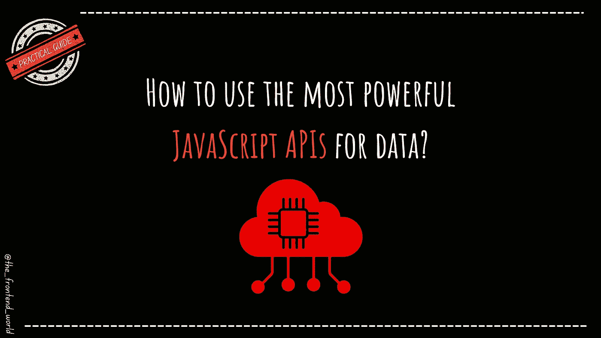

# 每个 Web 开发人员都应该知道的 JavaScript APIs

> 原文：<https://javascript.plainenglish.io/javascript-apis-every-web-developer-should-know-fa9b36cc1ecf?source=collection_archive---------2----------------------->

## 如何使用最强大的 JavaScript APIs 的实用指南。

现代浏览器 JavaScript APIs 可以帮助您构建令人惊叹的
web 应用程序，这些应用程序可以更好地离线工作，并提供更好的整体用户体验。

当涉及到网站时，我们呈现一个向用户展示数据和信息的设计。每个开发者都应该以提高数据检索、存储、获得更好的 app 性能、构建强大的网页为最终目标， ***创造最佳用户体验*** 。

在本文中，我将通过代码示例列出我最喜欢的 JavaScript APIs。

# 1-设备内存 API

这个 API 非常简单。我们使用名为 Device Memory 的全局导航器对象上的一个可用属性。虽然它很简单，但它提供了有价值的信息，您可以使用这些信息来计算用户设备的存储容量，并相应地定制用户体验，以充分利用用户的资源。

## 代码示例:

# 2-持久存储

你怎么知道有多少存储空间是可用的，有多少已经被使用了？当浏览器没有本地内存来存储和维护网站的数据时，会发生什么？嗯，浏览器会自动尝试清空存储空间。我想你知道这里有什么问题了吧？**离线应用将无法正常工作**。这个 API 告诉浏览器尽最大努力优先维护网站的数据。因此，如果存在内存压力，离线应用程序的关键数据将被优先考虑，如果没有空间供有权限请求的浏览器使用，这些数据将被清除。

要做到这一点，我们需要将存储标记为持久存储，在清除它之前，浏览器会通知用户并请求允许删除这些数据。

## 代码示例:

# 3 缓存 API

我们可以通过 fetch API 获取必要的数据，但是有时候需要本地存储。这一次我们将使用缓存 API 来完成这项任务。缓存 API 使得获取 HTTP 请求的结果并存储它们以备后用变得很容易。

## 代码示例:

*   现场看([链接](https://codepen.io/thgreasi/pen/ojYKeE))

# 3-获取 API

我们通常使用 XML HTTP 请求 API 或者 Ajax 来获取数据。这对 web 应用程序的质量有很大的影响。Fetch API 帮助您提高 HTTP 请求的质量，并简化来自远程服务器的数据请求的编码。

## 代码示例:

# 4-本地饲料 API

local feed 是一种简化的方法，我们可以用 indexedDB 将重要数据存储在一个或多个数据库中。它是由 Mozilla 创建的第三方库。您可以下载并在您的应用程序中轻松使用它。使用这个 API，您可以将 indexedDB 视为键和值的简单存储。

# 外卖:

*   要快速检索一个样本 JSON 代码，使用[Httpbin.org](http://httpbin.org/json)
*   Fetch 是一个`**promise**`，所以它可以和`**then**`和`**catch**`一起用作任何其他的承诺。
*   我们确保使用`**clone()**` 来复制对象，以确保我们复制的是实际的对象，而不是它的引用。
*   `**localForage**`使用 javascript 承诺。

> *每当有新的热门文章发布，第一个得到通知的是***！**

*如果你有兴趣成为付费会员，你可以使用我的推荐[链接](https://famzil.medium.com/membership)。下次见*

*亲爱的读者，感谢你在我生命中的存在。*

***让我们接触一下** [**中**](https://medium.com/@famzil/)**[**Linkedin**](https://www.linkedin.com/in/fatima-amzil-9031ba95/)**[**脸书**](https://www.facebook.com/The-Front-End-World)**[**insta gram**](https://www.instagram.com/the_frontend_world/)**[**YouTube**](https://www.youtube.com/channel/UCaxr-f9r6P1u7Y7SKFHi12g)**或***********

*****见我的[电子书](http://www.fam-front.com/)关于网络要义和一般文化。*****

******更多内容看*[***plain English . io***](http://plainenglish.io/)*****