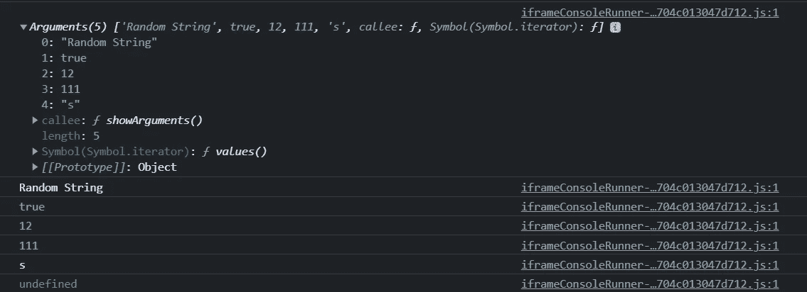

# 关于 JavaScript Arguments 对象您需要知道的一切

> 原文：<https://javascript.plainenglish.io/javascript-arguments-object-everything-you-need-to-know-62a298057972?source=collection_archive---------16----------------------->

## 理解 JavaScript 中函数的关键部分

Photo by [Clément Hélardot](https://unsplash.com/@clemhlrdt?utm_source=medium&utm_medium=referral) on [Unsplash](https://unsplash.com?utm_source=medium&utm_medium=referral)

函数是创建高效、简洁的 JavaScript 代码的重要组成部分。

如果你不知道函数是什么，它们是为执行特定任务而设计的代码块。

例如，您可能有一个唯一的目的是将两个数字相加的函数。该函数将接受参数，可能如下所示:

但是，如果我们想把 2 个、3 个甚至 100 个数字加在一起，我们该怎么办呢？

我们必须为每一种可能性创建一个单独的函数吗？

幸运的是，我们不需要！

由于 JavaScript 中的 *arguments* 对象，我们将能够创建一个函数来添加不同数量的数字。

我们将通过创建一个可以将任意数量的数字相加的函数来学习 arguments 对象。

*链接到完整的代码将在文章的底部*

# **什么是*论证*对象？**

首先，在我们可以在函数中使用参数*对象之前，理解它是什么是很重要的。*

根据 [MDN 文档](https://developer.mozilla.org/en-US/docs/Web/JavaScript/Reference/Functions/arguments)，其*参数*对象为:

**“…是一个类似数组的对象，可在** [**函数**](https://developer.mozilla.org/en-US/docs/Web/JavaScript/Guide/Functions) **中访问，其中包含传递给该函数的参数值。”**

用外行人的话来说，我们传递给函数的任何值，不管是字符串、整型还是布尔型，都包含在*参数*对象中

我在下面展示了一个例子:

如果您喜欢进入控制台，您将看到 *arguments* 对象，其中包含所有参数

我在下面的控制台中展示了一个示例:

Example of what you can expect to see in the console

因为 arguments 对象是一个类似数组的对象，所以我们也可以索引数组的每个元素。

下面修改后的代码显示了如何使用 for 循环遍历数组中的每一项:

这是您可以在控制台中看到的内容:

*注意:****arguments****对象只在以 function 关键字开头的非箭头函数中可用。*

# **在函数中使用参数对象**

现在我们对参数对象有了更好的理解，是时候创建我们的函数了。

代码样本如下

*注意:因为我们将使用 arguments 对象，所以不需要指定任何参数*

Boilerplate Code

由于我们的函数将返回 1 个值，我将添加一个名为 *total* 的变量来保存我们的运行计数，并将该值记录到控制台:

Variable named “total” added

太好了！

下一步是使用 for 循环遍历*参数*对象中的每个值，并将其添加到总数中

链接到 CodePen:【https://codepen.io/azizbooker/pen/XWgzaON?editors=1010 

# 结论

感谢您阅读完我的文章**“关于 JavaScript Arguments 对象您需要知道的一切”**。我希望你有美好的一天。以下是我的一些进一步的文章供你阅读:

 [## 如何在 React 和 React Native 中以正确的方式实现条件呈现

### 在 Web 和移动应用中使用动态用户界面

javascript.plainenglish.io](/how-to-implement-conditional-rendering-in-react-and-react-native-the-right-way-f00e2fa7a730)  [## 如何在 GSAP 使用滚动触发插件

### 如何使用 GSAP 创建基于滚动的动画

javascript.plainenglish.io](/how-to-use-the-scroll-trigger-plugin-in-gsap-36ecbef854a)  [## 作为一名网络开发者，你需要 7 个 Chrome 扩展

### 让你的开发者生活更美好的扩展。

javascript.plainenglish.io](/7-chrome-extensions-you-need-as-a-web-developer-b5521025fb90) 

*更多内容请看*[***plain English . io***](http://plainenglish.io/)